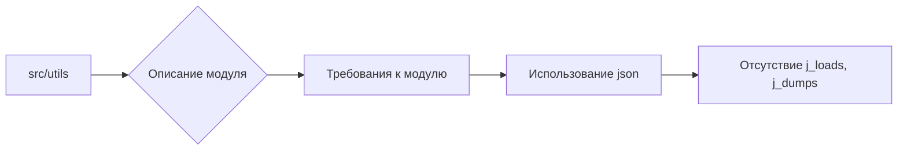

```MD
# Анализ кода (src/utils/comments_to_model/about_utils.md)

## <input code>

```
# src/utils
## Модуль: src.utils

**Instruction**
1. Модули `src.utils` и `src.utils.converters` — служебные утилиты проекта. Они спроектированы так, чтобы по минимуму использовать внутренние утилиты.  
2. В этих модулях **НЕ используется** `j_loads`, `j_loads_ns` и `j_dumps`.  
3. Используйте стандартную библиотеку `import json`.

**End of instruction**
```

## <algorithm>

Этот код не содержит программного кода, а представляет собой комментарий, описывающий модуль `src.utils`.  Поэтому блок-схема не применима.  Алгоритм работы отсутствует, так как нет функции или класса для анализа.

## <mermaid>



## <explanation>

Код представляет собой комментарий, описывающий модуль `src.utils` и его функции.  Он задаёт правила для работы модуля:

* **Цель:** `src.utils` и `src.utils.converters` являются вспомогательными утилитами, минимизирующими использование внутренних утилит.
* **Запрет:** Запрещено использовать `j_loads`, `j_loads_ns`, `j_dumps`.  Вместо этого необходимо использовать стандартный модуль `json` Python.
* **Описание:** Комментарий описывает ожидания и правила для разработки модуля.

**Связь с другими частями проекта:**

Данный комментарий задаёт требования к модулю `src.utils` и  `src.utils.converters`. Это значит, что  другие части проекта (например, `src.main`, `src.data_processing`) должны придерживаться этих правил, при использовании этих утилит.

**Возможные ошибки/улучшения:**

* **Недостаток конкретики:** Комментарий не содержит деталей о конкретных функциях или классах в модуле.  Для улучшения было бы полезно добавить примеры или описания, например, примеры использования `json.load` и `json.dump`.
* **Отсутствие примеров:** Отсутствуют примеры кода, иллюстрирующие использование.

**Вывод:**

Этот комментарий задаёт рамки и ожидания для дальнейшей разработки модуля `src.utils`.  Он важен для поддержания целостности проекта и предотвращения использования устаревших или проблемных функций.