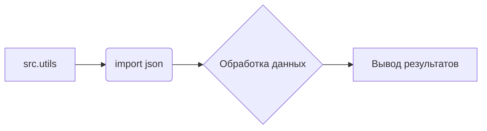

```MD
# Анализ кода из файла hypotez/src/utils/comments_to_model/about_utils.md

## <input code>

```
# src/utils

## Модуль: src.utils

**Instruction**
1. Модули `src.utils` и `src.utils.converters` — служебные утилиты проекта. Они спроектированы так, чтобы по минимуму использовать внутренние утилиты.  
2. В этих модулях **НЕ используется** `j_loads`, `j_loads_ns` и `j_dumps`.  
3. Используйте стандартную библиотеку `import json`.

**End of instruction**
```

## <algorithm>

Данный код представляет собой комментарий к коду, а не работающий код.  Поскольку это не функциональный код, алгоритм не может быть представлен.  Отсутствуют функции, классы, переменные, которые можно было бы проанализировать с точки зрения алгоритма.


## <mermaid>



**Описание диаграммы:**

Диаграмма показывает, что модуль `src.utils` импортирует модуль `json` для работы с данными. После импорта происходит обработка данных, а затем вывод результата.  Однако, без конкретного кода, невозможно визуализировать более детальные взаимосвязи и обработку.


## <explanation>

Этот код не является полноценным кодом, а представляет собой инструкцию для разработчиков.  Он описывает требования к модулям `src.utils` и `src.utils.converters`, подчеркивая необходимость использования стандартной библиотеки `json` вместо специализированных функций `j_loads`, `j_loads_ns` и `j_dumps`.

**Импорты:**

Код  объявляет требование к импорту модуля `json`.  Это ключевой момент, указывающий на использование стандартных средств парсинга JSON.  

**Классы, функции, переменные:**

В коде отсутствуют объявления классов, функций и переменных.


**Возможные ошибки или области для улучшений:**

* Отсутствие примера кода делает невозможным анализ потенциальных ошибок.  Необходимо привести пример кода для проверки соответствия указанным требованиям.

**Взаимосвязь с другими частями проекта:**

Инструкция предполагает, что модули `src.utils` и `src.utils.converters` используются в других частях проекта для обработки и преобразования данных в формате JSON.  Более глубокий анализ взаимосвязи требует просмотра кода, который эти модули используют.

**Выводы:**

Данный код описывает требования к структуре и функциональности модулей, а не сам код. Для детального анализа необходимо предоставить код, описывающий реализацию данных модулей.