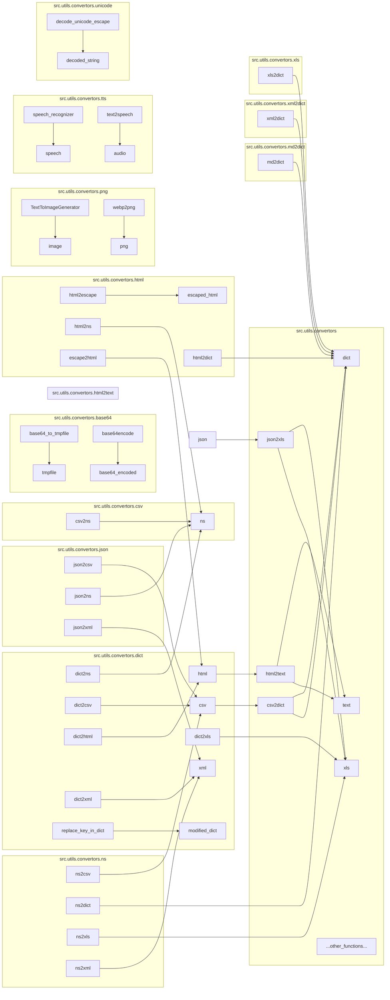

# <input code>

```python
# ## \file hypotez/src/utils/convertors/__init__.py
# # -*- coding: utf-8 -*-\
# #! venv/Scripts/python.exe
# #! venv/bin/python/python3.12

# """
# .. module: src.utils.convertors 
#     :platform: Windows, Unix
#     :synopsis:

# 
# Модуль для конвертации различных форматов данных
# =========================================================================================

# Этот модуль содержит функции для конвертации между различными форматами данных, такими как
# CSV, JSON, XML, HTML, MD, Base64, а также для работы с изображениями и текстом. Он предоставляет
# утилиты для преобразования данных в словари, списки, форматы для работы с таблицами и т.д.

# Пример использования
# --------------------

# Пример использования функций модуля `src.utils.convertors`:

# .. code-block:: python

#     from src.utils.convertors import csv2dict, json2xls

#     # Преобразование CSV в словарь
#     csv_data = csv2dict('data.csv')

#     # Преобразование JSON в XLSX
#     json_data = json2xls('data.json')

# Функции модуля охватывают широкий спектр конвертаций, включая работу с изображениями (например,
# сгенерировать PNG изображение из текста), работу с аудио (речь в текст и наоборот), а также конвертацию
# между различными кодировками и форматами, такими как Base64.

# Доступные функции
# -----------------
# - Работа с CSV: конвертация из CSV в словарь или в пространство имен.
# - Работа с JSON: конвертация из JSON в другие форматы (CSV, XLSX, XML).
# - Работа с HTML: преобразование HTML в текст, создание словаря из HTML.
# - Работа с Base64: кодирование и декодирование данных в формат Base64.
# - Работа с изображениями: генерация изображений, конвертация PNG в WebP.
# - Работа с текстом: преобразование текста в речь и наоборот.

# Включенные форматы
# -------------------
# - CSV
# - JSON
# - XML
# - HTML
# - Markdown
# - Base64
# - PNG
# - WebP


# """
# MODE = 'dev'


# import json
# import os
# import sys
# import warnings
# from pathlib import Path

# from .base64 import (
#                     base64_to_tmpfile,
#                     base64encode,
#                     )

# from .csv import (
#                     csv2dict, 
#                     csv2ns,
#                     )

# from .dict import ( dict2ns, 
#                     dict2csv,
#                     dict2html,
#                     dict2xls, 
#                     dict2xml,
#                     replace_key_in_dict
#                     )

# from .dot import dot2png

# from .html import (
#                     html2escape, 
#                     html2ns, 
#                     html2dict, 
#                     escape2html,
#                     ) 

# from .html2text import (
#                     html2text,
#                     html2text_file,
#                     google_fixed_width_font,
#                     google_has_height,
#                     google_list_style,
#                     google_nest_count,
#                     google_text_emphasis,
#                     dumb_css_parser,
#                     dumb_property_dict,
#                     )

# from .json import (
#                     json2csv, 
#                     json2ns, 
#                     json2xls, 
#                     json2xml
#                     )

# from .md2dict import (
#                     md2dict, 
#                     )

# from .ns import (
#                     ns2csv, 
#                     ns2dict, 
#                     ns2xls, 
#                     ns2xml
#                     )

# from .png import (TextToImageGenerator, 
#                   webp2png, 
#                     )

# from .tts import (
#                     speech_recognizer, 
#                     text2speech,
#                 )

# from .unicode import decode_unicode_escape

# from .xml2dict import xml2dict  
# from .xls import xls2dict
```

# <algorithm>

(Блок-схема не визуализируется в формате markdown, но алгоритм работы можно описать словесно)

Модуль `src.utils.convertors` - это модуль утилит для преобразования данных между различными форматами (CSV, JSON, XML, HTML, Base64 и т.д.).  Он импортирует функции и классы из подпапок, обеспечивая доступ к различным инструментам преобразования.  Функциональность  опирается на различные преобразования, например из CSV в словарь (`csv2dict`), JSON в XLSX (`json2xls`), HTML в текст (`html2text`), и т.д.

# <mermaid>


**Подключаемые зависимости**:


Код импортирует различные модули Python, такие как `json`, `os`, `sys`, `warnings`, `pathlib` и другие модули, необходимые для работы с файлами, строками, словарями, и т.д. Он также импортирует функции и классы из подпапок, содержащих специализированные преобразователи форматов данных (например,  `csv`, `dict`, `html`, `json`, `ns`, `png`, `tts`, `xml2dict`, `xls`).  Связи между подпапками определяют, какие данные могут быть обработаны (форматы) и как.


# <explanation>

**Импорты**: Модуль импортирует различные функции и классы для работы с разными форматами данных.  Например, `from .base64 import ...` импортирует функции для работы с кодированием Base64.  `from .csv import ...` — для работы с CSV. Импортированные подпапки находятся в текущем каталоге (`src/utils/convertors/`), что указывает на организацию проекта.


**Классы**:  Код содержит классы, такие как `TextToImageGenerator`. Они  специализируются на конкретных преобразованиях, например, конвертация текста в изображение PNG.


**Функции**: Модуль предоставляет множество функций, например `csv2dict`, `json2xls`, `html2text` и т.д.  Каждая функция предназначена для преобразования данных между различными форматами.  Функции обычно принимают данные (файлы, строки, словари) в качестве входных параметров и возвращают преобразованные данные.


**Переменные**:  Переменная `MODE` определяет режим работы (например, `'dev'` для разработки).


**Возможные ошибки или области для улучшений**:

* **Обработка ошибок**: Необходимо добавить проверку ошибок (например, обработку исключений `FileNotFoundError`) в функциях, которые работают с файлами, чтобы код был более устойчивым.
* **Документация**: Добавьте более подробные комментарии к функциям и классам, чтобы объяснить их работу и возможные варианты использования.
* **Типы данных**:  Используйте аннотации типов данных, чтобы улучшить читаемость и надежность кода.


**Цепочка взаимосвязей**: Модуль `src.utils.convertors` взаимодействует с другими частями проекта, которые могут использовать эти функции для преобразования данных.  Например, аналитический модуль (модуль, который выполняет анализ данных) может использовать функции для преобразования форматов данных перед анализом.  Связь определяется тем, какие модули будут использовать `src.utils.convertors` для дальнейших преобразований данных.