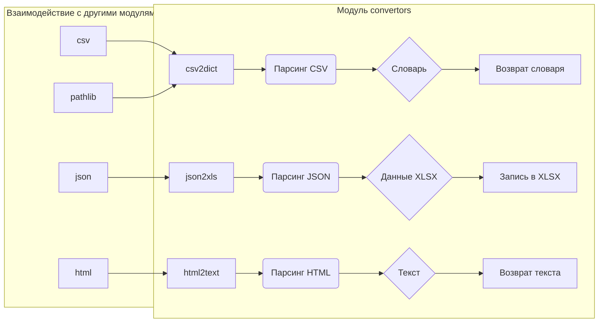

# <input code>

```python
## \file hypotez/src/utils/convertors/__init__.py
# -*- coding: utf-8 -*-\
#! venv/Scripts/python.exe
#! venv/bin/python/python3.12

"""
.. module: src.utils.convertors 
    :platform: Windows, Unix
    :synopsis:


    
Модуль для конвертации различных форматов данных
=========================================================================================

Этот модуль содержит функции для конвертации между различными форматами данных, такими как
CSV, JSON, XML, HTML, MD, Base64, а также для работы с изображениями и текстом. Он предоставляет
утилиты для преобразования данных в словари, списки, форматы для работы с таблицами и т.д.

Пример использования
--------------------

Пример использования функций модуля `src.utils.convertors`:

.. code-block:: python

    from src.utils.convertors import csv2dict, json2xls

    # Преобразование CSV в словарь
    csv_data = csv2dict('data.csv')

    # Преобразование JSON в XLSX
    json_data = json2xls('data.json')

Функции модуля охватывают широкий спектр конвертаций, включая работу с изображениями (например,
сгенерировать PNG изображение из текста), работу с аудио (речь в текст и наоборот), а также конвертацию
между различными кодировками и форматами, такими как Base64.

Доступные функции
-----------------
- Работа с CSV: конвертация из CSV в словарь или в пространство имен.
- Работа с JSON: конвертация из JSON в другие форматы (CSV, XLSX, XML).
- Работа с HTML: преобразование HTML в текст, создание словаря из HTML.
- Работа с Base64: кодирование и декодирование данных в формат Base64.
- Работа с изображениями: генерация изображений, конвертация PNG в WebP.
- Работа с текстом: преобразование текста в речь и наоборот.

Включенные форматы
-------------------
- CSV
- JSON
- XML
- HTML
- Markdown
- Base64
- PNG
- WebP


"""
MODE = 'dev'


import json
import os
import sys
import warnings
from pathlib import Path

from .base64 import (
                    base64_to_tmpfile,
                    base64encode,
                    )

from .csv import (
                    csv2dict, 
                    csv2ns,
                    )

from .dict import ( dict2ns, 
                    dict2csv,
                    dict2html,
                    dict2xls, 
                    dict2xml,
                    replace_key_in_dict
                    )

from .dot import dot2png

from .html import (
                    html2escape, 
                    html2ns, 
                    html2dict, 
                    escape2html,
                    ) 

from .html2text import (
                    html2text,
                    html2text_file,
                    google_fixed_width_font,
                    google_has_height,
                    google_list_style,
                    google_nest_count,
                    google_text_emphasis,
                    dumb_css_parser,
                    dumb_property_dict,
                    )

from .json import (
                    json2csv, 
                    json2ns, 
                    json2xls, 
                    json2xml
                    )

from .md2dict import (
                    md2dict, 
                    )

from .ns import (
                    ns2csv, 
                    ns2dict, 
                    ns2xls, 
                    ns2xml
                    )

from .png import (TextToImageGenerator, 
                  webp2png, 
                    )

from .tts import (
                    speech_recognizer, 
                    text2speech,
                )

from .unicode import decode_unicode_escape

from .xml2dict import xml2dict  
from .xls import xls2dict
```

# <algorithm>

Этот модуль предоставляет набор функций для преобразования различных форматов данных (CSV, JSON, XML, HTML, MD, Base64, изображения, текст). Алгоритм работы каждой функции зависит от конкретного преобразования.  Например, `csv2dict` считывает CSV-файл, парсит данные, и преобразует их в словарь.  `json2xls` считывает JSON-файл, преобразует его в подходящий формат для XLSX, и записывает результат.   Невозможно представить общую блок-схему для всех функций, так как их функциональность разная.

**Пример:**  Функция `csv2dict`:

1. Принимает путь к CSV-файлу.
2. Использует библиотеку для чтения CSV-файла (вероятно, `csv`).
3. Парсит данные из CSV, строя словарь из столбцов и строк.
4. Возвращает словарь.

**Пример:** Функция `html2text`:

1. Принимает HTML-строку или путь к файлу.
2. Использует парсер HTML (вероятно, `BeautifulSoup` или похожий).
3. Выделяет только текстовую часть HTML-контента, игнорируя теги и форматирование.
4. Возвращает текстовую строку.


# <mermaid>



**Описание диаграммы:**

Эта диаграмма в виде блок-схемы показывает основные части модуля `convertors` и их взаимосвязи с другими библиотеками (например, `csv`, `json`, `html` и `pathlib`).  Стрелки представляют поток данных,  квадраты — функции или блоки преобразований.

# <explanation>

**Импорты:** Модуль `convertors` импортирует различные библиотеки, необходимые для работы с разными форматами данных, включая:

* `json`, `os`, `sys`, `warnings`, `pathlib`: Стандартные библиотеки Python, используемые для обработки файлов, работы с путями, JSON, системных функций.
* `*.base64`, `*.csv`, `*.dict`, `*.dot`, `*.html`, `*.html2text`, `*.json`, `*.md2dict`, `*.ns`, `*.png`, `*.tts`, `*.unicode`, `*.xml2dict`, `*.xls`:  Модули из подпапок, которые содержат функции для работы с соответствующими форматами данных.  Это показывает структурированную организацию кода.  Например, `*.csv` вероятно содержит функции для работы с CSV-файлами (чтения, записи, преобразования).


**Классы:**  Модуль определяет классы, например, `TextToImageGenerator`. Роль этих классов - предоставлять функциональность для преобразования данных, скорее всего в контексте обработки изображений.

**Функции:** Модуль содержит множество функций для преобразования различных форматов данных.  Пример:

* `csv2dict`: Преобразует данные из CSV-файла в словарь. Аргументы: путь к файлу. Возвращает: словарь.
* `json2xls`: Преобразует данные из JSON-файла в формат Excel (XLSX).
* `html2text`: Преобразует HTML-текст в обычный текст.
* `text2speech`: Преобразует текст в аудио.
* `speech_recognizer`: Преобразует аудио в текст.


**Переменные:**  Переменная `MODE` определяет режим работы (например, разработка или производство).

**Возможные ошибки/улучшения:**

* Нет проверки на существование входных файлов. Функции не проверяют, существуют ли файлы, которые они пытаются прочитать.
* Отсутствует обработка ошибок: код не обрабатывает потенциальные исключения (например, ошибки при чтении файлов, некорректные форматы данных).
* Неясно, как происходят проверки корректности входящих данных.  Например, если в CSV есть ошибка, функция может выдать непредсказуемые результаты.


**Цепочка взаимосвязей:** Модуль `convertors` является частью пакета `utils`. Функции этого модуля используются в других частях проекта, обрабатывающих данные различных форматов.  Например, функции преобразования могут использоваться в компонентах анализа данных, отчётности или других инструментах.