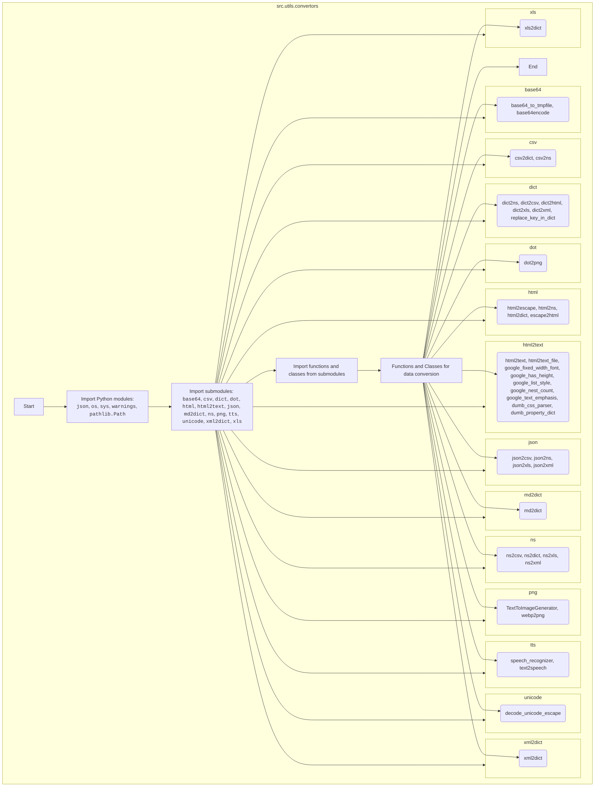

## Анализ кода `hypotez/src/utils/convertors/__init__.py`

### <алгоритм>
1. **Импорт необходимых модулей:**
   - Импортируются стандартные модули Python: `json`, `os`, `sys`, `warnings`, `pathlib.Path`.
   - Импортируются подмодули из текущей директории, например: `base64`, `csv`, `dict`, `dot`, `html`, `html2text`, `json`, `md2dict`, `ns`, `png`, `tts`, `unicode`, `xml2dict`, `xls`.
2. **Импорт функций и классов из подмодулей:**
   - Из каждого подмодуля импортируются функции и классы для выполнения преобразований между различными форматами данных.
   - Например, из `.base64` импортируются `base64_to_tmpfile` и `base64encode`, из `.csv` импортируются `csv2dict` и `csv2ns`, и так далее.
3. **Преобразования данных:**
   - Функции импортированные из подмодулей используются для преобразования данных между различными форматами.
   - Например, `csv2dict` преобразует CSV данные в словарь, `json2xls` преобразует JSON данные в XLSX формат, `html2text` преобразует HTML данные в текст, и т.д.

### <mermaid>

### <объяснение>
#### Импорты:
   - **Стандартные модули Python**:
     - `json`: Используется для работы с данными в формате JSON.
     - `os`: Предоставляет функции для взаимодействия с операционной системой, например, для работы с файловой системой.
     - `sys`: Обеспечивает доступ к некоторым переменным и функциям, связанным с интерпретатором Python.
     - `warnings`: Используется для управления предупреждениями во время выполнения.
     - `pathlib.Path`: Обеспечивает объектно-ориентированный способ работы с путями к файлам и директориям.

   - **Подмодули из `src.utils.convertors`**:
     - `.base64`: Содержит функции для кодирования и декодирования данных в формате Base64 (`base64_to_tmpfile`, `base64encode`).
     - `.csv`: Содержит функции для работы с CSV данными (`csv2dict`, `csv2ns`).
     - `.dict`: Содержит функции для преобразования словарей в другие форматы (`dict2ns`, `dict2csv`, `dict2html`, `dict2xls`, `dict2xml`, `replace_key_in_dict`).
     - `.dot`: Содержит функции для генерации изображений из DOT-файлов (`dot2png`).
     - `.html`: Содержит функции для работы с HTML (`html2escape`, `html2ns`, `html2dict`, `escape2html`).
     - `.html2text`: Содержит функции для преобразования HTML в текст, включая парсинг стилей и форматирования (`html2text`, `html2text_file`, `google_fixed_width_font`, `google_has_height`, `google_list_style`, `google_nest_count`, `google_text_emphasis`, `dumb_css_parser`, `dumb_property_dict`).
     - `.json`: Содержит функции для преобразования JSON в другие форматы (`json2csv`, `json2ns`, `json2xls`, `json2xml`).
     - `.md2dict`: Содержит функцию для преобразования Markdown в словарь (`md2dict`).
     - `.ns`: Содержит функции для работы с пространствами имен (`ns2csv`, `ns2dict`, `ns2xls`, `ns2xml`).
     - `.png`: Содержит функции для работы с изображениями PNG и WebP (`TextToImageGenerator`, `webp2png`).
     - `.tts`: Содержит функции для распознавания и синтеза речи (`speech_recognizer`, `text2speech`).
     - `.unicode`: Содержит функцию для декодирования Unicode-последовательностей (`decode_unicode_escape`).
     - `.xml2dict`: Содержит функцию для преобразования XML в словарь (`xml2dict`).
     - `.xls`: Содержит функцию для преобразования XLS в словарь (`xls2dict`).
     
   - **Взаимосвязь с другими пакетами `src`:**
     - Все импорты из текущего пакета `src.utils.convertors` являются частью более крупной структуры пакета `src`. Это позволяет модулям использовать друг друга.

#### Классы:
   - В данном файле не определены классы. Классы, такие как `TextToImageGenerator`, импортируются из подмодуля `.png`.
   - `TextToImageGenerator`: Класс для создания PNG-изображений из текста.

#### Функции:
   - В данном файле функции не определяются, а импортируются из подмодулей.
   - Каждая импортированная функция предназначена для преобразования данных из одного формата в другой.
   - **Примеры функций**:
     - `csv2dict(file_path)`: Преобразует CSV файл в словарь.
     - `json2xls(file_path)`: Преобразует JSON файл в XLSX файл.
     - `html2text(html_string)`: Преобразует HTML-строку в текст.
     - `base64encode(data)`: Кодирует данные в формат Base64.
     - `text2speech(text)`: Преобразует текст в речь.
     - `speech_recognizer(audio_file)`: Распознает речь из аудиофайла.
     - `webp2png(webp_file, png_file)`: Преобразует WebP изображение в PNG.
     - `xml2dict(xml_file)`: Преобразует XML файл в словарь.

#### Переменные:
   - В данном файле нет явно определенных переменных.
   - Переменные могут использоваться внутри импортируемых функций для обработки данных, но они не объявлены глобально в этом `__init__.py` файле.

#### Потенциальные ошибки и области для улучшения:
   - **Зависимости**: Модуль сильно зависит от подмодулей. Если один из подмодулей не работает должным образом, это может повлиять на работу всего модуля.
   - **Расширяемость**: Добавление новых форматов или функций может потребовать добавления новых подмодулей, что может сделать структуру более сложной.
   - **Обработка ошибок**: Следует более явно обрабатывать исключения в функциях преобразования, особенно если они работают с файлами.

#### Цепочка взаимосвязей с другими частями проекта:
   - `src.utils.convertors` является частью пакета `src`. Он предназначен для выполнения преобразований данных, которые могут быть использованы другими частями проекта, например, модулями, отвечающими за загрузку, обработку и сохранение данных.
   - Модули, использующие данный пакет, могут импортировать нужные функции для преобразования данных между различными форматами. Например, модуль обработки данных может использовать `csv2dict` для загрузки CSV файлов и `dict2xls` для сохранения данных в формате Excel.