## <алгоритм>

Модуль `__init__.py` в `src.utils.convertors` служит точкой входа для всех конвертеров, предоставляя удобный интерфейс для импорта и использования различных функций преобразования данных.

**Блок-схема:**

1. **Импорт модулей**:
   - Модуль `__init__.py` импортирует необходимые стандартные библиотеки Python, такие как `json`, `os`, `sys`, `warnings`, `pathlib`, которые могут использоваться внутри других модулей конвертеров.
   - Идет импорт всех необходимых подмодулей конвертеров, расположенных в директории `src.utils.convertors`: `base64`, `csv`, `dict`, `dot`, `html`, `html2text`, `json`, `md2dict`, `ns`, `png`, `tts`, `unicode`, `xml2dict` и `xls`.
   - Пример: `from .csv import csv2dict, csv2ns` импортирует функции `csv2dict` и `csv2ns` из модуля `csv`.
   
2. **Предоставление доступа к функциям:**
   - После импорта, все функции, классы и переменные из импортированных модулей становятся доступны через `src.utils.convertors`.
   - Пример: После импорта, функция `csv2dict` может быть вызвана как `src.utils.convertors.csv2dict()`.

**Поток данных**:

- Данные поступают в виде различных форматов (CSV, JSON, HTML, и т.д.).
-  Модуль `__init__.py` служит в качестве "маршрутизатора", предоставляя доступ к функциям конвертации.
-  Функции конвертации (например `csv2dict`, `json2xls`) обрабатывают входные данные и возвращают их в нужном формате.
-  Результат может быть использован в других частях проекта.

```mermaid
graph LR
    A[src.utils.convertors.__init__.py] --> B(src.utils.convertors.base64);
    A --> C(src.utils.convertors.csv);
    A --> D(src.utils.convertors.dict);
    A --> E(src.utils.convertors.dot);
    A --> F(src.utils.convertors.html);
    A --> G(src.utils.convertors.html2text);
    A --> H(src.utils.convertors.json);
    A --> I(src.utils.convertors.md2dict);
    A --> J(src.utils.convertors.ns);
    A --> K(src.utils.convertors.png);
    A --> L(src.utils.convertors.tts);
    A --> M(src.utils.convertors.unicode);
    A --> N(src.utils.convertors.xml2dict);
    A --> O(src.utils.convertors.xls);
    
    B --> B1[base64_to_tmpfile];
    B --> B2[base64encode];

    C --> C1[csv2dict];
    C --> C2[csv2ns];

    D --> D1[dict2ns];
    D --> D2[dict2csv];
    D --> D3[dict2html];
    D --> D4[dict2xls];
    D --> D5[dict2xml];
    D --> D6[replace_key_in_dict];

    E --> E1[dot2png];

    F --> F1[html2escape];
    F --> F2[html2ns];
    F --> F3[html2dict];
    F --> F4[escape2html];
    
     G --> G1[html2text];
    G --> G2[html2text_file];
    G --> G3[google_fixed_width_font];
    G --> G4[google_has_height];
    G --> G5[google_list_style];
    G --> G6[google_nest_count];
    G --> G7[google_text_emphasis];
    G --> G8[dumb_css_parser];
     G --> G9[dumb_property_dict];

    H --> H1[json2csv];
    H --> H2[json2ns];
    H --> H3[json2xls];
    H --> H4[json2xml];
    
    I --> I1[md2dict];

    J --> J1[ns2csv];
    J --> J2[ns2dict];
    J --> J3[ns2xls];
    J --> J4[ns2xml];
    
    K --> K1[TextToImageGenerator];
    K --> K2[webp2png];
   
    L --> L1[speech_recognizer];
    L --> L2[text2speech];
    
    M --> M1[decode_unicode_escape];
    
    N --> N1[xml2dict];
    
    O --> O1[xls2dict];
    
    style A fill:#f9f,stroke:#333,stroke-width:2px
    style B fill:#ccf,stroke:#333,stroke-width:1px
    style C fill:#ccf,stroke:#333,stroke-width:1px
    style D fill:#ccf,stroke:#333,stroke-width:1px
    style E fill:#ccf,stroke:#333,stroke-width:1px
    style F fill:#ccf,stroke:#333,stroke-width:1px
    style G fill:#ccf,stroke:#333,stroke-width:1px
    style H fill:#ccf,stroke:#333,stroke-width:1px
    style I fill:#ccf,stroke:#333,stroke-width:1px
    style J fill:#ccf,stroke:#333,stroke-width:1px
    style K fill:#ccf,stroke:#333,stroke-width:1px
    style L fill:#ccf,stroke:#333,stroke-width:1px
    style M fill:#ccf,stroke:#333,stroke-width:1px
    style N fill:#ccf,stroke:#333,stroke-width:1px
    style O fill:#ccf,stroke:#333,stroke-width:1px
    
```
   
## <mermaid>

**Описание зависимостей:**

- `src.utils.convertors.__init__.py`: Этот модуль действует как центральная точка доступа к функциям конвертации. Он импортирует подмодули, делая их функции доступными для остальной части проекта.
- Зависимости: каждый из подмодулей (например, `base64`, `csv`, `dict`, и т.д.) содержат специализированные функции для обработки конкретных форматов. Импорт этих модулей позволяет `__init__.py` предоставлять полный спектр возможностей конвертации.
    
    - **src.utils.convertors.base64**:  Модуль, предоставляющий функции для кодирования и декодирования в формат base64.
        - `base64_to_tmpfile`:  Функция для декодирования base64 и сохранения результата во временный файл.
        - `base64encode`: Функция для кодирования данных в base64.
    -   **src.utils.convertors.csv**: Модуль, предоставляющий функции для работы с CSV файлами.
        -   `csv2dict`:  Функция для преобразования CSV в словарь.
        -   `csv2ns`:  Функция для преобразования CSV в пространство имен.
    - **src.utils.convertors.dict**: Модуль, предоставляющий функции для работы со словарями.
        -   `dict2ns`:  Функция для преобразования словаря в пространство имен.
        -   `dict2csv`: Функция для преобразования словаря в CSV.
        -   `dict2html`: Функция для преобразования словаря в HTML.
        -   `dict2xls`: Функция для преобразования словаря в XLSX.
        -   `dict2xml`: Функция для преобразования словаря в XML.
        -   `replace_key_in_dict`: Функция для замены ключа в словаре.
    - **src.utils.convertors.dot**: Модуль для работы с DOT файлами.
        - `dot2png`:  Функция для генерации PNG из DOT файла.
    -  **src.utils.convertors.html**: Модуль, предоставляющий функции для работы с HTML.
        -   `html2escape`:  Функция для экранирования HTML.
        -   `html2ns`:  Функция для преобразования HTML в пространство имен.
        -   `html2dict`:  Функция для преобразования HTML в словарь.
        -   `escape2html`: Функция для отмены экранирования HTML.
    - **src.utils.convertors.html2text**: Модуль, предоставляющий функции для преобразования HTML в текст.
        -  `html2text`:  Функция для преобразования HTML в текст.
        - `html2text_file`:  Функция для преобразования HTML файла в текст.
        - `google_fixed_width_font`: Функция для определения ширины шрифта.
        -  `google_has_height`:  Функция для проверки высоты.
        -   `google_list_style`: Функция для получения стиля списка.
        -   `google_nest_count`:  Функция для подсчета вложенности.
        -   `google_text_emphasis`:  Функция для выделения текста.
        -   `dumb_css_parser`: Функция для разбора CSS.
        -   `dumb_property_dict`: Функция для создания словаря свойств.
    -  **src.utils.convertors.json**: Модуль, предоставляющий функции для работы с JSON.
        -   `json2csv`:  Функция для преобразования JSON в CSV.
        -   `json2ns`:  Функция для преобразования JSON в пространство имен.
        -   `json2xls`:  Функция для преобразования JSON в XLSX.
        -   `json2xml`:  Функция для преобразования JSON в XML.
    - **src.utils.convertors.md2dict**: Модуль для работы с Markdown.
        - `md2dict`:  Функция для преобразования Markdown в словарь.
    -   **src.utils.convertors.ns**: Модуль, предоставляющий функции для работы с пространствами имен.
        -  `ns2csv`:  Функция для преобразования пространства имен в CSV.
        -  `ns2dict`:  Функция для преобразования пространства имен в словарь.
        - `ns2xls`:  Функция для преобразования пространства имен в XLSX.
        -  `ns2xml`: Функция для преобразования пространства имен в XML.
    -   **src.utils.convertors.png**: Модуль для работы с изображениями.
        -   `TextToImageGenerator`:  Класс для генерации PNG из текста.
        -   `webp2png`: Функция для преобразования WebP в PNG.
    -   **src.utils.convertors.tts**: Модуль для работы с преобразованием текста в речь и наоборот.
        -   `speech_recognizer`:  Функция для распознавания речи.
        -   `text2speech`: Функция для преобразования текста в речь.
    -   **src.utils.convertors.unicode**: Модуль для работы с юникодом.
        -   `decode_unicode_escape`: Функция для декодирования escape-последовательностей юникода.
    -   **src.utils.convertors.xml2dict**: Модуль для работы с XML.
        -   `xml2dict`:  Функция для преобразования XML в словарь.
    -  **src.utils.convertors.xls**: Модуль для работы с XLSX.
        -   `xls2dict`:  Функция для преобразования XLSX в словарь.
    
    

## <объяснение>

**Импорты:**

- **`json`**: Стандартная библиотека Python для работы с данными в формате JSON. Используется в модуле `json` для конвертации JSON данных.
- **`os`**: Стандартная библиотека для взаимодействия с операционной системой. Может использоваться для работы с файлами, путями и т.д.
- **`sys`**: Стандартная библиотека, предоставляющая доступ к параметрам и функциям, специфичным для системы.
- **`warnings`**: Стандартная библиотека для управления предупреждениями.
- **`pathlib`**: Стандартная библиотека для работы с путями в виде объектов, удобнее чем `os.path`.
- **`.base64`**: Локальный модуль для работы с кодировкой Base64. Включает `base64_to_tmpfile` (декодирование base64 и сохранение во временный файл) и `base64encode` (кодирование в base64).
- **`.csv`**: Локальный модуль для работы с CSV файлами. Включает `csv2dict` (конвертация CSV в словарь) и `csv2ns` (конвертация CSV в пространство имен).
- **`.dict`**: Локальный модуль для работы со словарями. Включает `dict2ns` (словарь в пространство имен), `dict2csv` (словарь в CSV), `dict2html` (словарь в HTML), `dict2xls` (словарь в XLSX), `dict2xml` (словарь в XML) и `replace_key_in_dict` (замена ключа в словаре).
- **`.dot`**: Локальный модуль для работы с файлами в формате DOT. Включает `dot2png` (конвертация DOT в PNG).
- **`.html`**: Локальный модуль для работы с HTML. Включает `html2escape` (экранирование HTML), `html2ns` (HTML в пространство имен), `html2dict` (HTML в словарь) и `escape2html` (отмена экранирования HTML).
- **`.html2text`**: Локальный модуль для конвертации HTML в текст. Включает `html2text` (конвертация HTML в текст), `html2text_file` (конвертация HTML файла в текст), а также набор утилит для работы со стилями (`google_fixed_width_font`, `google_has_height`, `google_list_style`, `google_nest_count`, `google_text_emphasis`, `dumb_css_parser`, `dumb_property_dict`).
- **`.json`**: Локальный модуль для работы с JSON. Включает `json2csv` (JSON в CSV), `json2ns` (JSON в пространство имен), `json2xls` (JSON в XLSX) и `json2xml` (JSON в XML).
- **`.md2dict`**: Локальный модуль для конвертации Markdown в словарь. Включает `md2dict` (Markdown в словарь).
- **`.ns`**: Локальный модуль для работы с пространствами имен. Включает `ns2csv` (пространство имен в CSV), `ns2dict` (пространство имен в словарь), `ns2xls` (пространство имен в XLSX) и `ns2xml` (пространство имен в XML).
- **`.png`**: Локальный модуль для работы с PNG изображениями. Включает `TextToImageGenerator` (генерация PNG из текста) и `webp2png` (конвертация WebP в PNG).
- **`.tts`**: Локальный модуль для работы с преобразованием текста в речь и наоборот. Включает `speech_recognizer` (распознавание речи) и `text2speech` (конвертация текста в речь).
- **`.unicode`**: Локальный модуль для работы с юникодом. Включает `decode_unicode_escape` (декодирование escape-последовательностей юникода).
- **`.xml2dict`**: Локальный модуль для конвертации XML в словарь. Включает `xml2dict` (XML в словарь).
- **`.xls`**: Локальный модуль для конвертации XLSX в словарь. Включает `xls2dict` (XLSX в словарь).

**Классы:**

- **`TextToImageGenerator`**: Класс из модуля `.png`, предназначен для генерации изображений PNG из текста. Он имеет методы для установки параметров изображения и генерации самого изображения.

**Функции:**

- Каждая функция импортированная из подмодулей (например, `csv2dict`, `json2xls`, `html2text`) представляет собой конвертер данных.
    - Функции принимают различные типы данных (текст, файлы) на входе и возвращают данные в преобразованном формате.
    - Например, `csv2dict(filename)` читает CSV файл и возвращает словарь, а `json2xls(filename)` читает JSON файл и возвращает данные в формате XLSX.

**Переменные:**

- `MODE`: Глобальная переменная (закомментирована), определяющая режим работы модуля (например, 'dev', 'prod').

**Объяснение:**

- Модуль `__init__.py` в `src.utils.convertors` служит фасадом для всех конвертеров, предоставляя единую точку доступа к их функциям.
- Импортируя все подмодули, он делает их функции доступными для остального проекта без необходимости импортировать каждый модуль отдельно.
- Все модули в `src.utils.convertors` спроектированы для преобразования данных из одного формата в другой.
- Примеры использования функций в комментариях дают представление о том, как эти функции используются в коде.
- Архитектура модуля позволяет легко добавлять новые конвертеры, создавая новые подмодули в `src.utils.convertors`.

**Потенциальные ошибки и области для улучшения:**

-  Некоторые модули могут иметь дублирование функциональности или неоптимизированный код (например `html2text`).
- Не все функции имеют явное описание типов аргументов и возвращаемых значений, что затрудняет чтение и поддержку.
- Отсутствует единый механизм обработки ошибок во всех конвертерах, что может затруднить отладку.
- Глобальная переменная `MODE` закомментирована, что может быть причиной ошибок при дальнейшем развитии проекта.

**Взаимосвязь с другими частями проекта:**
- Этот модуль используется в других частях проекта, где требуется конвертировать данные между различными форматами.
- Например, модуль `src.data_processing` может использовать этот модуль для преобразования данных из CSV файлов в формат, необходимый для машинного обучения.
- Модуль `src.api` может использовать этот модуль для преобразования данных из JSON запросов в формат, который можно сохранить в базе данных.
- Таким образом, `src.utils.convertors` является важной частью инфраструктуры, обеспечивающей гибкость и модульность проекта.