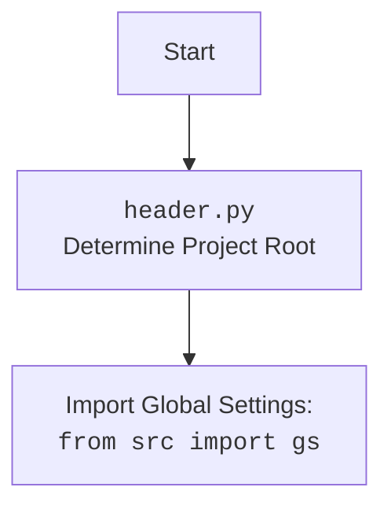

## Анализ кода `hypotez/src/utils/convertors/any.py`

### 1. <алгоритм>

Функция `any2dict` рекурсивно преобразует любой тип данных в словарь.

**Блок-схема:**

```mermaid
graph TD
    A[Начало: any2dict(any_data)] --> B{Является ли any_data простым типом (int, float, str, bool, None)?};
    B -- Да --> C{Вернуть any_data};
    C --> F[Конец];
    B -- Нет --> D{Является ли any_data списком, кортежем или множеством?};
    D -- Да --> E{Обработка списка/кортежа/множества};
    E --> F[Конец];
    D -- Нет --> G{Создать пустой словарь result_dict};
    G --> H{Имеет ли any_data атрибут __dict__ или является ли он словарем?};
    H -- Да --> I{Получить items_dict из __dict__ или непосредственно из словаря};
    I --> J{Перебрать элементы items_dict};
    J --> K{Рекурсивно преобразовать ключ и значение: any2dict(key), any2dict(value)};
    K --> L{Добавить преобразованные ключ и значение в result_dict, если ключ не False};
    L --> M{Вернуть result_dict};
    M --> F[Конец];
    H -- Нет --> N{Вернуть False};
    N --> F[Конец];
    E -- Элемент является False --> O{Добавить пустую строку в список};
    E -- Элемент не является False --> P{Добавить преобразованный элемент в список};
    O --> Q{Вернуть список};
    P --> Q{Вернуть список};
    Q --> F[Конец];
```

**Примеры:**

1.  **Простой тип данных (int, str, bool, None):**

    ```python
    data = 123
    result = any2dict(data)  # result будет равен 123
    ```

2.  **Список:**

    ```python
    data = [1, "two", {"key": "value"}]
    result = any2dict(data)  # result будет равен [1, 'two', {'key': 'value'}]
    ```

3.  **Словарь:**

    ```python
    data = {"name": "John", "age": 30}
    result = any2dict(data)  # result будет равен {'name': 'John', 'age': 30}
    ```

4.  **Объект класса:**

    ```python
    class MyClass:
        def __init__(self, x):
            self.x = x

    data = MyClass(10)
    result = any2dict(data)  # result будет равен {'x': 10}
    ```

### 2. <mermaid>

```mermaid
flowchart TD
    A[Начало: any2dict(any_data)] --> B{instance of set, list, int, float, str, bool, None?};
    B -- Yes --> C[return any_data];
    B -- No --> D{instance of (list, tuple)?};
    D -- Yes --> E[process list/tuple];
    D -- No --> F{create result_dict = {}};
    F --> G{hasattr(any_data, '__dict__') or instance of dict?};
    G -- Yes --> H[items_dict = any_data.__dict__ or any_data];
    G -- No --> I[return False];
    H --> J{iterate items_dict.items()};
    J --> K[converted_key = any2dict(key), converted_value = any2dict(value)];
    K --> L{if converted_key is not False: result_dict[converted_key] = converted_value or ''};
    L --> M[return result_dict];
    E -- item is False --> N[append '' to result_list];
    E -- item is not False --> O[append converted_item to result_list];
    N --> P[return result_list];
    O --> P[return result_list];
    
    subgraph list/tuple processing
    direction LR
        E --> N;
        E --> O;
    end
```



**Объяснение зависимостей (mermaid):**

1.  **`typing`**: Модуль `typing` используется для аннотации типов переменных и возвращаемых значений функций. В данном случае используется `Any` для указания, что функция `any2dict` может принимать аргумент любого типа.
2.  **`header`**: Модуль `header` импортируется, но не используется непосредственно в функции `any2dict`. Вероятно, он используется для каких-то общих настроек или инициализации проекта.
3.  **`src.logger`**: Модуль `src.logger` используется для логгирования.

### 3. <объяснение>

**Импорты:**

*   `typing.Any`: Используется для аннотации типов, указывая, что переменная или параметр может быть любого типа.
*   `header`: Импортируется, но не используется в представленном коде. Предположительно, содержит общие настройки или функции, используемые в проекте.
*   `src.logger`: Используется для логирования. В данном коде не используется, но должен использоваться для записи ошибок и предупреждений.

**Функции:**

*   `any2dict(any_data: Any) -> dict | list | int | float | str | bool | None`:
    *   **Аргументы:**
        *   `any_data`: Данные любого типа, которые нужно преобразовать в словарь.
    *   **Возвращаемое значение:**
        *   Словарь, представляющий входные данные, список или базовый тип данных, если преобразование успешно. `False`, если преобразование невозможно.
    *   **Назначение:**
        Рекурсивно преобразует входные данные любого типа в словарь. Поддерживает преобразование словарей, списков, кортежей, множеств и объектов классов.
    *   **Примеры:**

        ```python
        data = {"name": "John", "age": 30}
        result = any2dict(data)  # result будет равен {'name': 'John', 'age': 30}

        data = [1, "two", {"key": "value"}]
        result = any2dict(data)  # result будет равен [1, 'two', {'key': 'value'}]

        class MyClass:
            def __init__(self, x):
                self.x = x

        data = MyClass(10)
        result = any2dict(data)  # result будет равен {'x': 10}
        ```

**Переменные:**

*   `result_dict`: Используется для хранения преобразованного словаря.
*   `items_dict`: Используется для хранения атрибутов объекта, если `any_data` является объектом класса.

**Потенциальные ошибки и области для улучшения:**

1.  **Отсутствие логирования:** В случае возникновения исключения в блоке `try...except` отсутствует логирование ошибки. Рекомендуется добавить логирование с использованием `logger.error` для записи информации об ошибке.
2.  **Обработка объектов классов:** Преобразование объектов классов ограничено извлечением атрибутов через `__dict__`. Если класс имеет более сложную структуру или использует свойства, преобразование может быть неполным.
3.  **Обработка множеств:** Преобразование множеств в списки может изменить порядок элементов, что может быть нежелательным в некоторых случаях.

**Взаимосвязи с другими частями проекта:**

*   Функция `any2dict` может использоваться в других модулях проекта для преобразования данных различных типов в формат, пригодный для записи в файлы CSV или JSON.
*   Модуль `header` предположительно содержит общие настройки проекта, которые могут влиять на работу функции `any2dict`.

**Рекомендации:**

*   Добавить логирование ошибок с использованием `logger.error`.
*   Рассмотреть возможность расширения функциональности для более полной обработки объектов классов.
*   Учитывать возможность изменения порядка элементов при преобразовании множеств в списки.