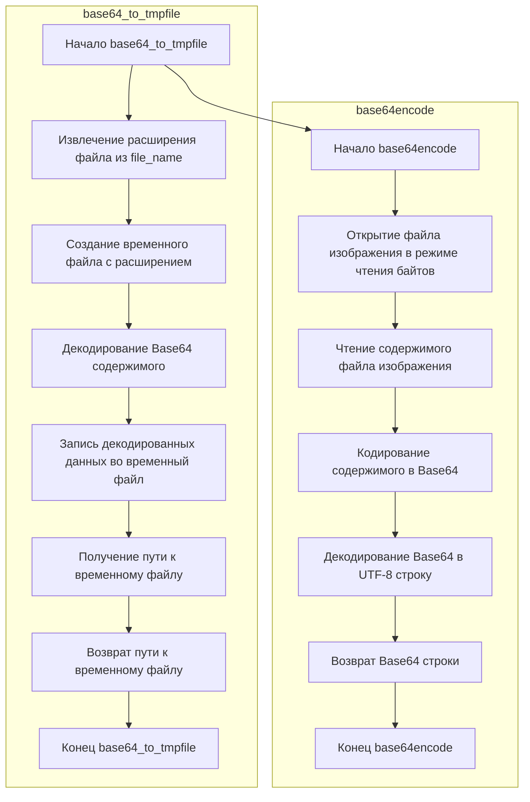

## Анализ кода `hypotez/src/utils/convertors/base64.py`

### 1. <алгоритм>

**Функция `base64_to_tmpfile`:**

1.  **Начало:** Функция принимает на вход два аргумента: `content` (строка, содержащая Base64-кодированные данные) и `file_name` (строка, содержащая имя файла, используемое для определения расширения временного файла).
    *   Пример: `content = "SGVsbG8gd29ybGQh"` , `file_name = "example.txt"`

2.  **Извлечение расширения файла:** С помощью `os.path.splitext(file_name)` имя файла разделяется на две части: имя (не используется) и расширение `ext`.
    *   Пример: `file_name = "example.txt"`, `ext` становится ".txt".

3.  **Создание временного файла:** Используется `tempfile.NamedTemporaryFile(delete=False, suffix=ext)` для создания временного файла с расширением, полученным на предыдущем шаге. `delete=False` гарантирует, что файл не будет удален после закрытия.
    *   Пример: Создается временный файл `/tmp/tmpfile.txt`.

4.  **Декодирование и запись в файл:** Base64-содержимое `content` декодируется с помощью `base64.b64decode(content)`, и результат записывается во временный файл.
    *   Пример: `"SGVsbG8gd29ybGQh"` декодируется в `"Hello world!"` и записывается во временный файл.

5.  **Получение пути к временному файлу:** Путь к созданному временному файлу извлекается из объекта временного файла `tmp.name` и присваивается переменной `path`.
    *   Пример: `path = "/tmp/tmpfile.txt"`

6.  **Возврат пути:** Функция возвращает путь к созданному временному файлу.
    *   Пример: Функция возвращает `"/tmp/tmpfile.txt"`.

**Функция `base64encode`:**

1.  **Начало:** Функция принимает на вход один аргумент: `image_path` (путь к файлу изображения).
    *   Пример: `image_path = "image.png"`

2.  **Открытие файла:** Файл изображения открывается в режиме чтения байтов (`"rb"`) с помощью `open(image_path, "rb")`.

3.  **Чтение содержимого файла:** Содержимое файла считывается с помощью `image_file.read()`.

4.  **Кодирование в base64:** Прочитанное содержимое кодируется в base64 с помощью `base64.b64encode()`.

5.  **Декодирование в utf-8:** Результат кодирования в base64 декодируется в строку utf-8 с помощью `.decode('utf-8')`.

6.  **Возврат результата:** Функция возвращает строку с base64-кодированным содержимым файла.

### 2. <mermaid>

### Импорт зависимостей:

*   **`base64`**: Этот модуль используется для кодирования и декодирования данных в формате Base64.
*   **`tempfile`**: Этот модуль предоставляет функции для создания временных файлов и каталогов.
*   **`os`**: Этот модуль предоставляет функции для работы с операционной системой, в частности используется `os.path.splitext` для извлечения расширения файла.

### 3. <объяснение>

**Импорты:**

*   `import base64`: Импортирует модуль `base64`, который предоставляет функции для работы с кодировкой Base64. Используется для декодирования Base64-строки в функции `base64_to_tmpfile` и кодирования содержимого файла в функции `base64encode`.
*   `import tempfile`: Импортирует модуль `tempfile`, который позволяет создавать временные файлы и папки. В `base64_to_tmpfile` используется для создания временного файла, в который записываются декодированные данные.
*   `import os`: Импортирует модуль `os`, который предоставляет функции для взаимодействия с операционной системой, в частности, здесь используется `os.path.splitext` для получения расширения файла из имени файла.

**Функции:**

*   `base64_to_tmpfile(content: str, file_name: str) -> str`:
    *   **Аргументы:**
        *   `content`: Строка с Base64-кодированными данными.
        *   `file_name`: Имя файла, из которого извлекается расширение для временного файла.
    *   **Возвращаемое значение:** Строка, представляющая путь к созданному временному файлу.
    *   **Назначение:** Функция декодирует Base64-данные и записывает их во временный файл с соответствующим расширением.
    *   **Пример:** `base64_to_tmpfile("SGVsbG8gd29ybGQh", "test.txt")` создаст временный файл, содержащий строку `"Hello world!"`, и вернет путь к этому файлу.
*  `base64encode(image_path)`
    *   **Аргументы:**
        *   `image_path`: Путь к файлу изображения для кодирования
    *   **Возвращаемое значение:** Строка, представляющая base64-кодированное содержимое файла изображения.
    *   **Назначение:** Функция читает содержимое файла изображения, кодирует его в base64 и возвращает результат.
    *   **Пример:** `base64encode("image.png")` возвратит строку с base64-кодированным содержимым файла.

**Переменные:**

*   `content`: Строка, содержащая Base64-кодированные данные, передается в функцию `base64_to_tmpfile`.
*   `file_name`: Строка, содержащая имя файла, из которого извлекается расширение.
*   `ext`: Строка, содержащая расширение файла, извлеченное с помощью `os.path.splitext()`.
*  `image_path`: Строка, содержащая путь к файлу изображения, передается в функцию `base64encode`.
*   `tmp`: Объект временного файла, созданный с помощью `tempfile.NamedTemporaryFile()`.
*   `path`: Строка, содержащая путь к созданному временному файлу.
*   `image_file`: Объект файла, содержащий открытый файл изображения.

**Потенциальные ошибки и области для улучшения:**

*   **Обработка ошибок:** В коде нет обработки исключений, например, ошибок при декодировании Base64 или записи в файл. Это можно улучшить, добавив блоки `try-except`.
*   **Удаление временных файлов:** Функция `base64_to_tmpfile` оставляет временный файл, даже после того как он больше не нужен. Хотя в `tempfile.NamedTemporaryFile` стоит параметр `delete=False`, это означает что файл не удалится автоматически при закрытии. Внешний код должен быть ответственен за удаление файла, когда он больше не нужен.  Можно было бы добавить автоматическое удаление файла в конце функции с помощью блока `try-finally`, чтобы гарантировать удаление файла.
* **Явное указание кодировки:** При использовании `base64.b64encode` можно явно указать кодировку.
*   **Расширение файла:** Функция извлекает расширение из `file_name`, но не проверяет, является ли это действительно расширением файла или просто частью имени файла. Можно добавить дополнительную валидацию.

**Взаимосвязи с другими частями проекта:**

*   Этот модуль `base64.py` является частью `utils` и может использоваться другими модулями проекта, где необходимо обрабатывать Base64-кодированные данные, например, для обработки изображений, полученных из API, или загрузки файлов через веб-интерфейс.
*   Функция `base64_to_tmpfile` может использоваться в тех местах, где нужно временно сохранить декодированное содержимое Base64 в файл для дальнейшей обработки.
*   Функция `base64encode` может использоваться в тех местах, где требуется кодировать содержимое файла в base64.

Таким образом, этот модуль предоставляет базовые инструменты для работы с Base64-кодировкой, которые могут быть использованы в разных частях проекта для обработки данных.