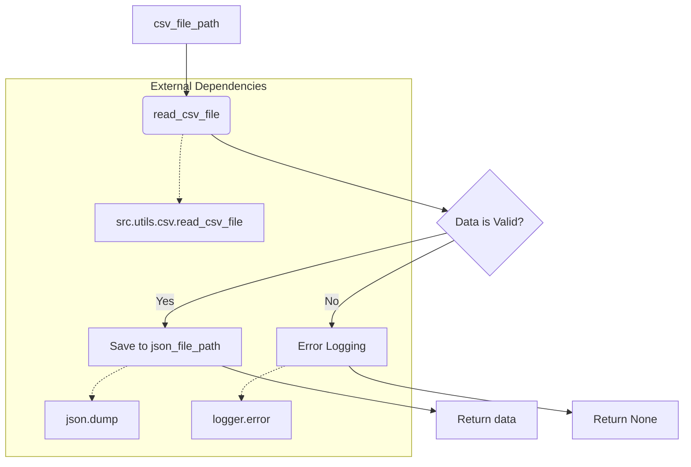

# <input code>

```python
## \file hypotez/src/utils/convertors/csv.py
# -*- coding: utf-8 -*-
#! venv/Scripts/python.exe
#! venv/bin/python/python3.12

"""
.. module: src.utils.convertors.csv 
	:platform: Windows, Unix
	:synopsis: CSV and JSON conversion utilities

"""
MODE = 'dev'

""" Functions:
    - `csv2dict`: Convert CSV data to a dictionary.
    - `csv2ns`: Convert CSV data to SimpleNamespace objects.

.. code-block:: python

    # Example usage:

    # Using JSON list of dictionaries
    json_data_list = [{"name": "John", "age": 30, "city": "New York"}, {"name": "Alice", "age": 25, "city": "Los Angeles"}]
    json_file_path = 'data.json'
    csv_file_path = 'data.csv'

    # Convert JSON to CSV
    json2csv.json2csv(json_data_list, csv_file_path)

    # Convert CSV back to JSON
    csv_data = csv2json(csv_file_path, json_file_path)
    if csv_data:
        if isinstance(csv_data, list):
            if isinstance(csv_data[0], dict):
                print("CSV data (list of dictionaries):")
            else:
                print("CSV data (list of values):")
            print(csv_data)
        else:
            print("Failed to read CSV data.")
"""


import json
import csv
from pathlib import Path
from typing import List, Dict
from types import SimpleNamespace
from src.logger import logger
from src.utils.csv import read_csv_as_dict, read_csv_as_ns, save_csv_file, read_csv_file

def csv2dict(csv_file: str | Path, *args, **kwargs) -> dict | None:
    """
    Convert CSV data to a dictionary.

    Args:
        csv_file (str | Path): Path to the CSV file to read.

    Returns:
        dict | None: Dictionary containing the data from CSV converted to JSON format, or `None` if conversion failed.

    Raises:
        Exception: If unable to read CSV.
    """
    return read_csv_as_dict(csv_file, *args, **kwargs)

def csv2ns(csv_file: str | Path, *args, **kwargs) -> SimpleNamespace | None:
    """
    Convert CSV data to SimpleNamespace objects.

    Args:
        csv_file (str | Path): Path to the CSV file to read.

    Returns:
        SimpleNamespace | None: SimpleNamespace object containing the data from CSV, or `None` if conversion failed.

    Raises:
        Exception: If unable to read CSV.
    """
    return read_csv_as_ns(csv_file, *args, **kwargs)

def csv_to_json(
    csv_file_path: str | Path,
    json_file_path: str | Path,
    exc_info: bool = True
) -> List[Dict[str, str]] | None:
    """ Convert a CSV file to JSON format and save it to a JSON file.

    Args:
        csv_file_path (str | Path): The path to the CSV file to read.
        json_file_path (str | Path): The path to the JSON file to save.
        exc_info (bool, optional): If True, includes traceback information in the log. Defaults to True.

    Returns:
        List[Dict[str, str]] | None: The JSON data as a list of dictionaries, or None if conversion failed.

    Example:
        >>> json_data = csv_to_json('dialogue_log.csv', 'dialogue_log.json')
        >>> print(json_data)
        [{\'role\': \'user\', \'content\': \'Hello\'}, {\'role\': \'assistant\', \'content\': \'Hi there!\'}]
    """
    try:
        data = read_csv_file(csv_file_path, exc_info=exc_info)
        if data is not None:
            with open(json_file_path, 'w', encoding='utf-8') as jsonfile:
                json.dump(data, jsonfile, indent=4)
            return data
        return
    except Exception as ex:
        logger.error("Failed to convert CSV to JSON", ex, exc_info=exc_info)
        return
```



# <explanation>

**Импорты:**

- `json`: Для работы с JSON-данными.
- `csv`: Для работы с CSV-файлами.
- `pathlib`: Для работы с путями к файлам.
- `typing`: Для типизации переменных.
- `types`: Для работы с `SimpleNamespace`.
- `src.logger`: Модуль для логирования, вероятно, определён в другом файле проекта.  Необходим для записи сообщений об ошибках.
- `src.utils.csv`: Модуль, содержащий функции для чтения и записи CSV файлов.  Связан с `hypotez/src/utils/csv.py`.


**Классы:**

Код не содержит объявления классов.  Используются стандартные типы данных Python.

**Функции:**

- `csv2dict`: Преобразует данные из CSV-файла в словарь.  Передаёт вызов в `read_csv_as_dict` из `src.utils.csv`. Принимает путь к CSV файлу и произвольное количество позиционных аргументов `*args` и именованных аргументов `**kwargs`. Возвращает словарь или `None` в случае ошибки.
- `csv2ns`: Преобразует данные из CSV-файла в объекты `SimpleNamespace`. Передаёт вызов в `read_csv_as_ns` из `src.utils.csv`.  Принимает путь к CSV файлу и произвольное количество позиционных аргументов `*args` и именованных аргументов `**kwargs`. Возвращает объект `SimpleNamespace` или `None` в случае ошибки.
- `csv_to_json`: Преобразует CSV файл в JSON и сохраняет результат в файл.  Принимает пути к CSV и JSON файлам, а также опциональный параметр `exc_info` для включения отладочной информации в лог. Возвращает данные в формате JSON как список словарей или `None` в случае ошибки.
- `read_csv_file`, `read_csv_as_dict`, `read_csv_as_ns`, `save_csv_file`: Эти функции предположительно определены в `src.utils.csv` и выполняют чтение и запись CSV-данных, преобразование в различные структуры.

**Переменные:**

- `MODE`: Строковая переменная, вероятно, для указания режима работы.
- `csv_file`: Путь к CSV-файлу (строка или объект `Path`).
- `json_file_path`: Путь к JSON-файлу (строка или объект `Path`).
- `data`: Данные, считанные из CSV файла, в формате JSON.
- `exc_info`: Логический параметр для включения отладочной информации в лог.


**Возможные ошибки и улучшения:**

- Нет проверки существования CSV-файла.  Рекомендуется добавить проверку на наличие файла.
- Отсутствует обработка различных кодировок CSV-файлов.  Можно добавить аргумент `encoding` для чтения CSV-файлов с разными кодировками.
- Обработка ошибок при чтении/записи файлов должна быть более явной, с помощью блоков `try...except`.
- Не все возвращаемые типы явно указаны, что может привести к ошибкам в вызывающем коде, в частности, если `read_csv_file` вернёт ошибочный тип.
- Функция `csv_to_json` имеет лишние проверочные операторы, такие как `if data is not None`.


**Взаимосвязь с другими частями проекта:**

Функции из `src.utils.csv` необходимы для корректной работы функций из `src.utils.convertors.csv`. Логирование происходит через `src.logger`, что свидетельствует о структурированном подходе к обработке ошибок и отслеживанию процесса в проекте.