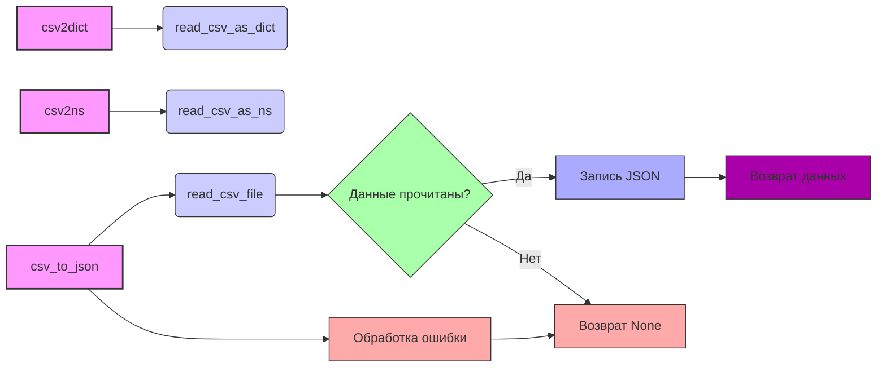

## Анализ кода `hypotez/src/utils/convertors/csv.py`

### 1. <алгоритм>

**Общая задача**: Преобразование данных из CSV формата в другие форматы (словарь, SimpleNamespace, JSON) и обратно.

**Блок-схема:**

1. **`csv2dict(csv_file, *args, **kwargs)`**:
   - **Вход**: Путь к CSV файлу (`csv_file`, строка или `Path`), дополнительные аргументы (`*args`) и именованные аргументы (`**kwargs`).
   - **Действие**: Вызывает функцию `read_csv_as_dict` с теми же аргументами.
   - **Выход**: Словарь (`dict`) с данными из CSV, либо `None` в случае ошибки.
   - **Пример**: `csv2dict("data.csv")` возвращает `{"header1": ["value1", "value2"], "header2": ["value3", "value4"]}` (или `None`, если ошибка чтения файла).

2. **`csv2ns(csv_file, *args, **kwargs)`**:
   - **Вход**: Путь к CSV файлу (`csv_file`, строка или `Path`), дополнительные аргументы (`*args`) и именованные аргументы (`**kwargs`).
   - **Действие**: Вызывает функцию `read_csv_as_ns` с теми же аргументами.
   - **Выход**: Объект `SimpleNamespace` с данными из CSV, либо `None` в случае ошибки.
   - **Пример**: `csv2ns("data.csv")` возвращает `SimpleNamespace(header1=["value1", "value2"], header2=["value3", "value4"])` (или `None`, если ошибка чтения файла).

3. **`csv_to_json(csv_file_path, json_file_path, exc_info=True)`**:
    - **Вход**: Путь к CSV файлу (`csv_file_path`, строка или `Path`), путь к JSON файлу (`json_file_path`, строка или `Path`), флаг `exc_info` (по умолчанию `True`).
    - **Действие**:
        1. Вызывает функцию `read_csv_file`, для чтения данных из CSV.
        2. Проверяет, что `data` не `None`.
        3. Открывает JSON файл на запись (`w`) с кодировкой `utf-8`.
        4. Записывает данные в JSON файл с отступами (`indent=4`).
        5. Возвращает считанные данные.
    - **Выход**: Список словарей (`List[Dict[str, str]]`) с данными из CSV в формате JSON, либо `None` в случае ошибки.
    - **Пример**:
       -  `csv_to_json("data.csv", "data.json")` преобразует данные из CSV в JSON и сохраняет в файл `data.json`, возвращая список словарей, если преобразование удалось.
       - Если `data.csv` содержит данные `role,content\nuser,Hello\nassistant,Hi there!`, то вернется `[{"role": "user", "content": "Hello"}, {"role": "assistant", "content": "Hi there!"}]` и будет создан файл `data.json` с содержимым в формате JSON.

**Поток данных:**

- Данные из CSV файла читаются функциями `read_csv_as_dict`, `read_csv_as_ns` или `read_csv_file` (из `src.utils.csv`).
- Функции `csv2dict` и `csv2ns` возвращают данные в соответствующих форматах (словарь и `SimpleNamespace`).
- Функция `csv_to_json` сначала читает данные, затем преобразует их в JSON и сохраняет в файл.

### 2. <mermaid>



**Описание `mermaid` диаграммы:**

-   `csv2dict`, `csv2ns`, и `csv_to_json` представляют основные функции модуля и имеют фиолетовый цвет.
-   `read_csv_as_dict`, `read_csv_as_ns` и `read_csv_file` представляют функции, которые вызываются из `src.utils.csv` и имеют голубой цвет.
-   `Данные прочитаны?` - логический блок проверки.
-   `Запись JSON` - блок записи в JSON файл.
-   `Возврат данных` - блок возвращения данных при успешной операции.
-   `Возврат None` - блок возвращения None при неудачной операции.
-   `Обработка ошибки` - блок обработки исключения.
-   Стрелки показывают поток данных и вызовы функций.

**Зависимости:**

-   `csv2dict` зависит от `read_csv_as_dict`.
-   `csv2ns` зависит от `read_csv_as_ns`.
-   `csv_to_json` зависит от `read_csv_file`, `json.dump` (из стандартной библиотеки), открытия файла.
-   Все функции `read_csv_as_dict`, `read_csv_as_ns` и `read_csv_file` импортируются из `src.utils.csv`.

### 3. <объяснение>

#### Импорты:
- `import json`: Используется для работы с JSON, а именно для преобразования данных в JSON и записи в файл.
- `import csv`: Используется для работы с CSV файлами, хотя непосредственно не используется в текущем модуле.
- `from pathlib import Path`: Используется для работы с путями к файлам в объектно-ориентированном стиле.
- `from typing import List, Dict`: Используется для аннотации типов, что повышает читаемость и помогает в отладке.
- `from types import SimpleNamespace`: Используется для создания объектов с произвольными атрибутами, для хранения данных из CSV.
- `from src.logger.logger import logger`: Используется для логирования ошибок и другой информации. Этот импорт показывает зависимость от пакета логирования в проекте.
- `from src.utils.csv import read_csv_as_dict, read_csv_as_ns, save_csv_file, read_csv_file`: Импортирует функции для чтения и записи CSV файлов из модуля `src.utils.csv`.

#### Функции:

-   **`csv2dict(csv_file: str | Path, *args, **kwargs) -> dict | None`**:
    -   **Аргументы**:
        -   `csv_file`: Путь к CSV файлу (строка или `Path`).
        -   `*args`, `**kwargs`: Дополнительные позиционные и именованные аргументы для `read_csv_as_dict`.
    -   **Возвращаемое значение**: Словарь, содержащий данные из CSV, или `None` в случае ошибки.
    -   **Назначение**:  Упрощенный интерфейс для преобразования CSV в словарь, делегируя работу `read_csv_as_dict`.
    -   **Пример**:
        ```python
        data_dict = csv2dict("my_data.csv")
        if data_dict:
            print(data_dict)
        ```
-   **`csv2ns(csv_file: str | Path, *args, **kwargs) -> SimpleNamespace | None`**:
    -   **Аргументы**:
        -   `csv_file`: Путь к CSV файлу (строка или `Path`).
        -   `*args`, `**kwargs`: Дополнительные позиционные и именованные аргументы для `read_csv_as_ns`.
    -   **Возвращаемое значение**: Объект `SimpleNamespace`, содержащий данные из CSV, или `None` в случае ошибки.
    -   **Назначение**: Упрощенный интерфейс для преобразования CSV в SimpleNamespace, делегируя работу `read_csv_as_ns`.
    -   **Пример**:
        ```python
        data_ns = csv2ns("my_data.csv")
        if data_ns:
             print(data_ns.header1)
        ```
-   **`csv_to_json(csv_file_path: str | Path, json_file_path: str | Path, exc_info: bool = True) -> List[Dict[str, str]] | None`**:
    -   **Аргументы**:
        -   `csv_file_path`: Путь к CSV файлу (строка или `Path`).
        -   `json_file_path`: Путь к JSON файлу (строка или `Path`).
        -   `exc_info`: Флаг для логирования подробной информации об ошибке (по умолчанию `True`).
    -   **Возвращаемое значение**: Список словарей с данными из CSV, преобразованными в JSON формат, или `None` в случае ошибки.
    -   **Назначение**: Преобразует CSV файл в JSON формат и сохраняет его в JSON файл. Обрабатывает ошибки, логируя их.
    -   **Пример**:
        ```python
        json_data = csv_to_json("data.csv", "data.json")
        if json_data:
            print(json_data)
        ```

#### Переменные:
-   `MODE`: Строковая переменная, которая задает режим работы модуля (по умолчанию `dev`). Используется для определения поведения модуля в разных средах. В данном коде не используется.

#### Потенциальные ошибки и улучшения:
-   **Отсутствие обработки кодировки**: В функциях `csv2dict` и `csv2ns` не обрабатывается кодировка файла, что может привести к проблемам с файлами, содержащими символы, отличные от ASCII.
-   **Ограничения обработки ошибок**: В функции `csv_to_json` обрабатывается только общее исключение, но не конкретные типы ошибок при чтении CSV или записи JSON.
-   **Зависимость от `src.utils.csv`**: Модуль полностью зависит от функций `read_csv_as_dict`, `read_csv_as_ns` и `read_csv_file` из `src.utils.csv`. Если в будущем  логика чтения CSV будет изменена, этот модуль также потребует изменений.
-   **Отсутствие проверки существования файла**: Перед чтением не проверяется существование файла.
-   **Отсутствие настройки отступов**: Отступы в JSON файле жестко заданы (4 пробела). Возможно, стоит сделать их настраиваемыми.
-   **Не используется `save_csv_file`**: Функция `save_csv_file` импортируется, но нигде не используется.

#### Взаимосвязь с другими частями проекта:
-   **`src.utils.csv`**: Этот модуль сильно зависит от `src.utils.csv`, который содержит основные функции чтения и записи CSV файлов.
-   **`src.logger.logger`**: Модуль использует `src.logger.logger` для логирования ошибок и другой информации. Это демонстрирует связь с системой логирования в проекте.

**В заключение**: Модуль `csv.py` предоставляет удобный интерфейс для преобразования CSV данных в различные форматы, используя функции из `src.utils.csv` и `json`. Модуль нуждается в улучшении обработки ошибок и кодировки.