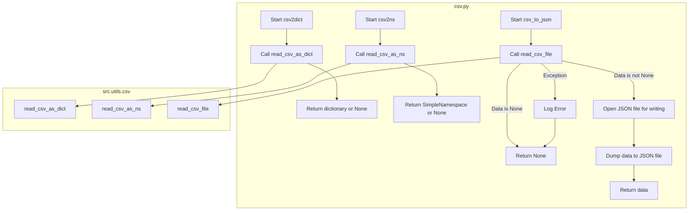

## АНАЛИЗ КОДА `hypotez/src/utils/convertors/csv.py`

### 1. <алгоритм>

**Функция `csv2dict`:**

1.  **Вход:** Получает путь к CSV файлу (`csv_file`) и дополнительные аргументы (`*args`, `**kwargs`).
2.  **Вызов:** Вызывает функцию `read_csv_as_dict` из модуля `src.utils.csv`, передавая ей путь к файлу и дополнительные аргументы.
3.  **Возврат:** Возвращает результат вызова функции `read_csv_as_dict`, который является словарем или `None` в случае ошибки.

    *   _Пример_:
        ```python
        # Пример: Предположим, csv_file = 'data.csv', содержимое CSV: "name,age\nJohn,30\nAlice,25"
        result = csv2dict('data.csv')
        # Ожидаемый результат: [{'name': 'John', 'age': '30'}, {'name': 'Alice', 'age': '25'}] или None, если файл не найден.
        ```

**Функция `csv2ns`:**

1.  **Вход:** Получает путь к CSV файлу (`csv_file`) и дополнительные аргументы (`*args`, `**kwargs`).
2.  **Вызов:** Вызывает функцию `read_csv_as_ns` из модуля `src.utils.csv`, передавая ей путь к файлу и дополнительные аргументы.
3.  **Возврат:** Возвращает результат вызова функции `read_csv_as_ns`, который является объектом SimpleNamespace или `None` в случае ошибки.

    *   _Пример_:
        ```python
        # Пример: Предположим, csv_file = 'data.csv', содержимое CSV: "name,age\nJohn,30\nAlice,25"
        result = csv2ns('data.csv')
        # Ожидаемый результат: SimpleNamespace(name='John', age='30'), SimpleNamespace(name='Alice', age='25') или None, если файл не найден.
        ```

**Функция `csv_to_json`:**

1.  **Вход:** Получает путь к CSV файлу (`csv_file_path`), путь к JSON файлу (`json_file_path`), и флаг `exc_info` (по умолчанию `True`).
2.  **Чтение CSV:** Вызывает `read_csv_file` из `src.utils.csv` для чтения данных из CSV.
3.  **Проверка данных:** Проверяет, что данные не `None`.
4.  **Открытие JSON файла:** Открывает JSON файл на запись в кодировке UTF-8.
5.  **Запись JSON:** Использует `json.dump` для записи данных в JSON файл с отступами.
6.  **Возврат:** Возвращает считанные данные.
7.  **Обработка исключений:** Если во время работы возникает исключение, логирует ошибку с использованием `logger.error` и возвращает `None`.

    *   _Пример_:
        ```python
        # Пример: Предположим, csv_file_path = 'data.csv', содержимое CSV: "name,age\nJohn,30\nAlice,25", json_file_path = 'data.json'
        result = csv_to_json('data.csv', 'data.json')
        # Ожидаемый результат: [{'name': 'John', 'age': '30'}, {'name': 'Alice', 'age': '25'}], файл 'data.json' будет содержать JSON представление данных.
        ```

### 2. <mermaid>



### 3. <объяснение>

**Импорты:**

*   `import json`: Используется для работы с JSON-данными, включая сериализацию (преобразование Python объектов в JSON) и десериализацию (преобразование JSON в Python объекты). В данном коде используется для записи данных в JSON-файл.
*   `import csv`: Используется для работы с CSV-файлами (чтение и запись данных в формате CSV). В данном коде не используется напрямую, но подразумевается использование в вызываемых функциях `read_csv_as_dict`, `read_csv_as_ns` и `read_csv_file` из `src.utils.csv`.
*   `from pathlib import Path`:  Используется для представления путей к файлам и каталогам в более объектно-ориентированном виде.
*   `from typing import List, Dict`: Используется для аннотации типов, что делает код более читаемым и позволяет IDE и инструментам статического анализа проверять типы переменных.
*   `from types import SimpleNamespace`: Используется для создания простых объектов с атрибутами, что полезно, когда нужно динамически создавать объекты с произвольными именами атрибутов.
*   `from src.logger.logger import logger`: Импортирует объект `logger` из модуля `src.logger.logger`, который используется для логирования ошибок и другой важной информации.
*   `from src.utils.csv import read_csv_as_dict, read_csv_as_ns, save_csv_file, read_csv_file`: Импортирует функции для работы с CSV файлами из модуля `src.utils.csv`:
    *   `read_csv_as_dict`: Читает CSV файл и возвращает данные в виде списка словарей.
    *   `read_csv_as_ns`: Читает CSV файл и возвращает данные в виде списка `SimpleNamespace` объектов.
    *   `read_csv_file`: Читает CSV файл и возвращает данные в виде списка словарей или списка списков.
    *   `save_csv_file`: функция не используется в коде.

**Функции:**

*   `csv2dict(csv_file: str | Path, *args, **kwargs) -> dict | None`:
    *   **Аргументы**:
        *   `csv_file`: Путь к CSV-файлу (может быть строкой или объектом `Path`).
        *   `*args`, `**kwargs`: Дополнительные позиционные и именованные аргументы, которые будут переданы в `read_csv_as_dict`.
    *   **Возвращает**: Словарь (список словарей) с данными из CSV-файла или `None`, если чтение не удалось.
    *   **Назначение**: Функция-обертка, которая вызывает функцию `read_csv_as_dict` из `src.utils.csv`.
*   `csv2ns(csv_file: str | Path, *args, **kwargs) -> SimpleNamespace | None`:
    *   **Аргументы**:
        *   `csv_file`: Путь к CSV-файлу (может быть строкой или объектом `Path`).
        *   `*args`, `**kwargs`: Дополнительные позиционные и именованные аргументы, которые будут переданы в `read_csv_as_ns`.
    *   **Возвращает**: `SimpleNamespace` объект с данными из CSV-файла или `None`, если чтение не удалось.
    *   **Назначение**: Функция-обертка, которая вызывает функцию `read_csv_as_ns` из `src.utils.csv`.
*   `csv_to_json(csv_file_path: str | Path, json_file_path: str | Path, exc_info: bool = True) -> List[Dict[str, str]] | None`:
    *   **Аргументы**:
        *   `csv_file_path`: Путь к CSV-файлу (может быть строкой или объектом `Path`).
        *   `json_file_path`: Путь к JSON-файлу (может быть строкой или объектом `Path`).
        *   `exc_info`: Флаг, указывающий, нужно ли включать информацию об исключении в лог. По умолчанию `True`.
    *   **Возвращает**: Список словарей, представляющий данные из CSV-файла, или `None` в случае ошибки.
    *   **Назначение**: Преобразует CSV-файл в JSON-файл.

**Переменные:**

*   `csv_file_path`, `json_file_path`:  Переменные, представляющие пути к CSV- и JSON-файлам, могут быть типа `str` или `Path`.
*   `exc_info`: Логическая переменная, определяющая, добавлять ли в лог информацию об исключении.
*   `data`: Переменная, в которую сохраняются прочитанные из csv файла данные.
*   `jsonfile`: файловый объект, используемый для записи JSON-данных в файл.

**Взаимосвязи:**

*   **src.logger.logger**: Модуль `src.logger.logger` используется для логирования ошибок и другой важной информации, связанных с конвертацией.
*   **src.utils.csv**: Модуль `src.utils.csv` содержит функции для работы с CSV-файлами.
*   **json**: Модуль `json` используется для сериализации данных в формат JSON и записи в файл.

**Потенциальные ошибки и улучшения:**

*   **Обработка ошибок**: Ошибки при чтении CSV-файла (например, отсутствие файла, некорректный формат) обрабатываются и логируются, но можно добавить более детальную обработку исключений, чтобы более точно определять тип возникшей проблемы и предоставлять пользователю более информативное сообщение об ошибке.
*   **Повторное использование кода**: Функции `csv2dict` и `csv2ns` являются простыми обертками над функциями `read_csv_as_dict` и `read_csv_as_ns` из `src.utils.csv`. Возможно, стоит рассмотреть возможность избавиться от этих оберток, если они не предоставляют дополнительной логики.
*   **Гибкость**: Функцию `csv_to_json` можно улучшить, добавив возможность использовать другие аргументы `json.dump` для более гибкой настройки вывода JSON.
*   **Типизация**: В некоторых случаях, можно добавить более конкретные типы, чтобы сделать код еще более выразительным и читаемым.
*   **Отсутствие тестов**: В коде отсутствуют автоматизированные тесты, что затрудняет проверку правильности работы и внесение изменений в будущем.

**Цепочка взаимосвязей:**
1.  **Вызов функций**:
    *   `csv2dict` -> `src.utils.csv.read_csv_as_dict`
    *   `csv2ns` -> `src.utils.csv.read_csv_as_ns`
    *   `csv_to_json` -> `src.utils.csv.read_csv_file`
2.  **Обработка данных**:
    *   Чтение данных из CSV -> преобразование данных в необходимый формат (список словарей, список `SimpleNamespace` объектов) -> запись данных в файл JSON.
3.  **Логирование**:
    *   При возникновении ошибок, информация об этом записывается в лог с использованием `src.logger.logger.logger`.

Этот анализ обеспечивает всестороннее понимание представленного кода, его функций, взаимосвязей с другими частями проекта и потенциальных областей для улучшения.