## <алгоритм>

1.  **`csv2dict(csv_file, *args, **kwargs)`**:
    *   **Вход**: Путь к CSV файлу (`csv_file`), дополнительные позиционные (`*args`) и именованные (`**kwargs`) аргументы.
    *   **Действие**: Вызывает функцию `read_csv_as_dict` с переданными аргументами.
    *   **Выход**: Результат работы `read_csv_as_dict` (словарь или `None`).
    *   **Пример**: `csv2dict("data.csv", delimiter=",")`

2.  **`csv2ns(csv_file, *args, **kwargs)`**:
    *   **Вход**: Путь к CSV файлу (`csv_file`), дополнительные позиционные (`*args`) и именованные (`**kwargs`) аргументы.
    *   **Действие**: Вызывает функцию `read_csv_as_ns` с переданными аргументами.
    *   **Выход**: Результат работы `read_csv_as_ns` (SimpleNamespace объект или `None`).
    *    **Пример**: `csv2ns("data.csv")`

3.  **`csv_to_json(csv_file_path, json_file_path, exc_info=True)`**:
    *   **Вход**: Путь к CSV файлу (`csv_file_path`), путь к JSON файлу (`json_file_path`), флаг для включения traceback в логи (`exc_info`).
    *   **Действие**:
        *   Вызывает функцию `read_csv_file` для чтения данных из CSV.
        *   Если данные успешно прочитаны:
            *   Открывает JSON файл на запись.
            *   Записывает данные в JSON файл с отступами в 4 пробела.
            *   Возвращает прочитанные данные.
        *   Если данные не прочитаны или возникла ошибка, возвращает `None`.
        *   Ловит и логирует исключения при неудачной конвертации.
    *   **Выход**: Список словарей с данными из CSV (`List[Dict[str, str]]`) или `None` в случае ошибки.
    *    **Пример**: `csv_to_json("data.csv", "data.json")`
    
    **Поток данных**: `csv_file_path` -> `read_csv_file` -> `data` -> `json.dump` -> `json_file_path`

```mermaid
flowchart TD
    subgraph csv.py
        Start(["Start"])
        csv2dict_func[<code>csv2dict</code><br>Convert CSV to dict]
        csv2ns_func[<code>csv2ns</code><br>Convert CSV to SimpleNamespace]
        csv_to_json_func[<code>csv_to_json</code><br>Convert CSV to JSON file]

        Start --> csv2dict_func
        Start --> csv2ns_func
        Start --> csv_to_json_func
        
        subgraph utils.csv
        read_csv_as_dict_func[<code>read_csv_as_dict</code><br>Read CSV as dict]
        read_csv_as_ns_func[<code>read_csv_as_ns</code><br>Read CSV as SimpleNamespace]
        read_csv_file_func[<code>read_csv_file</code><br>Read CSV File]
        save_csv_file_func[<code>save_csv_file</code><br>Save CSV File]

        csv2dict_func --> read_csv_as_dict_func
        csv2ns_func --> read_csv_as_ns_func
        csv_to_json_func --> read_csv_file_func
        
    end
        
        
        read_csv_file_func --> json_dump[<code>json.dump</code> <br> Dump to JSON]
        json_dump --> End_CSV_JSON(["End CSV to JSON"])
        read_csv_as_dict_func --> End_CSV_DICT(["End CSV to Dict"])
        read_csv_as_ns_func --> End_CSV_NS(["End CSV to SimpleNamespace"])
        
    end

    style Start fill:#f9f,stroke:#333,stroke-width:2px
    style End_CSV_JSON fill:#ccf,stroke:#333,stroke-width:2px
    style End_CSV_DICT fill:#ccf,stroke:#333,stroke-width:2px
    style End_CSV_NS fill:#ccf,stroke:#333,stroke-width:2px
```

## <mermaid>

## <объяснение>

### Импорты
*   `json`: Используется для работы с JSON-форматом данных, в частности для сериализации и сохранения данных в JSON-файл.
*   `csv`: Используется для работы с CSV-файлами, включая чтение и запись данных.
*   `pathlib.Path`: Используется для работы с файловыми путями в объектно-ориентированном стиле, что делает код более читаемым и платформонезависимым.
*   `typing.List`, `typing.Dict`: Используется для аннотации типов, улучшает читаемость кода и помогает в отлове ошибок на этапе разработки. `List` и `Dict` указывают, что переменная является списком или словарем.
*   `types.SimpleNamespace`:  Используется для создания объектов с атрибутами, доступ к которым осуществляется через точку, как в обычных объектах. Это удобно, когда нужно создать структуру данных, не определяя класс.
*   `src.logger.logger.logger`: Используется для логирования событий и ошибок в приложении.
*    `src.utils.csv`:  Импортирует функции для работы с CSV файлами, такие как чтение в виде словарей, именнованных кортежей и запись в файл.

### Функции

*   **`csv2dict(csv_file: str | Path, *args, **kwargs) -> dict | None`**:
    *   **Аргументы**:
        *   `csv_file`: Путь к CSV файлу в виде строки или объекта `Path`.
        *   `*args`: Необязательные позиционные аргументы для функции `read_csv_as_dict`.
        *   `**kwargs`: Необязательные именованные аргументы для функции `read_csv_as_dict`.
    *   **Возвращает**: Словарь, представляющий данные из CSV файла, или `None`, если произошла ошибка.
    *   **Назначение**: Преобразует CSV-файл в словарь.
    *   **Пример**: `csv2dict("data.csv", delimiter=",")` преобразует CSV файл `data.csv` используя запятую как разделитель и возвращает словарь.

*   **`csv2ns(csv_file: str | Path, *args, **kwargs) -> SimpleNamespace | None`**:
    *   **Аргументы**:
        *   `csv_file`: Путь к CSV файлу в виде строки или объекта `Path`.
        *   `*args`: Необязательные позиционные аргументы для функции `read_csv_as_ns`.
        *   `**kwargs`: Необязательные именованные аргументы для функции `read_csv_as_ns`.
    *   **Возвращает**: Объект `SimpleNamespace`, представляющий данные из CSV файла, или `None`, если произошла ошибка.
    *   **Назначение**: Преобразует CSV-файл в `SimpleNamespace`.
    *    **Пример**: `csv2ns("data.csv")` преобразует CSV файл `data.csv` и возвращает объект SimpleNamespace.

*   **`csv_to_json(csv_file_path: str | Path, json_file_path: str | Path, exc_info: bool = True) -> List[Dict[str, str]] | None`**:
    *   **Аргументы**:
        *   `csv_file_path`: Путь к CSV файлу в виде строки или объекта `Path`.
        *   `json_file_path`: Путь к JSON файлу в виде строки или объекта `Path`.
        *   `exc_info`: Логический флаг, определяющий, включать ли traceback информацию в лог. По умолчанию `True`.
    *   **Возвращает**: Список словарей с данными из CSV (`List[Dict[str, str]]`) или `None` в случае ошибки.
    *   **Назначение**: Читает данные из CSV файла, преобразует их в JSON-формат и сохраняет в JSON-файл.
    *   **Пример**: `csv_to_json("data.csv", "data.json")` преобразует CSV файл `data.csv` в JSON файл `data.json`.

### Переменные
*   В основном используются аргументы функций, например `csv_file`, `json_file_path`. Типы переменных указаны с помощью аннотации типов (`str | Path`, `bool`, `List[Dict[str, str]]` и т.д.).

### Потенциальные ошибки и области для улучшения

*   **Обработка исключений**: В функции `csv_to_json` используется общий блок `except Exception as ex`. Возможно, стоит добавить более конкретные блоки обработки исключений для разных типов ошибок. Например, для `FileNotFoundError`, `csv.Error`, `json.JSONEncodeError`.
*   **Валидация данных**: Нет проверки на корректность CSV-файла и его содержимого. Можно добавить проверки на соответствие структуры файла ожидаемой, например, наличие заголовков.
*   **Кодировка файлов**: Кодировка `utf-8` используется при записи в JSON файл, но не указана при чтении CSV файлов. Это может вызвать проблемы с файлами, закодированными в другой кодировке.
*   **Логирование**: Логирование ошибок производится с использованием `logger.error`, что хорошо, но можно добавить более детальное логирование, например, с указанием имени файла и точного места возникновения ошибки.
*   **Типизация**: В функции `csv_to_json` возвращаемый тип `List[Dict[str, str]]` -  может быть уточнён, так как значения в словаре могут быть не только строками, а  и других типов данных, в зависимости от  содержимого CSV файла.

### Взаимосвязь с другими частями проекта

*   **`src.logger.logger`**: Модуль `logger` используется для логирования ошибок и событий, что является важной частью любого приложения для отладки и мониторинга.
*   **`src.utils.csv`**:  Модуль `src.utils.csv` содержит  функции для работы с CSV-файлами.
    *   `read_csv_as_dict` — используется для чтения CSV в виде словарей.
    *   `read_csv_as_ns` — используется для чтения CSV в виде `SimpleNamespace`.
    *   `read_csv_file` — используется для чтения CSV файлов.
    *   `save_csv_file` — используется для сохранения данных в CSV файл.
*   **`src`**: Код является частью пакета `src`, что подразумевает общую структуру проекта, где разные модули могут взаимодействовать друг с другом.

Этот код является частью утилит для конвертации данных и может быть использован в других модулях проекта, которым требуется обрабатывать CSV данные, конвертировать их в JSON формат или в виде словарей.