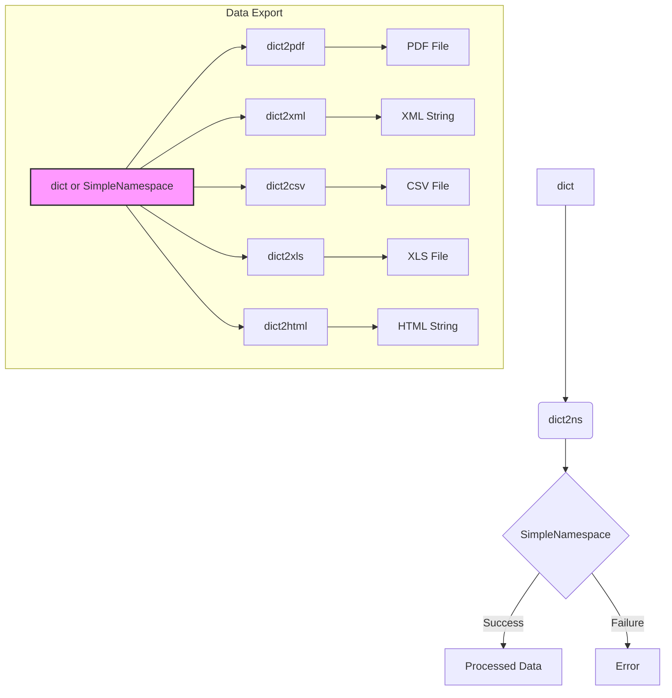

```MD
# <input code>

```python
## \file hypotez/src/utils/convertors/dict.py
# -*- coding: utf-8 -*-
#! venv/Scripts/python.exe
#! venv/bin/python/python3.12

"""
.. module:: src.utils.convertors.dict 
	:platform: Windows, Unix
	:synopsis: Converter for converting between dict and SimpleNamespace objects

"""
MODE = 'dev'


""" This module contains functions to recursively convert dictionaries to SimpleNamespace
objects and vice versa, as well as exporting data to various formats.

Functions:
    - `dict2ns`: Recursively convert dictionaries to SimpleNamespace objects.
    - `dict2xml`: Generate an XML string from a dictionary.
    - `dict2csv`: Save dictionary or SimpleNamespace data to a CSV file.
    - `dict2json`: Save dictionary or SimpleNamespace data to a JSON file.
    - `dict2xls`: Save dictionary or SimpleNamespace data to an XLS file.
    - `dict2html`: Generate an HTML table string from a dictionary or SimpleNamespace object.
    - `dict2pdf`: Save dictionary data as a PDF file.
"""


import json
from types import SimpleNamespace
from typing import Any, Dict, List
from pathlib import Path
from xml.dom.minidom import getDOMImplementation
from reportlab.lib.pagesizes import A4
from reportlab.pdfgen import canvas
from src.utils.xls import save_xls_file

# ... (rest of the code)
```

# <algorithm>

**Функция `replace_key_in_dict`:**

1. Принимает словарь или список `data`, старое имя ключа `old_key` и новое имя ключа `new_key`.
2. Рекурсивно проверяет, является ли `data` словарем или списком.
3. Если `data` - словарь, проверяет каждый ключ.
4. Если ключ равен `old_key`, заменяет его на `new_key`.
5. Рекурсивно вызывает функцию для вложенных словарей и списков.
6. Возвращает обновленный словарь или список.

**Пример:**

Вход: `data = {"old_key": 1, "other_key": {"old_key": 2}}`, `old_key = "old_key"`, `new_key = "new_key"`
Выход: `{"new_key": 1, "other_key": {"new_key": 2}}`

**Функция `dict2pdf`:**

1. Принимает данные `data` (словарь или SimpleNamespace) и путь к файлу `file_path`.
2. Если `data` - SimpleNamespace, преобразует его в словарь.
3. Создаёт объект canvas для PDF файла.
4. Перебирает пары ключ-значение в словаре.
5. Добавляет строку `ключ: значение` на страницу.
6. Если места на странице не хватает, переходит на новую страницу.
7. Сохраняет PDF файл.

**Функция `dict2ns`:**

1. Принимает данные `data` (словарь или список).
2. Если `data` - словарь, рекурсивно конвертирует вложенные словари в SimpleNamespace.
3. Если `data` - список, рекурсивно конвертирует вложенные словари в SimpleNamespace.
4. Возвращает результат конвертации.


**Остальные функции (dict2xml, dict2csv, dict2xls, dict2html):**
Каждая функция имеет свою специфику обработки данных для соответствующего формата.

# <mermaid>



**Объяснение зависимостей:**

* `reportlab`: Библиотека для создания PDF-документов. Используется для генерации файла `dict2pdf`.
* `xml.dom.minidom`: Библиотека для работы с XML-документами.  Используется в `dict2xml` для создания XML-строки.
* `json`: Библиотека для работы с JSON-форматом.  Вероятно, используется для промежуточной обработки данных.
* `src.utils.xls`: Модуль для работы с XLS-файлами.  Вероятно, содержит функции для сохранения данных в XLS-формат.
* `pathlib`: Библиотека для работы с путями к файлам.
* `types`: Библиотека для работы с типами данных.  Используется для работы с `SimpleNamespace`.


# <explanation>

**Импорты:**

* `json`: Для работы с JSON-данными (вероятно, используется внутри модуля, но не напрямую в экспортирующих функциях).
* `types.SimpleNamespace`: Для создания объектов SimpleNamespace.
* `typing`: Для аннотирования типов данных (что улучшает читабельность и помогает статическому анализу).
* `pathlib`: Для работы с файловыми путями.
* `xml.dom.minidom`: Для создания XML-документов.
* `reportlab.lib.pagesizes`, `reportlab.pdfgen`: Для создания PDF-документов.
* `src.utils.xls`: Для сохранения данных в XLS-формат.
  
**Классы:**

Нет классов. Все функции являются автономными.


**Функции:**

* **`replace_key_in_dict`:** Рекурсивно заменяет ключи в словарях и списках. Важный инструмент для гибкости обработки данных.
* **`dict2pdf`:** Сохраняет данные словаря в PDF-файл.  Хорошее решение для генерации PDF-отчётов.
* **`dict2ns`:** Преобразует словарь в `SimpleNamespace` объект, что позволяет получить доступ к данным через атрибуты (например, `obj.key`).
* **`dict2xml`:** Преобразует словарь в строку XML.  Используется для сохранения данных в XML-формате.
* **`dict2csv`:** Сохраняет данные в CSV-файл.
* **`dict2xls`:** Сохраняет данные в XLS-файл.
* **`dict2html`:** Преобразует словарь в HTML-таблицу.  Подходит для представления данных в веб-формате.

**Переменные:**

`MODE`:  Переменная, возможно, используемая для определения режима работы (разработка, производство).

**Возможные ошибки и улучшения:**

* **Обработка ошибок:** Не все функции имеют обработку ошибок (например, проверку на корректность входных данных). Это следует добавить для повышения устойчивости кода.  Проверка типа данных `data` в функциях `dict2pdf`, `dict2csv`, `dict2html`, `dict2xml`, `dict2xls`, `dict2json` не выполняется.
* **Документация:** Некоторые функции имеют недостаточно подробную документацию. Документация должна быть полной и описывать все возможные сценарии использования.
* **Типы данных:** При использовании `SimpleNamespace`, не лишним было бы добавить проверку типов данных (например, int, float) в функцию `dict2xml`, чтобы избежать неожиданного поведения (преобразование в строку).
* **Оптимизация:** В функциях, обрабатывающих вложенные структуры, можно использовать более эффективные алгоритмы.
* **`dict2json`:**  Отсутствует. Необходимо добавить обработку JSON в экспорте данных.
* **Общие ошибки:** Необходимо добавить проверки корректности входных данных (пустой словарь, None и т.д.).

**Взаимосвязи с другими частями проекта:**

Функции из этого модуля (`hypotez/src/utils/convertors/dict.py`) предназначены для преобразования данных и сохранения их в разные форматы.  Они скорее всего используются в других модулях проекта (`src.utils.xls`, `src.some_other_module`) для работы с данными в различных форматах.  Эта связь должна быть описана в документации или комментариях.