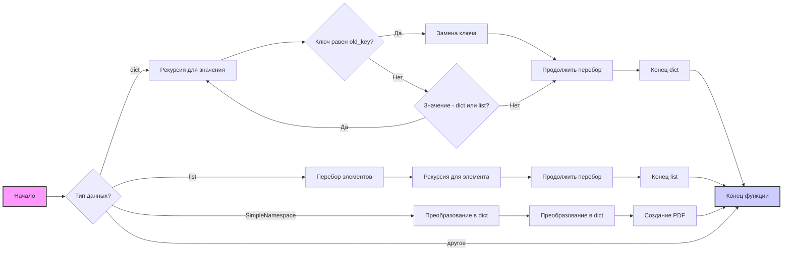
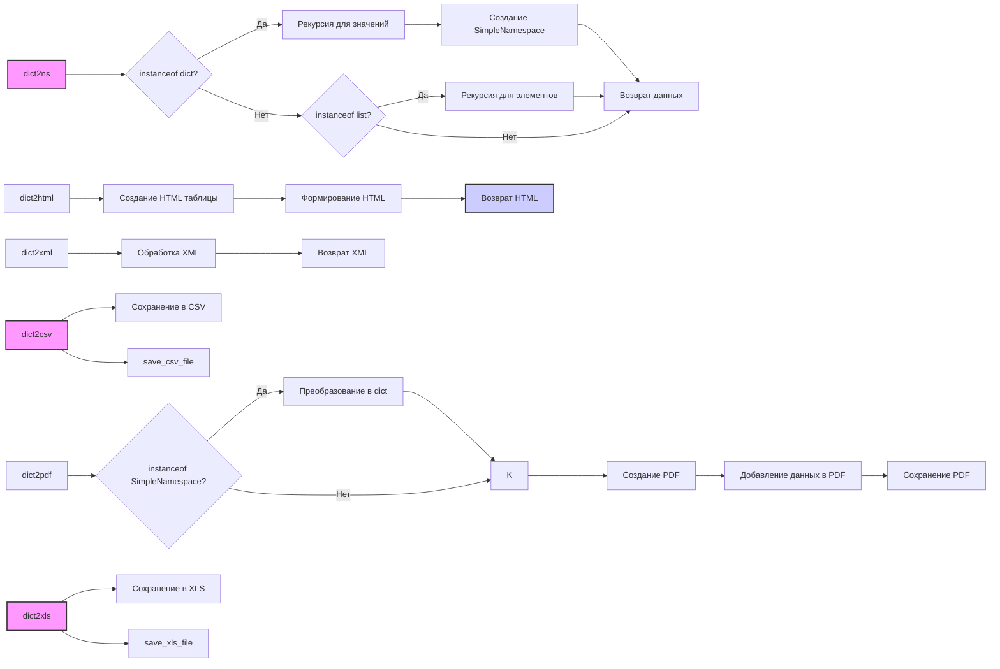

## Анализ кода `hypotez/src/utils/convertors/dict.py`

### 1. <алгоритм>

**Блок-схема:**

**Примеры:**

1.  **`replace_key_in_dict`**:
    *   Вход: `{"old_key": "value"}` , `old_key="old_key"`, `new_key="new_key"`
    *   Выход: `{"new_key": "value"}`.
    *   Вход: `{"outer": {"old_key": "value"}}` , `old_key="old_key"`, `new_key="new_key"`
    *   Выход: `{"outer": {"new_key": "value"}}`
    *   Вход: `[{"old_key": "value1"}, {"old_key": "value2"}]`, `old_key="old_key"`, `new_key="new_key"`
    *   Выход: `[{"new_key": "value1"}, {"new_key": "value2"}]`

2.  **`dict2pdf`**:
    *   Вход: `{"key1": "value1", "key2": "value2"}`
    *   Действие: Создается PDF файл со строками `key1: value1`, `key2: value2`.

3.  **`dict2ns`**:
    *   Вход: `{"key1": "value1", "key2": {"key3": "value3"}}`
    *   Выход: `SimpleNamespace(key1='value1', key2=SimpleNamespace(key3='value3'))`

4. **`dict2xml`**:
    * Вход: `{"root": {"item1": "value1", "item2": {"value": "value2"}, "attrs": {"name": "test"}}}`
    * Выход: `<root name="test"><item1>value1</item1><item2>value2</item2></root>`

5. **`dict2csv`**:
    * Вход: `{"col1": ["val1", "val2"], "col2": ["val3", "val4"]}`, `file_path = "test.csv"`
    * Действие: Создается CSV файл с данными.

6. **`dict2xls`**:
    * Вход: `{"col1": ["val1", "val2"], "col2": ["val3", "val4"]}`, `file_path = "test.xls"`
    * Действие: Создается XLS файл с данными.

7.  **`dict2html`**:
    *   Вход: `{"key1": "value1", "key2": {"key3": "value3"}}`
    *   Выход: HTML table с ключами и значениями.

### 2. <mermaid>

**Объяснение зависимостей:**

*   **`dict2ns`**: Рекурсивно преобразует словари в объекты `SimpleNamespace`. Зависит от модуля `types` для создания `SimpleNamespace`.
*   **`dict2pdf`**: Создает PDF документ на основе данных из словаря. Использует `reportlab` для работы с PDF.
*   **`dict2xml`**: Преобразует словарь в XML строку. Использует `xml.dom.minidom` для создания XML.
*  **`dict2csv`**: Сохраняет данные в CSV файл. Зависит от `save_csv_file`.
*  **`dict2xls`**: Сохраняет данные в XLS файл. Зависит от `src.utils.xls.save_xls_file`.
*   **`dict2html`**: Генерирует HTML таблицу из словаря.
*   Импортированные модули: `json`, `SimpleNamespace`, `Any, Dict, List`, `Path`, `getDOMImplementation`, `A4`, `canvas`, `save_xls_file`

### 3. <объяснение>

**Импорты:**

*   `json`: Используется для работы с JSON данными, но в данном файле не используется напрямую. Возможно, используется в других функциях, которые вызывают `dict2csv` или `dict2json`.
*   `SimpleNamespace` из `types`: Используется для создания объектов с атрибутами, доступными через точку.
*   `Any, Dict, List` из `typing`: Используются для аннотации типов.
*   `Path` из `pathlib`: Используется для работы с путями к файлам.
*   `getDOMImplementation` из `xml.dom.minidom`: Используется для создания XML документов.
*   `A4` из `reportlab.lib.pagesizes`: Задает размер страницы для PDF.
*   `canvas` из `reportlab.pdfgen`: Используется для создания PDF.
*   `save_xls_file` из `src.utils.xls`: Используется для сохранения данных в формате XLS.

**Функции:**

*   **`replace_key_in_dict(data, old_key, new_key)`**:
    *   **Аргументы**: `data` (словарь или список), `old_key` (ключ для замены), `new_key` (новый ключ).
    *   **Возвращает**: Обновленный словарь.
    *   **Назначение**: Рекурсивно заменяет ключ в словаре или списке словарей.
    *   **Пример**:
        *   Вход: `{"old_key": "value"}`, `"old_key"`, `"new_key"`
        *   Выход: `{"new_key": "value"}`

*   **`dict2pdf(data, file_path)`**:
    *   **Аргументы**: `data` (словарь или SimpleNamespace), `file_path` (путь к файлу).
    *   **Возвращает**: `None`.
    *   **Назначение**: Сохраняет словарь в PDF.
    *   **Пример**: `dict2pdf({"name": "test", "value": 123}, "output.pdf")`

*   **`dict2ns(data)`**:
    *   **Аргументы**: `data` (словарь или список).
    *   **Возвращает**: `SimpleNamespace` или список `SimpleNamespace`.
    *   **Назначение**: Рекурсивно преобразует словарь в `SimpleNamespace`.
    *   **Пример**: `dict2ns({"key1": "value1", "key2": {"key3": "value3"}})`

*  **`dict2xml(data, encoding='UTF-8')`**:
    *   **Аргументы**: `data` (словарь), `encoding` (кодировка).
    *   **Возвращает**: XML строка.
    *   **Назначение**: Преобразует словарь в XML.
    *    **Пример**: `dict2xml({"root": {"item1": "value1", "item2": {"value": "value2"}, "attrs": {"name": "test"}}})`

*   **`dict2csv(data, file_path)`**:
    *   **Аргументы**: `data` (словарь или SimpleNamespace), `file_path` (путь к файлу).
    *   **Возвращает**: `bool`.
    *   **Назначение**: Сохраняет словарь в CSV.
    *   **Пример**: `dict2csv({"col1": ["val1", "val2"], "col2": ["val3", "val4"]}, "output.csv")`

*   **`dict2xls(data, file_path)`**:
    *   **Аргументы**: `data` (словарь или SimpleNamespace), `file_path` (путь к файлу).
    *   **Возвращает**: `bool`.
    *   **Назначение**: Сохраняет словарь в XLS.
    *   **Пример**: `dict2xls({"col1": ["val1", "val2"], "col2": ["val3", "val4"]}, "output.xls")`

*   **`dict2html(data, encoding='UTF-8')`**:
    *   **Аргументы**: `data` (словарь или SimpleNamespace), `encoding` (кодировка).
    *   **Возвращает**: HTML строка.
    *   **Назначение**: Преобразует словарь в HTML.
    *   **Пример**: `dict2html({"key1": "value1", "key2": {"key3": "value3"}})`

**Переменные:**

*   `MODE`: Строковая переменная, определяющая режим работы. Используется в контексте проекта, но не используется в этом файле напрямую.

**Потенциальные ошибки и области для улучшения:**

*   В функции `dict2xml`  проверка на количество корней `if len(data) > 1:` может быть излишней, если структура XML  должна поддерживать несколько корней.
*   В функции `dict2pdf` при создании PDF документа для больших словарей, нужно предусмотреть разбиение на страницы.
*   В функциях `dict2csv` и `dict2xls` используется вызов сторонних функций из других модулей `save_csv_file` и `save_xls_file`.
*   Обработка ошибок не всегда явно прописана.  Нужно добавить `try-except` блоки, чтобы обрабатывать исключения при работе с файлами.
*   В функции `dict2html` не хватает обработки  специальных символов, для корректного отображения в HTML.

**Взаимосвязи с другими частями проекта:**

*   Функции `dict2csv` и `dict2xls` зависят от `save_csv_file` (должен быть реализован в `src.utils.csv`) и `src.utils.xls.save_xls_file`.
*   Импорт `src.utils.xls` указывает на зависимость от этого модуля.
*   Этот модуль предназначен для преобразования данных и используется другими модулями, где требуется вывод данных в различных форматах.