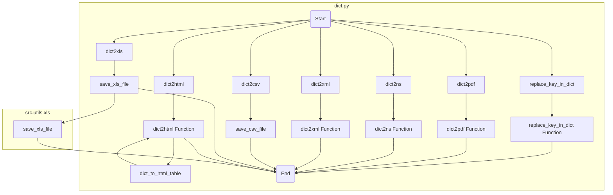

## ИНСТРУКЦИЯ:

Анализируй предоставленный код подробно и объясни его функциональность. Ответ должен включать три раздела:

1.  **<алгоритм>**: Опиши рабочий процесс в виде пошаговой блок-схемы, включая примеры для каждого логического блока, и проиллюстрируй поток данных между функциями, классами или методами.
2.  **<mermaid>**: Напиши код для диаграммы в формате `mermaid`, проанализируй и объясни все зависимости,
    которые импортируются при создании диаграммы.
    **ВАЖНО!** Убедитесь, что все имена переменных, используемые в диаграмме `mermaid`,
    имеют осмысленные и описательные имена. Имена переменных вроде `A`, `B`, `C`, и т.д., не допускаются!

    **Дополнительно**: Если в коде есть импорт `import header`, добавьте блок `mermaid` flowchart, объясняющий `header.py`:
    ```mermaid
    flowchart TD
        Start --> Header[<code>header.py</code><br> Determine Project Root]

        Header --> import[Import Global Settings: <br><code>from src import gs</code>]
    ```

3.  **<объяснение>**: Предоставьте подробные объяснения:
    -   **Импорты**: Их назначение и взаимосвязь с другими пакетами `src.`.
    -   **Классы**: Их роль, атрибуты, методы и взаимодействие с другими компонентами проекта.
    -   **Функции**: Их аргументы, возвращаемые значения, назначение и примеры.
    -   **Переменные**: Их типы и использование.
    -   Выделите потенциальные ошибки или области для улучшения.

Дополнительно, постройте цепочку взаимосвязей с другими частями проекта (если применимо).

Это обеспечивает всесторонний и структурированный анализ кода.
## Формат ответа: `.md` (markdown)
**КОНЕЦ ИНСТРУКЦИИ**
```markdown
## <алгоритм>

### `replace_key_in_dict`
1.  **Вход:** `data` (словарь или список), `old_key` (строка), `new_key` (строка).
2.  **Проверка типа `data`**:
    *   Если `data` - словарь:
        1.  Итерируем по ключам словаря.
        2.  Если ключ равен `old_key`:
            *   Удаляем `old_key` и добавляем `new_key` со значением `old_key`.
        3.  Если значение - словарь или список, рекурсивно вызываем `replace_key_in_dict`
    *   Если `data` - список:
        1.  Итерируем по элементам списка.
        2.  Для каждого элемента вызываем `replace_key_in_dict`.
3.  **Возврат:** Обновленный словарь или список.

**Пример:**

   ```
    data = {"old_key": "value", "nested": {"old_key": "nested_value"}, "list_data": [{"old_key": "list_value"}]}
    replace_key_in_dict(data, "old_key", "new_key")
    # Результат: {"new_key": "value", "nested": {"new_key": "nested_value"}, "list_data": [{"new_key": "list_value"}]}
   ```

### `dict2pdf`
1.  **Вход:** `data` (словарь или `SimpleNamespace`), `file_path` (путь к файлу).
2.  Если `data` - `SimpleNamespace`, преобразуем его в словарь.
3.  Создаем PDF-документ с помощью `canvas.Canvas`.
4.  Устанавливаем шрифт.
5.  Итерируем по элементам словаря:
    *   Создаем строку вида "ключ: значение".
    *   Выводим строку в PDF.
    *   Уменьшаем Y-координату для следующей строки.
    *   Если Y-координата меньше порога, начинаем новую страницу.
6.  Сохраняем PDF-документ.

**Пример:**
```
   data = {"name": "John", "age": 30}
   dict2pdf(data, "output.pdf") # Создаст PDF файл с данными из словаря
```

### `dict2ns`
1.  **Вход:** `data` (словарь или список).
2.  **Проверка типа `data`**:
    *   Если `data` - словарь:
        1.  Итерируем по элементам словаря.
        2.  Если значение - словарь, рекурсивно вызываем `dict2ns`.
        3.  Если значение - список, применяем `dict2ns` к элементам словаря, если они словари.
        4.  Возвращаем `SimpleNamespace`, созданный из словаря.
    *   Если `data` - список:
         1.  Применяем `dict2ns` к элементам списка, если они словари.
    *   Иначе возвращаем `data` без изменений
3.  **Возврат:** `SimpleNamespace` или список `SimpleNamespace`.

**Пример:**
```
   data = {"name": "John", "details": {"age": 30, "city": "New York"}, "hobbies": ["reading", "coding"]}
   ns_data = dict2ns(data)
   # ns_data.name == "John"
   # ns_data.details.age == 30
   # ns_data.hobbies == ["reading", "coding"]
```
### `dict2xml`
1.  **Вход:** `data` (словарь), `encoding` (кодировка).
2.  Определяем вложенные функции `_process_simple`, `_process_attr`, `_process_complex`, `_process`.
3.  Создаем XML-документ.
4.  Вызываем `_process_complex` для обработки корневых элементов словаря.
5.  Добавляем полученный корневой элемент в XML-документ.
6.  Возвращаем XML-строку.

**Пример:**
```
   data = {"root": {"item1": "value1", "item2": {"value": "value2", "attrs": {"name": "attr1"}}}}
   xml_string = dict2xml(data)
   # xml_string будет содержать XML представление данных
```
### `dict2csv`
1.  **Вход:** `data` (словарь или `SimpleNamespace`), `file_path` (путь к файлу).
2.  Вызывает `save_csv_file` для сохранения данных в CSV.
3.  **Возврат:** Результат вызова `save_csv_file`.

### `dict2xls`
1.  **Вход:** `data` (словарь или `SimpleNamespace`), `file_path` (путь к файлу).
2.  Вызывает `save_xls_file` для сохранения данных в XLS.
3.  **Возврат:** Результат вызова `save_xls_file`.

### `dict2html`
1.  **Вход:** `data` (словарь или `SimpleNamespace`), `encoding` (кодировка).
2.  Если `data` - `SimpleNamespace`, преобразуем его в словарь.
3.  Определяем вложенную функцию `dict_to_html_table`, преобразующую словарь в HTML-таблицу.
4.  Вызываем `dict_to_html_table` для преобразования словаря в HTML.
5.  Оборачиваем HTML-таблицу в HTML-документ.
6.  **Возврат:** HTML-строку.

**Пример:**
```
   data = {"name": "John", "details": {"age": 30}}
   html_string = dict2html(data)
    # html_string будет содержать HTML-представление данных
```

## <mermaid>


**Описание `mermaid` диаграммы:**

*   **`dict.py`**:  Основной блок, представляющий файл `dict.py`.
    *   **`Start`**: Начало выполнения кода.
    *   **Функции:** `replace_key_in_dict`, `dict2pdf`, `dict2ns`, `dict2xml`, `dict2csv`, `dict2xls`, `dict2html` -  представлены как узлы-вызовы функций.
    *   **Функциональные блоки**: `replace_key_in_dict Function`, `dict2pdf Function`, `dict2ns Function`, `dict2xml Function`, `dict2html Function` - представляют определения функций внутри `dict.py`
    *   **Вложенные вызовы:** `dict2html` вызывает `dict_to_html_table`.
    *   **Вызов внешних функций:**  `dict2csv` и `dict2xls` вызывают функции `save_csv_file` и `save_xls_file`, соответственно.
    *   **`End`**: Конец выполнения кода.
*   **`src.utils.xls`**: Представляет внешний модуль `src.utils.xls`
    *   **`save_xls_file`**: функция `save_xls_file` как узел, вызываемый из  `dict.py`

**Импорты, используемые в диаграмме `mermaid`:**

*   `json`: Для работы с JSON (непосредственно не участвует в блок схеме, так как не используется в логике, но импортируется в файле).
*   `types.SimpleNamespace`:  Создание объектов с атрибутами, доступными через точку.
*    `typing`: для аннотаций типов.
*   `pathlib.Path`: для работы с путями к файлам (непосредственно не участвует в блок схеме, но импортируется в файле).
*   `xml.dom.minidom`: для работы с XML (используется в `dict2xml`).
*   `reportlab.lib.pagesizes`, `reportlab.pdfgen.canvas`: для создания PDF-документов (используется в `dict2pdf`).
*   `src.utils.xls`: для сохранения данных в XLS-файл (используется в `dict2xls`).

## <объяснение>

### Импорты:
* `json`:  Используется для работы с JSON-данными. Хотя прямого использования в коде нет, этот импорт предполагает, что функционал для работы с JSON данными возможно будет добавлен позже.
* `types.SimpleNamespace`: Класс для создания объектов с атрибутами, доступными через точечную нотацию. Используется для представления данных в виде объектов с удобным доступом к полям.
* `typing.Any, typing.Dict, typing.List`: Используются для аннотации типов данных, делая код более понятным и типобезопасным. `Any` означает, что переменная может иметь любой тип, `Dict` - словарь, `List` - список.
* `pathlib.Path`: Используется для работы с путями к файлам и каталогам. Предоставляет более объектно-ориентированный способ работы с файловой системой.
* `xml.dom.minidom`:  Модуль для создания и работы с XML-документами. Используется для конвертации словарей в XML формат.
* `reportlab.lib.pagesizes.A4`:  Используется для определения размера страницы A4 для PDF-документов.
* `reportlab.pdfgen.canvas`: Модуль для создания PDF-документов.
* `src.utils.xls.save_xls_file`: Функция для сохранения данных в XLS-файл. Импортируется для вызова в `dict2xls`.

### Функции:

* **`replace_key_in_dict(data, old_key, new_key)`**:
    *   **Аргументы**:
        *   `data` (`dict | list`): Словарь или список, в котором нужно заменить ключи.
        *   `old_key` (`str`): Ключ, который нужно заменить.
        *   `new_key` (`str`): Новый ключ.
    *   **Возвращаемое значение**: Обновленный словарь или список с замененными ключами.
    *   **Назначение**: Рекурсивно заменяет ключ `old_key` на `new_key` в словаре или списке, включая вложенные структуры.
* **`dict2pdf(data, file_path)`**:
    *   **Аргументы**:
        *   `data` (`dict | SimpleNamespace`): Словарь или `SimpleNamespace` объект для конвертации в PDF.
        *   `file_path` (`str | Path`): Путь к выходному PDF-файлу.
    *   **Возвращаемое значение**: `None`.
    *   **Назначение**: Конвертирует словарь или `SimpleNamespace` в PDF-файл. Данные отображаются построчно, ключи и значения.
* **`dict2ns(data)`**:
    *   **Аргументы**:
        *   `data` (`Dict[str, Any] | List[Any]`): Словарь или список, который нужно конвертировать.
    *   **Возвращаемое значение**: `Any`: Объект `SimpleNamespace`, созданный из входных данных.
    *   **Назначение**: Рекурсивно конвертирует словари в `SimpleNamespace`, обеспечивая точечный доступ к элементам.
* **`dict2xml(data, encoding='UTF-8')`**:
    *   **Аргументы**:
        *   `data` (`Dict[str, Any]`): Словарь для конвертации в XML.
        *   `encoding` (`str`, по умолчанию `'UTF-8'`): Кодировка данных.
    *   **Возвращаемое значение**: `str`: XML строка, представляющая входной словарь.
    *   **Назначение**: Преобразует словарь в XML-строку. Поддерживает вложенные структуры и атрибуты.
*   **`dict2csv(data, file_path)`**:
    *   **Аргументы**:
        *   `data` (`dict | SimpleNamespace`): Данные для сохранения в CSV.
        *   `file_path` (`str | Path`): Путь к CSV-файлу.
    *   **Возвращаемое значение**: `bool`: `True` при успешном сохранении, иначе `False`.
    *   **Назначение**: Сохраняет словарь или `SimpleNamespace` в CSV файл, используя функцию `save_csv_file`.
* **`dict2xls(data, file_path)`**:
    *   **Аргументы**:
        *   `data` (`dict | SimpleNamespace`): Данные для сохранения в XLS.
        *   `file_path` (`str | Path`): Путь к XLS-файлу.
    *   **Возвращаемое значение**: `bool`: `True` при успешном сохранении, иначе `False`.
    *   **Назначение**: Сохраняет словарь или `SimpleNamespace` в XLS-файл, используя `save_xls_file` из модуля `src.utils.xls`.
*   **`dict2html(data, encoding='UTF-8')`**:
    *   **Аргументы**:
        *   `data` (`dict | SimpleNamespace`): Данные для конвертации в HTML.
        *   `encoding` (`str`, по умолчанию `'UTF-8'`): Кодировка.
    *   **Возвращаемое значение**: `str`: HTML-строка, представляющая входной словарь в виде таблицы.
    *   **Назначение**: Конвертирует словарь или `SimpleNamespace` в HTML-таблицу.

### Переменные:

*   В основном используются локальные переменные внутри функций.
*   `data`: Обычно словарь или `SimpleNamespace`, которые передаются как аргументы.
*   `file_path`: Путь к файлу.
*   `encoding`: Кодировка данных.

### Потенциальные ошибки и области для улучшения:

*   **Обработка ошибок**: В некоторых функциях отсутствует явная обработка ошибок. Например, при работе с файлами. Необходимо добавить блоки `try-except`.
*   **`dict2pdf`**: Зависит от размера данных. При большом количестве строк, PDF будет генерироваться на нескольких страницах, без нумерации.
*   **`dict2xml`**: Может быть улучшен для обработки более сложных XML-структур.
*   **`dict2csv`**:  Использует внешнюю функцию `save_csv_file`, но ее реализации нет в коде. Это требует проверки корректности работы.
*   **`dict2xls`**:  Использует внешнюю функцию `save_xls_file`, и ее логику нет в коде.  Это требует проверки корректности работы.
*   **`dict2html`**:  Вложенные таблицы могут быть плохо отформатированы в сложных случаях.

### Взаимосвязь с другими частями проекта:
*   Функции `dict2csv` и `dict2xls` используют внешние функции `save_csv_file` и `save_xls_file` из других модулей.
*   `dict2xls` явно импортирует `src.utils.xls`, что показывает зависимость от этого модуля.

Этот модуль `dict.py` является частью пакета `src.utils.convertors`, который специализируется на преобразовании данных между различными форматами. Модуль имеет зависимости от пакетов `src.utils.xls`, `reportlab` и  стандартных библиотек `json`, `xml`, `typing`, `pathlib`, что подчеркивает его функциональность как конвертора данных.
```