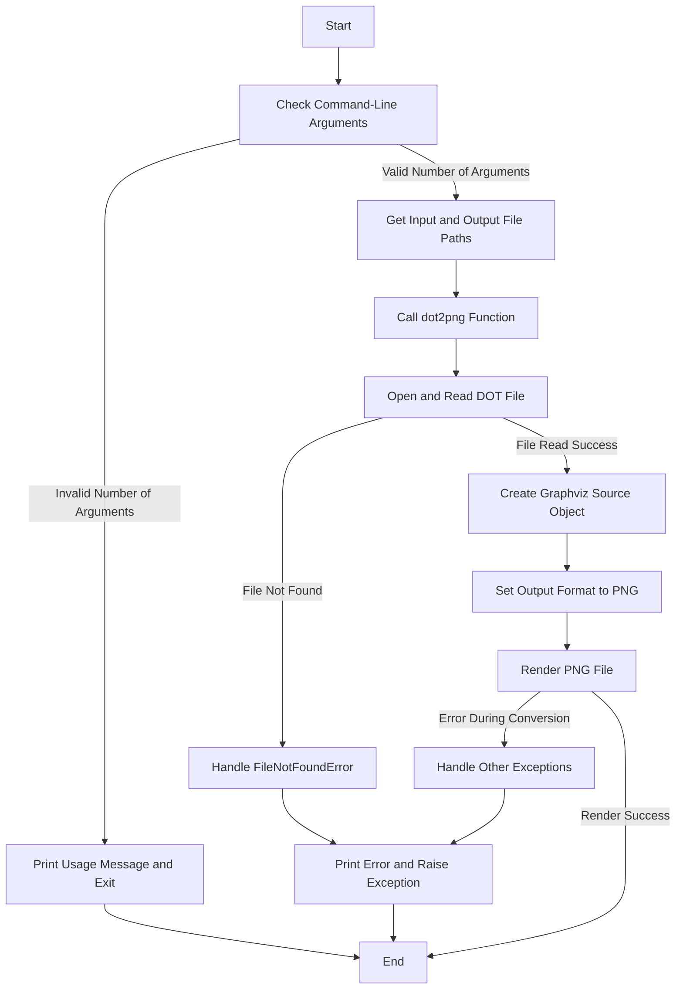

## <алгоритм>

1.  **Начало:** Программа начинается с импорта необходимых модулей `sys` и `Source` из `graphviz`.
    
    *   Пример: `import sys`, `from graphviz import Source`
2.  **Определение функции `dot2png`:** Определяется функция, которая принимает два строковых аргумента `dot_file` и `png_file`, представляющих пути к DOT и PNG файлам соответственно.
    
    *   Пример: `def dot2png(dot_file: str, png_file: str) -> None:`
3.  **Чтение DOT файла:** Внутри функции `dot2png` открывается файл, указанный в `dot_file` в режиме чтения. Содержимое файла считывается и сохраняется в переменной `dot_content`.
    
    *   Пример:  
        ```python
        with open('input.dot', 'r') as f:
             dot_content = f.read()
        ```
        Допустим файл `input.dot` имеет такое содержимое:
        ```dot
        digraph G {
           A -> B;
        }
        ```
        Тогда `dot_content` будет строкой: `'digraph G {\\n    A -> B;\\n}'`
4.  **Создание объекта Source:** Создается объект `Source` из содержимого DOT файла.
    
    *   Пример: `source = Source(dot_content)`
5.  **Установка формата и рендеринг:** Формат вывода устанавливается как `png`, и вызывается метод `render` для преобразования DOT в PNG. Результат сохраняется в файл, указанный в `png_file`.
    
    *   Пример: `source.format = 'png'`, `source.render('output.png', cleanup=True)`
6.  **Обработка ошибок:** Если DOT файл не найден (`FileNotFoundError`), выводится сообщение об ошибке, и ошибка пробрасывается дальше. Если произошла любая другая ошибка, выводится сообщение об ошибке, и ошибка также пробрасывается дальше.
    
    *   Пример:
        ```python
        except FileNotFoundError as e:
           print(f"Error: The file '{dot_file}' was not found.")
           raise e
        except Exception as e:
           print(f"An error occurred during the conversion: {e}")
           raise e
        ```
7.  **Основной блок (if \_\_name\_\_ == "\_\_main\_\_"):**
    
    *   **Проверка аргументов командной строки:** Если количество аргументов командной строки не равно 3 (имя скрипта, путь к входному DOT файлу и путь к выходному PNG файлу), программа печатает сообщение об использовании и завершается с кодом ошибки 1.
        
        *   Пример: `if len(sys.argv) != 3:`
    *   **Получение аргументов:** Аргументы командной строки, представляющие пути к входному и выходному файлам, присваиваются переменным `input_dot_file` и `output_png_file`.
        
        *   Пример: `input_dot_file = sys.argv[1]`, `output_png_file = sys.argv[2]`
    *   **Вызов dot2png:** Функция `dot2png` вызывается с полученными путями к файлам.
        
        *   Пример: `dot2png(input_dot_file, output_png_file)`
8.  **Конец:** Программа завершается.

## <mermaid>



### Объяснение зависимостей `mermaid`:

*   `Start`: Начальная точка выполнения программы.
*   `InputCheck`: Проверяет количество аргументов командной строки.
*   `UsageMessage`: Выводит сообщение о правильном использовании скрипта и завершает работу.
*   `GetFilePaths`: Извлекает пути к входному DOT файлу и выходному PNG файлу из аргументов командной строки.
*   `CallDot2Png`: Вызывает функцию `dot2png` для преобразования DOT в PNG.
*   `OpenDotFile`: Открывает и читает содержимое DOT файла.
*   `FileNotFoundError`: Обрабатывает ошибку, если DOT файл не найден.
*  `ErrorExit`: выводит ошибку и завершает работу программы.
*   `CreateSourceObj`: Создает объект `Source` из библиотеки `graphviz`, используя содержимое DOT файла.
*   `SetFormat`: Устанавливает формат вывода как PNG.
*   `RenderPng`: Выполняет рендеринг DOT файла в PNG файл.
*  `ConversionError`: Обрабатывает ошибки при рендеринге.
*   `End`: Завершает работу программы.

## <объяснение>

### Импорты:

*   `import sys`: Модуль `sys` используется для доступа к аргументам командной строки (через `sys.argv`) и для выхода из программы с кодом ошибки (через `sys.exit`).
    *   Взаимосвязь с другими частями проекта: `sys` является стандартным модулем Python и используется для взаимодействия с операционной системой, поэтому он не зависит от конкретных частей проекта. В данном случае, он используется для обработки аргументов командной строки, что делает скрипт более гибким при использовании.
*   `from graphviz import Source`: Импортирует класс `Source` из библиотеки `graphviz`. Этот класс используется для создания объектов, представляющих графы в формате DOT, которые можно затем преобразовать в изображения (например, PNG).
    *   Взаимосвязь с другими частями проекта: `graphviz` это сторонняя библиотека, используемая для работы с графами. Она взаимодействует с операционной системой через вызов утилит `dot`. В данном случае, `Source` используется для создания объекта графа из содержимого DOT-файла, что является основой для дальнейшего преобразования в PNG.

### Функции:

*   `dot2png(dot_file: str, png_file: str) -> None`:
    *   **Аргументы:**
        *   `dot_file` (`str`): Путь к входному файлу в формате DOT.
        *   `png_file` (`str`): Путь, куда будет сохранен выходной PNG файл.
    *   **Возвращаемое значение:** `None` (функция ничего не возвращает, а выполняет действия)
    *   **Назначение:** Преобразует файл DOT в PNG файл.  
    *   **Пример:** `dot2png("input.dot", "output.png")`
    
        В этом примере функция прочитает `input.dot`, создаст на его основе граф, и сохранит полученное изображение в файл `output.png`.
    
    *   **Пример с обработкой ошибки:**
        Если файл `input.dot` не существует, функция выведет сообщение об ошибке и пробросит `FileNotFoundError`.
        ```
        try:
           dot2png("not_found.dot", "output.png")
        except FileNotFoundError as e:
           print(f"Caught error: {e}")
        ```
        В результате выполнения этого кода будет выведено сообщение об ошибке "Error: The file 'not_found.dot' was not found.".
*   **Цепочка взаимосвязей:** Функция `dot2png` является основной логикой данного модуля. Она берет DOT файл, созданный где-то в проекте, и преобразует его в PNG. Это позволяет визуализировать графовые структуры, сгенерированные другими частями системы.

### Переменные:

*   `dot_file` (`str`):  Строка, представляющая путь к файлу DOT.
*   `png_file` (`str`): Строка, представляющая путь к файлу PNG.
*   `dot_content` (`str`): Содержимое файла DOT, прочитанное из файла.
*   `source` (`graphviz.Source`): Объект типа `Source`, представляющий граф, полученный из содержимого DOT.
*  `input_dot_file` (`str`): Строка, представляющая путь к входному DOT файлу, полученный из аргументов командной строки.
*  `output_png_file` (`str`): Строка, представляющая путь к выходному PNG файлу, полученный из аргументов командной строки.
* `e` (`Exception`): Объект исключения, пойманный во время выполнения кода.

### Потенциальные ошибки и области для улучшения:

1.  **Обработка ошибок:** В коде используется общая обработка ошибок (`except Exception as e:`). Было бы полезно выделить конкретные типы исключений и обработать их более специфично (например, `subprocess.CalledProcessError` если `graphviz` не установлен корректно), предоставляя более подробные сообщения об ошибках.
2.  **Зависимость от graphviz:** Код зависит от наличия установленной библиотеки `graphviz`. Можно было бы добавить проверку наличия `graphviz` и `dot` в системе и вывести предупреждение, если они не найдены.
3.  **Проверка валидности DOT:** Не производится проверка валидности DOT содержимого. Некорректный синтаксис DOT может привести к ошибкам во время рендеринга. Было бы полезно добавить проверку содержимого DOT файла перед созданием объекта `Source`, чтобы обнаруживать ошибки на ранней стадии.
4.  **Отсутствие гибкости:** Функция `dot2png` предполагает только преобразование в PNG. Можно расширить функциональность, чтобы поддерживать другие форматы вывода, предлагаемые `graphviz` (например, PDF, SVG).
5.  **Отсутствие логирования:** Вывод ошибок осуществляется через `print`. Было бы лучше использовать модуль `logging`, чтобы сохранять логи.

### Цепочка взаимосвязей с другими частями проекта:

1.  **Генерация DOT файлов:** Другие модули проекта могут генерировать DOT файлы как промежуточный формат для представления графов или других структур. Например, модули, которые анализируют зависимости, архитектуру проекта, могут выводить свои результаты в формате DOT.
2.  **Визуализация:** Данный модуль (`dot.py`) используется для визуализации этих графов, преобразуя DOT файлы в изображения PNG. Это может быть использовано для создания отчетов или для отладки и понимания сложных структур.
3.  **Внешние утилиты:** Внутри себя, `graphviz` использует внешнюю программу `dot`.  Поэтому корректная установка `graphviz` подразумевает, что `dot` также должен быть установлен.
4.  **Интеграция:** Этот модуль может быть интегрирован в более широкий процесс, например, автоматическую генерацию документации или отчетов о проекте.

В целом, код выполняет свою задачу по преобразованию DOT в PNG, но есть возможности для улучшения его надежности, гибкости и информативности.