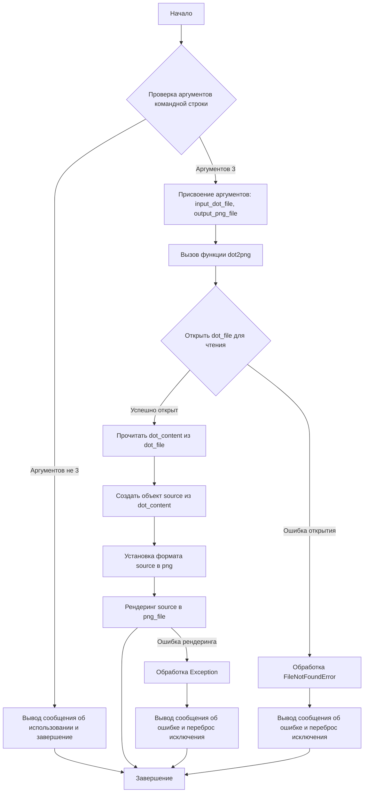

# Анализ кода `hypotez/src/utils/convertors/dot.py`

## <алгоритм>

1.  **Начало**:
    *   Принимает два аргумента командной строки: путь к входному DOT-файлу (`dot_file`) и путь к выходному PNG-файлу (`png_file`).
    *   Проверяет количество аргументов командной строки. Если их не 3 (имя скрипта + 2 файла), выводит сообщение об использовании и завершает программу.
    *   Пример:
        ```bash
        python dot.py input.dot output.png
        ```
2.  **Чтение DOT-файла**:
    *   Функция `dot2png` открывает файл, путь к которому указан в `dot_file`, в режиме чтения (`'r'`).
    *   Содержимое файла считывается и сохраняется в переменную `dot_content`.
    *   Пример: Если `dot_file` - `"example.dot"` и файл содержит `digraph G {A -> B;}`, то `dot_content` будет `"digraph G {A -> B;}"`.
3.  **Создание объекта `Source`**:
    *   Создается объект `source` класса `graphviz.Source`, используя содержимое `dot_content`.
    *   Этот объект представляет DOT-график и позволяет управлять процессом рендеринга.
4.  **Настройка и рендеринг**:
    *   У объекта `source` устанавливается формат вывода в `'png'`.
    *   Вызывается метод `render`, который преобразует DOT-описание в PNG-изображение и сохраняет его по пути, указанному в `png_file`. При этом `cleanup=True` удаляет временные файлы.
    *   Пример: Если `png_file` - `"output.png"`, то в этой директории будет создан файл `output.png` с графическим представлением графа из DOT файла.
5.  **Обработка исключений**:
    *   Если файл, указанный в `dot_file`, не существует, возникает `FileNotFoundError`, который обрабатывается: выводится сообщение об ошибке и исключение перебрасывается.
    *   Если во время конвертации возникает любая другая ошибка, она также обрабатывается: выводится сообщение об ошибке, и исключение перебрасывается.
6.  **Завершение**:
    *   Программа завершается успешно, если конвертация прошла без ошибок, либо завершается с ошибкой, если возникло исключение.

## <mermaid>



**Описание диаграммы:**

*   **A** (Начало): Начальная точка выполнения программы.
*   **B** (Проверка аргументов командной строки): Проверяет, было ли передано нужное количество аргументов (путь к входному DOT-файлу и путь к выходному PNG-файлу).
*   **C** (Вывод сообщения об использовании и завершение): Выводит сообщение об использовании и завершает программу, если количество аргументов неверно.
*  **D** (Присвоение аргументов): Присваивает значения аргументов командной строки переменным `input_dot_file` и `output_png_file`.
*   **E** (Вызов функции `dot2png`): Вызывает функцию `dot2png` для преобразования DOT-файла в PNG-изображение.
*   **F** (Открыть `dot_file` для чтения): Пытается открыть файл, указанный в `dot_file`, для чтения.
*   **G** (Прочитать `dot_content` из `dot_file`): Читает содержимое файла в переменную `dot_content`.
*  **H** (Обработка `FileNotFoundError`): Обрабатывает исключение, если файл не найден.
*  **I** (Создать объект source из `dot_content`): Создает объект `Source` из библиотеки `graphviz`, используя `dot_content`.
* **J** (Установка формата `source` в png): Устанавливает формат вывода `source` в png.
*  **K** (Рендеринг `source` в `png_file`): Выполняет рендеринг DOT-графика в PNG-изображение и сохраняет его в файл `png_file`.
*   **L** (Завершение): Завершение выполнения программы.
*   **M** (Обработка `Exception`): Обрабатывает общие исключения во время рендеринга.
*   **N** (Вывод сообщения об ошибке и переброс исключения): Выводит сообщение об ошибке отсутствия файла и перебрасывает исключение.
*   **O** (Вывод сообщения об ошибке и переброс исключения): Выводит сообщение об общей ошибке во время конвертации и перебрасывает исключение.

## <объяснение>

### Импорты:

*   `sys`: Используется для доступа к аргументам командной строки (`sys.argv`) и для завершения программы (`sys.exit`).
*   `graphviz.Source`: Класс из библиотеки `graphviz`, который используется для представления DOT-графа и его последующего преобразования в графический формат.

### Классы:
*   В данном коде нет пользовательских классов. Используется класс `Source` из библиотеки `graphviz`.

### Функции:

*   **`dot2png(dot_file: str, png_file: str) -> None`**:
    *   **Аргументы**:
        *   `dot_file (str)`: Путь к входному DOT-файлу.
        *   `png_file (str)`: Путь к выходному PNG-файлу.
    *   **Возвращаемое значение**: `None`. Функция не возвращает значения, а либо сохраняет PNG файл, либо выбрасывает исключение.
    *   **Назначение**: Преобразует DOT-файл в PNG-изображение.
    *   **Пример**:
        ```python
        dot2png('input.dot', 'output.png')
        ```
        Эта команда конвертирует файл `input.dot` в `output.png`.

### Переменные:

*   `MODE: str = 'dev'` - переменная режима работы, установлена на `'dev'`, но не используется в коде.
*   `dot_file: str` - имя файла с входными данными (DOT)
*   `png_file: str` - имя файла с выходными данными (PNG)
*   `dot_content: str` - строка, содержащая текст DOT файла
*   `source: graphviz.Source` - объект, представляющий DOT граф для преобразования
*   `input_dot_file: str` - имя файла с входными данными из аргументов командной строки
*   `output_png_file: str` - имя файла с выходными данными из аргументов командной строки

### Ошибки и улучшения:

*   **Обработка ошибок**: Код корректно обрабатывает `FileNotFoundError` и общие исключения, но можно добавить более детальную обработку ошибок, специфичных для `graphviz` (например, если DOT-файл содержит синтаксические ошибки).
*   **Режим работы**: `MODE` установлена, но не используется, можно удалить.
*   **Сообщения об ошибках**: Сообщения об ошибках могут быть более информативными, например, можно добавить информацию о конкретной ошибке при рендеринге.
*   **Ввод/вывод**: Можно сделать более гибкий ввод-вывод, чтобы принимать потоки (например, `stdin` и `stdout`) вместо файлов.

### Взаимосвязи с другими частями проекта:

*   Данный скрипт является утилитой, которая может быть использована другими частями проекта, например, для визуализации структуры гипотез, графов зависимостей, или любой другой структуры, которая может быть представлена в виде DOT-файла.
*   Этот модуль зависит от библиотеки `graphviz`, которую необходимо установить для работы.