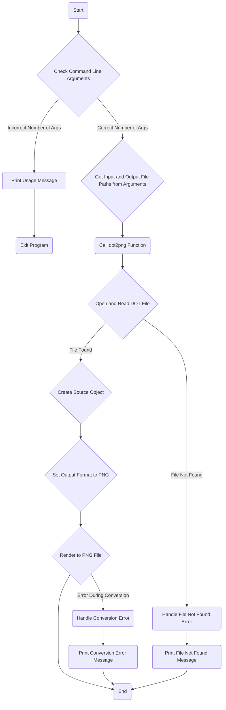

## <алгоритм>

**Общая схема работы:**

1.  **Прием входных данных:**
    *   Принимаются два аргумента командной строки: путь к DOT-файлу (`dot_file`) и путь к выходному PNG-файлу (`png_file`).
    *   Проверяется количество аргументов командной строки. Если их не 3 (имя скрипта + 2 аргумента), выводится сообщение об использовании и программа завершается.

2.  **Чтение DOT-файла:**
    *   Функция `dot2png` принимает `dot_file` и `png_file`.
    *   Открывается DOT-файл для чтения (`with open(dot_file, 'r') as f:`).
    *   Содержимое DOT-файла считывается в переменную `dot_content`.
    *   **Пример:** Если `dot_file` это `'example.dot'`, то `dot_content` будет содержать строку, например:
        ```dot
        digraph G {
            A -> B;
            B -> C;
            C -> A;
        }
        ```

3.  **Создание объекта Source:**
    *   Из содержимого DOT-файла `dot_content` создается объект `Source` из библиотеки `graphviz` (`source = Source(dot_content)`). Этот объект представляет собой граф, который можно преобразовать в изображение.

4.  **Настройка и рендеринг:**
    *   Формат выходного файла устанавливается в PNG (`source.format = 'png'`).
    *   Вызывается метод `render` для сохранения PNG-изображения в файл `png_file` (`source.render(png_file, cleanup=True)`).
    *   `cleanup=True` указывает, что временные файлы должны быть удалены после рендеринга.
    *   **Пример:** Если `png_file` это `'output.png'`, то в указанном месте будет создан файл `output.png`, содержащий графическое представление DOT-файла.

5.  **Обработка ошибок:**
    *   Обрабатывается исключение `FileNotFoundError`, если файл DOT не найден. Выводится сообщение об ошибке и исключение перебрасывается дальше.
    *   Обрабатываются другие исключения (типа `Exception`), которые могут возникнуть во время конвертации. Выводится сообщение об ошибке и исключение перебрасывается дальше.

6.  **Вызов функции и завершение работы:**
    *   В основной части скрипта (`if __name__ == "__main__":`) если количество аргументов командной строки верно, то вызывается функция `dot2png` с переданными аргументами.
    *   После выполнения функции программа завершается.

**Поток данных:**

1.  `sys.argv` → `input_dot_file`, `output_png_file`
2.  `input_dot_file`, `output_png_file` → `dot2png(dot_file, png_file)`
3.  `dot_file` → `open(dot_file, 'r')` → `dot_content`
4.  `dot_content` → `Source(dot_content)` → `source`
5.  `source`, `png_file` → `source.render(png_file, cleanup=True)`
6.  `png_file` ← `PNG file`

## <mermaid>



**Объяснение:**

*   `Start`: Начало выполнения скрипта.
*   `CheckArgs`: Проверяет количество аргументов командной строки.
*   `UsageMessage`: Выводит сообщение об использовании скрипта, если количество аргументов неверное.
*   `ExitProgram`: Завершает программу.
*   `GetFilePaths`: Извлекает пути к входному DOT-файлу и выходному PNG-файлу из аргументов командной строки.
*   `CallDot2Png`: Вызывает функцию `dot2png` для преобразования DOT в PNG.
*    `ReadDotFile`: Открывает и считывает содержимое DOT-файла.
*   `FileNotFoundError`: Блок обработки ошибки, если файл не найден.
*   `CreateSourceObject`: Создает объект `Source` из содержимого DOT-файла.
*   `SetOutputFormat`: Устанавливает формат выходного файла в PNG.
*   `RenderPNG`: Сохраняет PNG-изображение.
*   `End`: Конец выполнения программы.
*   `PrintFileNotFoundError`: Выводит сообщение об ошибке, если файл не найден.
*  `ConversionError`: Блок обработки ошибки, если произошла ошибка во время конвертации
*  `PrintConversionError`: Выводит сообщение об ошибке, если произошла ошибка во время конвертации.

## <объяснение>

### Импорты

*   `import sys`: Модуль `sys` используется для доступа к параметрам командной строки (`sys.argv`) и для завершения программы (`sys.exit`).
*   `from graphviz import Source`: Из библиотеки `graphviz` импортируется класс `Source`, который используется для создания объектов графов на основе DOT-формата и их рендеринга в различные форматы, в том числе PNG.  `graphviz` - сторонняя библиотека, и она не является частью проекта `src`.

### Функции

*   `dot2png(dot_file: str, png_file: str) -> None`:
    *   **Аргументы:**
        *   `dot_file` (str): Путь к входному DOT-файлу.
        *   `png_file` (str): Путь, по которому будет сохранён выходной PNG-файл.
    *   **Возвращаемое значение:** `None`. Функция ничего не возвращает, но генерирует PNG-файл.
    *   **Назначение:** Конвертирует DOT-файл в PNG-изображение.
    *   **Пример:**
        ```python
        dot2png('input.dot', 'output.png')
        ```
        Эта команда конвертирует файл `input.dot` в изображение `output.png`.

### Переменные

*   `dot_file`: Строковая переменная, содержащая путь к входному DOT-файлу.
*   `png_file`: Строковая переменная, содержащая путь, по которому нужно сохранить выходной PNG-файл.
*   `dot_content`: Строковая переменная, содержащая содержимое DOT-файла.
*   `source`: Объект класса `Source` из библиотеки `graphviz`, представляющий граф.
*   `input_dot_file`: Строковая переменная, содержащая путь к входному DOT-файлу, полученный из аргументов командной строки.
*   `output_png_file`: Строковая переменная, содержащая путь к выходному PNG-файлу, полученный из аргументов командной строки.

### Взаимосвязи с другими частями проекта

Этот файл, `/src/utils/convertors/dot.py`, представляет собой утилиту для преобразования DOT-файлов в PNG-изображения. Он является независимым модулем и не имеет прямых зависимостей от других модулей в проекте. Но его можно использовать в разных частях проекта, где необходимо визуализировать графы, описанные в формате DOT.

### Потенциальные ошибки и улучшения

*   **Отсутствие обработки ошибок Graphviz:** В коде обрабатываются только исключения `FileNotFoundError` и общие исключения. Было бы полезно добавить обработку ошибок, которые могут возникнуть непосредственно во время работы `graphviz`, например, когда DOT-файл синтаксически неправильный или если нет установленной программы graphviz.
*   **Улучшенная обработка ошибок:** Вместо того, чтобы просто печатать сообщение об ошибке и перебрасывать исключение, можно добавить более информативный вывод для пользователя, возможно, с указанием конкретной строки или части кода, где возникла ошибка.
*   **Конфигурация Graphviz:** Не предусмотрена возможность конфигурации параметров `graphviz` (например, движка рендеринга).
*   **Ограничение форматов:** Код сейчас поддерживает только PNG. Можно добавить поддержку других форматов изображений.
*   **Временные файлы:** Хоть `cleanup=True` и удаляет временные файлы, можно было бы добавить логирование для более легкой отладки.
*   **Интеграция с logging:** Вместо `print` использовать модуль `logging` для вывода ошибок и другой информации.
*   **Тестирование:** Нет юнит-тестов для проверки корректной работы функции. Добавление тестов повысит надежность кода.
*   **Зависимости**: Зависимость от сторонней библиотеки `graphviz` может быть проблемой, если она не установлена или несовместима.