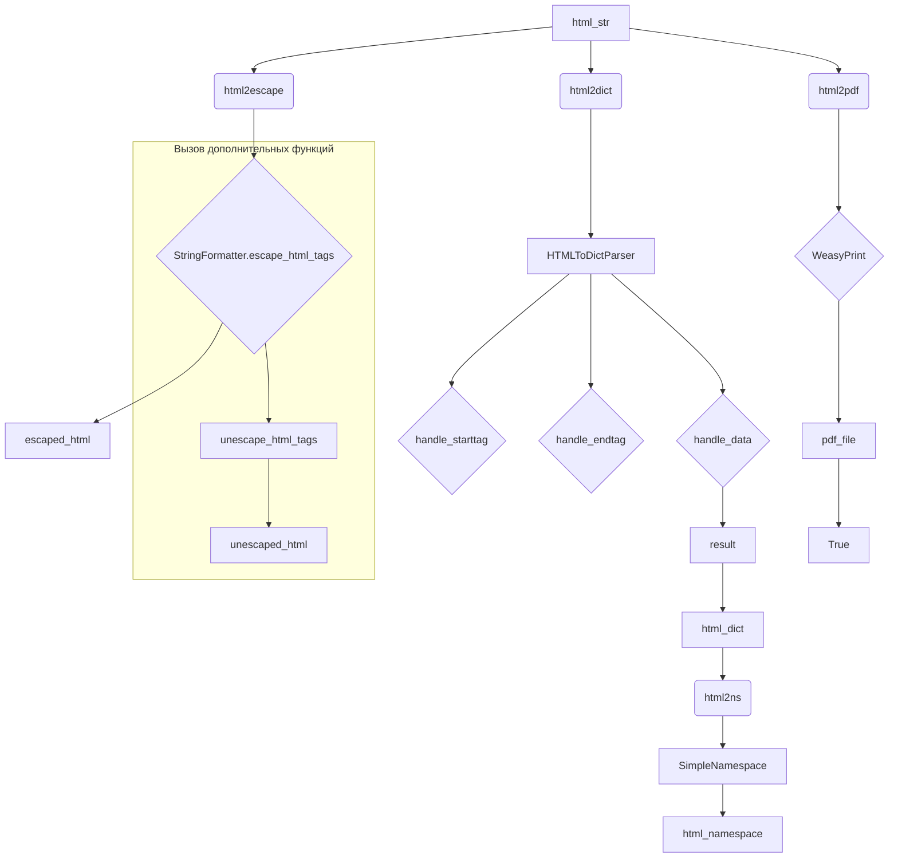

# <input code>

```python
## \file hypotez/src/utils/convertors/html.py
# -*- coding: utf-8 -*-\
#! venv/Scripts/python.exe
#! venv/bin/python/python3.12

"""
.. module: src.utils.convertors.html 
	:platform: Windows, Unix
	:synopsis: HTML conversion utilities
Functions:
    - `html2escape`: Convert HTML to escape sequences.
    - `escape2html`: Convert escape sequences to HTML.
    - `html2dict`: Convert HTML to dictionaries.
    - `html2ns`: Convert HTML to SimpleNamespace objects.
    https://stackoverflow.com/questions/73599970/how-to-solve-wkhtmltopdf-reported-an-error-exit-with-code-1-due-to-network-err
https://chatgpt.com/share/672266a3-0048-800d-a97b-c38f647d496b
"""
MODE = 'dev'
import re
from typing import Dict
from pathlib import Path
from venv import logger

from src.logger import logger
from types import SimpleNamespace
from html.parser import HTMLParser
from xhtml2pdf import pisa
try:
    from weasyprint import HTML
except Exception as ex:
    logger.error(ex)
    ...

def html2escape(input_str: str) -> str:
    """
    Convert HTML to escape sequences.

    Args:
        input_str (str): The HTML code.

    Returns:
        str: HTML converted into escape sequences.

    Example:
        >>> html = "<p>Hello, world!</p>"
        >>> result = html2escape(html)
        >>> print(result)
        &lt;p&gt;Hello, world!&lt;/p&gt;
    """
    return StringFormatter.escape_html_tags(input_str)

def escape2html(input_str: str) -> str:
    """
    Convert escape sequences to HTML.

    Args:
        input_str (str): The string with escape sequences.

    Returns:
        str: The escape sequences converted back into HTML.

    Example:
        >>> escaped = "&lt;p&gt;Hello, world!&lt;/p&gt;"
        >>> result = escape2html(escaped)
        >>> print(result)
        <p>Hello, world!</p>
    """
    return StringFormatter.unescape_html_tags(input_str)

def html2dict(html_str: str) -> Dict[str, str]:
    """
    Convert HTML to a dictionary where tags are keys and content are values.

    Args:
        html_str (str): The HTML string to convert.

    Returns:
        dict: A dictionary with HTML tags as keys and their content as values.

    Example:
        >>> html = "<p>Hello</p><a href='link'>World</a>"
        >>> result = html2dict(html)
        >>> print(result)
        {'p': 'Hello', 'a': 'World'}
    """
    class HTMLToDictParser(HTMLParser):
        def __init__(self):
            super().__init__()
            self.result = {}
            self.current_tag = None

        def handle_starttag(self, tag, attrs):
            self.current_tag = tag

        def handle_endtag(self, tag):
            self.current_tag = None

        def handle_data(self, data):
            if self.current_tag:
                self.result[self.current_tag] = data.strip()

    parser = HTMLToDictParser()
    parser.feed(html_str)
    return parser.result

def html2ns(html_str: str) -> SimpleNamespace:
    """
    Convert HTML to a SimpleNamespace object where tags are attributes and content are values.

    Args:
        html_str (str): The HTML string to convert.

    Returns:
        SimpleNamespace: A SimpleNamespace object with HTML tags as attributes and their content as values.

    Example:
        >>> html = "<p>Hello</p><a href='link'>World</a>"
        >>> result = html2ns(html)
        >>> print(result.p)
        Hello
        >>> print(result.a)
        World
    """
    html_dict = html2dict(html_str)
    return SimpleNamespace(**html_dict)

def html2pdf(html_str: str, pdf_file: str | Path) -> bool | None:
    """Converts HTML content to a PDF file using WeasyPrint."""
    try:
        HTML(string=html_str).write_pdf(pdf_file)
        return True
    except Exception as e:
        print(f"Error during PDF generation: {e}")
        return

```

# <algorithm>

**Алгоритм html2escape:**

1. Принимает строку `input_str`.
2. Возвращает результат вызова `StringFormatter.escape_html_tags(input_str)`.

**Алгоритм escape2html:**

1. Принимает строку `input_str`.
2. Возвращает результат вызова `StringFormatter.unescape_html_tags(input_str)`.

**Алгоритм html2dict:**

1. Создает экземпляр класса `HTMLToDictParser`.
2. Использует `parser.feed(html_str)` для обработки входной HTML-строки.
3. `handle_starttag`: Устанавливает `current_tag` для последующего сохранения данных.
4. `handle_endtag`: Сбрасывает `current_tag`, сигнализируя об окончании тега.
5. `handle_data`: Если `current_tag` существует, записывает данные в `result` под ключом `current_tag`.
6. Возвращает `parser.result`, словарь сохраненных данных.

**Алгоритм html2ns:**

1. Вызывает `html2dict` для преобразования HTML в словарь.
2. Использует `SimpleNamespace(**html_dict)` для создания объекта `SimpleNamespace`, где ключи словаря становятся атрибутами объекта.
3. Возвращает созданный объект `SimpleNamespace`.

**Алгоритм html2pdf:**

1. Принимает `html_str` и `pdf_file`.
2. Пытается преобразовать `html_str` в PDF с помощью `weasyprint.HTML(string=html_str).write_pdf(pdf_file)`.
3. Если преобразование успешно, возвращает `True`.
4. Если происходит ошибка, выводит сообщение об ошибке и возвращает `None`.

**Пример перемещения данных:**

html_input = "<p>Hello</p><a>World</a>"
dict_result = html2dict(html_input)  // dict_result = {'p': 'Hello', 'a': 'World'}
namespace_result = html2ns(html_input) // namespace_result.p = 'Hello'


#  Пример работы функций
html_string = "<p>Some text</p>"
escaped_html = html2escape(html_string) # escaped_html = "&lt;p&gt;Some text&lt;/p&gt;"
unescaped_html = escape2html(escaped_html) # unescaped_html = "<p>Some text</p>"


```

# <mermaid>



# <explanation>

**Импорты:**

- `re`: Регулярные выражения для работы со строками.
- `typing.Dict`: Тип данных для словарей.
- `pathlib.Path`: Работа с путями к файлам.
- `venv.logger`: Вероятно, логгер из среды виртуальной среды Python.
- `src.logger`: Логгер, определенный в модуле `src.logger`.
- `types.SimpleNamespace`: Для создания объектов, где атрибуты - имена тегов.
- `html.parser`: Базовый класс для парсинга HTML.
- `xhtml2pdf.pisa`: Библиотека для преобразования HTML в PDF.
- `weasyprint.HTML`: Библиотека для преобразования HTML в PDF.  (Обратите внимание, что `weasyprint` импортируется с обработкой исключений, что позволяет программе продолжать работу, если `weasyprint` недоступен).

**Классы:**

- `HTMLToDictParser(HTMLParser)`: Наследованный класс для обработки HTML.  `HTMLParser` - базовый класс из стандартной библиотеки Python.  `HTMLToDictParser` парсит HTML и сохраняет содержимое тегов в словаре.
   - `__init__`: Инициализирует `result` (словарь) и `current_tag` (текущий тег).
   - `handle_starttag`: Устанавливает текущий тег.
   - `handle_endtag`: Сбрасывает текущий тег.
   - `handle_data`: Если текущий тег задан, сохраняет данные в словаре под текущим тегом.

**Функции:**

- `html2escape`: Преобразует HTML-теги в escape-последовательности.
- `escape2html`: Преобразует escape-последовательности обратно в HTML-теги.
- `html2dict`: Преобразует HTML-строку в словарь, где ключи - теги, значения - текст внутри тегов.
- `html2ns`: Преобразует HTML-строку в объект `SimpleNamespace`, где атрибуты объекта - теги, а значения - текст внутри тегов.
- `html2pdf`: Преобразует HTML-строку в PDF-файл с использованием `weasyprint`.

**Переменные:**

- `MODE`: Вероятно, переменная для обозначения режима работы (например, `dev` или `prod`).

**Возможные ошибки и улучшения:**

- **Обработка исключений в `html2pdf`:** Обработка исключений (`try...except`) в `html2pdf` важна, т.к. преобразование HTML в PDF может вызывать ошибки (например, некорректный HTML, проблемы с установкой внешних библиотек).
- **Внутренние зависимости:**  Функция `html2pdf` зависит от наличия `weasyprint`, что может быть проблемой, если этот пакет отсутствует на машине пользователя.
- **Проверка входных данных:**  Добавление проверок на корректность входных данных для функций (например, проверка, что входная строка для `html2dict` - валидный HTML) повысит надежность кода.

**Взаимосвязи с другими частями проекта:**

- `src.logger`: Модуль для логгирования, что указывает на то, что код, вероятно, интегрирован в систему логгирования проекта.
-  Возможна дальнейшая обработка сгенерированных данных (`html_namespace`):  Это может быть преобразование данных для дальнейшей обработки в других компонентах проекта (например, в модулях отображения или форматирования текста).