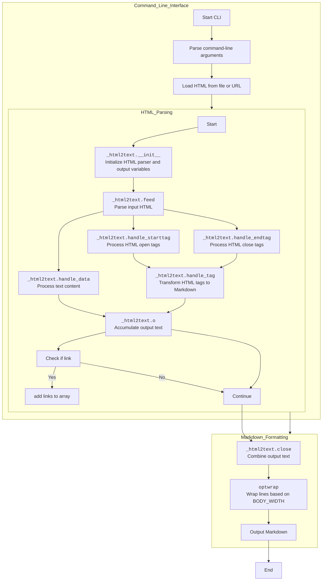

## <алгоритм>

1. **Инициализация:**
   - Задаются глобальные параметры, такие как `UNICODE_SNOB`, `LINKS_EACH_PARAGRAPH`, `BODY_WIDTH` и т.д.
   - Определяются словари `unifiable` и `unifiable_n` для замены HTML-сущностей на соответствующие символы.
   - Функция `name2cp` преобразует имя HTML-сущности в её Unicode-код.

   ```python
   UNICODE_SNOB = 0
   LINKS_EACH_PARAGRAPH = 0
   BODY_WIDTH = 78
   unifiable = {'rsquo':"'", 'lsquo':"'", 'rdquo':'"', 'ldquo':'"', 'copy':'(C)'}
   def name2cp(k):
       if k == 'apos': return ord("'")
       return ord(codecs.latin_1_decode(k)[0])
   ```

2. **Обработка HTML:**
   - Класс `_html2text` наследуется от `HTMLParser.HTMLParser` для разбора HTML.
   - Метод `feed` передаёт HTML-код для разбора.
   - В `__init__` устанавливаются начальные значения атрибутов, таких как `outtext`, `quiet`, `list` и т.д.

   ```python
    class _html2text(HTMLParser.HTMLParser):
        def __init__(self, out=None, baseurl=''):
            HTMLParser.HTMLParser.__init__(self)
            self.outtext = str()
            self.quiet = 0
            self.list = []
   ```

3. **Разбор HTML-тегов:**
   - Методы `handle_starttag` и `handle_endtag` обрабатывают открывающие и закрывающие HTML-теги соответственно.
   - В методе `handle_tag` происходит основная логика преобразования тегов:
     - **Заголовки (`h1`-`h6`):** Преобразуются в Markdown-заголовки (`# Заголовок`).
     - **Параграфы (`p`, `div`):** Добавляется перевод строки.
     - **Разрывы строк (`br`):** Преобразуются в `  \n`.
     - **Горизонтальные линии (`hr`):** Преобразуются в `* * *`.
     - **Блочные цитаты (`blockquote`):** Добавляются символы `> ` перед текстом.
     - **Эмфазы (`em`, `i`, `strong`, `b`):** Преобразуются в `_` и `**`.
     - **Ссылки (`a`):** Сохраняются в списке `self.a` и обрабатываются в конце.
     - **Изображения (`img`):** Преобразуются в ``.
     - **Списки (`ol`, `ul`, `li`):** Форматируются как Markdown-списки.
     - **Код (`code`):** Преобразуется в `` `code` ``.
     - **Аббревиатуры (`abbr`):** Сохраняются в словаре `abbr_list`.

   ```python
   def handle_tag(self, tag, attrs, start):
        if tag in ['p', 'div']: self.p()
        if tag == "br" and start: self.o("  \n")
        if tag == "a" and not IGNORE_ANCHORS:
            if start:
               self.astack.append(attrs)
               self.o("[")
            else:
                a = self.astack.pop()
                self.o("]("+a['href']+")")
    
   ```
4. **Обработка текста:**
   - Метод `handle_data` получает текст между HTML-тегами и передаёт его в метод `o`.
   - Метод `o` добавляет текст в `outtextlist`, форматируя его в соответствии с параметрами (преобразование пробелов, добавление переводов строк).
    ```python
    def handle_data(self, data):
        self.o(data, 1)
    def o(self, data, puredata=0, force=0):
        if not self.quiet:
           if puredata and not self.pre:
             data = re.sub('\s+', ' ', data)
             if data and data[0] == ' ':
                 self.space = 1
                 data = data[1:]
           if not data and not force: return
           self.out(data)

   ```

5. **Завершение:**
   - Метод `close` объединяет элементы `outtextlist` в одну строку и возвращает результат.

   ```python
    def close(self):
        self.outtext = self.outtext.join(self.outtextlist)
        return self.outtext
   ```

6. **Вспомогательные функции:**
   - `optwrap` выполняет перенос длинных строк на основе `BODY_WIDTH`.
   - `html2text_file` принимает HTML, вызывает класс `_html2text`, и возвращает преобразованный текст.
   - `html2text` вызывает `html2text_file` и `optwrap` для форматирования вывода.

   ```python
    def optwrap(text):
        if not BODY_WIDTH: return text
        result = ''
        for para in text.split("\n"):
            for line in wrap(para, BODY_WIDTH):
                result += line + "\n"
            result += "\n"
        return result
    def html2text_file(html, out=wrapwrite, baseurl=''):
        h = _html2text(out, baseurl)
        h.feed(html)
        h.feed("")
        return h.close()
    def html2text(html, baseurl=''):
        return optwrap(html2text_file(html, None, baseurl))
   ```

7. **Обработка командной строки:**
   - Разбираются аргументы командной строки для опций, таких как `--google-doc`, `--body-width` и т.д.
   - Загружается HTML из файла или URL.
   - Результат передается в `wrapwrite` для вывода.

```python
if __name__ == "__main__":
    p = optparse.OptionParser('%prog [(filename|url) [encoding]]')
    p.add_option("-g", "--google-doc", action="store_true", dest="google_doc")
    (options, args) = p.parse_args()
    if len(args) > 0:
        file_ = args[0]
        if file_.startswith('http://') or file_.startswith('https://'):
            j = urllib.urlopen(file_)
            text = j.read()
        else:
            data = open(file_, 'rb').read()
    else:
        data = sys.stdin.read()
    wrapwrite(html2text(data))
```

## <mermaid>



**Объяснение `mermaid`:**

- `HTML_Parsing`: Эта поддиаграмма отвечает за разбор HTML-кода и его преобразование в промежуточный формат.
  - `HTMParser_init`: Инициализирует парсер HTML и все необходимые переменные.
  - `Feed_HTML`: Отвечает за передачу HTML-кода в парсер для обработки.
  - `Handle_StartTag`: Метод, который обрабатывает открывающие HTML-теги, переходя к `Handle_Tag`.
  - `Handle_EndTag`: Метод, который обрабатывает закрывающие HTML-теги, также переходя к `Handle_Tag`.
  - `Handle_Data`: Метод, который обрабатывает текстовое содержимое внутри HTML-тегов и передаёт его в `Output_Text`.
  - `Handle_Tag`: Основной метод для преобразования HTML-тегов в Markdown.
  - `Output_Text`: Накапливает текст для окончательного вывода, обрабатывая форматирование и специфические случаи, такие как ссылки.
  - `Check_Links`: проверка если элемент является ссылкой
  - `Add_Links_Array`: добавление ссылки в массив для дальнейшей обработки
  - `Continue`: Продолжает выполнение после `Output_Text` если нет обработки ссылок.
- `Markdown_Formatting`: Эта поддиаграмма отвечает за окончательное форматирование Markdown текста.
  - `Close_Parser`: Метод `close` класса `_html2text`, объединяющий все фрагменты текста и возвращающий готовый Markdown.
  - `Opt_Wrap`: Функция `optwrap`, которая переносит длинные строки для читаемости, используя заданную ширину `BODY_WIDTH`.
   - `Output_Markdown`: Функция вывода Markdown.

- `Command_Line_Interface`: Эта поддиаграмма отвечает за обработку аргументов командной строки и загрузку HTML.
    - `StartCLI`: Начало выполнения скрипта
    - `Parse_Arguments`: Разбор аргументов командной строки.
    - `Load_HTML`: Загрузка HTML контента из файла или URL.

**Зависимости:**

Диаграмма показывает последовательность обработки HTML и преобразование его в Markdown.  `HTML_Parsing` передает обработанные данные в  `Markdown_Formatting`, который форматирует текст и выводит результат.   `Command_Line_Interface` отвечает за подготовку данных. Все эти этапы работают последовательно для достижения цели преобразования HTML в Markdown.

## <объяснение>

### Импорты

- `html.entities as htmlentitydefs`: Предоставляет определения HTML-сущностей, используемые для преобразования символов.
- `urllib.parse as urlparse`: Используется для парсинга и объединения URL-адресов.
- `html.parser as HTMLParser`: Модуль для разбора HTML-кода.
- `urllib.request as urllib`: Используется для загрузки веб-страниц по URL.
- `optparse`: Модуль для разбора аргументов командной строки.
- `re`: Модуль для работы с регулярными выражениями, используется для поиска и замены.
- `sys`: Модуль для доступа к параметрам и функциям, специфичным для системы.
- `codecs`: Модуль для работы с кодеками, используется для декодирования текста в разных кодировках.
- `textwrap.wrap`: Функция для переноса длинных строк.
- `from chardet import detect`: Используется для определения кодировки текста, если она не указана явно. (Используется в блоке `if __name__ == '__main__':`).
- `from feedparser import _getCharacterEncoding as enc`: Используется для определения кодировки контента, загруженного с веб-страницы. (Используется в блоке `if __name__ == '__main__':`).

### Классы

- `_html2text(HTMLParser.HTMLParser)`:
  - **Назначение:** Класс для разбора HTML-кода и преобразования его в Markdown-текст.
  - **Атрибуты:**
    - `out`: Функция для вывода текста (по умолчанию используется `self.outtextf`).
    - `outtext`: Строка для хранения преобразованного текста.
    - `quiet`: Флаг для подавления вывода (используется для игнорирования содержимого тегов `<head>`, `<style>` и `<script>`).
    - `p_p`: Число переводов строк, которые нужно добавить перед следующим выводом.
    - `outcount`: Счетчик выведенных элементов (не используется).
    - `start`: Флаг, указывающий, что нужно пропускать пробелы в начале строки.
    - `space`: Флаг, указывающий, что нужно добавить пробел перед следующим выводом.
    - `a`: Список для хранения ссылок.
    - `astack`: Стек для хранения атрибутов ссылок.
    - `acount`: Счетчик ссылок.
    - `list`: Список для хранения информации о списках.
    - `blockquote`: Счетчик вложенности цитат.
    - `pre`: Флаг, указывающий, что идет обработка тега `<pre>`.
    - `startpre`: Флаг, указывающий, что нужно добавлять отступы перед текстом внутри `<pre>`.
    - `code`: Флаг, указывающий, что идет обработка тега `<code>`.
    - `br_toggle`: Флаг для добавления двойного пробела в начале новой строки.
    - `lastWasNL`: Флаг, указывающий, что последний выведенный символ был переводом строки.
    - `lastWasList`: Флаг, указывающий, что последний обработанный тег был списком.
    - `style`: Флаг, указывающий, что идет обработка содержимого тега `<style>`.
    - `style_def`: Словарь для хранения CSS-стилей.
    - `tag_stack`: Стек для отслеживания открытых тегов.
    - `emphasis`: Счетчик уровня выделения текста.
    - `drop_white_space`: Флаг для отбрасывания пробелов при выделении текста.
    - `inheader`: Флаг, указывающий, что идет обработка заголовка.
    - `abbr_title`: Заголовок текущей аббревиатуры.
    - `abbr_data`: Текст внутри текущей аббревиатуры.
    - `abbr_list`: Словарь для хранения аббревиатур.
    - `baseurl`: Базовый URL для объединения относительных URL.
  - **Методы:**
    - `__init__(self, out=None, baseurl='')`: Конструктор класса, инициализирует атрибуты.
    - `feed(self, data)`: Передает HTML-код для разбора.
    - `outtextf(self, s)`: Добавляет текст в список `outtextlist`.
    - `close(self)`: Объединяет все фрагменты текста и возвращает результирующую строку.
    - `handle_charref(self, c)`: Обрабатывает числовые HTML-сущности.
    - `handle_entityref(self, c)`: Обрабатывает именованные HTML-сущности.
    - `handle_starttag(self, tag, attrs)`: Обрабатывает открывающий HTML-тег.
    - `handle_endtag(self, tag)`: Обрабатывает закрывающий HTML-тег.
    - `previousIndex(self, attrs)`: Находит индекс существующей ссылки в списке `self.a` по атрибутам.
    - `drop_last(self, nLetters)`: Удаляет последние `nLetters` символов из `self.outtext`, если это возможно.
    - `handle_emphasis(self, start, tag_style, parent_style)`: Добавляет или удаляет символы форматирования (`_`, `**`, `` ` ``) в зависимости от контекста и стиля.
    - `handle_tag(self, tag, attrs, start)`: Обрабатывает открытие и закрытие тегов, вызывая соответствующие методы форматирования.
    - `pbr(self)`: Добавляет перевод строки, если это необходимо.
    - `p(self)`: Добавляет два перевода строки.
    - `soft_br(self)`: Добавляет перевод строки и устанавливает флаг для двойного пробела.
    - `o(self, data, puredata=0, force=0)`: Добавляет текст к выводу, выполняя необходимые форматирования.
    - `handle_data(self, data)`: Обрабатывает текстовые данные внутри тегов.
    - `unknown_decl(self, data)`: Пустой метод для обработки неизвестных объявлений.

- `Storage`:
  - **Назначение:** Пустой класс, используемый для хранения настроек командной строки (опций).

### Функции

- `has_key(x, y)`: Проверяет наличие ключа в словаре или объекта.
- `name2cp(k)`: Преобразует имя HTML-сущности в её Unicode-код.
- `charref(name)`: Преобразует числовую HTML-сущность в символ Unicode.
- `entityref(c)`: Преобразует именованную HTML-сущность в символ Unicode.
- `replaceEntities(s)`: Функция для замены HTML сущностей
- `unescape(s)`: Заменяет HTML-сущности в строке на соответствующие символы.
- `onlywhite(line)`: Проверяет, состоит ли строка только из пробельных символов.
- `optwrap(text)`: Переносит длинные строки, используя `textwrap.wrap`.
- `hn(tag)`: Возвращает уровень заголовка (1-6), если тег — заголовок (`h1`-`h6`), иначе возвращает 0.
- `dumb_property_dict(style)`: Преобразует строку CSS-стилей в словарь.
- `dumb_css_parser(data)`: Парсит CSS-код и возвращает словарь селекторов и их стилей.
- `element_style(attrs, style_def, parent_style)`: Возвращает объединенный стиль элемента, учитывая стили классов и inline-стилей.
- `google_list_style(style)`: Определяет тип списка (нумерованный или ненумерованный) по CSS-стилям.
- `google_nest_count(style)`: Вычисляет уровень вложенности списка в Google Docs.
- `google_has_height(style)`: Проверяет наличие свойства `height` в CSS-стиле.
- `google_text_emphasis(style)`: Возвращает список стилей выделения текста, применяемых к элементу.
- `google_fixed_width_font(style)`: Проверяет, используется ли шрифт с фиксированной шириной.
- `list_numbering_start(attrs)`: Возвращает начальное значение нумерации списка, взятое из атрибута start.
- `wrapwrite(text)`: Выводит текст в `sys.stdout`, кодируя его в `utf-8`.
- `html2text_file(html, out=wrapwrite, baseurl='')`: Преобразует HTML в текст, используя заданную функцию вывода.
- `html2text(html, baseurl='')`: Преобразует HTML в Markdown и переносит длинные строки.

### Переменные

- `UNICODE_SNOB`: Флаг для использования Unicode символов вместо ASCII эквивалентов.
- `LINKS_EACH_PARAGRAPH`: Флаг для вывода ссылок после каждого абзаца.
- `BODY_WIDTH`: Максимальная ширина строки для переноса текста.
- `SKIP_INTERNAL_LINKS`: Флаг для пропуска внутренних ссылок.
- `INLINE_LINKS`: Флаг для вывода ссылок в inline-формате.
- `GOOGLE_LIST_INDENT`: Число пикселей отступа списка Google.
- `IGNORE_ANCHORS`: Флаг для игнорирования ссылок.
- `IGNORE_IMAGES`: Флаг для игнорирования изображений.
- `unifiable`, `unifiable_n`: Словари для замены HTML-сущностей.
- `options`: Объект класса `Storage` для хранения настроек командной строки.
- `__version__`, `__author__`, `__copyright__`, `__contributors__`: Метаданные.

### Потенциальные ошибки и области для улучшения

- **Обработка CSS:** Парсер CSS (функции `dumb_property_dict` и `dumb_css_parser`) является очень простым и может некорректно обрабатывать сложный CSS.
- **Кодировка:** Автоматическое определение кодировки может быть неточным.
- **Сложные HTML:** Скрипт может некорректно обрабатывать сложные HTML-структуры.
- **Поддержка новых тегов:** Скрипт может быть расширен для поддержки большего числа HTML-тегов.
- **Улучшение форматирования:** Можно улучшить форматирование Markdown-вывода, например, добавить поддержку таблиц.
- **Отсутствие обработки JavaScript:** Скрипт игнорирует JavaScript, который может влиять на отображение контента.
- **Ограниченная обработка CSS:** Скрипт обрабатывает CSS на очень базовом уровне, что может привести к некорректному форматированию.

### Взаимосвязь с другими частями проекта

- **Использование в `src/hypotez.py`:** Этот модуль используется в `src/hypotez.py` для преобразования HTML-описаний гипотез в Markdown.
- **Конфигурация:** Настройки, как `BODY_WIDTH`, можно вынести в конфигурационный файл для гибкости.
- **Расширяемость:** Структура классов и функций позволяет относительно легко добавлять новые возможности, например, поддержку новых HTML-тегов.

В целом, данный скрипт предоставляет базовый функционал для преобразования HTML в Markdown, но требует доработки для обработки более сложных случаев и более точного преобразования стилей.