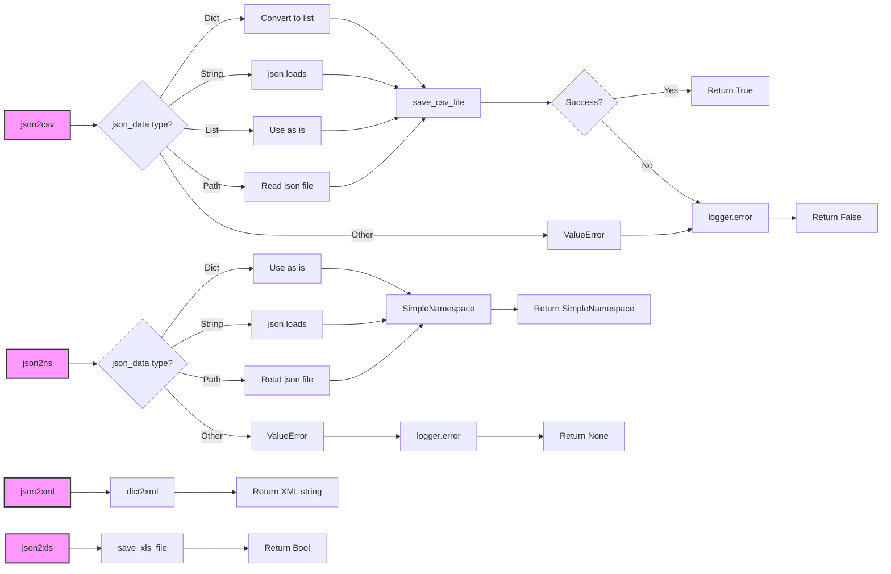

## <алгоритм>

1.  **`json2csv(json_data, csv_file_path)`**
    *   **Вход:** `json_data` (строка, список, словарь или путь к файлу JSON), `csv_file_path` (путь к файлу CSV).
    *   **Логика:**
        *   Определить тип `json_data`.
            *   Если словарь, преобразовать в список, содержащий этот словарь.
            *   Если строка, попытаться преобразовать JSON в Python-объект.
            *   Если список, использовать как есть.
            *   Если путь, прочитать файл и загрузить JSON.
            *   Если другой тип, вызвать исключение `ValueError`.
        *   Вызвать `save_csv_file(data, csv_file_path)` для записи данных в CSV.
        *   В случае успеха вернуть `True`. В случае ошибки - вызвать `logger.error` и вернуть `False`.
    *   **Пример:**
        *   Вход: `json_data` = `[{"a": 1, "b": 2}, {"a": 3, "b": 4}]`, `csv_file_path` = `"output.csv"`
        *   Результат: Файл `"output.csv"` с содержимым `a,b\n1,2\n3,4\n`, возвращает `True`.
2.  **`json2ns(json_data)`**
    *   **Вход:** `json_data` (строка, словарь или путь к файлу JSON).
    *   **Логика:**
        *   Определить тип `json_data`.
            *   Если словарь, использовать как есть.
            *   Если строка, преобразовать JSON в Python-объект.
            *   Если путь, прочитать файл и загрузить JSON.
            *   Если другой тип, вызвать исключение `ValueError`.
        *   Создать и вернуть `SimpleNamespace`, используя распакованный словарь.
        *   В случае ошибки - вызвать `logger.error` и вернуть `None`.
    *   **Пример:**
        *   Вход: `json_data` = `'{"a": 1, "b": 2}'`
        *   Результат: Объект `SimpleNamespace(a=1, b=2)`.
3.  **`json2xml(json_data, root_tag="root")`**
    *   **Вход:** `json_data` (строка, словарь или путь к файлу JSON), `root_tag` (строка, имя корневого тега XML).
    *   **Логика:**
        *   Вызвать `dict2xml(json_data)` для преобразования в XML.
        *   Вернуть XML строку.
    *   **Пример:**
        *   Вход: `json_data` = `{"a": 1, "b": 2}`, `root_tag` = `"data"`
        *   Результат: Строка XML (зависит от реализации `dict2xml`).
4.  **`json2xls(json_data, xls_file_path)`**
    *   **Вход:** `json_data` (строка, список, словарь или путь к файлу JSON), `xls_file_path` (путь к файлу XLS).
    *   **Логика:**
         *  Вызвать функцию `save_xls_file`  с аргументами `json_data` и `xls_file_path`
    *   **Пример:**
        *   Вход: `json_data` = `[{"a": 1, "b": 2}, {"a": 3, "b": 4}]`, `xls_file_path` = `"output.xls"`
        *   Результат: Файл `"output.xls"` с содержимым в формате XLS, возвращает `True` или `False`

## <mermaid>

**Описание зависимостей `mermaid`:**

*   `json2csv`, `json2ns`, `json2xml`, `json2xls` - основные функции, которые обрабатывают JSON-данные и преобразуют их в другие форматы.
*   `json.loads`: Используется для преобразования JSON-строки в Python-объект (словарь или список).
*    `save_csv_file`: Функция из `src.utils.csv`, которая отвечает за запись данных в CSV-файл.
*   `SimpleNamespace`: Класс из `types`, используется для создания объекта с произвольными атрибутами из словаря.
*    `dict2xml`: Функция из `src.utils.convertors.dict`, преобразующая словарь в XML-строку.
*   `Path`: Класс из `pathlib`, используется для работы с файловыми путями.
*   `logger.error`: Функция для логирования ошибок.
*    `save_xls_file`: Функция из `src.utils.xls`, которая сохраняет данные в формат XLS

## <объяснение>

**Импорты:**

*   `import json`: Используется для работы с данными в формате JSON, включая преобразование JSON-строк в Python-объекты и наоборот.
*   `import csv`: Используется для работы с CSV-файлами, хотя в данном коде используется функция `save_csv_file` из модуля `src.utils.csv`.
*   `from types import SimpleNamespace`: Импортирует класс `SimpleNamespace`, который используется для создания объектов, атрибуты которых могут быть динамически добавлены на основе словаря.
*   `from pathlib import Path`: Импортирует класс `Path` для работы с путями к файлам и директориям.
*   `from typing import List, Dict`: Импортирует типы `List` и `Dict` для аннотации типов.
*   `from src.utils.csv import save_csv_file`: Импортирует функцию `save_csv_file` для сохранения данных в CSV файл.
*   `from src.utils.jjson import j_dumps`: Импортирует функцию `j_dumps` для сериализации json объектов
*   `from src.utils.xls import save_xls_file`: Импортирует функцию `save_xls_file` для сохранения данных в XLS файл.
*   `from src.utils.convertors.dict import dict2xml`: Импортирует функцию `dict2xml` для преобразования словаря в XML.
*   `from src.logger.logger import logger`: Импортирует объект `logger` для логирования ошибок.

**Переменные:**

*   `MODE = 'dev'`: Определяет режим работы (в данном случае, 'dev', то есть режим разработки). Влияет на логирование и другие аспекты работы приложения (может быть использован в других модулях проекта).

**Функции:**

*   **`json2csv(json_data, csv_file_path)`**:
    *   **Аргументы:**
        *   `json_data`: Может быть строкой JSON, списком словарей, словарем или путем к файлу JSON.
        *   `csv_file_path`: Путь к файлу, в который будет сохранен CSV.
    *   **Возвращает:** `True` при успешном преобразовании и сохранении, `False` в противном случае.
    *   **Назначение:** Преобразует JSON данные в CSV формат и сохраняет их в указанный файл.
    *   **Пример:** `json2csv('[{"a": 1, "b": 2}, {"a": 3, "b": 4}]', 'output.csv')` создаст файл `output.csv` с данными, представленными в формате CSV.
*   **`json2ns(json_data)`**:
    *   **Аргументы:**
        *   `json_data`: Может быть строкой JSON, словарем или путем к файлу JSON.
    *   **Возвращает:** Объект `SimpleNamespace`, представляющий данные JSON.
    *   **Назначение:** Преобразует JSON данные в объект `SimpleNamespace`, позволяя обращаться к данным через атрибуты (например, `obj.a` вместо `obj['a']`).
    *   **Пример:** `json2ns('{"a": 1, "b": 2}')` вернет `SimpleNamespace(a=1, b=2)`.
*   **`json2xml(json_data, root_tag="root")`**:
    *   **Аргументы:**
        *   `json_data`: Может быть строкой JSON, словарем или путем к файлу JSON.
        *   `root_tag`: Имя корневого тега XML (по умолчанию "root").
    *   **Возвращает:** Строка, представляющая данные в формате XML.
    *   **Назначение:** Преобразует JSON данные в XML формат.
    *   **Пример:** `json2xml('{"a": 1, "b": 2}', "data")` вернет XML-строку.
*    **`json2xls(json_data, xls_file_path)`**:
        *   **Аргументы:**
            *   `json_data`: Может быть строкой JSON, списком словарей, словарем или путем к файлу JSON.
             *  `xls_file_path`: Путь к файлу, в который будет сохранен XLS.
        *   **Возвращает:** `True` при успешном преобразовании и сохранении, `False` в противном случае.
        *    **Назначение:** Преобразует JSON данные в XLS формат и сохраняет их в указанный файл.
        *   **Пример:** `json2xls('[{"a": 1, "b": 2}, {"a": 3, "b": 4}]', 'output.xls')` создаст файл `output.xls` с данными, представленными в формате XLS.

**Потенциальные ошибки и области для улучшения:**

*   **Обработка ошибок:** В функциях используется общее исключение `Exception`, что затрудняет отладку. Лучше использовать более конкретные исключения для различных типов ошибок.
*   **Обработка исключений:** В функциях `json2csv` и `json2ns`  обработка ошибок реализована с помощью catch all `Exception` , это может затруднить отладку кода. Лучше обрабатывать конкретные исключения.
*    **Функция json2xml**: Не реализована логика преобразования, а перенаправляется вызов в `dict2xml`, что может быть неочевидным. Лучше либо реализовать преобразования здесь или сделать вызов более явным.
*   **Функция json2xls**: Вызывает `save_xls_file` , но не обрабатывает потенциальные исключения. Необходимо добавить обработку исключений как в других функциях.
*   **Отсутствие явного возврата `False` при ошибке** в функциях `json2ns`, `json2xml`  и `json2xls`.
*    **Использование `...`** :В функции `json2csv` в блоке `except` используется `...`. Это может скрыть потенциальные ошибки в коде.
*   **Константа MODE:** Не используется в данном модуле.

**Взаимосвязи с другими частями проекта:**

*   Использует функции `save_csv_file` из `src.utils.csv`, `j_dumps`  из  `src.utils.jjson`, `save_xls_file` из `src.utils.xls`, и `dict2xml` из `src.utils.convertors.dict`.
*   Использует объект `logger` из `src.logger.logger` для логирования ошибок.

Этот модуль предоставляет набор инструментов для преобразования JSON-данных в различные форматы, что делает его важной частью проекта для работы с данными.