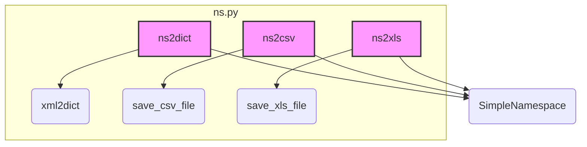

# Проект `hypotez`
# Роль `code explainer`
## \\file /src/utils/convertors/ns.py

### **<алгоритм>**

1.  **`ns2dict(obj: Any) -> Dict[str, Any]`**:
    *   На входе функция принимает объект `obj` любого типа.
    *   Функция определяет, есть ли у объекта атрибут `__dict__` (например, если это `SimpleNamespace` или пользовательский объект) или атрибут `items` (например, если это словарь).
    *   Если у объекта есть атрибут `__dict__` или `items`, функция рекурсивно преобразует его в словарь, обрабатывая вложенные структуры и заменяя пустые ключи пустой строкой.
    *   Если объект является списком, функция рекурсивно преобразует каждый элемент списка.
    *   Если объект не является ни одним из вышеперечисленных, функция возвращает его как есть.

    ```python
    # Пример использования ns2dict
    from types import SimpleNamespace
    
    # Инициализация SimpleNamespace
    obj = SimpleNamespace(name='John', age=30, address=SimpleNamespace(city='New York', zip='10001'))
    
    # Преобразование в словарь
    result = ns2dict(obj)
    # {'name': 'John', 'age': 30, 'address': {'city': 'New York', 'zip': '10001'}}
    ```

2.  **`ns2csv(ns_obj: SimpleNamespace, csv_file_path: str | Path) -> bool`**:
    *   Функция принимает объект `SimpleNamespace` и путь к CSV-файлу.
    *   Преобразует `SimpleNamespace` в словарь с помощью функции `ns2dict`.
    *   Сохраняет полученный словарь в CSV-файл с помощью функции `save_csv_file`.
    *   В случае успеха возвращает `True`, в случае неудачи логирует ошибку и возвращает `False`.

    ```python
    # Пример использования ns2csv
    from types import SimpleNamespace
    from pathlib import Path
    
    # Инициализация SimpleNamespace
    ns_obj = SimpleNamespace(name='John', age=30)
    
    # Указание пути к CSV-файлу
    csv_file_path = Path('output.csv')
    
    # Преобразование в CSV
    result = ns2csv(ns_obj, csv_file_path)
    # True
    ```

3.  **`ns2xml(ns_obj: SimpleNamespace, root_tag: str = "root") -> str`**:
    *   Функция принимает объект `SimpleNamespace` и корневой тег для XML.
    *   Преобразует `SimpleNamespace` в словарь с помощью функции `ns2dict`.
    *   Преобразует полученный словарь в XML-строку с помощью функции `xml2dict`.
    *   В случае успеха возвращает XML-строку, в случае неудачи логирует ошибку.

    ```python
    # Пример использования ns2xml
    from types import SimpleNamespace
    
    # Инициализация SimpleNamespace
    ns_obj = SimpleNamespace(name='John', age=30)
    
    # Преобразование в XML
    result = ns2xml(ns_obj)
    # '<root><name>John</name><age>30</age></root>'
    ```

4.  **`ns2xls(data: SimpleNamespace, xls_file_path: str | Path) -> bool`**:
    *   Функция принимает объект `SimpleNamespace` и путь к XLS-файлу.
    *   Сохраняет `SimpleNamespace` в XLS-файл с помощью функции `save_xls_file`.
    *   Возвращает результат выполнения функции `save_xls_file`.

    ```python
    # Пример использования ns2xls
    from types import SimpleNamespace
    from pathlib import Path
    
    # Инициализация SimpleNamespace
    data = SimpleNamespace(name='John', age=30)
    
    # Указание пути к XLS-файлу
    xls_file_path = Path('output.xls')
    
    # Преобразование в XLS
    result = ns2xls(data, xls_file_path)
    # True
    ```

### **<mermaid>**



**Описание зависимостей:**

*   **`ns2dict`**: Эта функция преобразует объект `SimpleNamespace` в словарь. Зависит от модуля `xml2dict` для преобразования словаря в XML-формат в функции `ns2xml`.
*   **`ns2csv`**: Эта функция преобразует объект `SimpleNamespace` в CSV-формат. Зависит от модуля `save_csv_file` для сохранения данных в CSV-файл.
*   **`ns2xls`**: Эта функция преобразует объект `SimpleNamespace` в XLS-формат. Зависит от модуля `save_xls_file` для сохранения данных в XLS-файл.
*   **`xml2dict`**: Используется для преобразования словаря в XML-формат.
*   **`save_csv_file`**: Используется для сохранения данных в CSV-файл.
*   **`save_xls_file`**: Используется для сохранения данных в XLS-файл.
*   **`SimpleNamespace`**: Используется в качестве входного объекта для преобразования в различные форматы.

### **<объяснение>**

**Импорты:**

*   **`json`**: Используется для работы с JSON-форматом.
*   **`csv`**: Используется для работы с CSV-форматом.
*   **`SimpleNamespace`**: Используется для создания объектов, которые могут быть преобразованы в различные форматы.
*   **`Path`**: Используется для работы с путями к файлам.
*   **`List`, `Dict`, `Any`**: Используются для аннотации типов.
*   **`src.utils.convertors.xml2dict`**: Используется для преобразования словаря в XML-формат.
*   **`src.utils.csv.save_csv_file`**: Используется для сохранения данных в CSV-файл.
*   **`src.utils.xls.save_xls_file`**: Используется для сохранения данных в XLS-файл.
*   **`src.logger.logger.logger`**: Используется для логирования ошибок.

**Функции:**

*   **`ns2dict(obj: Any) -> Dict[str, Any]`**:
    *   **Аргументы**:
        *   `obj` (Any): Объект для преобразования. Может быть `SimpleNamespace`, словарем или любым объектом с аналогичной структурой.
    *   **Возвращаемое значение**:
        *   `Dict[str, Any]`: Преобразованный словарь.
    *   **Назначение**:
        *   Рекурсивно преобразует объект с парами ключ-значение в словарь. Обрабатывает пустые ключи, заменяя их пустой строкой.
    *   **Пример**:

```python
    from types import SimpleNamespace
    obj = SimpleNamespace(name='John', age=30, address=SimpleNamespace(city='New York', zip='10001'))
    result = ns2dict(obj)
    # {'name': 'John', 'age': 30, 'address': {'city': 'New York', 'zip': '10001'}}
```

*   **`ns2csv(ns_obj: SimpleNamespace, csv_file_path: str | Path) -> bool`**:
    *   **Аргументы**:
        *   `ns_obj` (`SimpleNamespace`): Объект `SimpleNamespace` для преобразования.
        *   `csv_file_path` (`str | Path`): Путь для сохранения CSV-файла.
    *   **Возвращаемое значение**:
        *   `bool`: `True`, если преобразование прошло успешно, `False` в противном случае.
    *   **Назначение**:
        *   Преобразует объект `SimpleNamespace` в CSV-формат и сохраняет его в файл.
    *   **Пример**:

```python
    from types import SimpleNamespace
    from pathlib import Path
    ns_obj = SimpleNamespace(name='John', age=30)
    csv_file_path = Path('output.csv')
    result = ns2csv(ns_obj, csv_file_path)
    # True
```

*   **`ns2xml(ns_obj: SimpleNamespace, root_tag: str = "root") -> str`**:
    *   **Аргументы**:
        *   `ns_obj` (`SimpleNamespace`): Объект `SimpleNamespace` для преобразования.
        *   `root_tag` (`str`): Корневой тег для XML. По умолчанию `"root"`.
    *   **Возвращаемое значение**:
        *   `str`: Результирующая XML-строка.
    *   **Назначение**:
        *   Преобразует объект `SimpleNamespace` в XML-формат.
    *   **Пример**:

```python
    from types import SimpleNamespace
    ns_obj = SimpleNamespace(name='John', age=30)
    result = ns2xml(ns_obj)
    # '<root><name>John</name><age>30</age></root>'
```

*   **`ns2xls(data: SimpleNamespace, xls_file_path: str | Path) -> bool`**:
    *   **Аргументы**:
        *   `data` (`SimpleNamespace`): Объект `SimpleNamespace` для преобразования.
        *   `xls_file_path` (`str | Path`): Путь для сохранения XLS-файла.
    *   **Возвращаемое значение**:
        *   `bool`: `True`, если преобразование прошло успешно, `False` в противном случае.
    *   **Назначение**:
        *   Преобразует объект `SimpleNamespace` в XLS-формат и сохраняет его в файл.
    *   **Пример**:

```python
    from types import SimpleNamespace
    from pathlib import Path
    data = SimpleNamespace(name='John', age=30)
    xls_file_path = Path('output.xls')
    result = ns2xls(data, xls_file_path)
    # True
```

**Переменные:**

*   В основном используются локальные переменные внутри функций для хранения промежуточных результатов преобразований.

**Потенциальные ошибки и области для улучшения:**

*   В функциях `ns2csv` и `ns2xml` не предусмотрена обработка сложных вложенных структур.
*   В функции `ns2xml` используется `xml2dict`, который может не поддерживать все возможные варианты преобразования словаря в XML.
*   В функциях `ns2csv`, `ns2xml`, `ns2xls` отсутствует детальная обработка исключений. Логируется только общий случай.

**Взаимосвязи с другими частями проекта:**

*   Данный модуль используется для преобразования объектов `SimpleNamespace` в различные форматы, которые могут быть использованы другими модулями проекта.
*   Использует `src.utils.convertors.xml2dict` для преобразования в XML.
*   Использует `src.utils.csv.save_csv_file` для сохранения в CSV.
*   Использует `src.utils.xls.save_xls_file` для сохранения в XLS.
*   Использует `src.logger.logger.logger` для логирования ошибок.