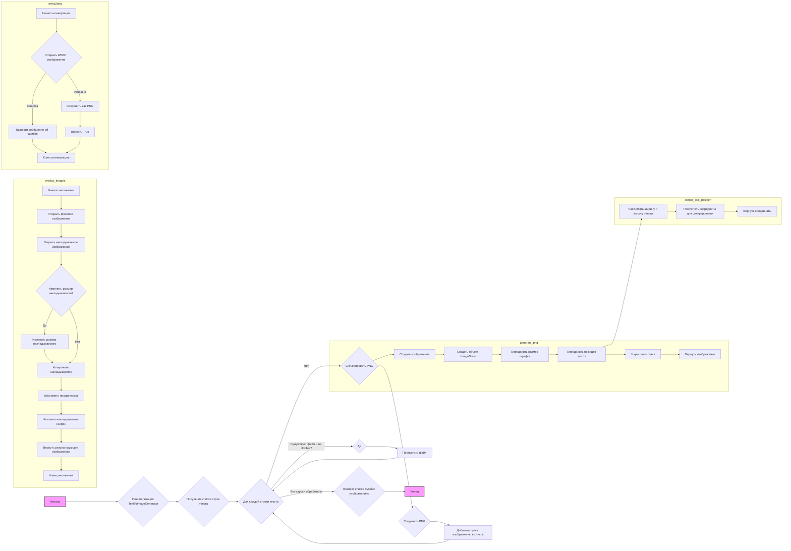

## Анализ кода `hypotez/src/utils/convertors/png.py`

### 1. <алгоритм>

**Блок-схема:**



**Примеры для логических блоков:**

*   **B (Инициализация `TextToImageGenerator`):** Создается экземпляр класса `TextToImageGenerator`, устанавливаются значения по умолчанию для выходной директории, размера холста, отступов, цветов и уровня логирования.
*   **C (Получение списка строк текста):**  На вход функции `generate_images` поступает список строк, например: `lines = ["Строка 1", "Строка 2", "Строка 3"]`.
*   **D (Для каждой строки текста):** Цикл перебирает каждую строку из списка `lines`.
*   **E (Существует файл и не `clobber`?):** Проверяется, существует ли файл, например, `output/Строка 1.png`. Если файл существует и `clobber` равен `False`, то переходим к блоку F.
*   **F (Пропустить файл):** Выводится предупреждение в лог, и цикл переходит к следующей строке.
*   **G (Сгенерировать PNG):** Вызывается функция `generate_png` для создания изображения.
*   **H (Сохранить PNG):** Сгенерированное изображение сохраняется в файл, например, `output/Строка 1.png`.
*   **I (Добавить путь к изображению в список):** Путь к сохраненному изображению добавляется в список `generated_images`.
*  **J (Возврат списка путей к изображениям):** Функция `generate_images` возвращает список путей к созданным изображениям.
* **L (Создать изображение):** Функция `generate_png` создает новое изображение с заданными размерами и цветом фона.
*   **M (Создать объект `ImageDraw`):** Создается объект `ImageDraw` для рисования на изображении.
*   **N (Определить размер шрифта):** Размер шрифта определяется на основе размера холста и отступов.
*   **O (Определить позицию текста):** Вычисляется позиция для центрирования текста на изображении.
*   **P (Нарисовать текст):** Текст рисуется на изображении с использованием заданных параметров.
*   **Q (Вернуть изображение):** Функция возвращает созданное изображение.
* **R (Рассчитать ширину и высоту текста):** Метод `center_text_position` вычисляет ширину и высоту текста с использованием текущего шрифта.
* **S (Рассчитать координаты для центрирования):** Вычисляются координаты для расположения текста по центру изображения.
* **T (Вернуть координаты):** Функция возвращает координаты центрирования текста.
* **V (Открыть фоновое изображение):** Функция `overlay_images` открывает фоновое изображение по указанному пути.
* **W (Открыть накладываемое изображение):** Открывается изображение, которое будет наложено на фон.
* **X (Изменить размер накладываемого?):** Проверяется, отличается ли размер накладываемого изображения от размера фона.
* **Y (Изменить размер накладываемого):**  Если размеры отличаются, накладываемое изображение изменяет размер.
* **Z (Копировать накладываемое):** Создается копия накладываемого изображения для применения прозрачности.
* **AA (Установить прозрачность):** Устанавливается уровень прозрачности для накладываемого изображения.
* **BB (Наклеить накладываемое на фон):** Накладываемое изображение помещается на фон в заданной позиции.
* **CC (Вернуть результирующее изображение):** Функция возвращает результат наложения.
*   **FF (Открыть WEBP изображение):** Функция `webp2png` пытается открыть WEBP изображение по указанному пути.
*   **GG (Вывести сообщение об ошибке):**  Если при открытии WEBP возникает ошибка, функция выводит сообщение об ошибке.
*   **II (Сохранить как PNG):** Если WEBP изображение открыто успешно, оно сохраняется как PNG файл.
*   **JJ (Вернуть True):**  В случае успешного преобразования, функция возвращает True.

### 2. <mermaid>

```mermaid
graph LR
    subgraph TextToImageGenerator
        A(TextToImageGenerator)
        A --> B(default_output_dir)
        A --> C(default_canvas_size)
        A --> D(default_padding)
        A --> E(default_background)
        A --> F(default_text_color)
        A --> G(default_log_level)
        A --> H(generate_images)
        H --> I(lines: List[str])
        H --> J(output_dir: str | Path)
        H --> K(font: str | ImageFont.ImageFont)
        H --> L(canvas_size: Tuple[int, int])
        H --> M(padding: float)
        H --> N(background_color: str)
        H --> O(text_color: str)
        H --> P(log_level: int | str | bool)
         H --> Q(clobber: bool)
         H --> R(generated_images: List[Path])
        H --> S(setup_logging)
        H --> T(generate_png)
        A --> U(generate_png)
         U --> V(text: str)
        U --> W(canvas_size: Tuple[int, int])
        U --> X(padding: float)
        U --> Y(background_color: str)
        U --> Z(text_color: str)
        U --> AA(font: str | ImageFont.ImageFont)
        U --> AB(center_text_position)
        A --> AC(center_text_position)
         AC --> AD(draw: ImageDraw.Draw)
        AC --> AE(text: str)
         AC --> AF(font: ImageFont.ImageFont)
         AC --> AG(canvas_size: Tuple[int, int])
        A --> AH(overlay_images)
         AH --> AI(background_path: str | Path)
        AH --> AJ(overlay_path: str | Path)
        AH --> AK(position: tuple[int, int])
        AH --> AL(alpha: float)
    end
    
    subgraph webp2png
        AM(webp2png)
        AM --> AN(webp_path: str)
        AM --> AO(png_path: str)
        AM --> AP(return: bool)
        
    end
    
    style A fill:#f9f,stroke:#333,stroke-width:2px
     style AM fill:#f9f,stroke:#333,stroke-width:2px
    
    
    
    
    
    
    
    
    

```

**Объяснение зависимостей:**

*   `TextToImageGenerator` - это класс, который управляет созданием PNG изображений из текста. Он имеет атрибуты для хранения параметров по умолчанию (путь вывода, размер холста, отступы, цвета, уровень логгирования) и методы для генерации изображений, расчета позиции текста, наложения изображений и настройки логирования.
*  `generate_images` - метод класса, который принимает список строк текста, путь вывода, шрифт, размер холста, отступы, цвета, уровень логирования и флаг перезаписи. Метод возвращает список путей к сгенерированным изображениям.
*  `generate_png` - метод класса, создает PNG изображение с заданным текстом, размером холста, отступами, цветами, и шрифтом. Возвращает объект `Image`.
* `center_text_position` - метод класса, рассчитывает координаты для центрирования текста на изображении. Возвращает координаты в виде кортежа.
*   `overlay_images` - метод класса, накладывает одно изображение на другое. Принимает пути к фоновому и накладываемому изображению, позицию наложения и уровень прозрачности. Возвращает результат наложения в виде изображения `Image`.
* `webp2png` - функция, которая конвертирует WEBP изображение в PNG. Принимает пути к WEBP и PNG файлам. Возвращает True в случае успешной конвертации.
*  `lines: List[str]` - список строк, из которых генерируются изображения.
* `output_dir: str | Path` - путь к директории, в которую будут сохранены изображения.
*  `font: str | ImageFont.ImageFont` - шрифт, который будет использоваться для текста.
* `canvas_size: Tuple[int, int]` - размер холста в пикселях.
*  `padding: float` - процент от размера холста, используемый в качестве границы.
* `background_color: str` - цвет фона изображения.
*  `text_color: str` - цвет текста.
*  `log_level: int | str | bool` - уровень логирования.
*  `clobber: bool` - флаг, указывающий нужно ли перезаписывать существующие файлы.
*   `generated_images: List[Path]` - список путей к сгенерированным изображениям.
*   `text: str` - текст, который нужно нарисовать на изображении.
*   `draw: ImageDraw.Draw` - экземпляр `ImageDraw`, используемый для рисования на изображении.
* `background_path: str | Path` - путь к фоновому изображению.
* `overlay_path: str | Path` - путь к изображению для наложения.
*   `position: tuple[int, int]` - координаты для наложения изображения.
*   `alpha: float` - уровень прозрачности для накладываемого изображения.
*  `webp_path: str` - путь к WEBP файлу.
*   `png_path: str` - путь для сохранения PNG файла.
* `return: bool` - True в случае успешной конвертации, иначе ничего не возвращает.

### 3. <объяснение>

**Импорты:**

*   `pathlib.Path`: Используется для работы с путями файлов и директорий.
*   `typing.List`, `typing.Tuple`: Используются для аннотации типов, обеспечивая статическую проверку.
*   `PIL.Image`, `PIL.ImageDraw`, `PIL.ImageFont`: Библиотека Pillow для работы с изображениями, рисования на них и использования шрифтов.
*   `src.logger.logger`: Пользовательский модуль для логирования событий и ошибок.

**Класс `TextToImageGenerator`:**

*   **Роль:** Основной класс для генерации PNG изображений из текста.
*   **Атрибуты:**
    *   `default_output_dir`: Путь к директории вывода по умолчанию.
    *   `default_canvas_size`: Размер холста по умолчанию.
    *   `default_padding`: Отступ от края холста по умолчанию (в процентах).
    *   `default_background`: Цвет фона по умолчанию.
    *   `default_text_color`: Цвет текста по умолчанию.
    *  `default_log_level`: Уровень логирования по умолчанию.
*   **Методы:**
    *   `__init__`: Инициализирует класс значениями по умолчанию.
    *   `generate_images`: Главный метод для генерации изображений из списка строк. Принимает настройки и возвращает список путей к созданным файлам.
    *   `generate_png`: Создает одно изображение PNG из текста с заданными параметрами.
    *   `center_text_position`: Вычисляет координаты для центрирования текста на изображении.
    *   `overlay_images`: Накладывает одно изображение на другое.
*   **Взаимодействие:** Используется функциями `generate_images` и `generate_png` для создания и сохранения изображений. Класс также использует логирование.

**Функции:**

*   `generate_images`:
    *   **Аргументы:**
        *   `lines` (List[str]): Список строк текста.
        *   `output_dir` (str | Path, optional): Путь к директории вывода.
        *   `font` (str | ImageFont.ImageFont, optional): Шрифт.
        *   `canvas_size` (Tuple[int, int], optional): Размер холста.
        *   `padding` (float, optional): Отступ.
        *   `background_color` (str, optional): Цвет фона.
        *   `text_color` (str, optional): Цвет текста.
        *   `log_level` (int | str | bool, optional): Уровень логирования.
        *   `clobber` (bool, optional): Флаг перезаписи.
    *   **Возвращаемое значение:** `List[Path]` - список путей к сгенерированным изображениям.
    *   **Назначение:** Генерирует PNG изображения для каждой строки текста.
    *   **Пример:**
        ```python
        generator = TextToImageGenerator()
        lines = ["Текст 1", "Текст 2"]
        images = await generator.generate_images(lines, output_dir="./output")
        print(images)
        ```
*   `generate_png`:
    *   **Аргументы:**
        *   `text` (str): Текст.
        *   `canvas_size` (Tuple[int, int]): Размер холста.
        *   `padding` (float): Отступ.
        *   `background_color` (str): Цвет фона.
        *   `text_color` (str): Цвет текста.
        *   `font` (str | ImageFont.ImageFont): Шрифт.
    *   **Возвращаемое значение:** `Image` - сгенерированное PNG изображение.
    *   **Назначение:** Создает изображение с заданным текстом и параметрами.
    *  **Пример:**
        ```python
        img = self.generate_png("Пример текста", (512, 512), 0.1, "white", "black", "sans-serif")
        img.save("example.png")
        ```
*   `center_text_position`:
    *   **Аргументы:**
        *   `draw` (ImageDraw.Draw): Объект для рисования.
        *   `text` (str): Текст.
        *   `font` (ImageFont.ImageFont): Шрифт.
        *   `canvas_size` (Tuple[int, int]): Размер холста.
    *   **Возвращаемое значение:** `Tuple[int, int]` - координаты для центрирования текста.
    *   **Назначение:** Вычисляет координаты для центрирования текста на холсте.
*   `overlay_images`:
    *   **Аргументы:**
        *   `background_path` (str | Path): Путь к фоновому изображению.
        *   `overlay_path` (str | Path): Путь к накладываемому изображению.
        *   `position` (tuple[int, int], optional): Позиция наложения.
        *   `alpha` (float, optional): Прозрачность накладываемого изображения.
    *   **Возвращаемое значение:** `Image` - результирующее изображение.
    *  **Назначение:** Накладывает одно изображение поверх другого с учетом прозрачности и позиции.
    *   **Пример:**
        ```python
        result_image = overlay_images("background.png", "overlay.png", position=(50, 50), alpha=0.8)
        result_image.save("result.png")
        ```

*   `webp2png`:
    *   **Аргументы:**
        *   `webp_path` (str): Путь к WEBP файлу.
        *   `png_path` (str): Путь для сохранения PNG файла.
    *   **Возвращаемое значение:** `bool` - True при успешной конвертации.
    *   **Назначение:** Конвертирует WEBP изображение в PNG формат.
    *  **Пример:**
        ```python
        webp2png("image.webp", "image.png")
        ```
**Переменные:**

*   `MODE`: Глобальная переменная, определяет режим работы (dev или prod).
*   `self.default_output_dir`, `self.default_canvas_size`, `self.default_padding`, `self.default_background`, `self.default_text_color`, `self.default_log_level` : Атрибуты класса, устанавливают значения по умолчанию.

**Потенциальные ошибки и области для улучшения:**

*   Обработка ошибок при работе с файлами (например, открытие несуществующего файла).
*   Добавление проверки на существование шрифта перед его использованием.
*   Поддержка более гибких настроек шрифта (например, жирный, курсив).
*  Добавить возможность масштабирования текста, для того чтобы текст занимал всю отведенную область.
*   Возможность обработки исключений в `webp2png`.
*   Можно добавить валидацию аргументов в методах (например, проверить, что padding - это число от 0 до 1).

**Взаимосвязи с другими частями проекта:**

*   Использует модуль `src.logger.logger` для логирования событий, что указывает на интеграцию с системой логирования проекта.
*   Может быть использован для генерации изображений в других частях проекта, где требуется преобразование текста в изображение.

Этот подробный анализ обеспечивает полное понимание функциональности и структуры предоставленного кода, а также дает представление о его интеграции в более широкий проект.