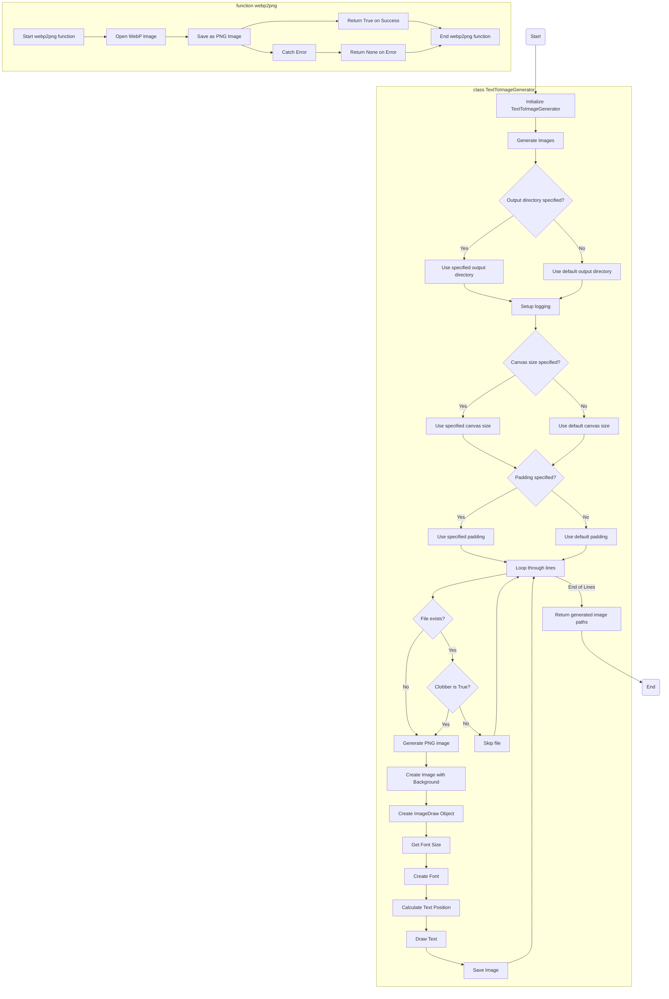

## ИНСТРУКЦИЯ:

Анализируй предоставленный код подробно и объясни его функциональность. Ответ должен включать три раздела:

1.  **<алгоритм>**: Опиши рабочий процесс в виде пошаговой блок-схемы, включая примеры для каждого логического блока, и проиллюстрируй поток данных между функциями, классами или методами.
2.  **<mermaid>**: Напиши код для диаграммы в формате `mermaid`, проанализируй и объясни все зависимости,
    которые импортируются при создании диаграммы.
    **ВАЖНО!** Убедитесь, что все имена переменных, используемые в диаграмме `mermaid`,
    имеют осмысленные и описательные имена. Имена переменных вроде `A`, `B`, `C`, и т.д., не допускаются!

    **Дополнительно**: Если в коде есть импорт `import header`, добавьте блок `mermaid` flowchart, объясняющий `header.py`:
    ```mermaid
    flowchart TD
        Start --> Header[<code>header.py</code><br> Determine Project Root]

        Header --> import[Import Global Settings: <br><code>from src import gs</code>]
    ```

3.  **<объяснение>**: Предоставьте подробные объяснения:
    -   **Импорты**: Их назначение и взаимосвязь с другими пакетами `src.`.
    -   **Классы**: Их роль, атрибуты, методы и взаимодействие с другими компонентами проекта.
    -   **Функции**: Их аргументы, возвращаемые значения, назначение и примеры.
    -   **Переменные**: Их типы и использование.
    -   Выделите потенциальные ошибки или области для улучшения.

Дополнительно, постройте цепочку взаимосвязей с другими частями проекта (если применимо).

Это обеспечивает всесторонний и структурированный анализ кода.
## Формат ответа: `.md` (markdown)
**КОНЕЦ ИНСТРУКЦИИ**

## <алгоритм>

### `TextToImageGenerator` класс:

1.  **Инициализация `__init__`:**
    *   Создается экземпляр класса `TextToImageGenerator`.
    *   Устанавливаются значения по умолчанию для:
        *   `default_output_dir`: Путь к директории вывода ("./output").
        *   `default_canvas_size`: Размер холста (1024, 1024).
        *   `default_padding`: Отступ от края холста (0.10).
        *   `default_background`: Цвет фона ("white").
        *   `default_text_color`: Цвет текста ("black").
        *   `default_log_level`: Уровень логирования ("WARNING").
    *   *Пример*: `generator = TextToImageGenerator()`.

2.  **`generate_images` метод:**
    *   Получает список строк `lines` для создания изображений, а также параметры (путь вывода, шрифт, размер холста, отступ, цвета, уровень логирования, флаг перезаписи).
    *   Определяет директорию вывода:
        *   Использует `output_dir`, если указан, иначе `default_output_dir`.
        *   *Пример*: `output_directory = Path("./my_output")` или `output_directory = generator.default_output_dir`
    *   Настраивает логирование с помощью `setup_logging` (уровень `log_level`).
    *   Устанавливает `canvas_size` и `padding`, если они не были переданы.
    *   Перебирает строки `lines`:
        *   Формирует путь к файлу `img_path` (`путь_вывода/line.png`).
        *   Проверяет, существует ли файл и не установлен ли флаг `clobber` (перезапись):
            *   Если файл существует и перезапись запрещена, выводится предупреждение в лог и строка пропускается.
            *   *Пример*: `img_path = Path("./output/Text 1.png")`
        *   Вызывает `generate_png` для создания изображения для текущей строки.
        *   Сохраняет созданное изображение `img_path`.
        *   Добавляет `img_path` в список `generated_images`.
    *   Возвращает `generated_images`.
    *   *Пример*:
        ```python
        lines = ["Line 1", "Line 2"]
        images = await generator.generate_images(lines, output_dir='./output', clobber=True)
        # images == [Path('./output/Line 1.png'), Path('./output/Line 2.png')]
        ```

3.  **`generate_png` метод:**
    *   Создает новое изображение `img` с размером `canvas_size` и цветом фона `background_color`.
    *   Создает объект `draw` для рисования на изображении.
    *   Получает размер шрифта с помощью `self.get_font_size`.
    *   Создает объект шрифта `font` заданного размера.
    *   Вызывает `center_text_position` для определения координат текста.
    *   Рисует текст на изображении `draw.text` с заданным цветом `text_color`.
    *   Возвращает созданное изображение `img`.
        *   *Пример*:
        ```python
            img = generator.generate_png("Text", (100, 50), 0.1, "white", "black", "arial")
        ```

4.  **`center_text_position` метод:**
    *   Получает объект `draw`, текст `text`, шрифт `font` и размер холста `canvas_size`.
    *   Вычисляет ширину и высоту текста с помощью `draw.textsize`.
    *   Вычисляет координаты для центрирования текста на холсте.
    *   Возвращает координаты.
    *   *Пример*: `x, y = generator.center_text_position(draw, "Text", font, (100, 50))`

5. **`overlay_images` метод:**
    *   Получает пути к фоновому (`background_path`) и накладываемому (`overlay_path`) изображениям, а также позицию и прозрачность наложения.
    *   Открывает и конвертирует оба изображения в формат RGBA.
    *   Если размеры накладываемого и фонового изображений не совпадают, изменяет размер накладываемого изображения до размера фонового.
    *   Устанавливает прозрачность накладываемого изображения, используя параметр `alpha`.
    *   Накладывает (`paste`) накладываемое изображение на фоновое в заданной позиции.
    *   Возвращает результирующее изображение с наложением.
    *   *Пример*: `result = generator.overlay_images("bg.png", "ol.png", position=(10,10), alpha=0.5)`

### `webp2png` функция:
1.  Получает путь к WebP изображению `webp_path` и путь для сохранения PNG `png_path`.
2.  Открывает изображение WebP с помощью `Image.open()`.
3.  Сохраняет изображение как PNG по указанному пути `png_path`.
4.  Возвращает `True` в случае успеха, иначе `None`.
5.  *Пример*: `result = webp2png("img.webp", "img.png")`

## <mermaid>



### Объяснение `mermaid` диаграммы:

*   **`Start`**: Начало процесса.
*   **`InitGenerator`**: Инициализирует класс `TextToImageGenerator` и его атрибуты по умолчанию, включая путь вывода, размер холста и другие параметры.
*   **`GenerateImages`**: Запускает процесс генерации изображений, получая список строк и параметры.
*   **`CheckOutputDir`**: Проверяет, был ли указан путь вывода, если да, то используется он, если нет, то используется путь по умолчанию.
*   **`UseOutputDir`**: Использует указанный путь вывода.
*   **`UseDefaultOutputDir`**: Использует путь вывода по умолчанию.
*    **`SetupLogging`**: Настраивает уровень логирования в соответствии с входным параметром.
*   **`CheckCanvasSize`**: Проверяет, был ли указан размер холста, если да, то используется он, если нет, то используется размер по умолчанию.
*   **`UseCanvasSize`**: Использует указанный размер холста.
*   **`UseDefaultCanvasSize`**: Использует размер холста по умолчанию.
*   **`CheckPadding`**: Проверяет, был ли указан отступ, если да, то используется он, если нет, то используется отступ по умолчанию.
*    **`UsePadding`**: Использует указанный отступ.
*    **`UseDefaultPadding`**: Использует отступ по умолчанию.
*   **`LoopThroughLines`**: Итерируется по строкам текста, для которых необходимо создать изображения.
*   **`CheckFileExists`**: Проверяет, существует ли файл с именем, совпадающим с текстом текущей строки.
*   **`CheckClobber`**: Проверяет, установлен ли флаг перезаписи.
*   **`SkipFile`**: Пропускает создание файла, если он уже существует и флаг перезаписи не установлен.
*   **`GeneratePngImage`**: Создаёт PNG изображение для текущей строки текста.
*   **`CreateImage`**: Создает новое изображение с заданным фоном и размером.
*    **`CreateDrawObject`**: Создаёт объект для рисования на изображении.
*   **`GetFontSize`**: Определяет размер шрифта на основе размера холста и отступа.
*   **`CreateFont`**: Создаёт объект шрифта заданного размера.
*   **`CalculateTextPosition`**: Рассчитывает позицию текста для центрирования на изображении.
*   **`DrawText`**: Рисует текст на изображении.
*   **`SaveImage`**: Сохраняет сгенерированное изображение в файл.
*   **`ReturnPaths`**: Возвращает список путей к созданным изображениям.
*   **`End`**: Завершение процесса генерации изображений.
*   **`StartWebpToPng`**: Начало функции `webp2png`.
*   **`OpenWebp`**: Открывает WebP изображение.
*   **`SavePng`**: Сохраняет изображение в формате PNG.
*    **`ReturnTrue`**: Возвращает `True` в случае успеха конвертации.
*   **`ErrorCatch`**: Перехватывает возникающие ошибки в процессе конвертации.
*    **`ReturnNone`**: Возвращает `None`, если в процессе конвертации произошла ошибка.
*   **`EndWebpToPng`**: Завершение функции `webp2png`.

Диаграмма наглядно показывает поток данных и последовательность вызовов функций в процессе генерации изображений, начиная с инициализации и заканчивая сохранением полученных PNG файлов.

## <объяснение>

### Импорты:

*   `pathlib.Path`: Используется для работы с путями к файлам и директориям, обеспечивает кроссплатформенную совместимость при работе с файловой системой.
*   `typing.List, typing.Tuple`: Используются для статической типизации, обеспечивают более понятный и читаемый код.
*   `PIL.Image, PIL.ImageDraw, PIL.ImageFont`: Библиотека Pillow (PIL) используется для работы с изображениями.
    *   `Image`: Класс для работы с изображениями (создание, открытие, сохранение).
    *   `ImageDraw`: Класс для рисования на изображении.
    *   `ImageFont`: Класс для работы со шрифтами.
*   `src.logger.logger`: Используется для логирования событий в ходе выполнения программы, позволяет отслеживать ошибки и предупреждения. `logger` из пакета `src` - указывает на то, что используется собственный модуль логирования внутри проекта.

### Классы:

*   `TextToImageGenerator`:
    *   **Роль**: Генерирует PNG изображения на основе заданного текста.
    *   **Атрибуты**:
        *   `default_output_dir`: `Path` - путь к директории вывода по умолчанию.
        *   `default_canvas_size`: `Tuple[int, int]` - размер холста по умолчанию.
        *   `default_padding`: `float` - отступ от края холста по умолчанию.
        *   `default_background`: `str` - цвет фона по умолчанию.
        *   `default_text_color`: `str` - цвет текста по умолчанию.
        *   `default_log_level`: `str` - уровень логирования по умолчанию.
    *   **Методы**:
        *   `__init__()`: Инициализация класса, устанавливает значения атрибутов по умолчанию.
        *   `generate_images(lines, output_dir, font, canvas_size, padding, background_color, text_color, log_level, clobber)`: Главный метод, генерирует PNG изображения.
        *   `generate_png(text, canvas_size, padding, background_color, text_color, font)`: Создает одно PNG изображение.
        *   `center_text_position(draw, text, font, canvas_size)`: Вычисляет координаты для центрирования текста на холсте.
        *   `overlay_images(background_path, overlay_path, position, alpha)`: Накладывает одно изображение на другое.
        *   `setup_logging(level)`: Настраивает уровень логирования.

### Функции:

*   `webp2png(webp_path, png_path)`:
    *   **Аргументы**:
        *   `webp_path`: `str` - путь к входному файлу WEBP.
        *   `png_path`: `str` - путь к файлу PNG для сохранения.
    *   **Возвращаемое значение**: `bool` или `None` (в случае ошибки) - `True`, если конвертация прошла успешно.
    *   **Назначение**: Конвертирует изображение из формата WEBP в PNG.
    *    **Примеры**:
        ```python
        webp2png("image.webp", "image.png")  # Конвертация изображения
        ```

### Переменные:

*   `output_directory`: `Path` - путь к директории вывода.
*   `lines`: `List[str]` - список строк текста для генерации.
*    `img_path`: `Path` - путь к создаваемому изображению.
*   `canvas_size`: `Tuple[int, int]` - размер холста.
*   `padding`: `float` - отступ от края холста.
*   `background_color`: `str` - цвет фона.
*   `text_color`: `str` - цвет текста.
*   `font`: `str` или `ImageFont.ImageFont` - шрифт.
*   `clobber`: `bool` - флаг перезаписи.
*    `text_width`, `text_height`: `int`, размеры текста.
*    `position`: `tuple[int, int]`, координаты наложения.
*    `alpha`: `float`, прозрачность наложения.

### Потенциальные ошибки и области для улучшения:

*   **Отсутствие проверки шрифта**: Код предполагает, что шрифт существует и может быть корректно загружен.
    Необходимо добавить обработку исключений, возникающих при загрузке шрифта, и/или предусмотреть механизм выбора шрифта по умолчанию.
*   **Недостаточная гибкость**: Код не позволяет настраивать многие параметры рисования текста, такие как выравнивание, межстрочный интервал и т.д.
*    **Не все возможные форматы изображений**: Функция `webp2png` обрабатывает только WebP, было бы хорошо добавить поддержку других форматов.
*    **Негибкое наложение изображений**:  В `overlay_images` изображения можно накладывать только с выравниванием по верхнему левому углу.
*    **Логика обработки ошибок**: В `webp2png` ошибки перехватываются общим `except Exception as e`, что может затруднить отладку. Лучше перехватывать конкретные типы исключений.

### Взаимосвязи с другими частями проекта:

*   **`src.logger.logger`**: Этот модуль используется для логирования, что обеспечивает централизованное управление журналами в рамках проекта.
*   Модуль `src.utils.convertors.png` может использоваться в других частях проекта для генерации изображений на основе текстовых данных, например для создания подписей или водяных знаков.
*   Прямой зависимости от других частей проекта нет, но если проект будет расширяться, может потребоваться использование общих ресурсов и параметров конфигурации.