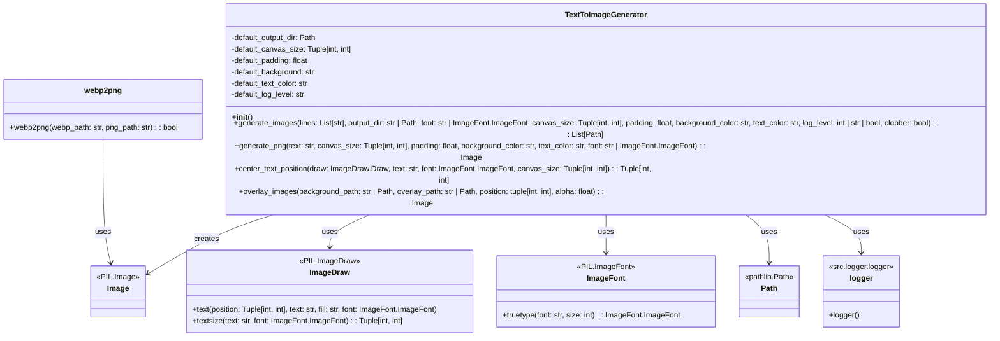

## ИНСТРУКЦИЯ:

Анализируй предоставленный код подробно и объясни его функциональность. Ответ должен включать три раздела:

1.  **<алгоритм>**: Опиши рабочий процесс в виде пошаговой блок-схемы, включая примеры для каждого логического блока, и проиллюстрируй поток данных между функциями, классами или методами.
2.  **<mermaid>**: Напиши код для диаграммы в формате `mermaid`, проанализируй и объясни все зависимости,
    которые импортируются при создании диаграммы.
    **ВАЖНО!** Убедитесь, что все имена переменных, используемые в диаграмме `mermaid`,
    имеют осмысленные и описательные имена. Имена переменных вроде `A`, `B`, `C`, и т.д., не допускаются!

    **Дополнительно**: Если в коде есть импорт `import header`, добавьте блок `mermaid` flowchart, объясняющий `header.py`
    ```mermaid
    flowchart TD
        Start --> Header[<code>header.py</code><br> Determine Project Root]

        Header --> import[Import Global Settings: <br><code>from src import gs</code>]
    ```

3.  **<объяснение>**: Предоставьте подробные объяснения:
    -   **Импорты**: Их назначение и взаимосвязь с другими пакетами `src.`.
    -   **Классы**: Их роль, атрибуты, методы и взаимодействие с другими компонентами проекта.
    -   **Функции**: Их аргументы, возвращаемые значения, назначение и примеры.
    -   **Переменные**: Их типы и использование.
    -   Выделите потенциальные ошибки или области для улучшения.

Дополнительно, постройте цепочку взаимосвязей с другими частями проекта (если применимо).

Это обеспечивает всесторонний и структурированный анализ кода.
## Формат ответа: `.md` (markdown)
**КОНЕЦ ИНСТРУКЦИИ**

## <алгоритм>

```mermaid
flowchart TD
    Start[Начало] --> Input[Получение входных данных: текст, параметры]
    Input --> CheckOutputDir{Проверка output_dir}
    CheckOutputDir -- output_dir задан --> SetOutputDir[Использовать заданный output_dir]
    CheckOutputDir -- output_dir не задан --> DefaultOutputDir[Использовать default_output_dir]
    SetOutputDir --> SetupLogging[Настройка логирования]
    DefaultOutputDir --> SetupLogging
    SetupLogging --> CheckCanvasSize{Проверка canvas_size}
    CheckCanvasSize -- canvas_size задан --> SetCanvasSize[Использовать заданный canvas_size]
    CheckCanvasSize -- canvas_size не задан --> DefaultCanvasSize[Использовать default_canvas_size]
    SetCanvasSize --> CheckPadding{Проверка padding}
    DefaultCanvasSize --> CheckPadding
    CheckPadding -- padding задан --> SetPadding[Использовать заданный padding]
    CheckPadding -- padding не задан --> DefaultPadding[Использовать default_padding]
    SetPadding --> LoopStart[Начало цикла по строкам текста]
    DefaultPadding --> LoopStart
    LoopStart --> CheckFileExists{Проверка существования файла}
    CheckFileExists -- Файл существует и clobber=False --> SkipFile[Пропустить файл, предупреждение в лог]
    CheckFileExists -- Файл не существует или clobber=True --> GenerateImage[Сгенерировать изображение: generate_png()]
    SkipFile --> LoopEnd[Конец цикла]
    GenerateImage --> SaveImage[Сохранить изображение]
    SaveImage --> AddImagePath[Добавить путь к изображению в список]
    AddImagePath --> LoopEnd
    LoopEnd --> CheckLoopEnd{Проверка завершения цикла}
    CheckLoopEnd -- Цикл не завершен --> LoopStart
    CheckLoopEnd -- Цикл завершен --> ReturnImages[Возврат списка путей к изображениям]
    ReturnImages --> End[Конец]
    
    subgraph generate_png
        GenerateImage --> CreateCanvas[Создание канвы]
        CreateCanvas --> CreateDraw[Создание объекта рисования]
        CreateDraw --> GetFontSize[Определение размера шрифта: get_font_size()]
        GetFontSize --> CreateFont[Создание объекта шрифта]
        CreateFont --> CalculateTextPosition[Вычисление позиции текста: center_text_position()]
        CalculateTextPosition --> DrawText[Отрисовка текста]
        DrawText --> ReturnImage[Возврат изображения]
    end
    
    subgraph center_text_position
        CalculateTextPosition --> GetTextSize[Получить размер текста: draw.textsize()]
        GetTextSize --> CalculatePosition[Вычисление координат центра]
        CalculatePosition --> ReturnPosition[Возврат координат]
    end
    
    subgraph overlay_images
        OverlayStart[Начало] --> OpenBackground[Открыть фоновое изображение]
        OpenBackground --> OpenOverlay[Открыть накладываемое изображение]
         OpenOverlay --> CheckOverlaySize{Проверка размера накладываемого изображения}
        CheckOverlaySize -- overlay.size != background.size --> ResizeOverlay[Изменить размер накладываемого изображения]
        CheckOverlaySize -- overlay.size == background.size --> AdjustTransparency[Изменить прозрачность накладываемого изображения]
         ResizeOverlay --> AdjustTransparency
        AdjustTransparency --> PasteOverlay[Накладывание изображения на фон]
        PasteOverlay --> ReturnOverlayedImage[Возврат результирующего изображения]
        ReturnOverlayedImage --> OverlayEnd[Конец]
    end
    
     subgraph webp2png
        Webp2PngStart[Начало] --> OpenWebp[Открыть webp изображение]
        OpenWebp --> SavePng[Сохранить в png]
        SavePng --> Webp2PngEnd[Конец]
        OpenWebp --> ExceptionHandler[Перехват ошибок]
        ExceptionHandler --> Webp2PngErrorEnd[Конец]
    end
```

**Примеры для блоков:**

*   **Input**:
    *   `lines = ["Hello", "World"]`,
    *   `output_dir = "output_images"`
    *   `font = "arial.ttf"`
    *   `canvas_size = (800, 600)`,
    *   `padding = 0.05`
    *   `background_color = "lightblue"`
    *   `text_color = "darkblue"`
    *   `log_level = "INFO"`
    *   `clobber = True`
*   **CheckOutputDir**: Проверяется, задан ли `output_dir`. Если задан "output_images", то используется он.
*   **DefaultOutputDir**: Если `output_dir` не задан, то используется `./output`.
*   **SetupLogging**: Устанавливает уровень логирования на `INFO`.
*   **CheckCanvasSize**: Проверяет, задан ли `canvas_size`. Если задан `(800, 600)`, то используется он.
*   **DefaultCanvasSize**: Если `canvas_size` не задан, то используется `(1024, 1024)`.
*   **CheckPadding**: Проверяет, задан ли `padding`. Если задан `0.05`, то используется он.
*  **DefaultPadding**: Если `padding` не задан, то используется `0.10`.
*  **LoopStart**: Цикл начинается для каждой строки в `lines`.
*   **CheckFileExists**: Для строки "Hello", проверяется наличие файла `output_images/Hello.png`. Если `clobber = True`, то пропускается проверка.
*   **SkipFile**: Если `output_images/Hello.png` существует и `clobber=False`, то выводится предупреждение в лог.
*  **GenerateImage**: Вызывается функция `generate_png` с текстом "Hello", размером канвы `(800, 600)`, отступами `0.05` и пр.
*   **CreateCanvas**: Создается белое изображение `800x600`.
*   **CreateDraw**: Создается объект рисования.
*   **GetFontSize**: На основе размера канвы и отступов высчитывается оптимальный размер шрифта.
*   **CreateFont**: Создается объект шрифта "arial.ttf" с полученным размером.
*  **CalculateTextPosition**: Вычисляется позиция для центрирования текста "Hello" на канве.
*   **GetTextSize**: Получает размеры текста "Hello" на канве.
*   **CalculatePosition**: Вычисляет координаты центра для размещения текста.
*   **DrawText**: Текст "Hello" рисуется на канве в центре.
*   **ReturnImage**: Возвращается изображение.
*   **SaveImage**: Изображение сохраняется как `output_images/Hello.png`.
*   **AddImagePath**: Путь `output_images/Hello.png` добавляется в список `generated_images`.
*   **LoopEnd**: Конец итерации.
*   **CheckLoopEnd**: Если еще есть строки в `lines`, то происходит переход на `LoopStart`.
*   **ReturnImages**: Возвращается список путей к изображениям.
*  **OverlayStart**: Начало процесса наложения изображений.
*  **OpenBackground**: Открытие фонового изображения.
*  **OpenOverlay**: Открытие накладываемого изображения.
*  **CheckOverlaySize**: Проверка соответствия размеров изображений.
*   **ResizeOverlay**: Изменение размеров накладываемого изображения.
*   **AdjustTransparency**:  Изменение прозрачности накладываемого изображения.
*  **PasteOverlay**: Наложение изображения на фон.
*  **ReturnOverlayedImage**: Возврат результирующего изображения.
*  **Webp2PngStart**: Начало процесса конвертации из webp в png.
*  **OpenWebp**: Открытие webp изображения.
*  **SavePng**: Сохранение изображения в формате png.
*  **ExceptionHandler**: Обработка исключений в процессе конвертации.

## <mermaid>



**Объяснение:**

*   **`TextToImageGenerator`**:
    *   Это основной класс, который управляет процессом генерации изображений из текста.
    *   Он имеет атрибуты, такие как `default_output_dir`, `default_canvas_size` и другие, для хранения настроек по умолчанию.
    *   Метод `generate_images` является точкой входа для генерации изображений.
    *   Метод `generate_png` создает изображение для одной текстовой строки.
    *   Метод `center_text_position` вычисляет координаты для центрирования текста.
    *   Метод `overlay_images` накладывает одно изображение на другое.
    *   Использует классы `Image`, `ImageDraw`, `ImageFont`, `Path` и `logger`.
*   **`Image`**:
    *   Представляет изображения из библиотеки PIL (Pillow).
    *   Используется для создания, сохранения и манипуляции с изображениями.
*   **`ImageDraw`**:
    *   Используется для рисования на объекте `Image`, в том числе для отрисовки текста.
    *   Имеет методы `text` для отрисовки текста и `textsize` для получения размеров текста.
*   **`ImageFont`**:
    *   Представляет шрифты из библиотеки PIL.
    *   Используется для загрузки и применения шрифтов для отрисовки текста.
    *   Используется метод `truetype` для загрузки шрифта из файла.
*  **`Path`**:
    *   Представляет пути к файлам и директориям из библиотеки `pathlib`.
    *   Используется для работы с путями файлов и директорий.
*  **`logger`**:
    *   Представляет логгер из `src.logger.logger`.
    *   Используется для вывода сообщений отладки и предупреждений.
* **`webp2png`**:
    * Представляет функцию конвертации из webp в png.
    * Использует `Image` из PIL.

## <объяснение>

**Импорты:**

*   `pathlib.Path`: Используется для работы с путями к файлам и директориям, что делает код более переносимым между разными операционными системами.
*   `typing.List`, `typing.Tuple`: Используются для аннотации типов, что делает код более понятным и помогает выявлять ошибки на ранних этапах разработки.
*   `PIL.Image`, `PIL.ImageDraw`, `PIL.ImageFont`: Это модули из библиотеки Pillow (PIL), которые используются для работы с изображениями. `Image` для создания и манипуляции изображениями, `ImageDraw` для рисования на изображениях (в том числе текста), `ImageFont` для работы со шрифтами.
*   `src.logger.logger`: Модуль для логирования событий, позволяющий отслеживать ход выполнения программы и выявлять ошибки. Импортирует объект `logger` для записи логов.

**Классы:**

*   **`TextToImageGenerator`**:
    *   **Роль**: Этот класс является основным инструментом для генерации PNG-изображений из текстовых строк. Он инкапсулирует всю логику, необходимую для преобразования текста в изображения, включая настройку параметров изображения, создание изображений, сохранение и т.д.
    *   **Атрибуты**:
        *   `default_output_dir`: `Path` - путь к директории по умолчанию для сохранения изображений, если не указано другое.
        *   `default_canvas_size`: `Tuple[int, int]` - размер канвы по умолчанию (ширина, высота).
        *   `default_padding`: `float` - процент от размера канвы для отступов текста от краев изображения.
        *   `default_background`: `str` - цвет фона по умолчанию.
        *   `default_text_color`: `str` - цвет текста по умолчанию.
        *   `default_log_level`: `str` - уровень логирования по умолчанию.
    *   **Методы**:
        *   `__init__`: Конструктор класса, который инициализирует атрибуты значениями по умолчанию.
        *   `generate_images`:
            *   **Назначение**: Основной метод для генерации изображений из списка строк.
            *   **Аргументы**:
                *   `lines`: `List[str]` - список текстовых строк для преобразования в изображения.
                *   `output_dir`: `str | Path` - путь к директории для сохранения изображений (необязательный, по умолчанию `./output`).
                *   `font`: `str | ImageFont.ImageFont` - шрифт для текста (необязательный, по умолчанию "sans-serif").
                *   `canvas_size`: `Tuple[int, int]` - размер канвы изображения (необязательный, по умолчанию `(1024, 1024)`).
                *   `padding`: `float` - процент от размера канвы для отступов текста (необязательный, по умолчанию `0.10`).
                *   `background_color`: `str` - цвет фона изображения (необязательный, по умолчанию "white").
                *   `text_color`: `str` - цвет текста (необязательный, по умолчанию "black").
                *   `log_level`: `int | str | bool` - уровень логирования (необязательный, по умолчанию "WARNING").
                *   `clobber`: `bool` - флаг перезаписи существующих файлов (необязательный, по умолчанию `False`).
            *   **Возвращаемое значение**: `List[Path]` - список путей к сгенерированным изображениям.
        *    `generate_png`:
            *   **Назначение**: Создает одно PNG-изображение на основе предоставленного текста и параметров.
            *   **Аргументы**:
                *   `text`: `str` - текст для отрисовки на изображении.
                *   `canvas_size`: `Tuple[int, int]` - размер канвы изображения.
                *   `padding`: `float` - отступ текста от краев.
                *   `background_color`: `str` - цвет фона.
                *   `text_color`: `str` - цвет текста.
                *   `font`: `str | ImageFont.ImageFont` - шрифт.
            *   **Возвращаемое значение**: `Image` - сгенерированное изображение.
        *   `center_text_position`:
            *   **Назначение**: Вычисляет координаты для центрирования текста на изображении.
            *   **Аргументы**:
                *   `draw`: `ImageDraw.Draw` - объект рисования.
                *   `text`: `str` - текст для центрирования.
                *   `font`: `ImageFont.ImageFont` - используемый шрифт.
                *   `canvas_size`: `Tuple[int, int]` - размер канвы.
            *   **Возвращаемое значение**: `Tuple[int, int]` - координаты (x, y) для размещения текста.
        *  `overlay_images`:
            *   **Назначение**: Накладывает одно PNG-изображение на другое.
            *    **Аргументы**:
                *   `background_path`: `str | Path` - путь к фоновому изображению.
                *   `overlay_path`: `str | Path` - путь к накладываемому изображению.
                *  `position`: `tuple[int, int]` - координаты наложения (необязательный, по умолчанию `(0, 0)`).
                *  `alpha`: `float` - прозрачность накладываемого изображения (необязательный, по умолчанию `1.0`).
            *   **Возвращаемое значение**: `Image` - результирующее изображение с наложенным.

**Функции:**

*   **`webp2png(webp_path: str, png_path: str) -> bool`**:
    *   **Назначение**: Конвертирует изображение из формата WEBP в формат PNG.
    *   **Аргументы**:
        *   `webp_path`: `str` - путь к входному файлу WEBP.
        *   `png_path`: `str` - путь для сохранения выходного файла PNG.
    *   **Возвращаемое значение**: `bool` - `True`, если конвертация прошла успешно, `None` в случае ошибки.
    *   **Пример**: `webp2png('image.webp', 'image.png')` конвертирует `image.webp` в `image.png`.

**Переменные:**

*   Многочисленные переменные, используемые в методах класса `TextToImageGenerator`, определяют параметры генерации изображений, такие как `lines`, `output_dir`, `font`, `canvas_size`, `padding`, `background_color`, `text_color`, `log_level`, и `clobber`.
*   Переменные `img`, `draw`, `font`, `text_position` в методе `generate_png` используются для временного хранения объектов `Image`, `ImageDraw`, `ImageFont`, и координат текста во время создания изображения.
*   В методе `center_text_position` переменные `text_width` и `text_height` используются для хранения размеров текста.
*   Переменные `background`, `overlay`  в методе `overlay_images` используются для временного хранения объектов `Image` для фонового и накладываемого изображений.

**Потенциальные ошибки и области для улучшения:**

*   **Обработка ошибок:** В функции `webp2png` используется общий блок `except Exception as e:`. Лучше использовать более конкретные исключения для лучшей обработки ошибок и предоставления более информативных сообщений.
*   **Валидация входных данных**: В методе `generate_images` не проводится валидация входных данных. Например, нужно проверять, является ли `canvas_size` кортежем из двух положительных целых чисел.
*   **Гибкость шрифтов**: Сейчас используется `ImageFont.truetype()`, что требует наличия шрифтов в файловой системе. Можно добавить возможность использования системных шрифтов без указания пути.
*   **Обработка не ASCII текста**: Сейчас в имени файла используется строка, что может вызвать проблемы если используются не ASCII символы. Стоит пересмотреть этот момент.
*   **Масштабирование изображений**: При наложении изображений, если размеры фонового и накладываемого изображения отличаются, происходит изменение размера накладываемого изображения. Если это поведение нежелательно, необходимо добавить опцию для масштабирования или обрезки изображений.
*   **Управление памятью**: Для очень больших наборов изображений можно оптимизировать работу с памятью и уменьшить нагрузку.
*   **Синхронность**: Метод `generate_images` объявлен как асинхронный, но внутри он использует синхронные операции PIL. Для полной асинхронности можно использовать асинхронные версии библиотек.

**Взаимосвязи с другими частями проекта:**

*   Модуль зависит от модуля логирования `src.logger.logger`, который, в свою очередь, может зависеть от глобальных настроек проекта.
*   Модуль используется для генерации изображений из текста, которые могут применяться в других частях проекта, например для создания презентаций, водяных знаков и т.д.
*   Функция `webp2png` может быть использована в модулях, которые обрабатывают изображения и используют webp формат.

Этот анализ предоставляет подробное понимание работы модуля `png.py` и позволяет видеть его место в контексте всего проекта.