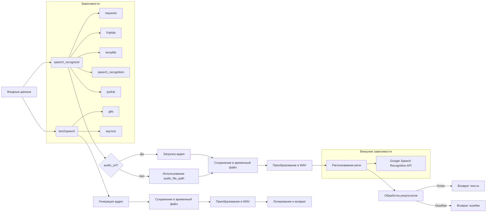

# <input code>

```python
## \file hypotez/src/utils/convertors/tts.py
# -*- coding: utf-8 -*-\
#! venv/Scripts/python.exe
#! venv/bin/python/python3.12

"""
.. module: src.utils.convertors.tts 
	:platform: Windows, Unix
	:synopsis: speech recognition and text-to-speech conversion

"""
MODE = 'dev'

from pathlib import Path
import tempfile
import asyncio
import requests
import speech_recognition as sr  # Библиотека для распознавания речи
from pydub import AudioSegment  # Library for audio conversion
from gtts import gTTS  # Генерация текста в речь

from src.utils.jjson import j_loads, j_loads_ns, j_dumps
from src.logger import logger


def speech_recognizer(audio_url: str = None, audio_file_path: Path = None, language: str = 'ru-RU') -> str:
    """ Download an audio file and recognize speech in it.

    Args:
        audio_url (str, optional): URL of the audio file to be downloaded. Defaults to `None`.
        audio_file_path (Path, optional): Local path to an audio file. Defaults to `None`.
        language (str): Language code for recognition (e.g., 'ru-RU'). Defaults to 'ru-RU'.

    Returns:
        str: Recognized text from the audio or an error message.

    Example:
        .. code::

            recognized_text = speech_recognizer(audio_url='https://example.com/audio.ogg')
            print(recognized_text)  # Output: "Привет"
    """
    try:
        if audio_url:
            # Download the audio file
            response = requests.get(audio_url)
            audio_file_path = Path(tempfile.gettempdir()) / 'recognized_audio.ogg'

            with open(audio_file_path, 'wb') as f:
                f.write(response.content)

        # Convert OGG to WAV
        wav_file_path = audio_file_path.with_suffix('.wav')
        audio = AudioSegment.from_file(audio_file_path)  # Load the OGG file
        audio.export(wav_file_path, format='wav')  # Export as WAV

        # Initialize the recognizer
        recognizer = sr.Recognizer()
        with sr.AudioFile(str(wav_file_path)) as source:
            audio_data = recognizer.record(source)
            try:
                # Recognize speech using Google Speech Recognition
                text = recognizer.recognize_google(audio_data, language=language)
                logger.info(f'Recognized text: {text}')
                return text
            except sr.UnknownValueError:
                logger.error('Google Speech Recognition could not understand audio')
                return 'Sorry, I could not understand the audio.'
            except sr.RequestError as ex:
                logger.error('Could not request results from Google Speech Recognition service:', ex)
                return 'Could not request results from the speech recognition service.'
    except Exception as ex:
        logger.error('Error in speech recognizer:', ex)
        return 'Error during speech recognition.'


async def text2speech(text: str, lang: str = 'ru') -> str:
    """ Convert text to speech and save it as an audio file.

    Args:
        text (str): The text to be converted into speech.
        lang (str, optional): Language code for the speech (e.g., 'ru'). Defaults to 'ru'.

    Returns:
        str: Path to the generated audio file.

    Example:
        .. code::

            audio_path = await text2speech('Привет', lang='ru')
            print(audio_path)  # Output: "/tmp/response.mp3"
    """
    try:
        # Generate speech using gTTS
        tts = gTTS(text=text, lang=lang)
        audio_file_path = f'{tempfile.gettempdir()}/response.mp3'
        tts.save(audio_file_path)  # Save the audio file

        # Load and export audio using pydub
        audio = AudioSegment.from_file(audio_file_path, format='mp3')
        wav_file_path = audio_file_path.replace('.mp3', '.wav')
        audio.export(wav_file_path, format='wav')

        logger.info(f'TTS audio saved at: {wav_file_path}')
        return wav_file_path
    except Exception as ex:
        logger.error('Error in text2speech:', ex)
        return 'Error during text-to-speech conversion.'
```

# <algorithm>

**speech_recognizer(audio_url, audio_file_path, language):**

1. **Проверка наличия audio_url:**
   * Если `audio_url` предоставлен, загрузить аудио с указанного URL.
   * Создать временный файл `recognized_audio.ogg` в временном каталоге.
   * Сохранить загруженный контент в временный файл.

2. **Преобразование в WAV:**
   * Создать файл `.wav` (`wav_file_path`), используя `audio_file_path` в качестве исходного.
   * Загрузить файл `ogg` в `pydub`.
   * Сохранить `ogg` в `wav` формате.

3. **Распознавание речи:**
   * Инициализировать распознаватель речи `speech_recognition`.
   * Загрузить аудиоданные из `wav_file_path`.
   * Использовать `recognize_google` для распознавания.
   * Логировать распознанный текст.
   * Вернуть распознанный текст.

4. **Обработка ошибок:**
   * Обработать `sr.UnknownValueError`, если распознаватель не смог распознать аудио.
   * Обработать `sr.RequestError` если возникла ошибка при запросе к сервису распознавания.
   * Обработать общие ошибки (`Exception`).

**text2speech(text, lang):**

1. **Генерация аудио:**
   * Создать объект `gTTS` с заданным текстом и языком.
   * Создать временный файл `response.mp3`.
   * Сохранить аудио в файл.

2. **Преобразование в WAV:**
   * Загрузить `mp3` аудио в `pydub`.
   * Создать файл `.wav` (`wav_file_path`), заменив суффикс `.mp3` на `.wav`.
   * Сохранить аудио в формате `.wav`

3. **Логирование и возврат:**
   * Логировать путь сохранённого аудио.
   * Вернуть путь к сохранённому аудио в `.wav` формате.

4. **Обработка ошибок:**
   * Обработать общие ошибки (`Exception`).


# <mermaid>



# <explanation>

**Импорты:**

- `from pathlib import Path`: Импортирует класс `Path` для работы с путями к файлам.
- `import tempfile`: Позволяет создавать временные файлы и каталоги.
- `import asyncio`:  Не используется напрямую, но присутствует, возможно, для будущих асинхронных операций.
- `import requests`: Для загрузки аудио с URL.
- `import speech_recognition as sr`:  Библиотека для распознавания речи. Используется для преобразования аудио в текст.
- `from pydub import AudioSegment`: Библиотека для работы с аудиоформатами.  Используется для конвертирования форматов аудиофайлов (ogg в wav, mp3 в wav).
- `from gtts import gTTS`: Библиотека для генерации текста в речь. Используется для преобразования текста в аудио.
- `from src.utils.jjson import j_loads, j_loads_ns, j_dumps`:  Возможно, для работы с JSON данными, импортированные из пакета `jjson` внутри проекта.
- `from src.logger import logger`: Импортирует объект логгера, позволяющий вести запись событий в логи.


**Классы:**

- Нет явных классов, кроме встроенных (`Path`, `AudioSegment`, etc.).


**Функции:**

- `speech_recognizer(audio_url, audio_file_path, language)`:  Распознаёт речь из аудиофайла.
    - Принимает `audio_url`, `audio_file_path` (опционально), `language`.
    - Возвращает распознанный текст или сообщение об ошибке.
    - Поддерживает загрузку аудио с URL.
    -  Конвертирует входной аудиофайл в формат WAV, что важно для `speech_recognition`.
    - Использует `speech_recognition` для распознавания речи.
    -  Аккуратно обрабатывает возможные ошибки (`try...except`).
- `text2speech(text, lang)`: Преобразует текст в речь и сохраняет аудиофайл.
    - Принимает текст и код языка.
    - Возвращает путь к сгенерированному аудиофайлу в формате WAV или сообщение об ошибке.
    - Конвертирует аудио с формата `mp3` в `wav` для единообразия.
    - Использовать `asyncio` (не используется напрямую, но потенциально может быть).

**Переменные:**

- `MODE = 'dev'`: Вероятно, константа, определяющая режим работы (например, `dev` или `prod`).
- `audio_url`, `audio_file_path`, `language`, `text`, `lang`, `wav_file_path`, `audio_data` и т.д.: Переменные с данными, используемыми в функциях для хранения параметров, загруженных данных и путей к файлам.

**Возможные ошибки и улучшения:**

- **Обработка ошибок:** Функции содержат `try...except` блоки, но обработка более конкретных исключений (например, исключений `requests`) может улучшить надежность.
- **Время ожидания:** При загрузке с `audio_url`, стоит использовать таймауты.
- **Проверка формата:** Добавить проверку того, что переданные `audio_url` или `audio_file_path` указывают на допустимый аудиофайл.
- **Выбор формата файла:** При генерации,  можно предоставить пользователю возможность выбора формата.
- **Языки:**  Расширить поддерживаемые языки для `gTTS`.

**Взаимосвязь с другими частями проекта:**

- `logger`:  Подключается к системе логирования (`src.logger`), что указывает на использование логирования в проекте для отслеживания состояния выполнения и ошибок.
- `jjson`:  Возможно, эти функции используются для обработки JSON-данных в других частях проекта.

**Рекомендации:**

В целом, код написан аккуратно с хорошей обработкой ошибок, однако, можно улучшить чтение кода с помощью docstrings, более подробного комментария и улучшения обработки различных возможных исключений.