## ИНСТРУКЦИЯ:

Анализируй предоставленный код подробно и объясни его функциональность. Ответ должен включать три раздела:

1.  **<алгоритм>**: Опиши рабочий процесс в виде пошаговой блок-схемы, включая примеры для каждого логического блока, и проиллюстрируй поток данных между функциями, классами или методами.
2.  **<mermaid>**: Напиши код для диаграммы в формате `mermaid`, проанализируй и объясни все зависимости,
    которые импортируются при создании диаграммы.
    **ВАЖНО!** Убедитесь, что все имена переменных, используемые в диаграмме `mermaid`,
    имеют осмысленные и описательные имена. Имена переменных вроде `A`, `B`, `C`, и т.д., не допускаются!

    **Дополнительно**: Если в коде есть импорт `import header`, добавьте блок `mermaid` flowchart, объясняющий `header.py`:
    ```mermaid
    flowchart TD
        Start --> Header[<code>header.py</code><br> Determine Project Root]

        Header --> import[Import Global Settings: <br><code>from src import gs</code>]
    ```

3.  **<объяснение>**: Предоставьте подробные объяснения:
    -   **Импорты**: Их назначение и взаимосвязь с другими пакетами `src.`.
    -   **Классы**: Их роль, атрибуты, методы и взаимодействие с другими компонентами проекта.
    -   **Функции**: Их аргументы, возвращаемые значения, назначение и примеры.
    -   **Переменные**: Их типы и использование.
    -   Выделите потенциальные ошибки или области для улучшения.

Дополнительно, постройте цепочку взаимосвязей с другими частями проекта (если применимо).

Это обеспечивает всесторонний и структурированный анализ кода.
## Формат ответа: `.md` (markdown)
**КОНЕЦ ИНСТРУКЦИИ**

```md
## <алгоритм>

**1. `speech_recognizer` (Распознавание речи):**

   *   **Начало:** Функция принимает URL аудиофайла (`audio_url`), путь к локальному аудиофайлу (`audio_file_path`), и язык (`language`, по умолчанию 'ru-RU').
    ```
        Пример:
            speech_recognizer(audio_url='https://example.com/audio.ogg')
            speech_recognizer(audio_file_path=Path('/path/to/audio.ogg'), language='en-US')
    ```

   *   **Загрузка аудио (если `audio_url` предоставлен):**
       *   Отправляется GET-запрос на `audio_url`.
       *   Содержимое ответа сохраняется во временный файл в формате OGG (`recognized_audio.ogg`).
       ```
        Пример:
             response = requests.get('https://example.com/audio.ogg')
             audio_file_path = Path('/tmp/recognized_audio.ogg')
             with open(audio_file_path, 'wb') as f:
                 f.write(response.content)
       ```

   *   **Конвертация OGG в WAV:**
       *   Из файла OGG создается объект `AudioSegment`.
       *   Аудио экспортируется в формат WAV (`.wav`).
       ```
       Пример:
           audio = AudioSegment.from_file('/tmp/recognized_audio.ogg')
           wav_file_path = Path('/tmp/recognized_audio.wav')
           audio.export(wav_file_path, format='wav')
       ```

   *   **Распознавание речи:**
       *   Создается объект `sr.Recognizer`.
       *   WAV файл загружается как источник аудио.
       *   Аудио записывается.
       *   Используется `recognizer.recognize_google` для распознавания речи.
       *   Результат (текст) возвращается.
       ```
         Пример:
            recognizer = sr.Recognizer()
            with sr.AudioFile('/tmp/recognized_audio.wav') as source:
                 audio_data = recognizer.record(source)
                 text = recognizer.recognize_google(audio_data, language='ru-RU')
                 return text
       ```

   *   **Обработка ошибок:**
       *   Если распознавание не удалось, возвращается сообщение об ошибке.
       *   Ошибки распознавания речи, сетевые ошибки или другие исключения логируются.

**2. `text2speech` (Синтез речи):**
   *   **Начало:** Функция принимает текст (`text`) и язык (`lang`, по умолчанию 'ru').
     ```
       Пример:
          await text2speech(text='Привет мир', lang='ru')
     ```
   *   **Генерация речи:**
       *   Используется `gTTS` для создания аудио из текста.
       *   Аудио сохраняется во временный файл в формате MP3.
       ```
        Пример:
            tts = gTTS(text='Привет мир', lang='ru')
            audio_file_path = '/tmp/response.mp3'
            tts.save(audio_file_path)
       ```

   *   **Конвертация MP3 в WAV:**
       *   MP3 файл загружается с помощью `AudioSegment`.
       *   Аудио экспортируется в формат WAV.
        ```
          Пример:
            audio = AudioSegment.from_file('/tmp/response.mp3', format='mp3')
            wav_file_path = '/tmp/response.wav'
            audio.export(wav_file_path, format='wav')
       ```

   *   **Возврат пути к файлу:**
       *   Функция возвращает путь к созданному WAV файлу.
       ```
        Пример:
           return '/tmp/response.wav'
       ```
   *   **Обработка ошибок:**
       *   Если возникает ошибка в процессе преобразования текста в речь, логируется ошибка и возвращается сообщение об ошибке.

```mermaid
flowchart TD
    subgraph speech_recognizer
        Start_speech_recognizer[Начало]
        Check_audio_url{audio_url?}
        Download_audio[Скачать аудио]
        Save_audio[Сохранить аудио]
        Convert_ogg_to_wav[Конвертировать OGG в WAV]
        Init_recognizer[Инициализировать распознаватель]
        Record_audio[Записать аудио]
        Recognize_speech[Распознать речь]
        Return_text[Возврат распознанного текста]
        Error_speech[Обработка ошибок]
    end
    
    subgraph text2speech
        Start_text2speech[Начало]
        Generate_speech[Сгенерировать речь]
        Save_speech[Сохранить аудио MP3]
        Convert_mp3_to_wav[Конвертировать MP3 в WAV]
        Return_audio_path[Возврат пути к WAV]
         Error_text[Обработка ошибок]
    end
    
    Start_speech_recognizer --> Check_audio_url
    Check_audio_url -- Yes --> Download_audio
     Check_audio_url -- No -->  Convert_ogg_to_wav
    Download_audio --> Save_audio
    Save_audio --> Convert_ogg_to_wav
    Convert_ogg_to_wav --> Init_recognizer
    Init_recognizer --> Record_audio
    Record_audio --> Recognize_speech
    Recognize_speech --> Return_text
    Recognize_speech -- Error --> Error_speech
    Error_speech --> Return_text
   
   
    Start_text2speech --> Generate_speech
    Generate_speech --> Save_speech
    Save_speech --> Convert_mp3_to_wav
    Convert_mp3_to_wav --> Return_audio_path
     Convert_mp3_to_wav -- Error --> Error_text
    Error_text --> Return_audio_path
```

## <mermaid>



### **Объяснение `mermaid` диаграммы:**
Диаграмма состоит из двух подграфов, представляющих функции `speech_recognizer` и `text2speech`.

*   **`speech_recognizer`**:
    *   **`Start_speech_recognizer`**: Начальная точка функции.
    *   **`Check_audio_url`**: Проверка, был ли предоставлен `audio_url`.
    *   **`Download_audio`**: Загрузка аудиофайла по URL.
    *   **`Save_audio`**: Сохранение загруженного аудио в файл.
    *   **`Convert_ogg_to_wav`**: Конвертация аудио из OGG в WAV.
    *   **`Init_recognizer`**: Инициализация объекта распознавания речи `sr.Recognizer`.
    *   **`Record_audio`**: Запись аудио из WAV-файла.
    *   **`Recognize_speech`**: Распознавание речи с помощью Google Speech Recognition.
    *   **`Return_text`**: Возврат распознанного текста или сообщения об ошибке.
    *    **`Error_speech`**: Обработка ошибок, возникших в процессе распознавания.
*   **`text2speech`**:
    *   **`Start_text2speech`**: Начальная точка функции.
    *   **`Generate_speech`**: Генерация речи из текста с помощью `gTTS`.
    *   **`Save_speech`**: Сохранение сгенерированной речи в MP3 файл.
    *    **`Convert_mp3_to_wav`**: Конвертация аудио из MP3 в WAV.
    *   **`Return_audio_path`**: Возврат пути к созданному WAV-файлу.
    *   **`Error_text`**: Обработка ошибок, возникших в процессе синтеза.
Стрелки показывают поток выполнения и передачи данных между блоками.

## <объяснение>

### **Импорты:**

*   **`pathlib.Path`**: Используется для работы с путями к файлам и каталогам. Позволяет создавать, проверять и манипулировать путями к файлам независимо от операционной системы.
*   **`tempfile`**: Модуль для создания временных файлов и каталогов. Используется для хранения временных аудиофайлов во время обработки.
*   **`asyncio`**: Библиотека для асинхронного программирования. Функция `text2speech` объявлена асинхронной (`async def`), что позволяет выполнять операции ввода-вывода неблокирующим образом.
*   **`requests`**: Библиотека для отправки HTTP запросов. Используется для загрузки аудиофайлов по URL.
*   **`speech_recognition as sr`**: Библиотека для распознавания речи. Содержит классы и методы для распознавания речи из аудио.
*   **`pydub.AudioSegment`**: Библиотека для работы с аудиофайлами, например, конвертации форматов.
*   **`gtts.gTTS`**: Библиотека для преобразования текста в речь.
*   **`src.utils.jjson.j_loads, src.utils.jjson.j_loads_ns, src.utils.jjson.j_dumps`**: Модуль для работы с json.
*   **`src.logger.logger`**: Модуль для логирования событий.
### **Функции:**

*   **`speech_recognizer(audio_url: str = None, audio_file_path: Path = None, language: str = 'ru-RU') -> str`**:
    *   **Аргументы:**
        *   `audio_url` (str, optional): URL аудиофайла.
        *   `audio_file_path` (Path, optional): Путь к локальному аудиофайлу.
        *   `language` (str): Язык для распознавания (например, 'ru-RU').
    *   **Возвращаемое значение:**
        *   str: Распознанный текст или сообщение об ошибке.
    *   **Назначение:** Загружает или принимает аудиофайл и пытается распознать в нём речь, используя Google Speech Recognition.
    *   **Примеры:**
        *   `speech_recognizer(audio_url='https://example.com/audio.ogg')`
        *   `speech_recognizer(audio_file_path=Path('/path/to/audio.ogg'), language='en-US')`

*   **`async def text2speech(text: str, lang: str = 'ru') -> str`**:
    *   **Аргументы:**
        *   `text` (str): Текст для преобразования в речь.
        *   `lang` (str): Язык для синтеза речи (например, 'ru').
    *   **Возвращаемое значение:**
        *    str: Путь к созданному WAV-файлу или сообщение об ошибке.
    *   **Назначение:** Преобразует текст в речь и сохраняет результат в виде аудиофайла в формате WAV.
    *   **Примеры:**
        *   `await text2speech(text='Привет мир', lang='ru')`
        *   `await text2speech(text='Hello world', lang='en')`
### **Переменные:**
*   **`audio_url`** (str): URL для загрузки аудиофайла.
*   **`audio_file_path`** (Path): Путь к локальному аудиофайлу.
*   **`language`** (str): Языковой код для распознавания речи.
*   **`response`** (requests.Response): Ответ от HTTP-запроса.
*   **`text`** (str): Текст, который нужно преобразовать в речь.
*   **`lang`** (str): Языковой код для синтеза речи.
*   **`tts`** (gtts.gTTS): Объект для генерации речи из текста.
*   **`recognizer`** (sr.Recognizer): Объект распознавания речи.
*   **`audio`** (AudioSegment): Объекты для обработки аудио.
*   **`wav_file_path`** (str): Путь к WAV файлу.

### **Взаимосвязь с другими частями проекта:**

*   **`src.utils.jjson`**: Используется для загрузки и сохранения конфигурационных файлов в формате json.
*   **`src.logger.logger`**: Используется для записи логов в процессе выполнения функций, что помогает при отладке и мониторинге работы программы.

### **Потенциальные ошибки и области для улучшения:**

*   **Зависимость от Google Speech Recognition:** Функция `speech_recognizer` полностью зависит от Google Speech Recognition, что делает её уязвимой в случае сбоев сервиса или ограничений.
*   **Обработка ошибок:**  Обработка ошибок выполняется, но в некоторых случаях, ошибки могут быть более информативными для пользователя.
*   **Формат файлов:** Код конвертирует OGG в WAV и MP3 в WAV, но не проверяет исходный формат и не поддерживает другие форматы.
*  **Временные файлы:** Код создает временные файлы, но не предусмотрена их очистка, что может привести к переполнению диска.

**Общие замечания:**

*   Функции `speech_recognizer` и `text2speech` инкапсулируют логику преобразования речи в текст и наоборот. Это делает код модульным и удобным для использования в других частях проекта.
*   Код использует библиотеки, которые необходимо устанавливать отдельно (`speech_recognition`, `pydub`, `gtts`, `requests`).
*   В коде используется асинхронный подход для `text2speech`, что позволяет более эффективно обрабатывать операции ввода-вывода.
```