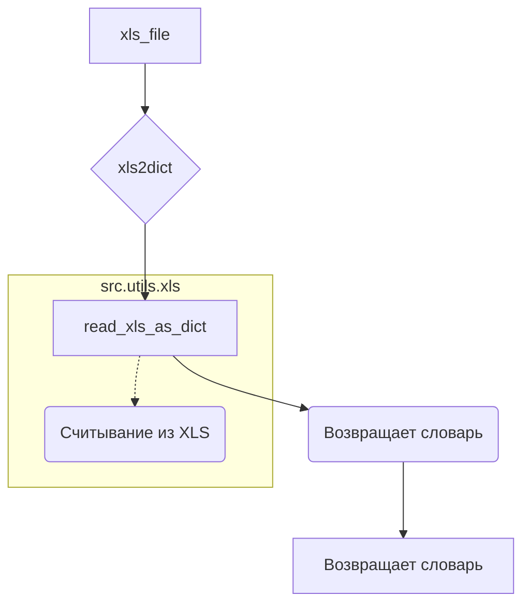

# <input code>

```python
## \file hypotez/src/utils/convertors/xls.py
# -*- coding: utf-8 -*-\
#! venv/Scripts/python.exe
#! venv/bin/python/python3.12

"""
.. module: src.utils.convertors 
	:platform: Windows, Unix
	:synopsis:

"""
MODE = 'dev'


from pathlib import Path

from src.utils.xls import read_xls_as_dict, save_xls_file


def xls2dict(xls_file: str | Path) -> dict | None:
    """"""
    return read_xls_as_dict(xls_file = xls_file)

```

# <algorithm>

**Шаг 1:** Функция `xls2dict` получает на вход строку или объект `Path`, представляющий путь к файлу XLS.

**Шаг 2:** Функция `xls2dict` вызывает функцию `read_xls_as_dict` из модуля `src.utils.xls`, передавая ей путь к файлу XLS в качестве аргумента.

**Шаг 3:** Функция `read_xls_as_dict` (из модуля `src.utils.xls`) считывает данные из файла XLS и возвращает их в виде словаря.

**Шаг 4:** Функция `xls2dict` возвращает полученный словарь.

**Пример:**

Вход: `xls_file = 'path/to/file.xls'`

Результат: Словарь с данными из файла XLS, или `None`, если произошла ошибка.


# <mermaid>



**Подключаемые зависимости:**

* `pathlib`:  Используется для работы с путями к файлам.  (Встроенный модуль Python).
* `src.utils.xls`: Этот модуль содержит функции `read_xls_as_dict` и `save_xls_file`.   Предполагается, что `read_xls_as_dict` отвечает за чтение данных из файла Excel в формат словаря Python. `save_xls_file` вероятно отвечает за сохранение данных в файл Excel.

# <explanation>

* **Импорты:**
    * `from pathlib import Path`: Импортирует класс `Path` из модуля `pathlib`.  Это позволяет работать с путями к файлам в удобном формате, независимо от операционной системы (Windows, Unix).
    * `from src.utils.xls import read_xls_as_dict, save_xls_file`: Импортирует функции `read_xls_as_dict` и `save_xls_file` из модуля `xls` в подпапке `utils` текущего проекта (`src`).  Это указывает на то, что модуль `xls` содержит функции для работы с файлами Excel.


* **Классы:** Нет классов.


* **Функции:**
    * `xls2dict(xls_file: str | Path) -> dict | None`:
        * **Аргументы:** `xls_file` (строка или `Path` объект) — путь к файлу XLS.
        * **Возвращаемое значение:** Словарь (`dict`), содержащий данные из файла, или `None`, если произошла ошибка во время чтения файла.
        * **Функциональность:** Эта функция служит оберточкой для функции `read_xls_as_dict`. Она принимает путь к файлу XLS и возвращает данные в виде словаря, полученные после вызова `read_xls_as_dict`.


* **Переменные:**
    * `MODE = 'dev'`: Переменная, которая, скорее всего, определяет режим работы программы (например, 'dev' для разработки, 'prod' для производства). Ее значение в этом примере не используется внутри этой функции.


* **Возможные ошибки и улучшения:**

    * Необходимо обработать исключения, которые могут возникнуть при чтении файла (`xls_file` может быть некорректным, файл может отсутствовать, формат файла может быть неверным и т. д.). В текущем коде это не сделано.
    *  Полезно было бы добавить проверку, что возвращаемое значение `read_xls_as_dict` является словарем.

**Взаимосвязи с другими частями проекта:**

Функция `xls2dict` является частью системы преобразования данных. Она использует функцию `read_xls_as_dict` из модуля `src.utils.xls`, который, по всей видимости, содержит методы для работы с файлами в формате Excel.  Это предполагает, что существует более широкий контекст проекта, в котором  данные из Excel преобразуются в другие форматы или используются для дальнейшей обработки.