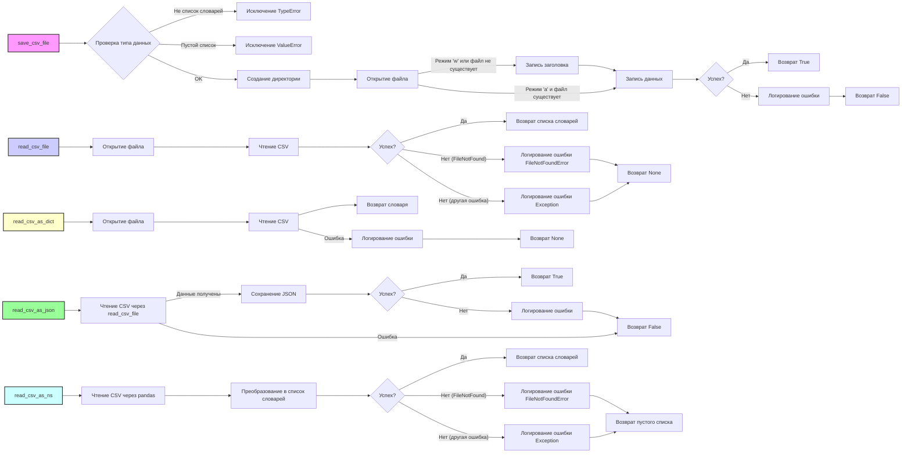

## Анализ кода `hypotez/src/utils/csv.py`

### <алгоритм>

1.  **`save_csv_file(data, file_path, mode='a', exc_info=True)`**:
    *   **Принимает**: `data` (список словарей), `file_path` (путь к файлу), `mode` (режим записи: 'a' - добавление, 'w' - перезапись), `exc_info` (включать ли информацию об исключении в лог).
    *   **Проверяет**: `data` - список словарей, не пустой.
    *   **Создает директорию**: `file_path.parent.mkdir(parents=True, exist_ok=True)` - создает все необходимые родительские директории.
    *   **Открывает файл**: `file_path.open(mode, newline='', encoding='utf-8')` - открывает файл в указанном режиме.
        *   Если `mode` == `'w'` или файла не существует, записывает заголовок `writer.writeheader()`.
        *   Записывает данные в CSV `writer.writerows(data)`.
    *   **Возвращает**: `True` при успехе, `False` при ошибке.
        *   **Пример**:
            ```python
            data = [{"col1": "val1", "col2": "val2"}, {"col1": "val3", "col2": "val4"}]
            file_path = "output.csv"
            save_csv_file(data, file_path, mode='w') # Запишет данные в файл output.csv
            ```

2.  **`read_csv_file(file_path, exc_info=True)`**:
    *   **Принимает**: `file_path` (путь к файлу), `exc_info` (включать ли информацию об исключении в лог).
    *   **Открывает файл**: `Path(file_path).open('r', encoding='utf-8')` - открывает CSV файл для чтения.
    *   **Читает CSV**: `csv.DictReader(file)` - читает CSV как список словарей.
    *   **Возвращает**: Список словарей или `None` при ошибке.
        *   **Пример**:
            ```python
            file_path = "input.csv"
            data = read_csv_file(file_path)  # Прочитает данные из файла input.csv
            ```

3.  **`read_csv_as_json(csv_file_path, json_file_path, exc_info=True)`**:
    *   **Принимает**: `csv_file_path` (путь к CSV файлу), `json_file_path` (путь к JSON файлу), `exc_info` (включать ли информацию об исключении в лог).
    *   **Читает CSV**: `read_csv_file(csv_file_path, exc_info=exc_info)` - читает данные из CSV файла.
    *   **Сохраняет JSON**: `json.dump(data, f, indent=4)` - преобразует данные в JSON и сохраняет в файл.
    *   **Возвращает**: `True` при успехе, `False` при ошибке.
        *   **Пример**:
            ```python
            csv_file_path = "input.csv"
            json_file_path = "output.json"
            read_csv_as_json(csv_file_path, json_file_path) # Преобразует input.csv в output.json
            ```

4.  **`read_csv_as_dict(csv_file)`**:
    *   **Принимает**: `csv_file` (путь к файлу).
    *   **Открывает файл**: `Path(csv_file).open('r', encoding='utf-8')` - открывает CSV файл.
    *   **Читает CSV**: `csv.DictReader(f)` - читает CSV файл.
    *   **Возвращает**: Словарь, содержащий ключ `data` со списком словарей, или `None` при ошибке.
        *   **Пример**:
            ```python
            csv_file = "input.csv"
            data_dict = read_csv_as_dict(csv_file) # Прочитает данные из файла input.csv в виде словаря
            ```

5.  **`read_csv_as_ns(file_path)`**:
    *   **Принимает**: `file_path` (путь к файлу).
    *   **Читает CSV**: `pd.read_csv(file_path)` - читает CSV файл с помощью `pandas`.
    *   **Преобразует в словарь**: `df.to_dict(orient='records')` - преобразует данные в список словарей.
    *   **Возвращает**: Список словарей или пустой список при ошибке.
        *   **Пример**:
            ```python
            file_path = "input.csv"
            data_list = read_csv_as_ns(file_path)  # Прочитает данные из файла input.csv, используя pandas
            ```

### <mermaid>



**Описание зависимостей в `mermaid` диаграмме:**

*   `save_csv_file`: Функция для сохранения данных в CSV файл.
    *   Проверяет входные данные на корректность (`Проверка типа данных`), создает директорию, открывает файл, записывает заголовок (при необходимости) и данные. Обрабатывает исключения.
*   `read_csv_file`: Функция для чтения данных из CSV файла.
    *   Открывает файл, читает данные, обрабатывает `FileNotFoundError` и другие исключения.
*   `read_csv_as_json`: Функция для преобразования CSV файла в JSON.
    *   Использует `read_csv_file` для чтения данных из CSV, затем записывает JSON в файл. Обрабатывает ошибки.
*   `read_csv_as_dict`: Функция для преобразования CSV в словарь с ключом `data`, содержащим список словарей.
    * Открывает файл, читает данные, обрабатывает исключения.
*   `read_csv_as_ns`: Функция для чтения CSV с помощью библиотеки `pandas`.
    *   Использует `pandas.read_csv`, преобразует DataFrame в список словарей. Обрабатывает `FileNotFoundError` и другие исключения.

### <объяснение>

**Импорты:**

*   `csv`: Используется для работы с CSV файлами (чтение, запись).
*   `json`: Используется для работы с JSON файлами (чтение, запись).
*   `pathlib.Path`: Используется для работы с путями к файлам.
*   `types.SimpleNamespace`:  Импорт, который не используется в данном файле.  Возможно, это остаток от предыдущей версии или запланированное использование в будущем.
*   `typing.List`, `typing.Dict`, `typing.Union`: Используются для аннотации типов, делая код более читаемым и понятным, а также облегчают отладку.
*   `pandas as pd`:  Используется для работы с данными в табличном формате (чтение CSV, преобразование в словари).
*   `src.logger.logger`: Используется для логирования ошибок и других событий.

**Функции:**

*   **`save_csv_file(data, file_path, mode='a', exc_info=True)`**
    *   **`data`**: `List[Dict[str, str]]` - Список словарей, где каждый словарь представляет строку в CSV файле. Ключи словарей - заголовки столбцов.
    *   **`file_path`**: `Union[str, Path]` - Путь к CSV файлу, может быть строкой или объектом `Path`.
    *   **`mode`**: `str` - Режим открытия файла: `'a'` - добавление, `'w'` - перезапись. По умолчанию `'a'`.
    *   **`exc_info`**: `bool` - Включать ли информацию об исключении в лог. По умолчанию `True`.
    *   **Назначение**: Сохраняет данные в CSV файл.
    *   **Возвращает**: `True` при успехе, `False` при неудаче.
    *   **Пример**:
        ```python
        data = [{'name': 'John', 'age': '30'}, {'name': 'Alice', 'age': '25'}]
        save_csv_file(data, 'output.csv', mode='w') # Создаст файл output.csv
        ```
*   **`read_csv_file(file_path, exc_info=True)`**
    *   **`file_path`**: `Union[str, Path]` - Путь к CSV файлу.
    *   **`exc_info`**: `bool` - Включать ли информацию об исключении в лог. По умолчанию `True`.
    *   **Назначение**: Читает данные из CSV файла в виде списка словарей.
    *   **Возвращает**: Список словарей при успехе, `None` при ошибке.
    *   **Пример**:
        ```python
        data = read_csv_file('input.csv')
        if data:
          print(data)
        ```
*   **`read_csv_as_json(csv_file_path, json_file_path, exc_info=True)`**
    *   **`csv_file_path`**: `Union[str, Path]` - Путь к CSV файлу.
    *   **`json_file_path`**: `Union[str, Path]` - Путь к JSON файлу, где будут сохранены данные.
    *   **`exc_info`**: `bool` - Включать ли информацию об исключении в лог. По умолчанию `True`.
    *   **Назначение**: Преобразует CSV файл в JSON файл.
    *   **Возвращает**: `True` при успехе, `False` при неудаче.
    *   **Пример**:
        ```python
        read_csv_as_json('input.csv', 'output.json') # Преобразует input.csv в output.json
        ```
*   **`read_csv_as_dict(csv_file)`**
    *   **`csv_file`**: `Union[str, Path]` - Путь к CSV файлу.
    *   **Назначение**: Читает CSV файл и возвращает его содержимое в виде словаря с ключом `data`, где значением является список словарей.
    *   **Возвращает**: Словарь при успехе, `None` при ошибке.
    *   **Пример**:
        ```python
        data_dict = read_csv_as_dict('input.csv')
        if data_dict:
          print(data_dict['data'])
        ```
*   **`read_csv_as_ns(file_path)`**
    *   **`file_path`**: `Union[str, Path]` - Путь к CSV файлу.
    *   **Назначение**: Читает CSV файл, используя `pandas`, и возвращает список словарей.
    *   **Возвращает**: Список словарей при успехе, пустой список при ошибке.
    *   **Пример**:
        ```python
        data_list = read_csv_as_ns('input.csv')
        print(data_list)
        ```

**Переменные:**

*   **`data`**: `List[Dict[str, str]]` -  Список словарей, используется для хранения данных CSV.
*   **`file_path`**: `Union[str, Path]` - Путь к файлу, используется для указания CSV или JSON файла.
*   **`mode`**: `str` - Режим открытия файла.
*   **`exc_info`**: `bool` - Флаг для включения/отключения информации об исключениях в логах.
*  **`csv_file_path`**: `Union[str, Path]` - Путь к CSV файлу.
*  **`json_file_path`**: `Union[str, Path]` - Путь к JSON файлу.
*   **`csv_file`**: `Union[str, Path]` - Путь к CSV файлу.
*   `reader` - `csv.DictReader` - объект, используемый для чтения данных из CSV файла в формате словарей.
* `writer` - `csv.DictWriter` - объект, используемый для записи данных в CSV файл в формате словарей.
*   `df`: `pd.DataFrame` - объект DataFrame библиотеки `pandas`.

**Взаимосвязи с другими частями проекта:**

*   **Логирование**: Используется `src.logger.logger` для записи ошибок и исключений.

**Потенциальные ошибки и области для улучшения:**

*   **Обработка ошибок**: В некоторых функциях, например `read_csv_as_dict` и `read_csv_as_ns`,  логгируется ошибка, но возвращается `None` или пустой список, что может затруднить отладку. Лучше генерировать исключения и позволить вызывающей стороне их обработать.
*   **Отсутствие обработки исключений**: В функциях `read_csv_as_dict` и `read_csv_as_ns` не обрабатываются конкретные исключения, такие как `FileNotFoundError`.
*   **`SimpleNamespace`**: Не используется и может быть удален.
*   **Гибкость**: функции, `read_csv_as_json` и  `read_csv_as_dict`,  зависят от типа возвращаемого значения, если это необходимо, лучше их разделить, по аналогии с `read_csv_as_ns`.

**Дополнительные замечания:**

*   Код хорошо структурирован и имеет docstring-и, что упрощает понимание.
*   Использование `pathlib.Path` упрощает работу с путями.
*   Использование `typing` повышает читаемость и надежность кода.
*   Можно было бы добавить проверку на наличие необходимых библиотек для pandas, а так же по возможности добавлять type hinting там где это возможно.