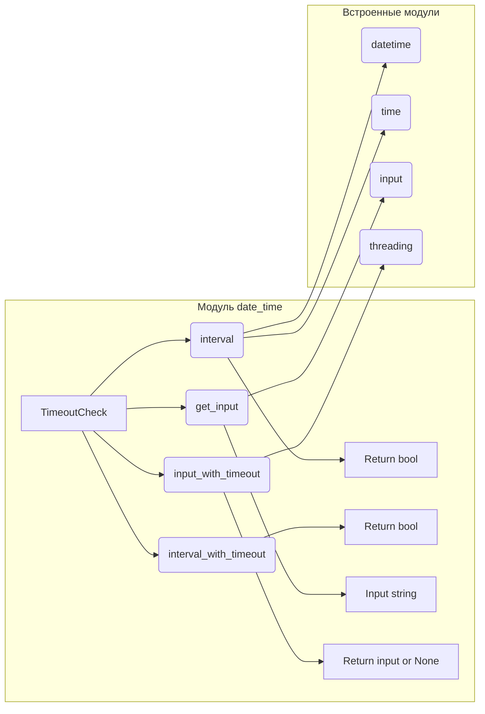

# <input code>

```python
## \file hypotez/src/utils/date_time.py
# -*- coding: utf-8 -*-
#! venv/Scripts/python.exe
#! venv/bin/python/python3.12

"""
.. module: src.utils 
	:platform: Windows, Unix
	:synopsis: function to check if the current time is within a specified interval with an optional timeout

"""
MODE = 'dev'

""" This module contains a function to check if the current time is within a specified interval with an optional timeout.

The `interval` function allows for determining whether the current time falls within the 
given time frame, which is useful for running operations that should only occur during 
specific periods (e.g., late-night maintenance). The default time interval is from 23:00 
to 06:00, and the function can handle intervals that span midnight.

Additionally, it provides functionality to wait for a response with a timeout.
"""

from datetime import datetime, time
import threading

class TimeoutCheck:
    def __init__(self):
        self.result = None

    def interval(self, start: time = time(23, 0), end: time = time(6, 0)) -> bool:
        """ Check if the current time is within the specified interval.
        
        Args:
            start (time): Start of the interval (default is 23:00).
            end (time): End of the interval (default is 06:00).

        Returns:
            bool: True if the current time is within the interval, False otherwise.
        """
        current_time = datetime.now().time()

        if start < end:
            # Interval within the same day (e.g., 08:00 to 17:00)
            self.result = start <= current_time <= end
        else:
            # Interval spanning midnight (e.g., 23:00 to 06:00)
            self.result = current_time >= start or current_time <= end

    def interval_with_timeout(self, timeout: int = 5, start: time = time(23, 0), end: time = time(6, 0)) -> bool:
        """ Check if the current time is within the specified interval with a timeout.

        Args:
            timeout (int): Time in seconds to wait for the interval check.
            start (time): Start of the interval (default is 23:00).
            end (time): End of the interval (default is 06:00).

        Returns:
            bool: True if the current time is within the interval and response within timeout, False if not or timeout occurs.
        """
        thread = threading.Thread(target=self.interval, args=(start, end))
        thread.start()
        thread.join(timeout)

        if thread.is_alive():
            print(f"Timeout occurred after {timeout} seconds, continuing execution.")
            thread.join()  # Ensures thread stops after timeout
            return False  # Timeout occurred, so returning False
        return self.result

    def get_input(self):
        """ Запрашиваем ввод от пользователя."""
        self.user_input = input("U:> ")

    def input_with_timeout(self, timeout: int = 5) -> str | None:
        """ Ожидаем ввод с тайм-аутом.

        Args:
            timeout (int): Время ожидания ввода в секундах.

        Returns:
            str | None: Введенные данные или None, если был тайм-аут.
        """
        # Запускаем поток для получения ввода от пользователя
        thread = threading.Thread(target=self.get_input)
        thread.start()

        # Ожидаем завершения потока или тайм-аут
        thread.join(timeout)

        if thread.is_alive():
            print(f"Timeout occurred after {timeout} seconds.")
            return  # Возвращаем None, если тайм-аут произошел

        return self.user_input


if __name__ == '__main__':
    # Example usage
    timeout_check = TimeoutCheck()
    
    # Check interval with a timeout of 5 seconds
    if timeout_check.interval_with_timeout(timeout=5):
        print("Current time is within the interval.")
    else:
        print("Current time is outside the interval or timeout occurred.")
```

# <algorithm>

```mermaid
graph TD
    A[Start] --> B{Is current time within interval?};
    B -- Yes --> C[Return True];
    B -- No --> D{Is timeout exceeded?};
    D -- Yes --> E[Return False];
    D -- No --> F[Start new thread for interval check];
    F --> G[Wait for thread (timeout)];
    G -- Thread finished --> H{Is result from thread True?};
    H -- Yes --> C;
    H -- No --> E;
    G -- Timeout occurred --> E;
    A --> I[Start];
    I --> J{Is input received?};
    J -- Yes --> K[Return input];
    J -- No --> L[Return None];

```

**Пример данных:**

* Если текущее время 23:59, а интервал (start, end) - 23:00 - 06:00, то `interval` вернет `True`.
* Если текущее время 07:00, а интервал (start, end) - 23:00 - 06:00, то `interval` вернет `False`.
* При вызове `interval_with_timeout` с таймаутом 5 секунд, если функция `interval` возвращает результат до таймаута, то результат возвращается.
* При вызове `interval_with_timeout` с таймаутом 5 секунд, если выполнение функции `interval` займёт более 5 секунд, то возвращается `False`.
* При вызове `input_with_timeout` с таймаутом 3 секунды, если пользователь введет данные до таймаута, то данные возвращаются.
* При вызове `input_with_timeout` с таймаутом 3 секунды, если пользователь не введет данные до таймаута, то функция возвращает `None`.

# <mermaid>



**Объяснение диаграммы:**

Диаграмма показывает взаимосвязи внутри модуля `date_time`. `TimeoutCheck` — главный класс, содержащий методы для проверки времени в интервале с тайм-аутом и для получения ввода от пользователя.  Зависимости от встроенных модулей `datetime`, `time`, `input` и `threading` продемонстрированы.


# <explanation>

**Импорты:**

* `from datetime import datetime, time`: Импортирует классы `datetime` и `time` из модуля `datetime`.  Используются для работы с датами и временем.  Они необходимы для определения текущего времени и сравнения его с заданным интервалом.
* `import threading`: Импортирует модуль `threading` для работы с многопоточностью. Используется для запуска проверки времени в отдельном потоке, чтобы избежать блокировки главного потока.

**Классы:**

* `TimeoutCheck`: Класс, содержащий логику для проверки времени в интервале с таймаутом и получения ввода с тайм-аутом.  Имеет атрибут `result` для хранения результата проверки времени.  Класс `TimeoutCheck` содержит методы для проверки времени в интервале (`interval`, `interval_with_timeout`), а также для получения ввода от пользователя с тайм-аутом (`get_input`, `input_with_timeout`).

**Функции:**

* `interval(self, start: time = time(23, 0), end: time = time(6, 0)) -> bool`: Проверяет, попадает ли текущее время в заданный интервал `(start, end)`. Возвращает `True`, если текущее время находится в интервале, иначе `False`.  Обработка случая, когда интервал пересекает полночь, реализована корректно.
* `interval_with_timeout(self, timeout: int = 5, start: time = time(23, 0), end: time = time(6, 0)) -> bool`: Проверка времени в заданном интервале с тайм-аутом. Запускает проверку в отдельном потоке.  Возвращает `True` если проверка успешно завершилась в заданный интервал, `False` - если таймаут истек или текущее время не в интервале.
* `get_input(self)`: Простая функция для получения ввода от пользователя. Не содержит логики обработки ошибок или ввода.
* `input_with_timeout(self, timeout: int = 5) -> str | None`: Ожидает ввод от пользователя с тайм-аутом. Запускает ввод в отдельном потоке, возвращает введенные данные или `None`, если тайм-аут.

**Переменные:**

* `MODE = 'dev'`: Переменная, вероятно, используется для определения режима работы приложения.  В данном примере не оказывает влияния на код, но может использоваться в других частях проекта.


**Возможные ошибки/улучшения:**

* **Обработка ошибок:** Функция `get_input` не обрабатывает потенциальные ошибки (например, пользователь может ввести нестроку).
* **Документация:**  Документация к классам и функциям могла бы быть более подробной и включать примеры использования.
* **Явное возвращение None:**  В функции `input_with_timeout` неявно неявно возвращается `None`, когда таймаут истек, а это неявное поведение, и лучше бы сделать его более явным.  Возвращение `None` более явно указывает на то, что ввод не был получен.
* **Обработка не-строковых входных данных:** Необходимо предусмотреть проверку типа возвращаемого значения `get_input`, чтобы функция не выдавала исключения при обработке ввода.

**Взаимосвязи с другими частями проекта:**

Код в `hypotez/src/utils/date_time.py`  представляет собой утилиту для работы с временем и вводом данных.   Он может использоваться в других частях проекта, например, для запуска задач только в определенное время или ожидания ответа от других систем с таймаутом.