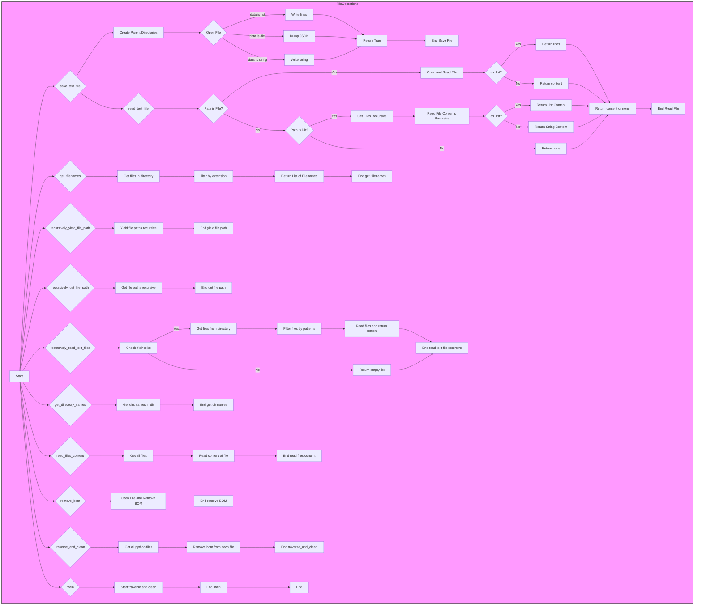

## ИНСТРУКЦИЯ:

Анализируй предоставленный код подробно и объясни его функциональность. Ответ должен включать три раздела:

1. **<алгоритм>**: Опиши рабочий процесс в виде пошаговой блок-схемы, включая примеры для каждого логического блока, и проиллюстрируй поток данных между функциями, классами или методами.
2. **<mermaid>**: Напиши код для диаграммы в формате `mermaid`, проанализируй и объясни все зависимости,
    которые импортируются при создании диаграммы.
    **ВАЖНО!** Убедитесь, что все имена переменных, используемые в диаграмме `mermaid`,
    имеют осмысленные и описательные имена. Имена переменных вроде `A`, `B`, `C`, и т.д., не допускаются!

    **Дополнительно**: Если в коде есть импорт `import header`, добавьте блок `mermaid` flowchart, объясняющий `header.py`
    ```mermaid
    flowchart TD
        Start --> Header[<code>header.py</code><br> Determine Project Root]

        Header --> import[Import Global Settings: <br><code>from src import gs</code>]
    ```

3. **<объяснение>**: Предоставьте подробные объяснения:
   - **Импорты**: Их назначение и взаимосвязь с другими пакетами `src.`.
   - **Классы**: Их роль, атрибуты, методы и взаимодействие с другими компонентами проекта.
   - **Функции**: Их аргументы, возвращаемые значения, назначение и примеры.
   - **Переменные**: Их типы и использование.
   - Выделите потенциальные ошибки или области для улучшения.

Дополнительно, постройте цепочку взаимосвязей с другими частями проекта (если применимо).

Это обеспечивает всесторонний и структурированный анализ кода.
## Формат ответа: `.md` (markdown)
**КОНЕЦ ИНСТРУКЦИИ**

## <алгоритм>

**Общая схема работы:**

1. **`save_text_file`**:
   - Принимает данные (строка, список строк или словарь), путь к файлу и режим записи.
   - Создает родительские директории, если их нет.
   - Открывает файл в указанном режиме.
   - Записывает данные:
     - Если список строк, записывает каждую строку с новой строки.
     - Если словарь, записывает в формате JSON.
     - Если строка, просто записывает строку.
   - Возвращает `True` при успехе, `False` при ошибке, логируя ошибку.
   - **Пример:** `save_text_file("Привет", "output.txt")` запишет строку "Привет" в файл output.txt.

2. **`read_text_file`**:
   - Принимает путь к файлу/директории, флаг возврата списка строк и расширения файлов для директорий.
   - Если путь - файл:
     - Открывает и возвращает содержимое файла (либо как одну строку, либо как список строк).
   - Если путь - директория:
     - Рекурсивно собирает пути ко всем файлам (с учетом расширений)
     - Читает содержимое каждого файла.
     - Возвращает объединенное содержимое (либо список, либо строку через `\n`).
   - Если путь не файл и не директория, возвращает `None` и логирует предупреждение.
   - Возвращает содержимое файла или None.
   - **Пример:** `read_text_file("input.txt")` вернет содержимое input.txt как строку. `read_text_file("docs", as_list=True, extensions=['.txt'])` вернет список строк из всех .txt файлов в директории docs.

3. **`get_filenames`**:
   - Принимает путь к директории и список расширений (или `*` для всех).
   - Возвращает список имен файлов в этой директории с учетом фильтрации по расширениям.
   - Возвращает пустой список в случае ошибки, логируя предупреждение.
   - **Пример:** `get_filenames("docs", [".txt", ".md"])` вернет список имен всех .txt и .md файлов в директории docs.

4. **`recursively_yield_file_path`**:
   - Принимает путь к корневой директории и шаблон(ы) поиска файлов.
   - Рекурсивно обходит директорию, возвращая генератор всех подходящих путей к файлам.
   - **Пример:**
     ```python
     for file_path in recursively_yield_file_path("my_dir", "*.txt"):
         print(file_path)
     ```

5. **`recursively_get_file_path`**:
   - Принимает путь к корневой директории и шаблон(ы) поиска файлов.
   - Рекурсивно обходит директорию, возвращая список путей ко всем подходящим файлам.
   - **Пример:** `file_paths = recursively_get_file_path("my_dir", ["*.txt", "*.md"])` вернет список всех путей к .txt и .md файлам.

6. **`recursively_read_text_files`**:
   - Принимает путь к корневой директории, шаблон(ы) поиска файлов и флаг `as_list`.
   - Использует `os.walk` для обхода директории.
   - Использует `fnmatch.fnmatch` для фильтрации файлов.
   - Читает содержимое каждого файла и возвращает список содержимого (или список строк)
   - **Пример:** `recursively_read_text_files("docs", ["*.txt", "*.log"], as_list=True)` вернет список строк из всех .txt и .log файлов в docs.

7. **`get_directory_names`**:
    - Принимает путь к директории.
    - Возвращает список имен всех директорий в этой директории.
    - **Пример:** `get_directory_names(".")` вернет список имен всех поддиректорий в текущей директории.

8. **`read_files_content`**:
   - Принимает путь к корневой директории, шаблон(ы) поиска файлов и флаг `as_list`.
   - Использует `recursively_get_files` для получения путей к файлам.
   - Использует `read_text_file` для чтения каждого файла.
   - Возвращает список содержимого всех файлов (или список строк).
   - **Пример:** `read_files_content("data", ["*.csv"], as_list=True)` вернет список строк из всех .csv файлов.

9. **`remove_bom`**:
    - Принимает путь к файлу.
    - Удаляет BOM (Byte Order Mark) из файла.
    - **Пример:** `remove_bom("file_with_bom.txt")` удалит BOM из файла file_with_bom.txt.

10. **`traverse_and_clean`**:
    - Принимает путь к директории.
    - Рекурсивно находит все Python-файлы и удаляет из них BOM.
    - **Пример:** `traverse_and_clean("my_project_root")` удалит BOM из всех .py файлов в директории my_project_root.

11. **`main`**:
    - Точка входа, задает корневую директорию (src) и вызывает `traverse_and_clean` для удаления BOM.
   - **Пример:** При запуске этого файла, будет запущен процесс `traverse_and_clean` для директории "src" находящейся уровнем выше от текущей директории.

**Поток данных:**
- Данные передаются между функциями через аргументы и возвращаемые значения.
- Функции чтения файлов (`read_text_file`, `recursively_read_text_files`, `read_files_content`) возвращают строки или списки строк, которые могут быть использованы другими функциями, например, для сохранения в файл (`save_text_file`).
- Функции получения путей к файлам (`recursively_yield_file_path`, `recursively_get_file_path`) используются другими функциями для поиска файлов (`read_files_content`).
- `main` вызывает `traverse_and_clean` для удаления BOM из Python-файлов.

## <mermaid>



### Анализ диаграммы `mermaid`:

- **`FileOperations`**: Общий подграф, который описывает все операции с файлами.
- **`save_text_file`**: Функция сохранения текстового файла.
    - **`Create Parent Directories`**: Создание родительских директорий, если они не существуют.
    - **`Open File`**: Открытие файла в режиме записи.
    - В зависимости от типа данных, производится запись данных в файл.
    - Завершается возвратом `True`.
- **`read_text_file`**: Функция чтения текстового файла.
  - Проверяет, является ли путь файлом или директорией.
  - Читает файл или рекурсивно обходит директории.
  - Возвращает содержимое файла как строку или список строк.
- **`get_filenames`**: Функция получения списка имен файлов в директории, фильтруя по расширению.
- **`recursively_yield_file_path`**: Функция рекурсивного обхода директории и возврата генератора путей к файлам.
- **`recursively_get_file_path`**: Функция рекурсивного обхода директории и возврата списка путей к файлам.
- **`recursively_read_text_files`**: Функция рекурсивного чтения текстовых файлов, фильтруя по шаблону.
-  **`get_directory_names`**: Функция получения списка имен директорий.
-   **`read_files_content`**: Функция чтения содержимого файлов, соответствующих шаблону.
-  **`remove_bom`**: Функция удаления BOM из файла.
-  **`traverse_and_clean`**: Функция обхода и очистки Python-файлов от BOM.
-  **`main`**: Точка входа, запускающая очистку BOM в Python-файлах в директории src.
-   **`Start`**, **`End ...`**, **`Z`**: Отмечают начало и конец каждого блока.

## <объяснение>

### Импорты:
- `os`:  предоставляет функции для работы с операционной системой (например, `os.walk`).
- `json`: используется для работы с JSON (например, для сохранения словарей в файлы).
- `fnmatch`: для фильтрации имен файлов по шаблону (например, `*.txt`).
- `pathlib.Path`: предоставляет объектно-ориентированный способ работы с путями к файлам и директориям, что делает код более читаемым и кроссплатформенным.
- `typing.List`, `typing.Optional`, `typing.Union`, `typing.Generator`: используются для аннотации типов, что повышает читаемость кода и позволяет проверять типы при разработке.
- `src.logger.logger`: импортирует модуль логирования из пакета `src`, обеспечивая централизованное управление логированием.
    -   Используется для вывода отладочных сообщений, предупреждений и ошибок.

### Классы:

- В данном коде нет классов. Используется объект `Path` из `pathlib` для работы с путями к файлам и директориям.

### Функции:

-   **`save_text_file`**: Сохраняет данные в текстовый файл.
    -   **Аргументы**:
        -   `data`: Данные для записи (строка, список строк или словарь).
        -   `file_path`: Путь к файлу.
        -   `mode`: Режим записи (по умолчанию 'w').
        -   `exc_info`: Флаг для логирования ошибок с трассировкой.
    -   **Возвращает**: `True` при успехе, `False` при ошибке.
    -   **Назначение**: Записывает данные в файл, обрабатывая различные типы данных.
-   **`read_text_file`**: Читает содержимое файла.
    -   **Аргументы**:
        -   `file_path`: Путь к файлу или директории.
        -   `as_list`: Флаг для возврата содержимого как списка строк.
        -   `extensions`: Список расширений для фильтрации (для директорий).
        -   `exc_info`: Флаг для логирования ошибок с трассировкой.
    -   **Возвращает**: Содержимое файла (строка или список строк) или `None` при ошибке.
    -   **Назначение**: Читает содержимое файла или файлов в директории, возвращая строку или список строк.
- **`get_filenames`**: Получает список имен файлов в директории.
    -   **Аргументы**:
        -   `directory`: Путь к директории.
        -   `extensions`: Расширения для фильтрации.
        -   `exc_info`: Флаг для логирования ошибок с трассировкой.
    -   **Возвращает**: Список имен файлов.
    -   **Назначение**: Получает список файлов в директории с фильтрацией по расширению.
-   **`recursively_yield_file_path`**: Рекурсивно генерирует пути к файлам, которые подходят по шаблону.
    -   **Аргументы**:
        -   `root_dir`: Корневая директория.
        -   `patterns`: Шаблон или список шаблонов.
        -   `exc_info`: Флаг для логирования ошибок с трассировкой.
    -   **Возвращает**: Генератор объектов `Path`.
    -   **Назначение**: Обеспечивает ленивый (экономит память) обход файловой системы и выдачу путей к файлам.
-   **`recursively_get_file_path`**: Рекурсивно получает пути к файлам, которые подходят по шаблону.
    -   **Аргументы**:
        -   `root_dir`: Корневая директория.
        -   `patterns`: Шаблон или список шаблонов.
        -   `exc_info`: Флаг для логирования ошибок с трассировкой.
    -   **Возвращает**: Список объектов `Path`.
    -   **Назначение**: Обеспечивает обход файловой системы и возвращает список путей к файлам.
-   **`recursively_read_text_files`**: Рекурсивно читает текстовые файлы из указанной директории, которые подходят по шаблону.
    -   **Аргументы**:
        -   `root_dir`: Корневая директория.
        -   `patterns`: Шаблон или список шаблонов.
        -   `as_list`: Флаг для возврата содержимого как списка строк.
        -   `exc_info`: Флаг для логирования ошибок с трассировкой.
    -   **Возвращает**: Список содержимого файлов (строк или списков строк).
    -   **Назначение**: Читает содержимое нескольких файлов, подходящих по шаблону.
-   **`get_directory_names`**:  Получает список имен директорий в указанной директории.
    -   **Аргументы**:
        -   `directory`: Путь к директории.
        -   `exc_info`: Флаг для логирования ошибок с трассировкой.
    -   **Возвращает**: Список имен директорий.
    -   **Назначение**: Возвращает список имен директорий, находящихся в указанной директории.
- **`read_files_content`**: Читает содержимое файлов, соответствующие шаблону.
    -   **Аргументы**:
        -   `root_dir`: Корневая директория.
        -   `patterns`: Шаблон или список шаблонов.
        -   `as_list`: Флаг для возврата содержимого как списка строк.
         -   `exc_info`: Флаг для логирования ошибок с трассировкой.
    -   **Возвращает**: Список содержимого файлов (строк или списков строк).
    -  **Назначение**:  Читает содержимое файлов из директории, соответствующих шаблону.
-   **`remove_bom`**: Удаляет BOM из файла.
    -   **Аргументы**:
        -   `file_path`: Путь к файлу.
    -   **Возвращает**: `None`.
    -   **Назначение**: Удаляет BOM из файла для предотвращения проблем с кодировкой.
-   **`traverse_and_clean`**: Рекурсивно обходит директорию и удаляет BOM из Python файлов.
    -   **Аргументы**:
        -   `directory`: Путь к директории.
    -   **Возвращает**: `None`.
    -   **Назначение**: Рекурсивно обходит директорию и удаляет BOM из Python файлов.
-  **`main`**: Главная функция, запускает удаление BOM из Python файлов.
    -   **Аргументы**: Нет.
    -   **Возвращает**: `None`.
    -   **Назначение**: Точка входа для выполнения операции удаления BOM из файлов.

### Переменные:
-   `MODE`: Глобальная константа, определяющая режим работы ('dev').

### Потенциальные ошибки и области для улучшения:
-   **Обработка ошибок**: Код уже включает обработку исключений и логирование, но может быть улучшена обработка специфических ошибок (например, `FileNotFoundError`, `PermissionError`).
-   **Дублирование логики**: Функции `recursively_yield_file_path` и `recursively_get_file_path` выполняют похожую работу. Можно рассмотреть возможность их объединения в одну, более универсальную функцию.
-   **Кодировка**: Код использует `utf-8` для открытия файлов.  Если есть необходимость обрабатывать файлы с другими кодировками, то нужно предусмотреть механизм их определения.
-   **`recursively_read_text_files`**: Использует `os.walk`, что может быть медленнее, чем `Path.rglob` при большом количестве файлов. Однако `os.walk` позволяет более гибко фильтровать файлы по условию. Выбор способа обхода зависит от потребностей и контекста.
-  **`read_files_content`**:  Может быть оптимизирована путем использования yield вместо расширения списка, если требуется чтение большого количества файлов.

### Взаимосвязи с другими частями проекта:

-   Этот модуль `file.py` является частью пакета `src.utils`, который предоставляет утилиты для работы с файлами.
-   Он использует `src.logger.logger` для логирования ошибок и предупреждений, что интегрирует его в общую систему логирования проекта.
-   Функция `main` предназначена для запуска из командной строки или как часть другого скрипта для удаления BOM из Python файлов.

В целом, код предоставляет набор полезных утилит для работы с файлами и директориями, которые могут быть использованы в различных частях проекта.