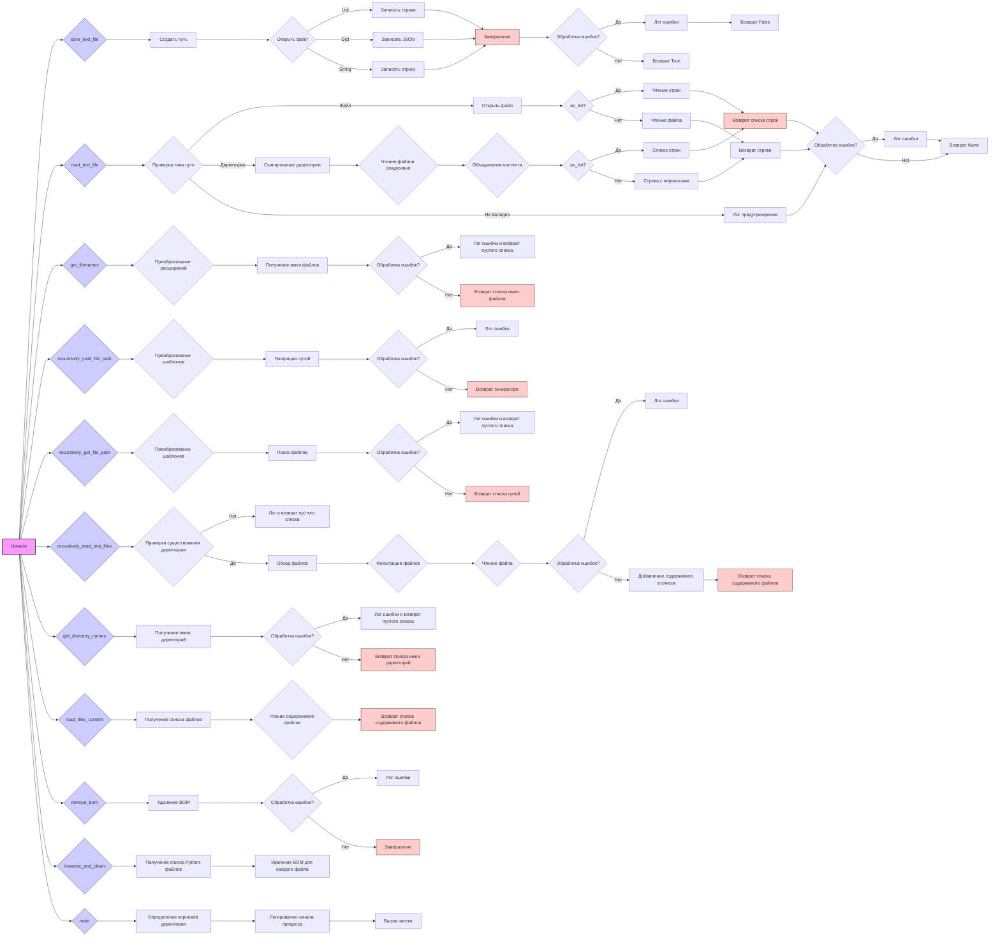

## <алгоритм>

**1. `save_text_file(data, file_path, mode='w', exc_info=True)`**
   - **Начало:** Функция принимает данные (`data`: строка, список строк или словарь), путь к файлу (`file_path`), режим записи (`mode`: 'w' или 'a', по умолчанию 'w') и флаг логирования ошибок (`exc_info`).
   - **Создание пути:** Преобразует `file_path` в объект `Path` и создает родительские директории, если они не существуют.
     - *Пример:* Если `file_path` - `"output/test.txt"` и папки `"output"` нет, она будет создана.
   - **Запись в файл:** Открывает файл по указанному пути в заданном режиме.
     - Если `data` - список, то записывает каждую строку в файл, добавляя символ новой строки.
       - *Пример:* `data` = `["line1", "line2"]`  ->  Файл: `"line1\nline2\n"`
     - Если `data` - словарь, то записывает словарь в формате JSON с отступами и отключенным ASCII-экранированием.
       - *Пример:* `data` = `{"key": "value"}` -> Файл: `{\n    "key": "value"\n}`
     - Если `data` - строка, то записывает строку в файл.
       - *Пример:* `data` = `"test string"` -> Файл: `"test string"`
   - **Обработка ошибок:** Если во время записи файла происходит ошибка, она логируется с помощью `logger.error`.
   - **Возврат значения:** Функция возвращает `True` в случае успешной записи и `False` в случае ошибки.
   - **Конец.**

**2. `read_text_file(file_path, as_list=False, extensions=None, exc_info=True)`**
   - **Начало:** Функция принимает путь к файлу или директории (`file_path`), флаг возвращения в виде списка (`as_list`), список расширений файлов (`extensions`, используется при чтении из директории) и флаг логирования ошибок (`exc_info`).
   - **Проверка типа пути:** Проверяет, является ли `file_path` файлом или директорией.
   - **Чтение файла:** Если `file_path` - файл, открывает файл в режиме чтения и возвращает его содержимое.
     - Если `as_list=True`, то возвращает список строк файла.
       - *Пример:* Файл содержит `"line1\nline2"` -> `["line1\n", "line2"]`
     - Иначе возвращает содержимое файла в виде строки.
       - *Пример:* Файл содержит `"line1\nline2"` -> `"line1\nline2"`
   - **Чтение директории:** Если `file_path` - директория, рекурсивно сканирует ее, читает содержимое всех файлов, соответствующих заданным расширениям.
     -  Формирует список файлов `files` в директории, фильтруя по расширению из аргумента `extensions`.
     -  Рекурсивно вызывает `read_text_file` для каждого файла в директории.
       - *Пример:* Если в директории есть `file1.txt` и `file2.txt`, читает оба файла.
     -  Объединяет содержимое всех файлов.
       -  Если `as_list=True`, то возвращает список всех строк из всех файлов.
       -  Иначе возвращает единую строку, объединяя содержимое файлов через `\n`.
   - **Обработка невалидного пути:** Если `file_path` не является ни файлом, ни директорией, то выводит предупреждение через `logger.warning`.
   - **Обработка ошибок:** Если во время чтения файла происходит ошибка, она логируется с помощью `logger.error`.
   - **Возврат значения:** Возвращает содержимое файла(ов) в виде строки или списка строк или `None` в случае ошибки.
   - **Конец.**

**3. `get_filenames(directory, extensions='*', exc_info=True)`**
   - **Начало:** Принимает директорию `directory` и расширения файлов `extensions` для фильтрации.
   - **Преобразование расширений:** Преобразует `extensions` в список. Если `extensions` - строка `'*'`, то список будет пуст, иначе каждый элемент списка расширений будет дополнен точкой, если ее нет.
     - *Пример:* `extensions` = `'txt'` -> `['.txt']`
     - *Пример:* `extensions` = `['txt', '.md']` -> `['.txt', '.md']`
   - **Получение имен файлов:** Проходит по всем файлам в директории и возвращает список имен файлов, соответствующих заданным расширениям.
   - **Обработка ошибок:** Логирует ошибку при возникновении и возвращает пустой список.
   - **Возврат значения:** Возвращает список имен файлов.
   - **Конец.**

**4. `recursively_yield_file_path(root_dir, patterns='*', exc_info=True)`**
   - **Начало:** Принимает корневую директорию `root_dir` и шаблон поиска `patterns`.
   - **Преобразование шаблонов:** Преобразует шаблон в список, если это строка.
   - **Генератор:** Для каждого шаблона вызывает `rglob` для `root_dir`, который генерирует все пути, соответствующие шаблону.
   - **Обработка ошибок:** Логирует ошибку, если она происходит.
   - **Возврат значения:** Возвращает генератор путей к файлам.
   - **Конец.**

**5. `recursively_get_file_path(root_dir, patterns='*', exc_info=True)`**
   - **Начало:** Принимает корневую директорию `root_dir` и шаблон поиска `patterns`.
   - **Преобразование шаблонов:** Преобразует шаблон в список, если это строка.
   - **Поиск файлов:** Для каждого шаблона вызывает `rglob` для `root_dir`, который находит все пути, соответствующие шаблону, и добавляет их в список `file_paths`.
   - **Обработка ошибок:** Логирует ошибку, если она происходит, и возвращает пустой список.
   - **Возврат значения:** Возвращает список путей к файлам.
   - **Конец.**

**6. `recursively_read_text_files(root_dir, patterns, as_list=False, exc_info=True)`**
  - **Начало**: Принимает корневую директорию `root_dir`, паттерны `patterns`, флаг чтения в список `as_list` и флаг логирования ошибок `exc_info`.
  - **Проверка существования директории**: Проверяет, существует ли корневая директория, если нет, то выводит сообщение в лог и возвращает пустой список.
  - **Итерация по файлам**: Используется `os.walk` для обхода директории и ее поддиректорий.
  - **Фильтрация файлов**: Проверяет, соответствует ли имя файла любому из заданных паттернов, используя `fnmatch.fnmatch`.
  - **Чтение файла**: Если файл соответствует паттерну, пытается открыть и прочитать его. В зависимости от флага `as_list` читает либо весь файл, либо построчно.
  - **Обработка ошибок**: Логирует ошибки при чтении файла, если они возникают.
  - **Возврат значения**: Возвращает список содержимого всех файлов, соответсвующих паттернам.
  - **Конец.**

**7. `get_directory_names(directory, exc_info=True)`**
   - **Начало:** Принимает директорию `directory` и флаг логирования ошибок `exc_info`.
   - **Получение имен директорий:** Проходит по всем элементам в директории и возвращает список имен только директорий.
   - **Обработка ошибок:** Логирует ошибку, если она происходит, и возвращает пустой список.
   - **Возврат значения:** Возвращает список имен директорий.
   - **Конец.**

**8. `read_files_content(root_dir, patterns, as_list=False, exc_info=True)`**
   - **Начало:** Принимает корневую директорию `root_dir`, паттерны `patterns`, флаг чтения в список `as_list` и флаг логирования ошибок `exc_info`.
   - **Получение списка файлов:** Вызывает `recursively_get_files` для получения списка файлов по заданным паттернам.
   - **Чтение содержимого файлов:** Итерирует по списку файлов, вызывая `read_text_file` для каждого файла и добавляет полученное содержимое в список `content`.
   - **Возврат значения:** Возвращает список содержимого всех файлов.
   - **Конец.**

**9. `remove_bom(file_path)`**
   - **Начало:** Принимает путь к файлу `file_path`.
   - **Удаление BOM:** Открывает файл, читает его содержимое, удаляет BOM, переходит в начало файла, записывает новое содержимое и обрезает остаток.
   - **Обработка ошибок:** Логирует ошибку, если она возникает.
   - **Возврат значения:** Нет.
   - **Конец.**

**10. `traverse_and_clean(directory)`**
    - **Начало:** Принимает директорию `directory`.
    - **Получение списка Python-файлов:** Использует `recursively_get_files` для получения списка путей всех файлов `.py` в указанной директории.
    - **Итерация по файлам:** Проходит по списку путей и вызывает `remove_bom` для каждого файла.
    - **Возврат значения:** Нет.
    - **Конец.**

**11. `main()`**
    - **Начало:** Функция `main`.
    - **Определение корневой директории:** Устанавливает корневую директорию `root_dir` на `../src`.
    - **Логирование:**  Логирует начало процесса удаления BOM.
    - **Вызов чистки:** Вызывает функцию `traverse_and_clean` для выполнения процесса чистки.
    - **Возврат значения:** Нет.
    - **Конец.**

## <mermaid>



**Зависимости импорта:**

*   `os`: Модуль `os` импортируется для работы с операционной системой, в частности для функции `os.walk`, используемой для рекурсивного обхода директорий.
*   `json`: Модуль `json` импортируется для сериализации и десериализации данных в формате JSON, в частности для функции `json.dump` при записи словаря в файл.
*   `fnmatch`: Модуль `fnmatch` импортируется для сопоставления имен файлов с шаблонами, используемыми для поиска файлов по маске.
*   `pathlib.Path`: Класс `Path` из модуля `pathlib` импортируется для более удобной работы с путями к файлам и директориям в объектно-ориентированном стиле.
*   `typing.List`, `typing.Optional`, `typing.Union`, `typing.Generator`: Импортируются для аннотации типов данных, улучшающей читаемость и поддержку кода.
*   `src.logger.logger`: Логгер импортируется для записи сообщений об ошибках и предупреждений.

## <объяснение>

**Импорты:**

*   `os`: Используется для взаимодействия с операционной системой, в частности, для обхода директорий (`os.walk`).
*   `json`: Используется для работы с JSON-данными, например, для записи словаря в файл в формате JSON (`json.dump`).
*   `fnmatch`: Используется для сопоставления имен файлов с шаблонами (`fnmatch.fnmatch`).
*   `pathlib.Path`: Предоставляет объектно-ориентированный способ работы с путями к файлам и директориям, упрощая операции вроде создания директорий, проверки наличия файлов и т.д.
*   `typing`: Модуль для статической типизации, используется для аннотации типов функций и переменных, что делает код более читаемым и предсказуемым.
*   `src.logger.logger`: Кастомный модуль логирования, позволяющий централизованно обрабатывать ошибки и предупреждения. Он позволяет отслеживать и регистрировать информацию о работе программы, что полезно для отладки и мониторинга.

**Переменные:**

*   `MODE`: Глобальная переменная, определяющая режим работы (`'dev'`), но в данном коде она не используется.

**Функции:**

*   **`save_text_file(data, file_path, mode='w', exc_info=True) -> bool`**:
    *   **Аргументы:**
        *   `data` (`str | list[str] | dict`): Данные для записи в файл. Может быть строкой, списком строк или словарем.
        *   `file_path` (`Union[str, Path]`): Путь к файлу.
        *   `mode` (`str`, по умолчанию `'w'`): Режим записи (write `'w'` или append `'a'`).
        *   `exc_info` (`bool`, по умолчанию `True`): Флаг, определяющий, включать ли трассировку ошибок в лог.
    *   **Возвращает:** `bool`: `True` в случае успешной записи, `False` в случае ошибки.
    *   **Назначение:** Записывает данные в текстовый файл. Поддерживает запись строк, списков строк и словарей в формате JSON.
    *   **Пример:**
        ```python
        save_text_file("some text", "output.txt")  # Запись строки в файл
        save_text_file(["line1", "line2"], "lines.txt", mode="a")  # Добавление строк в файл
        save_text_file({"key": "value"}, "data.json")  # Запись словаря в JSON файл
        ```
*   **`read_text_file(file_path, as_list=False, extensions=None, exc_info=True) -> Union[str, list[str], None]`**:
    *   **Аргументы:**
        *   `file_path` (`Union[str, Path]`): Путь к файлу или директории.
        *   `as_list` (`bool`, по умолчанию `False`): Если `True`, возвращает содержимое файла в виде списка строк.
        *   `extensions` (`Optional[list[str]]`, по умолчанию `None`): Список расширений файлов для чтения (используется при чтении директории).
        *   `exc_info` (`bool`, по умолчанию `True`): Флаг, определяющий, включать ли трассировку ошибок в лог.
    *   **Возвращает:** `Union[str, list[str], None]`: Содержимое файла в виде строки или списка строк, или `None` при ошибке.
    *   **Назначение:** Читает содержимое файла. Может читать как отдельный файл, так и все файлы с заданным расширением из директории.
    *   **Пример:**
        ```python
        file_content = read_text_file("input.txt")  # Чтение файла как строки
        lines = read_text_file("input.txt", as_list=True)  # Чтение файла как списка строк
        all_lines = read_text_file("input_dir", as_list=True, extensions=[".txt", ".md"]) # Чтение файлов с расширением .txt и .md из директории
        ```
*   **`get_filenames(directory, extensions='*', exc_info=True) -> list[str]`**:
    *   **Аргументы:**
        *   `directory` (`Union[str, Path]`): Путь к директории.
        *   `extensions` (`Union[str, list[str]]`, по умолчанию `'*'`) : Расширения файлов для фильтрации. Может быть как строкой с расширением, так и списком расширений, либо '*' для всех файлов.
        *   `exc_info` (`bool`, по умолчанию `True`): Флаг, определяющий, включать ли трассировку ошибок в лог.
    *   **Возвращает:** `list[str]`: Список имен файлов в директории.
    *   **Назначение:** Возвращает список имен файлов в директории, отфильтрованный по расширениям.
    *   **Пример:**
        ```python
        filenames = get_filenames("test_dir", extensions=".txt") # Получение списка всех txt файлов в директории
        filenames = get_filenames("test_dir", extensions=["txt","md"]) # Получение списка всех txt и md файлов в директории
        ```
*   **`recursively_yield_file_path(root_dir, patterns='*', exc_info=True) -> Generator[Path, None, None]`**:
    *   **Аргументы:**
        *   `root_dir` (`Union[str, Path]`): Корневая директория для поиска.
        *   `patterns` (`Union[str, list[str]]`, по умолчанию `'*'`) : Шаблон или список шаблонов для поиска файлов.
        *  `exc_info` (`bool`, по умолчанию `True`): Флаг, определяющий, включать ли трассировку ошибок в лог.
    *   **Возвращает:** `Generator[Path, None, None]`: Генератор путей к файлам.
    *   **Назначение:** Рекурсивно обходит директорию и возвращает генератор путей к файлам, соответствующим заданным шаблонам.
    *   **Пример:**
        ```python
        for file_path in recursively_yield_file_path("test_dir", patterns="*.txt"):
        print(file_path)
        ```
*   **`recursively_get_file_path(root_dir, patterns='*', exc_info=True) -> list[Path]`**:
    *   **Аргументы:**
        *   `root_dir` (`Union[str, Path]`): Корневая директория для поиска.
        *   `patterns` (`Union[str, list[str]]`, по умолчанию `'*'`) : Шаблон или список шаблонов для поиска файлов.
        *  `exc_info` (`bool`, по умолчанию `True`): Флаг, определяющий, включать ли трассировку ошибок в лог.
    *   **Возвращает:** `list[Path]`: Список путей к файлам.
    *   **Назначение:** Рекурсивно обходит директорию и возвращает список путей к файлам, соответствующим заданным шаблонам.
    *   **Пример:**
        ```python
        files_paths = recursively_get_file_path("test_dir", patterns=["*.txt", "*.md"])
        print(files_paths)
        ```
*   **`recursively_read_text_files(root_dir, patterns, as_list=False, exc_info=True) -> list[str]`**:
    *   **Аргументы:**
        *   `root_dir` (`str | Path`): Корневая директория для поиска.
        *   `patterns` (`str | list[str]`): Шаблон или список шаблонов для поиска файлов.
        *   `as_list` (`bool`, по умолчанию `False`): Если `True`, возвращает содержимое файла в виде списка строк.
        *   `exc_info` (`bool`, по умолчанию `True`): Флаг, определяющий, включать ли трассировку ошибок в лог.
    *   **Возвращает:** `list[str]`: Список содержимого файлов.
    *   **Назначение:** Рекурсивно читает текстовые файлы из заданной директории, соответствующие заданным шаблонам.
    *   **Пример:**
        ```python
        contents = recursively_read_text_files("test_dir", patterns="*.txt")
        print(contents)
        ```
*   **`get_directory_names(directory, exc_info=True) -> list[str]`**:
    *   **Аргументы:**
        *   `directory` (`str | Path`): Путь к директории.
        *   `exc_info` (`bool`, по умолчанию `True`): Флаг, определяющий, включать ли трассировку ошибок в лог.
    *   **Возвращает:** `list[str]`: Список имен директорий.
    *   **Назначение:** Возвращает список имен директорий внутри указанной директории.
    *   **Пример:**
        ```python
        dirs = get_directory_names("test_dir")
        print(dirs)
        ```
*   **`read_files_content(root_dir, patterns, as_list=False, exc_info=True) -> list[str]`**:
    *   **Аргументы:**
        *   `root_dir` (`Union[str, Path]`): Корневая директория для поиска.
        *   `patterns` (`Union[str, list[str]]`): Шаблон или список шаблонов для поиска файлов.
        *   `as_list` (`bool`, по умолчанию `False`): Если `True`, возвращает содержимое файла в виде списка строк.
        *   `exc_info` (`bool`, по умолчанию `True`): Флаг, определяющий, включать ли трассировку ошибок в лог.
    *   **Возвращает:** `list[str]`: Список содержимого файлов.
    *   **Назначение:** Читает содержимое всех файлов, соответствующих шаблонам в указанной директории.
    *   **Пример:**
         ```python
         content = read_files_content("test_dir", "*.txt", as_list=True)
         print(content)
         ```
*   **`remove_bom(file_path)`**:
    *   **Аргументы:**
        *   `file_path` (`Union[str, Path]`): Путь к файлу.
    *   **Возвращает:** `None`.
    *   **Назначение:** Удаляет BOM (Byte Order Mark) из текстового файла.
    *   **Пример:**
        ```python
         remove_bom("test.txt")
        ```
*   **`traverse_and_clean(directory)`**:
    *   **Аргументы:**
        *   `directory` (`Union[str, Path]`): Путь к директории.
    *   **Возвращает:** `None`.
    *   **Назначение:** Обходит все файлы с расширением `.py` в директории и удаляет из них BOM.
    *   **Пример:**
        ```python
        traverse_and_clean("test_dir")
        ```
*   **`main()`**:
    *   **Аргументы:** Нет.
    *   **Возвращает:** `None`.
    *   **Назначение:** Главная функция, выполняющая удаление BOM из Python файлов в директории `../src`.
    *   **Пример:**
        ```python
        main() # Выполняет удаление BOM для всех python файлов в директории '../src'
        ```

**Объяснение:**

Данный модуль `src.utils.file` предоставляет набор функций для работы с файлами и директориями. Функции позволяют выполнять чтение и запись файлов, искать файлы по шаблону, удалять BOM, и обходить директории. Все функции используют `pathlib.Path` для работы с путями, что упрощает обработку файловых операций. Использование логгера `src.logger.logger` позволяет централизованно регистрировать ошибки и предупреждения, что облегчает отладку и поддержку.

**Связь с другими частями проекта:**

*   Модуль `src.utils.file` используется в различных частях проекта, где требуется чтение или запись файлов, поиск файлов и директорий.
*   Импортирует `src.logger.logger` для логирования, что обеспечивает связность с системой логирования проекта.
*   Функция `main` и `traverse_and_clean` предназначены для очистки BOM из Python файлов, что может быть полезно при работе с проектами, использующих различные системы контроля версий.

**Потенциальные ошибки или области для улучшения:**

*   Отсутствие обработки ошибок при создании файла.
*   Отсутствие явного закрытия файла (хотя менеджер контекста `with` это гарантирует, но все же стоит об этом помнить).
*   В функции `read_text_file` при чтении директории может быть оптимизирована логика объединения содержимого файлов.

Этот анализ предоставляет исчерпывающее понимание кода `src/utils/file.py`.