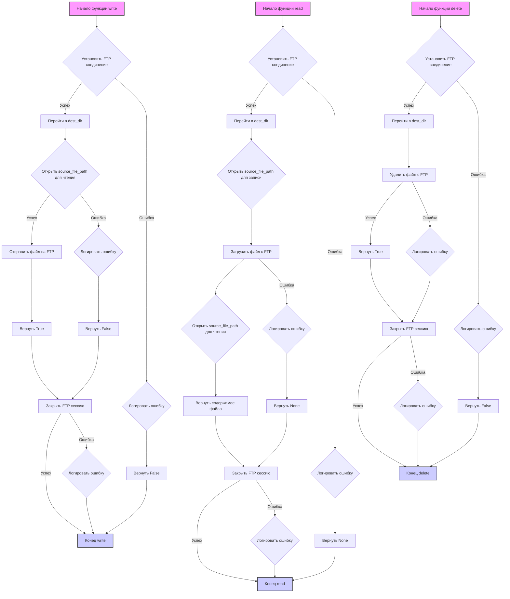

## <алгоритм>

**Функция `write(source_file_path, dest_dir, dest_file_name)`:**

1.  **Начало**: Функция принимает `source_file_path`, `dest_dir` и `dest_file_name` как входные данные.
    *   Пример: `source_file_path = "local/file.txt"`, `dest_dir = "/ftp/dir"`, `dest_file_name = "file.txt"`.
2.  **Установление FTP соединения**:
    *   Пытается установить соединение с FTP-сервером, используя данные из `_connection` (сервер, пользователь, пароль).
    *   Если соединение не удалось, записывает ошибку в лог и возвращает `False`.
    *   Пример: Создается объект `session` класса `ftplib.FTP`.
3.  **Переход в целевую директорию**:
    *   Используется `session.cwd(dest_dir)` для перехода в указанную директорию на FTP-сервере.
4.  **Отправка файла**:
    *   Открывает файл по пути `source_file_path` в режиме чтения бинарных данных (`'rb'`).
    *   Отправляет файл на FTP-сервер, используя `session.storbinary(f'STOR {dest_file_name}', f)`.
    *   Если отправка прошла успешно, возвращает `True`.
    *   Пример: Содержимое файла `local/file.txt` передается в FTP-сервер и сохраняется как `/ftp/dir/file.txt`.
5.  **Обработка ошибок при отправке**:
    *   Если во время отправки файла возникает ошибка, она логируется, и функция возвращает `False`.
6.  **Закрытие соединения**:
    *   В блоке `finally` пытается закрыть соединение с FTP-сервером, используя `session.quit()`.
    *   Если закрытие не удалось, ошибка логируется.
7.  **Конец**: Возвращает `True` при успехе, иначе `False`.

**Функция `read(source_file_path, dest_dir, dest_file_name)`:**

1.  **Начало**: Функция принимает `source_file_path`, `dest_dir` и `dest_file_name` как входные данные.
    *   Пример: `source_file_path = "local/file.txt"`, `dest_dir = "/ftp/dir"`, `dest_file_name = "file.txt"`.
2.  **Установление FTP соединения**:
    *   Пытается установить соединение с FTP-сервером, используя данные из `_connection` (сервер, пользователь, пароль).
    *   Если соединение не удалось, записывает ошибку в лог и возвращает `None`.
    *   Пример: Создается объект `session` класса `ftplib.FTP`.
3.  **Переход в целевую директорию**:
    *   Используется `session.cwd(dest_dir)` для перехода в указанную директорию на FTP-сервере.
4.  **Загрузка файла**:
    *   Открывает файл по пути `source_file_path` в режиме записи бинарных данных (`'wb'`).
    *   Загружает файл с FTP-сервера, используя `session.retrbinary(f'RETR {dest_file_name}', f.write)`.
    *   После загрузки, открывает этот файл в режиме чтения бинарных данных (`'rb'`) и возвращает его содержимое.
    *   Пример: Содержимое файла `/ftp/dir/file.txt` из FTP-сервера загружается в `local/file.txt`.
5.  **Обработка ошибок при загрузке**:
    *   Если во время загрузки файла возникает ошибка, она логируется, и функция возвращает `None`.
6.  **Закрытие соединения**:
    *   В блоке `finally` пытается закрыть соединение с FTP-сервером, используя `session.quit()`.
    *   Если закрытие не удалось, ошибка логируется.
7.  **Конец**: Возвращает содержимое файла (байты) при успехе, иначе `None`.

**Функция `delete(source_file_path, dest_dir, dest_file_name)`:**

1.  **Начало**: Функция принимает `source_file_path`, `dest_dir` и `dest_file_name` как входные данные.
    *   Пример: `source_file_path = "local/file.txt"`, `dest_dir = "/ftp/dir"`, `dest_file_name = "file.txt"`.
2.  **Установление FTP соединения**:
    *   Пытается установить соединение с FTP-сервером, используя данные из `_connection` (сервер, пользователь, пароль).
    *   Если соединение не удалось, записывает ошибку в лог и возвращает `False`.
    *   Пример: Создается объект `session` класса `ftplib.FTP`.
3.  **Переход в целевую директорию**:
    *   Используется `session.cwd(dest_dir)` для перехода в указанную директорию на FTP-сервере.
4.  **Удаление файла**:
    *   Удаляет файл с FTP-сервера, используя `session.delete(dest_file_name)`.
    *   Если удаление прошло успешно, возвращает `True`.
    *   Пример: Файл `/ftp/dir/file.txt` удаляется с FTP-сервера.
5.  **Обработка ошибок при удалении**:
    *   Если во время удаления файла возникает ошибка, она логируется, и функция возвращает `False`.
6.  **Закрытие соединения**:
    *   В блоке `finally` пытается закрыть соединение с FTP-сервером, используя `session.quit()`.
    *   Если закрытие не удалось, ошибка логируется.
7.  **Конец**: Возвращает `True` при успехе, иначе `False`.

## <mermaid>

**Импортированные зависимости для диаграммы `mermaid`:**

*   Нет внешних зависимостей. Диаграмма `mermaid` отражает только логику выполнения функций `write`, `read` и `delete` внутри модуля `ftp.py`.

## <объяснение>

**Импорты:**

*   `from src.logger.logger import logger`: Импортирует объект `logger` из модуля `src.logger.logger`. Используется для логирования ошибок и событий. Позволяет вести журнал работы программы, что помогает в отладке и мониторинге.
*   `from typing import Union`: Импортирует тип `Union` из модуля `typing`. Используется для указания типов данных, которые могут быть возвращены функцией (в случае `read` это `str`, `bytes` или `None`).
*   `import ftplib`: Импортирует модуль `ftplib`, который предоставляет функциональность для работы с FTP-серверами.
*   `from pathlib import Path`: Импортирует класс `Path` из модуля `pathlib`, который используется для работы с путями к файлам и каталогам (хотя в коде напрямую не используется, но присутствует в списке импортов).

**Переменные:**

*   `MODE = 'dev'`: Строковая константа, которая может использоваться для определения режима работы (например, для определения уровня логирования, хотя в данном коде не используется).
*   `_connection`: Словарь, который хранит параметры подключения к FTP-серверу: `server`, `port`, `user`, `password`. Приватная переменная, предназначенная для внутреннего использования в модуле.

**Функции:**

*   **`write(source_file_path: str, dest_dir: str, dest_file_name: str) -> bool`**:
    *   **Аргументы**:
        *   `source_file_path` (str): Путь к файлу, который нужно отправить.
        *   `dest_dir` (str): Путь к каталогу на FTP-сервере, куда нужно сохранить файл.
        *   `dest_file_name` (str): Имя файла на FTP-сервере.
    *   **Возвращает**:
        *   `bool`: `True`, если файл успешно отправлен, иначе `False`.
    *   **Назначение**: Отправляет файл на FTP-сервер. Использует `ftplib` для установления соединения, переключения в нужную директорию и отправки файла.
    *   **Пример**: `write("local_file.txt", "/ftp/images/", "new_image.txt")`.
*   **`read(source_file_path: str, dest_dir: str, dest_file_name: str) -> Union[str, bytes, None]`**:
    *   **Аргументы**:
        *   `source_file_path` (str): Путь к файлу, куда нужно сохранить загруженный файл.
        *   `dest_dir` (str): Путь к каталогу на FTP-сервере, где находится файл.
        *   `dest_file_name` (str): Имя файла на FTP-сервере.
    *   **Возвращает**:
        *   `Union[str, bytes, None]`: Содержимое файла в виде байтов, если загрузка прошла успешно, иначе `None`.
    *   **Назначение**: Загружает файл с FTP-сервера. Использует `ftplib` для установления соединения, переключения в нужную директорию и загрузки файла.
    *   **Пример**: `read("local_file.txt", "/ftp/images/", "image.txt")`.
*   **`delete(source_file_path: str, dest_dir: str, dest_file_name: str) -> bool`**:
    *   **Аргументы**:
        *   `source_file_path` (str): Путь к файлу, который нужно удалить (не используется).
        *   `dest_dir` (str): Путь к каталогу на FTP-сервере, где находится файл.
        *   `dest_file_name` (str): Имя файла на FTP-сервере.
    *   **Возвращает**:
        *   `bool`: `True`, если файл успешно удален, иначе `False`.
    *   **Назначение**: Удаляет файл с FTP-сервера. Использует `ftplib` для установления соединения, переключения в нужную директорию и удаления файла.
    *   **Пример**: `delete("local_file.txt", "/ftp/images/", "image.txt")`.

**Потенциальные ошибки и области для улучшения:**

*   **Обработка ошибок**: Код обрабатывает общие исключения `Exception`, что затрудняет точное определение ошибок. Лучше использовать более специфические исключения (например, `ftplib.all_errors` или конкретные исключения `ftplib`).
*   **Конфигурация FTP**: Конфигурация FTP-соединения хранится в словаре `_connection`. Желательно вынести эти данные в конфигурационный файл или переменные окружения, чтобы не хранить их в коде напрямую.
*   **Логирование**: В коде есть логирование ошибок, но его можно улучшить, добавив больше контекста (например, время, имя функции).
*   **Безопасность**: Пароль хранится в открытом виде в `_connection`. Рекомендуется использовать более безопасные способы хранения учетных данных (например, переменные окружения или менеджеры секретов).
*   **Использование `pathlib`**: Несмотря на импорт `pathlib`, он не используется в коде. Это можно исправить, переписав пути к файлам как `Path` объекты для большей переносимости и читаемости.
*   **Передача файла**: При отправке и получении файлов используется открытие файла в режиме бинарного чтения/записи. Можно добавить возможность передавать файл "кусками", для работы с очень большими файлами.

**Цепочка взаимосвязей с другими частями проекта:**

*   Этот модуль `ftp.py` зависит от модуля `src.logger.logger`, для записи логов.
*   Модуль `ftp.py` может использоваться в других частях проекта для отправки или получения файлов. Например, в модулях обработки данных или автоматизации процессов.
*   Параметры подключения к FTP серверу хранятся в `_connection`, что делает необходимым наличие внешнего механизма для хранения параметров, т.е. предполагается, что они будут заданы где-то еще.
*  Использование `typing` намекает на то, что используется статическая проверка типов.

Этот анализ дает полную картину функциональности, зависимостей и возможных улучшений в коде.