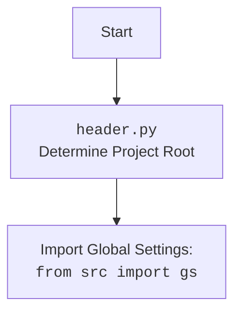

## ИНСТРУКЦИЯ:

Анализируй предоставленный код подробно и объясни его функциональность. Ответ должен включать три раздела:  

1. **<алгоритм>**: Опиши рабочий процесс в виде пошаговой блок-схемы, включая примеры для каждого логического блока, и проиллюстрируй поток данных между функциями, классами или методами.  
2. **<mermaid>**: Напиши код для диаграммы в формате `mermaid`, проанализируй и объясни все зависимости, 
    которые импортируются при создании диаграммы. 
    **ВАЖНО!** Убедитесь, что все имена переменных, используемые в диаграмме `mermaid`, 
    имеют осмысленные и описательные имена. Имена переменных вроде `A`, `B`, `C`, и т.д., не допускаются!  
    
    **Дополнительно**: Если в коде есть импорт `import header`, добавьте блок `mermaid` flowchart, объясняющий `header.py`:\
    ```mermaid
    flowchart TD
        Start --> Header[<code>header.py</code><br> Determine Project Root]
    
        Header --> import[Import Global Settings: <br><code>from src import gs</code>] 
    ```

3. **<объяснение>**: Предоставьте подробные объяснения:  
   - **Импорты**: Их назначение и взаимосвязь с другими пакетами `src.`.  
   - **Классы**: Их роль, атрибуты, методы и взаимодействие с другими компонентами проекта.  
   - **Функции**: Их аргументы, возвращаемые значения, назначение и примеры.  
   - **Переменные**: Их типы и использование.  
   - Выделите потенциальные ошибки или области для улучшения.  

Дополнительно, постройте цепочку взаимосвязей с другими частями проекта (если применимо).  

Это обеспечивает всесторонний и структурированный анализ кода.
## Формат ответа: `.md` (markdown)
**КОНЕЦ ИНСТРУКЦИИ**

## <алгоритм>

### Функция `get_free_port`
1.  **Начало**: Функция `get_free_port` принимает хост (`host`) и необязательный диапазон портов (`port_range`).
2.  **Проверка `port_range`**:
    *   **Если `port_range` не задан (`None`)**:
        *   Установить начальный порт `port = 1024`.
        *   Цикл:
            *   Вызвать функцию `_is_port_in_use` для текущего порта.
            *   Если порт свободен: вернуть `port`.
            *   Увеличить `port` на 1.
            *   Если `port` > 65535, то вызывается исключение ValueError.
            *   Пример: `get_free_port('localhost')`, находит первый свободный порт начиная с 1024.
    *   **Если `port_range` задан**:
        *   **Если `port_range` является строкой**:
            *   Вызвать функцию `_parse_port_range` для разбора диапазона.
                *   Пример: `port_range = "3000-3005"`
            *   Цикл по диапазону портов от `min_port` до `max_port`:
                *   Вызвать функцию `_is_port_in_use` для текущего порта.
                *   Если порт свободен: вернуть `port`.
            *   Если ни один порт не найден в диапазоне - исключение `ValueError`.
        *   **Если `port_range` является списком**:
            *   Цикл по элементам списка (`item`):
                *   **Если `item` является строкой**:
                    *   Вызвать функцию `_parse_port_range` для разбора диапазона.
                        *   Пример: `item = "3000-3005"`
                    *   Цикл по диапазону портов от `min_port` до `max_port`:
                        *   Вызвать функцию `_is_port_in_use` для текущего порта.
                        *   Если порт свободен: вернуть `port`.
                *   **Если `item` не строка**:
                    *   Вызвать исключение `ValueError`.
            *   Если ни один порт не найден в любом диапазоне - исключение `ValueError`.
        *   **Если `port_range` не является ни строкой, ни списком**:
            *   Вызвать исключение `ValueError`.
3.  **Конец**: Вернуть свободный порт или выбросить исключение `ValueError`.

### Функция `_is_port_in_use`
1.  **Начало**: Функция `_is_port_in_use` принимает хост (`host`) и порт (`port`).
2.  Создать сокет (`socket.socket`) для проверки.
3.  Попытаться привязать сокет к хосту и порту (`sock.bind`).
    *   **Если успешно**: вернуть `False` (порт свободен).
    *   **Если ошибка `OSError`**: вернуть `True` (порт занят).
4.  **Конец**: Возвращает `True` если порт занят, иначе `False`.

### Функция `_parse_port_range`
1. **Начало**: Функция `_parse_port_range` принимает строку с диапазоном портов `port_range_str`.
2. **Разделить строку**: `port_range_str` разделяется по символу `-` на две части.
3. **Проверка количества частей**: Если количество частей не равно 2, то генерируется исключение `ValueError`.
4. **Преобразование в `int`**: Обе части преобразуются в целые числа `min_port` и `max_port`.
5. **Проверка диапазона**: Если `min_port` >= `max_port`, то генерируется исключение `ValueError`.
6. **Конец**: Возвращает кортеж `(min_port, max_port)`.

## <mermaid>
```mermaid
flowchart TD
    Start(Start) --> CheckPortRange{port_range is defined?}
    
    CheckPortRange -- No --> FindFirstAvailablePort[Find first available port starting from 1024]
    FindFirstAvailablePort --> LoopCheckPort[Loop until free port found or max port reached]

    LoopCheckPort --> IsPortInUse{Is port in use?}
    IsPortInUse -- Yes --> IncrementPort[port = port + 1]
    IncrementPort --> CheckMaxPort[port > 65535?]
    CheckMaxPort -- No --> LoopCheckPort
    CheckMaxPort -- Yes --> RaiseValueErrorNoFreePort[Raise ValueError: No free port found]

    IsPortInUse -- No --> ReturnPort[Return Port]


    CheckPortRange -- Yes --> CheckPortRangeType{Type of port_range?}

    CheckPortRangeType -- String --> ParsePortRangeString[Parse string port range]
     ParsePortRangeString --> LoopPortRangeString[Loop over ports in range]
        LoopPortRangeString --> IsPortInUseString{Is port in use?}
        IsPortInUseString -- Yes --> NextPortRangeString[Next port]
        NextPortRangeString --> LoopPortRangeString
    	IsPortInUseString -- No --> ReturnPortString[Return Port]
     
     LoopPortRangeString --> NoPortFoundRangeString{No port in range}
    NoPortFoundRangeString --> RaiseValueErrorNoFreePortRange[Raise ValueError: No free port in range]

    CheckPortRangeType -- List --> LoopPortRangeList[Loop over items in list]
    	LoopPortRangeList --> CheckItemType{Type of item in list?}
    	CheckItemType -- StringItem --> ParsePortRangeListItem[Parse string item port range]
    	 ParsePortRangeListItem --> LoopPortRangeListItem[Loop over ports in range]
        LoopPortRangeListItem --> IsPortInUseListItem{Is port in use?}
        IsPortInUseListItem -- Yes --> NextPortRangeListItem[Next port]
        NextPortRangeListItem --> LoopPortRangeListItem
    	IsPortInUseListItem -- No --> ReturnPortList[Return Port]
        LoopPortRangeListItem --> NoPortFoundRangeListItem{No port in range}
       NoPortFoundRangeListItem -->  LoopPortRangeList
     	
    CheckItemType -- NotStringItem --> RaiseValueErrorInvalidPortRangeItemType[Raise ValueError: invalid port range item]

    
    LoopPortRangeList --> NoPortFoundList{No port found in list}
    NoPortFoundList --> RaiseValueErrorNoFreePortList[Raise ValueError: No free port in list]

    CheckPortRangeType -- OtherType --> RaiseValueErrorInvalidPortRangeType[Raise ValueError: Invalid port range type]
  

    
   
    
    
     subgraph Function _is_port_in_use
      	IsPortInUse1(Start)-->CreateSocket[Create socket]
      	CreateSocket-->TryBind[Try to bind socket to (host, port)]
       	TryBind-->|Success| ReturnFalse[Return False]
    	TryBind-->|OSError| ReturnTrue[Return True]

  end

  subgraph Function _parse_port_range
  	  StartParse(Start) --> SplitString[Split string by '-']
	  SplitString --> CheckParts[Check if there are 2 parts]
	   CheckParts --> |No| RaiseValueErrorInvalidPortRangeString[Raise ValueError: Invalid port range string]
	   CheckParts --> |Yes| ConvertToInt[Convert parts to integers]
	   ConvertToInt --> CheckMinMaxPorts[Check min_port >= max_port]
	   CheckMinMaxPorts --> |Yes| RaiseValueErrorInvalidPortRange[Raise ValueError: Invalid port range]
	   CheckMinMaxPorts --> |No| ReturnMinMaxPorts[Return (min_port, max_port)]
   end
    
```

### `header.py` Mermaid Diagram



## <объяснение>

### Импорты:

*   **`socket`**: Этот модуль используется для работы с сетевыми сокетами. В данном коде, он используется для создания сокета и попытки привязки его к указанному хосту и порту, чтобы определить, занят ли этот порт.
*   **`typing.Optional, typing.Tuple, typing.List`**: Используются для аннотации типов, делая код более читаемым и понятным. 
    *   `Optional` указывает, что переменная может быть либо определенного типа, либо `None`.
    *   `Tuple` задает кортеж фиксированной длины с определенными типами.
    *   `List` указывает, что переменная является списком.
*  **`header`**:  Импортируется, но не используется в коде.  Этот модуль  определяет корневой путь проекта и импортирует глобальные настройки.
*   **`src.logger.logger`**:  Используется для логирования ошибок и другой информации.  Предполагается, что в пакете `src` есть модуль `logger.py`, который предоставляет объект `logger` для логирования.

### Функции:

*   **`get_free_port(host: str, port_range: Optional[str | List[str]] = None) -> int`**:
    *   **Аргументы**:
        *   `host`: Строка, представляющая хост (например, `'localhost'`).
        *   `port_range`: Необязательный аргумент, который может быть строкой в формате "min-max" (например, `'3000-3005'`), списком строк таких форматов или `None`.
    *   **Возвращаемое значение**: Целое число, представляющее свободный порт.
    *   **Назначение**: Находит и возвращает свободный порт. Сначала проверяет наличие заданного диапазона портов. Если диапазон не задан, то ищет первый свободный порт, начиная с 1024. Примеры вызова:
        ```python
        get_free_port('localhost', '3000-3005') # Ищет порт в диапазоне 3000-3005
        get_free_port('localhost', ['3000-3005', '8000-8005']) # Ищет в двух диапазонах
        get_free_port('localhost') # Ищет первый свободный начиная с 1024
        ```
    *   **Внутренние функции:** использует функции `_is_port_in_use` и `_parse_port_range`.
    *   **Примеры вызова:** 
        ```python
         get_free_port(host, '3000-3005')
         get_free_port(host, ['3000-3005', '8000-8005'])
         get_free_port(host)
        ```
*   **`_is_port_in_use(host: str, port: int) -> bool`**:
    *   **Аргументы**:
        *   `host`: Строка, представляющая хост.
        *   `port`: Целое число, представляющее порт.
    *   **Возвращаемое значение**: Булево значение: `True`, если порт занят, `False` в противном случае.
    *   **Назначение**: Проверяет, занят ли данный порт на указанном хосте. Функция создает сокет, пробует его привязать к порту, если привязка успешна порт считается свободным, иначе порт считается занятым.
*   **`_parse_port_range(port_range_str: str) -> Tuple[int, int]`**:
    *   **Аргументы**:
        *   `port_range_str`: Строка, представляющая диапазон портов в формате "min-max".
    *   **Возвращаемое значение**: Кортеж из двух целых чисел: минимальный и максимальный порт.
    *   **Назначение**: Разбирает строку диапазона портов и возвращает кортеж `(min_port, max_port)`. Если строка имеет неверный формат или  `min_port` >= `max_port`, то вызывает исключение `ValueError`.
        *  Пример: `_parse_port_range("3000-3005")` вернет `(3000, 3005)`.

### Переменные:

*   **`host`**: Строка, представляющая хост (например, `'localhost'`).
*   **`port_range`**: Строка или список строк (например, `'3000-3005'` или `['3000-3005', '8000-8005']`), или `None`.
*   **`port`**: Целое число, представляющее номер порта.
*   **`min_port`, `max_port`**: Целые числа, представляющие минимальный и максимальный порт в диапазоне.
*   **`parts`**: Список строк, полученных при разбиении строки `port_range_str`.
*   **`item`**: Элемент из списка диапазонов портов.

### Потенциальные ошибки и области для улучшения:

1.  **Обработка ошибок**:
    *   Код обрабатывает `ValueError` при неверном формате диапазона портов. Можно добавить более специфичные исключения, например,  `InvalidPortRangeFormat`  для неправильного формата строки и `InvalidPortRange` для неверного диапазона.
    *   В случае, если не найден свободный порт, то `ValueError` генерируется без уточнения - можно добавить уточняющее сообщение и исключение `NoFreePortFound`.
    *   Стоит обрабатывать исключения `socket.error`.
2.  **Производительность**:
    *   В случае отсутствия диапазона портов, код ищет первый свободный порт с 1024. Можно добавить дополнительные проверки или возможность задать стартовую точку поиска.
3.  **Логирование**:
    *   Используется  `logger.error`, для сообщения об ошибках, но можно добавить  `logger.debug`  для информации о процессе поиска портов.
4.  **Проверка `host`**:
    *   Код не проверяет корректность `host`, стоит добавить проверку IP-адреса или hostname.
5.  **`header` import**:
    *   Импорт `header`  не используется в коде - стоит удалить.

### Взаимосвязь с другими частями проекта:

*   **`src.logger`**: Модуль `get_free_port` использует `logger` из `src.logger` для логирования ошибок. Это означает, что в проекте существует общая система логирования, которую могут использовать разные модули.
*   **`header.py`**: Модуль импортируется, но не используется. Обычно, `header.py` определяет корневой путь проекта и импортирует глобальные настройки.

**Пример цепочки взаимосвязей:**

1.  `get_free_port.py` импортирует `logger` из `src.logger`, чтобы логировать ошибки.
2.  `src.logger` - это общий модуль, который используется в разных частях проекта.
3.  `header.py`  может предоставлять общие настройки для других модулей в проекте, но в данном случае, не используется.