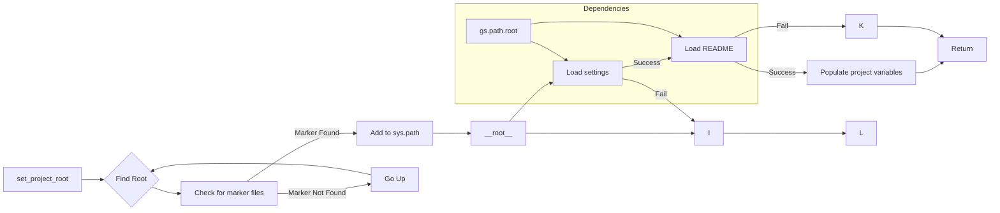

# <input code>

```python
## \file hypotez/src/logger/header.py
# -*- coding: utf-8 -*-\n#! venv/Scripts/python.exe
#! venv/bin/python/python3.12

"""
.. module: src.logger 
	:platform: Windows, Unix
	:synopsis:

"""
MODE = 'dev'

"""
	:platform: Windows, Unix
	:synopsis: Модуль определяющий корневой путь к проекту. Все импорты строятся относительно этого пути.
    :TODO: В дальнейшем перенести в системную переменную"""

import sys
import json
from packaging.version import Version

from pathlib import Path
def set_project_root(marker_files=('pyproject.toml', 'requirements.txt', '.git')) -> Path:
    """
    Finds the root directory of the project starting from the current file's directory,
    searching upwards and stopping at the first directory containing any of the marker files.

    Args:
        marker_files (tuple): Filenames or directory names to identify the project root.
    
    Returns:
        Path: Path to the root directory if found, otherwise the directory where the script is located.
    """
    __root__:Path
    current_path:Path = Path(__file__).resolve().parent
    __root__ = current_path
    for parent in [current_path] + list(current_path.parents):
        if any((parent / marker).exists() for marker in marker_files):
            __root__ = parent
            break
    if __root__ not in sys.path:
        sys.path.insert(0, str(__root__))
    return __root__


# Get the root directory of the project
__root__ = set_project_root()
"""__root__ (Path): Path to the root directory of the project"""

from src import gs

settings:dict = None
try:
    with open(gs.path.root / 'src' /  'settings.json', 'r') as settings_file:
        settings = json.load(settings_file)
except (FileNotFoundError, json.JSONDecodeError):
    ...

doc_str:str = None
try:
    with open(gs.path.root / 'src' /  'README.MD', 'r') as settings_file:
        doc_str = settings_file.read()
except (FileNotFoundError, json.JSONDecodeError):
    ...


__project_name__ = settings.get("project_name", 'hypotez') if settings  else 'hypotez'
__version__: str = settings.get("version", '')  if settings  else ''
__doc__: str = doc_str if doc_str else ''
__details__: str = ''
__author__: str = settings.get("author", '')  if settings  else ''
__copyright__: str = settings.get("copyrihgnt", '')  if settings  else ''
__cofee__: str = settings.get("cofee", "Treat the developer to a cup of coffee for boosting enthusiasm in development: https://boosty.to/hypo69")  if settings  else "Treat the developer to a cup of coffee for boosting enthusiasm in development: https://boosty.to/hypo69"
```

# <algorithm>

1. **`set_project_root(marker_files)`:**
    * Принимает кортеж `marker_files` — имена файлов/каталогов, указывающих на корень проекта.
    * Начинает поиск с текущего каталога.
    * Итеративно проверяет родительские каталоги, пока не найдет каталог, содержащий хотя бы один из файлов/каталогов из `marker_files`.
    * Если корень найден, добавляет его в `sys.path`, чтобы импорты работали.
    * Возвращает путь к корню проекта.

    * **Пример:** Если `marker_files = ('pyproject.toml',)` и `__file__` указывает на файл в каталоге `hypotez/src/logger/header.py`, то алгоритм пойдет по цепочке:
        * `hypotez/src/logger/header.py`
        * `hypotez/src/logger`
        * `hypotez/src`
        * `hypotez`
        Если в `hypotez` есть `pyproject.toml`, то функция возвращает путь `hypotez`.


2. **Получение корневого каталога:**
    * Вызывается `set_project_root()`, чтобы найти корень проекта. Результат сохраняется в переменную `__root__`.

3. **Загрузка настроек:**
    * Попытка загрузить настройки из файла `gs.path.root / 'src' / 'settings.json'`.
    * Если файл не найден или содержимое не является корректным JSON, `settings` остается `None`.

4. **Загрузка документации:**
    * Попытка загрузить документацию из файла `gs.path.root / 'src' / 'README.MD'`.
    * Если файл не найден или содержимое не является корректным текстом, `doc_str` остается `None`.

5. **Инициализация переменных проекта:**
    * Используя `settings.get()`, заполняются переменные: `__project_name__`, `__version__`, `__doc__`, `__details__`, `__author__`, `__copyright__`, `__cofee__`.
    * Если соответствующие ключи в `settings` не найдены, используются значения по умолчанию.


# <mermaid>



**Объяснение диаграммы:**

* **`set_project_root`**: функция, которая находит корень проекта.
* **`Find Root`**: этап поиска.
* **`Check for marker files`**: проверяется наличие файлов/каталогов из `marker_files`.
* **`Add to sys.path`**: добавляет найденный путь в системный путь импортов.
* **`Load settings`**: загружает настройки из `settings.json`.
* **`Load README`**: загружает описание из `README.MD`.
* **`Populate project variables`**: заполняет переменные проекта.


# <explanation>

* **Импорты:**
    * `sys`: для работы с системными переменными, в частности, добавления пути к корню проекта в `sys.path`.
    * `json`: для работы с файлами JSON (загрузка настроек).
    * `packaging.version`: для работы с версиями пакетов. Не используется явно в этом коде, но импортирована.
    * `pathlib`: для работы с путями файлов и каталогов. Важно для работы с файловой системой.
    * `src.gs`: модуль, вероятно, из этой же директории, содержащий константы или функции, связанные с корневым каталогом проекта.  Это показатель того, как проект построен модульно, чтобы облегчить организацию и повторное использование кода.  Этот модуль `gs` необходим для определения пути к корневому каталогу проекта.
* **Классы:** Нет определённых классов.
* **Функции:**
    * `set_project_root(marker_files)`: ищет корневой каталог проекта, начиная с текущего файла и поднимаясь по дереву каталогов, используя заданные `marker_files`.  Возвращает путь к корню проекта.
* **Переменные:**
    * `MODE`, `__root__`, `settings`, `doc_str`, `__project_name__`, `__version__`, `__doc__`, `__details__`, `__author__`, `__copyright__`, `__cofee__`:  различные переменные, используемые для хранения корневого пути, настроек проекта, документации и других метаданных.
* **Возможные ошибки и улучшения:**
    * Обработка ошибок (try...except) для чтения настроек и документации:  хорошая практика, так как файлы могут отсутствовать или содержать некорректные данные.
    * Использование `Pathlib` для пути: правильная практика для работы с путями.
    * Уточнение типа возвращаемого значения функции `set_project_root`:  можно добавить указание, что функция возвращает объект `Path`.
    * Определения глобальных констант (например, `MODE`) в отдельном файле настроек, чтобы они могли быть легко обновлены.  В текущем коде это единственная константа.
    * Проверка корректности данных, получаемых из файлов (например, проверки формата JSON).
    * Лучше использовать строковый шаблон `f-strings` для формирования путей, чтобы избежать проблем с экранированием.


**Цепочка взаимосвязей:**

Этот файл (`hypotez/src/logger/header.py`) инициализирует переменные, необходимые для работы модулей, находящихся внутри проекта (`src`). Он вычисляет корневой путь проекта (`__root__`) и загружает настройки (`settings`) и документацию (`doc_str`), которые используются в других модулях.  Модуль `gs`, импортированный из папки `src`, играет ключевую роль в получении пути к корню проекта.  Этот файл является составной частью более широкой структуры проекта, обеспечивающей инициализацию его функциональности.