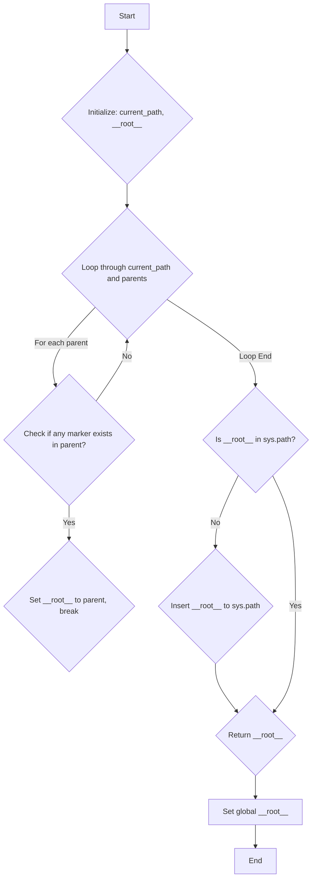

## АНАЛИЗ КОДА `hypotez/src/utils/header.py`

### 1. <алгоритм>

**Описание алгоритма:**

1.  **Инициализация:**
    *   Начало работы функции `set_project_root`.
    *   Определение текущего каталога, где находится файл `header.py`. `current_path` устанавливается как абсолютный путь к родительской директории текущего файла.
    *   Инициализация переменной `__root__`  текущим путем `current_path`.

    *Пример:* Если `header.py` находится в `/home/user/project/src/utils/header.py`, `current_path` будет `/home/user/project/src/utils/`, а `__root__` изначально также будет `/home/user/project/src/utils/`.
2.  **Поиск корня проекта:**
    *   Цикл начинается с `current_path` и перебирает его родительские директории.
    *   Для каждой директории проверяется, существует ли в ней хотя бы один из файлов-маркеров (по умолчанию `__root__` или `.git`).
    *   Если маркер найден, текущая директория устанавливается как корневая директория (`__root__`), и цикл прерывается.

    *Пример:*
        *  **Итерация 1:**  Проверяется `/home/user/project/src/utils/`. Маркер не найден.
        *  **Итерация 2:**  Проверяется `/home/user/project/src/`. Маркер не найден.
        *  **Итерация 3:**  Проверяется `/home/user/project/`. Если, например, в этой директории есть файл `.git`, то `__root__` станет `/home/user/project/`, и цикл завершится.
3.  **Добавление в sys.path:**
    *   Проверяется, находится ли найденный корневой каталог `__root__` в списке путей поиска модулей `sys.path`.
    *   Если нет, то путь к корневому каталогу добавляется в начало списка `sys.path`. Это делается для того, чтобы при импорте модулей можно было использовать относительные пути от корня проекта.

    *Пример:* Если `__root__` равен `/home/user/project/`, то этот путь будет добавлен в начало `sys.path`.
4.  **Возврат корня проекта:**
    *   Функция возвращает `__root__`, который теперь представляет собой путь к корню проекта.
    *   Глобальная переменная `__root__` устанавливается значением, возвращаемым функцией `set_project_root()`.

**Блок-схема:**



### 2. <mermaid>

```mermaid
flowchart TD
    Start --> Header[<code>header.py</code><br> Determine Project Root]
        
    Header --> Import_sys[Import: <code>sys</code>]
    Header --> Import_pathlib[Import: <code>pathlib</code> from <code>Path</code>]
    Header --> set_project_root_func[<code>set_project_root()</code><br> Function to Find Project Root]
     set_project_root_func --> current_path_var[<code>current_path</code>: <br> Path to current directory]
    set_project_root_func --> root_var[<code>__root__</code>:<br>Path to Project Root]
    
    set_project_root_func --> find_marker[Find Project Root based on Marker Files <br><code>(__root__)</code>]
     find_marker --> check_sys_path[Check if <code>__root__</code> is in  <code>sys.path</code>]
    check_sys_path -- No --> Insert_sys_path[Insert <code>__root__</code> to <code>sys.path</code>]
    check_sys_path -- Yes --> Return_root[Return Project Root <code>(__root__)</code>]
     Insert_sys_path --> Return_root
    Return_root --> set_global_root[Set global variable <code>__root__</code>]
    
    
    

    
```

**Анализ зависимостей:**

*   **`sys`**: Этот модуль необходим для взаимодействия с интерпретатором Python. В частности, используется для получения списка путей поиска модулей (`sys.path`) и изменения этого списка.
*   **`pathlib`**: Модуль `pathlib` предоставляет способ работы с файловыми путями в объектно-ориентированном стиле.  Используется класс `Path` для представления путей к файлам и директориям, выполнения операций над ними (например, получение родительского каталога, проверка существования файла).

### 3. <объяснение>

**Импорты:**

*   `import sys`: Импортирует модуль `sys`, который используется для работы с интерпретатором Python. В данном коде используется для изменения пути поиска модулей (`sys.path`), что позволяет импортировать модули из корневой директории проекта.
*   `from pathlib import Path`: Импортирует класс `Path` из модуля `pathlib`. Класс `Path` используется для создания и управления путями к файлам и каталогам. Это более удобный и современный способ работать с путями, чем использование строк.

**Функция `set_project_root(marker_files: tuple = ('__root__', '.git')) -> Path`:**

*   **Назначение:** Функция `set_project_root` предназначена для определения корневой директории проекта. Она ищет вверх по структуре директорий, начиная с директории текущего файла (`header.py`), пока не найдет директорию, содержащую один из файлов-маркеров (например, файл `__root__` или директорию `.git`).
*   **Аргументы:**
    *   `marker_files` (tuple): кортеж с именами файлов или директорий, которые используются для определения корневой директории проекта (по умолчанию `('__root__', '.git')`).
*   **Возвращаемое значение:** Возвращает объект `Path`, представляющий путь к корневой директории проекта.
*   **Логика работы:**
    1.  Определение абсолютного пути к родительской директории файла `header.py` (используя `Path(__file__).resolve().parent`).
    2.  Инициализация переменной `__root__` этим путём.
    3.  Перебор всех родительских директорий, включая текущую, в цикле.
    4.  Для каждой директории проверяется, существует ли в ней хотя бы один из файлов-маркеров.
    5.  Если маркер найден, путь к родительской директории устанавливается как `__root__`, и цикл прерывается.
    6.  Проверяется, добавлен ли `__root__` в `sys.path`. Если нет, он добавляется.
    7.  Возвращается `__root__`.

**Переменные:**

*   `__root__` (Path): Глобальная переменная, хранящая путь к корневой директории проекта. Инициализируется в результате вызова функции `set_project_root()`.
*   `current_path` (Path): Локальная переменная в функции `set_project_root`, хранящая путь к директории, в которой находится файл `header.py`.
*   `marker_files` (tuple): Аргумент функции `set_project_root`, который хранит кортеж с именами файлов-маркеров для определения корневой директории.

**Потенциальные ошибки и области для улучшения:**

*   **Обработка отсутствия маркера:** Если ни один из маркеров не будет найден, функция вернет директорию, где находится скрипт. Это может вызвать проблемы, если пользователь запустит скрипт не из корневого каталога проекта. Можно добавить логику обработки случая, когда ни один маркер не найден, например, выбросить исключение или вернуть `None`.
*   **Конфигурируемость маркеров:** Можно вынести список маркеров в глобальную переменную или файл конфигурации, чтобы пользователь мог легко менять маркеры, если они отличаются в разных проектах.
*   **Кроссплатформенность:** Код должен корректно работать на различных операционных системах. Модуль `pathlib` обеспечивает абстракцию от операционной системы, что делает код кроссплатформенным.
*   **Производительность:** Функция обходит директории по принципу поиска в ширину. В случае очень большой вложенности можно оптимизировать поиск.

**Взаимосвязь с другими частями проекта:**

*   Этот модуль является ключевым для всего проекта, так как определяет корневую директорию, относительно которой строятся все импорты модулей.
*   Другие модули проекта, импортируя этот файл, могут получать доступ к переменной `__root__` и использовать ее для создания путей к другим файлам проекта.

**Пример использования:**

Предположим, структура проекта выглядит так:

```
my_project/
├── __root__
├── src/
│   ├── utils/
│   │   └── header.py
│   └── module_a.py
```

В файле `module_a.py`, чтобы импортировать файл `header.py` или  модули из других частей проекта, можно использовать следующее:

```python
# в module_a.py
from src.utils import header
print(f"Project root: {header.__root__}")
#  импорт модулей проекта
from src.utils import some_utils
```

В этом случае `header.__root__` будет ссылаться на `my_project/`, даже если скрипт запущен из `src/`.