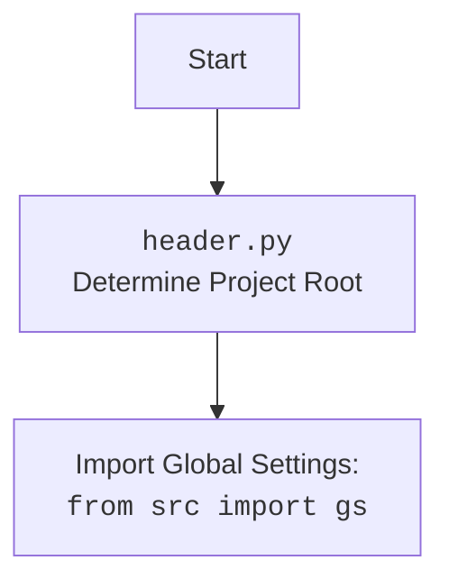

## АНАЛИЗ КОДА `hypotez/src/utils/header.py`

### 1. <алгоритм>

**Блок-схема:**

1.  **Начало**: Функция `set_project_root` вызывается с параметром `marker_files`, по умолчанию равным `('__root__', '.git')`.
2.  **Инициализация**: Определяется абсолютный путь к директории, где находится текущий файл (`header.py`). Это значение сохраняется в переменной `current_path` и `__root__`.
    *   Пример: Если `header.py` находится в `/home/user/hypotez/src/utils`, то `current_path` будет равен `/home/user/hypotez/src/utils`.
3.  **Поиск корневой директории**:
    *   Создается список, включающий текущую директорию и все ее родительские директории (путь вверх).
    *   Перебираются все эти директории, начиная с текущей.
    *   Для каждой директории проверяется, есть ли в ней хотя бы один из файлов или директорий, указанных в `marker_files`.
    *   Если такой маркер найден, путь к текущей директории присваивается `__root__` и цикл прекращается.
    *   Пример: Если в `/home/user/hypotez` есть файл `__root__`, то при проверке `/home/user/hypotez` условие будет выполнено, и `__root__` будет присвоен `/home/user/hypotez`.
4. **Обновление sys.path**:
    * Проверяется, находится ли текущий путь `__root__` в `sys.path`.
    * Если нет, `__root__` добавляется в начало списка путей поиска модулей `sys.path`.
    * Пример: Если `sys.path` не содержит `/home/user/hypotez`, то он будет добавлен.
5.  **Возврат**: Функция возвращает значение `__root__`, которое является абсолютным путем к корневой директории проекта.
6.  **Глобальная переменная**: `__root__` - присваивается результат работы функции `set_project_root()` как путь к корневой директории.

### 2. <mermaid>

```mermaid
flowchart TD
    Start[Начало: Вызов set_project_root()] --> Initialize[Инициализация: current_path = Путь к директории файла<br> __root__ = current_path];
    Initialize --> LoopStart[Начало цикла:<br> parent in [current_path, current_path.parents]];
    LoopStart --> CheckMarkers[Проверка: (parent / marker).exists() для marker in marker_files?];
    CheckMarkers -- Да --> SetRoot[__root__ = parent <br> break]
    CheckMarkers -- Нет --> LoopContinue[Продолжить цикл]
    LoopContinue --> LoopStart
    LoopStart -- Конец цикла --> CheckSysPath[Проверка: __root__ in sys.path?];
    SetRoot --> CheckSysPath
    CheckSysPath -- Нет --> UpdateSysPath[sys.path.insert(0, str(__root__))]
    CheckSysPath -- Да --> ReturnRoot[Возврат __root__]
    UpdateSysPath --> ReturnRoot
    ReturnRoot --> End[Конец: __root__]
    End --> RootAssignment[Глобальная __root__ = Результат set_project_root()]
```
**Объяснение зависимостей `mermaid`:**
*   `flowchart TD`: Указывает, что это диаграмма потока (flowchart) с направлением сверху вниз (Top-Down).
*   `Start`, `Initialize`, `LoopStart` и т.д.: Это идентификаторы узлов на диаграмме, отображающие этапы выполнения кода.
*   `-->`: Обозначает направленный поток выполнения между узлами.
*   `-- Да -->`, `-- Нет -->`: Обозначают условные переходы в зависимости от результатов проверки.
*   `<br>`: Используется для переноса строки внутри узлов, делая текст более читаемым.
*   Переменные: `current_path`, `__root__`, `parent`, `marker`,  `marker_files` представляют собой значения, используемые в ходе работы функции.

**Дополнительный `mermaid` блок для `header.py`:**



### 3. <объяснение>

**Импорты:**

*   `import sys`: Модуль `sys` используется для доступа к системным переменным, в данном случае, `sys.path`. Эта переменная содержит список путей, по которым Python ищет модули для импорта.
*   `from pathlib import Path`: Класс `Path` из модуля `pathlib` используется для удобной работы с путями к файлам и директориям.

**Функции:**

*   `set_project_root(marker_files=('__root__', '.git')) -> Path`:
    *   **Аргументы**:
        *   `marker_files` (tuple, опциональный): Кортеж с именами файлов или директорий, которые будут использоваться для поиска корневой директории проекта. По умолчанию `('__root__', '.git')`.
    *   **Возвращаемое значение**:
        *   `Path`: Объект `Path` с абсолютным путем к корневой директории проекта.
    *   **Назначение**: Функция предназначена для автоматического определения корневой директории проекта, что позволяет организовывать импорты модулей относительно этого корня.
    *   **Примеры**:
        *   `set_project_root()`: Вызовет функцию, используя значения по умолчанию `marker_files = ('__root__', '.git')`
        *   `set_project_root(marker_files = ('.project'))`: Вызовет функцию, используя в качестве `marker_files`  `('.project',)`

**Переменные:**

*   `__root__`:
    *   **Тип**: `pathlib.Path`
    *   **Назначение**: Содержит абсолютный путь к корневой директории проекта, полученный от функции `set_project_root()`. Используется для добавления корня в `sys.path` и для организации импортов.
*   `current_path`:
    *   **Тип**: `pathlib.Path`
    *   **Назначение**: Содержит абсолютный путь к директории, где находится текущий файл `header.py`.
*   `parent`:
    *   **Тип**: `pathlib.Path`
    *   **Назначение**: В цикле содержит абсолютный путь к текущей проверяемой директории (родительской по отношению к директории текущего файла)
*   `marker`:
    *   **Тип**: `str`
    *   **Назначение**: В цикле содержит имя файла или директории, используемой для поиска корневой директории

**Взаимосвязь с другими частями проекта:**

*   Этот модуль (header.py) служит основой для организации модульной структуры проекта `hypotez`, так как он обеспечивает возможность импортировать модули относительно корневой директории.
*   Другие модули проекта могут использовать импорт  `from src.utils.header import __root__` или `from src.utils.header import set_project_root` для работы с корневой директорией.

**Потенциальные ошибки и области для улучшения:**

*   **Обработка ошибок**: Функция не обрабатывает ошибки, если не находит ни одного маркера. В таком случае, она вернет путь к текущей директории, что может быть не совсем корректно в некоторых ситуациях.
*   **Гибкость поиска**: Можно расширить возможность настройки поиска, например, позволить использовать не только имена файлов и директорий, но и шаблоны поиска (glob pattern).

**Цепочка взаимосвязей с другими частями проекта:**

1.  `header.py` определяет корневой каталог проекта (`__root__`).
2.  Другие модули проекта импортируют `__root__` или `set_project_root` для построения путей к другим модулям, файлам настроек и другим ресурсам.
3.  Это позволяет избежать проблем с путями при запуске кода из разных директорий или на разных платформах.
4.  `header.py` может быть импортирован практически в любой модуль пакета `src`.

В целом, `header.py` — это важный компонент, который обеспечивает гибкость и правильное функционирование проекта `hypotez`.