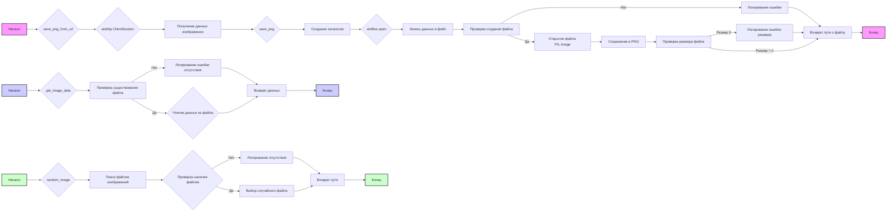

# Анализ кода `hypotez/src/utils/image.py`

## <алгоритм>

1.  **`save_png_from_url(image_url, filename)`**:
    *   Принимает `image_url` (URL изображения) и `filename` (имя файла для сохранения).
    *   **Пример**: `image_url` = `"https://example.com/image.png"`, `filename` = `"local_image.png"`.
    *   Использует `aiohttp.ClientSession` для асинхронного HTTP-запроса к `image_url`.
    *   Получает бинарные данные изображения из ответа (`image_data`).
    *   Вызывает `save_png(image_data, filename)` для сохранения изображения.
    *   Возвращает путь к сохраненному файлу или `None` в случае ошибки.

2.  **`save_png(image_data, file_name)`**:
    *   Принимает `image_data` (бинарные данные изображения) и `file_name` (имя файла для сохранения).
    *   **Пример**: `image_data` = `b'\x89PNG\r\n...'`, `file_name` = `"saved_image.png"`.
    *   Создаёт объект `Path` из `file_name`.
    *   Создаёт все необходимые родительские директории с помощью `file_path.parent.mkdir(parents=True, exist_ok=True)`.
    *   Асинхронно записывает `image_data` в файл с помощью `aiofiles.open()`.
    *   Проверяет, был ли файл создан, и если нет, то логирует ошибку и возвращает `None`.
    *   Открывает файл с помощью `PIL.Image.open()`, сохраняет в формате PNG, чтобы быть уверенным.
    *   Проверяет размер файла, и если он равен 0, то логирует ошибку и возвращает `None`.
    *   Возвращает строку с полным путём к сохраненному файлу или `None` в случае ошибки.

3.  **`get_image_data(file_name)`**:
    *   Принимает `file_name` (имя файла для чтения).
    *   **Пример**: `file_name` = `"saved_image.png"`.
    *   Создаёт объект `Path` из `file_name`.
    *   Проверяет существование файла. Если файл не существует, то логирует ошибку и возвращает `None`.
    *   Читает бинарные данные файла с помощью `open(file_path, "rb").read()`.
    *   Возвращает бинарные данные файла или `None` в случае ошибки.

4.  **`random_image(root_path)`**:
    *   Принимает `root_path` (путь к директории).
    *   **Пример**: `root_path` = `"path/to/images"`.
    *   Создаёт объект `Path` из `root_path`.
    *   Определяет список расширений изображений `image_extensions`.
    *   Рекурсивно ищет все файлы в `root_path` и его поддиректориях.
    *   Фильтрует файлы, оставляя только те, которые являются файлами и имеют расширение из `image_extensions`.
    *   Если не найдено ни одного файла изображения, то логирует предупреждение и возвращает `None`.
    *   Выбирает случайное изображение из списка найденных.
    *   Возвращает строку с путём к случайному изображению.

## <mermaid>

**Объяснение зависимостей:**

*   **`save_png_from_url`**:
    *   Использует `aiohttp.ClientSession` для асинхронных HTTP-запросов.
    *   Вызывает `save_png` для сохранения загруженного изображения.
*   **`save_png`**:
    *   Использует `Path` из модуля `pathlib` для работы с путями.
    *   Использует `aiofiles.open` для асинхронной записи в файл.
    *   Использует `PIL.Image.open` для открытия изображения, `image.save` для его сохранения в PNG формате
    *   Использует `file_path.stat().st_size` для проверки размера файла
*   **`get_image_data`**:
    *   Использует `Path` из модуля `pathlib` для работы с путями.
    *   Использует стандартную функцию `open` для чтения файла в бинарном режиме.
*   **`random_image`**:
    *   Использует `Path` из модуля `pathlib` для работы с путями.
    *   Использует `random.choice` для выбора случайного элемента из списка.

## <объяснение>

### Импорты:

*   **`aiohttp`**: Используется для выполнения асинхронных HTTP-запросов. Это необходимо для загрузки изображений из интернета в `save_png_from_url`.
*   **`aiofiles`**: Используется для асинхронных операций с файлами, таких как открытие и запись, в функции `save_png`.
*   **`PIL` (Pillow)**: Используется для работы с изображениями, в частности, для открытия и сохранения изображений в `save_png`.
*   **`pathlib.Path`**: Используется для представления путей к файлам и директориям в виде объектов, что упрощает работу с путями.
*   **`asyncio`**: Используется для поддержки асинхронного программирования.
*   **`random`**: Используется для выбора случайного изображения из списка в функции `random_image`.
*   **`src.logger.logger`**: Используется для логирования ошибок и предупреждений.
*    **`src.utils.printer`**: Используется для форматированного вывода в консоль.

### Функции:

*   **`save_png_from_url(image_url: str, filename: str | Path) -> str | None`**:
    *   Асинхронно загружает изображение по URL и сохраняет его в файл.
    *   `image_url` (str): URL изображения для загрузки.
    *   `filename` (str | Path): Имя файла для сохранения.
    *   Возвращает строку с путем к сохраненному файлу или `None` при ошибке.
    *   Пример использования: `asyncio.run(save_png_from_url("https://example.com/image.png", "local_image.png"))`.
*   **`save_png(image_data: bytes, file_name: str | Path) -> str | None`**:
    *   Асинхронно сохраняет переданные бинарные данные изображения в файл формата PNG.
    *   `image_data` (bytes): Бинарные данные изображения.
    *   `file_name` (str | Path): Имя файла для сохранения.
    *   Возвращает строку с путем к сохраненному файлу или `None` при ошибке.
    *   Пример использования: `asyncio.run(save_png(b'\x89PNG\r\n...', "saved_image.png"))`.
*   **`get_image_data(file_name: str | Path) -> bytes | None`**:
    *   Читает бинарные данные из файла.
    *   `file_name` (str | Path): Имя файла для чтения.
    *   Возвращает бинарные данные файла или `None`, если файл не найден или произошла ошибка.
    *   Пример использования: `get_image_data("saved_image.png")`.
*   **`random_image(root_path: str | Path) -> str | None`**:
    *   Ищет случайное изображение в указанной директории рекурсивно.
    *   `root_path` (str | Path): Путь к директории для поиска.
    *   Возвращает путь к случайному изображению или `None`, если изображения не найдены.
    *   Пример использования: `random_image("path/to/images")`.

### Переменные:

*   **`MODE`**: Строковая переменная, указывающая режим работы приложения. Сейчас всегда `dev`.
*   **`image_extensions`**: Список строковых переменных содержащие расширения файлов изображений, которые проверяет функция `random_image`.

### Потенциальные ошибки и улучшения:

1.  **Обработка исключений**:
    *   В функциях `save_png_from_url`, `save_png` и `get_image_data` используются блоки `try-except` для обработки исключений, но только логируют ошибку, не делают повторную попытку.
2.  **`save_png`**:
    *   После сохранения изображения с помощью `image.save(file_path, "PNG")` нет проверки целостности данных изображения.
    *   Используется `file_path.stat().st_size == 0` как проверка, но она не гарантирует, что файл корректно сохранился.
3.  **`random_image`**:
    *   Может быть неэффективным для очень больших директорий из-за рекурсивного поиска.
4.  **`MODE`**:
    *   Переменная `MODE` не используется в коде, поэтому ее можно удалить или добавить функционал с учетом разных режимов.

### Взаимосвязь с другими частями проекта:

*   Этот модуль (`image.py`) находится в директории `src/utils` и используется для общих операций с изображениями.
*   Модуль `src.logger.logger` используется для логирования событий и ошибок.
*   Может быть использован в любом другом модуле проекта, который требует загрузки, сохранения или поиска изображений.
*   `src.utils.printer` используется для вывода отладочной информации в консоль.