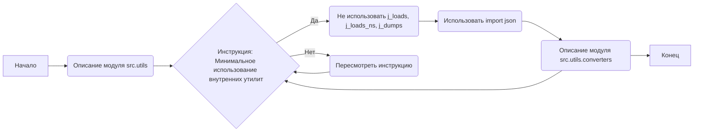
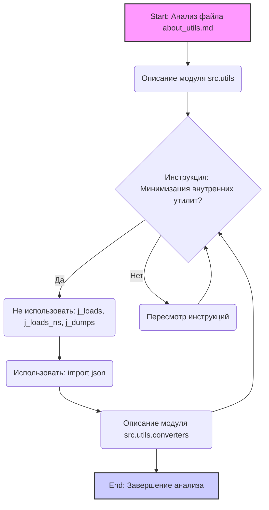

## Анализ кода: `src/utils/instructions/about_utils.md`

### 1. <алгоритм>

Файл `about_utils.md` представляет собой текстовый документ в формате Markdown, содержащий инструкции и описание для модулей `src.utils` и `src.utils.converters` в рамках проекта. 

**Блок-схема:**

**Пояснения к блокам:**

*   **A (Начало):** Начало анализа документа.
*   **B (Описание модуля src.utils):** Текстовое описание назначения модуля `src.utils`.
*   **C (Инструкция: Минимальное использование внутренних утилит):** Проверка наличия ключевой инструкции об ограничениях использования внутренних утилит проекта.
*   **C -- Да --> D (Не использовать j\_loads, j\_loads\_ns, j\_dumps):** Инструкция о запрете использования `j_loads`, `j_loads_ns` и `j_dumps`.
*   **D --> E (Использовать import json):** Инструкция об использовании стандартной библиотеки `json`.
*   **E --> F (Описание модуля src.utils.converters):** Описание назначения модуля `src.utils.converters`.
*    **F --> C** Инструкция о минимальном использовании внутренних утилит также распространяется на `src.utils.converters`
*   **C -- Нет --> G (Пересмотреть инструкцию):** Если условие C не выполнено, необходимо пересмотреть инструкцию.
*   **G --> C** Перенаправление обратно к условию.
*   **F --> H (Конец):** Конец анализа документа.

**Примеры:**

*   Описание модуля: `src.utils` — служебные утилиты проекта.
*   Инструкция: "В этих модулях **НЕ используется** `j_loads`, `j_loads_ns` и `j_dumps`."

### 2. <mermaid>

**Зависимости и их анализ:**

*   Диаграмма описывает процесс анализа файла `about_utils.md`.
*   Нет импортированных модулей.
*   Зависимости определяются логическим потоком анализа инструкций:
    *   Анализ начинается (`Start`)
    *   Проверяется наличие инструкции по минимизации внутренних утилит.
    *   В зависимости от ответа (Да/Нет), выполняется одно из двух действий:
    *   Если "Да" -  не использовать внутренние функции `j_loads`, `j_loads_ns`, `j_dumps` и использовать `import json`.
    *   Если "Нет" -  необходимо пересмотреть инструкции.
*   Диаграмма визуализирует последовательность действий.

### 3. <объяснение>

**Импорты:**

*   В предоставленном коде нет явных импортов в привычном смысле (как `import json`). 
*   Указывается рекомендация использовать `import json`. 
*   Это указывает на то, что модули в `src.utils` и `src.utils.converters` будут использовать стандартную библиотеку `json` для работы с данными в формате JSON.

**Классы:**

*   В коде не представлены классы. Инструкции предназначены для модулей `src.utils` и `src.utils.converters`, предполагая, что их реализация будет следовать заданным правилам.

**Функции:**

*   В коде не представлены функции. Инструкции подразумевают, что функции в `src.utils` и `src.utils.converters` будут избегать использования `j_loads`, `j_loads_ns` и `j_dumps`, а вместо этого использовать `json`.

**Переменные:**

*   В данном файле не используются переменные в коде. Он содержит инструкции в текстовой форме.

**Объяснение:**

*   **`src.utils` и `src.utils.converters`:** Эти модули предназначены для предоставления служебных функций в проекте.
*   **Инструкции:**
    *   **Минимальное использование внутренних утилит:** Подчёркивает необходимость минимизации зависимостей от других частей проекта. Это означает, что данные модули должны быть максимально самодостаточными и использовать только необходимые стандартные библиотеки.
    *   **`j_loads`, `j_loads_ns`, `j_dumps`:** Это, вероятно, внутренние функции проекта для работы с JSON, которые, согласно инструкции, **не должны** использоваться в `src.utils` и `src.utils.converters`.
    *   **`import json`:**  Указывает на необходимость использования стандартной библиотеки Python для работы с JSON. Это повышает переносимость и снижает зависимость от внутренних решений.

**Потенциальные ошибки и области для улучшения:**

*   Инструкции ясные, но для новичков в проекте, возможно, потребуется дополнительное разъяснение, почему именно ограничение на использование `j_loads` и т.д. 
*  Следование инструкциям не гарантирует отсутствие ошибок. Необходимо добавить unit-тесты для проверки корректности работы модулей.
*   Отсутствуют явные примеры использования.

**Цепочка взаимосвязей с другими частями проекта:**

*   Модули `src.utils` и `src.utils.converters` могут использоваться различными частями проекта для общих задач, таких как преобразование данных.
*   Взаимодействие с другими модулями через `src.utils` и `src.utils.converters` должно быть минимальным. Эти модули служат для изоляции логики, связанной с общими задачами.

**Итог:**
Файл `about_utils.md` предоставляет важные инструкции для разработчиков при работе с модулями `src.utils` и `src.utils.converters`. Он подчёркивает важность независимости этих модулей от внутренних утилит, а также использование стандартных инструментов для работы с JSON.