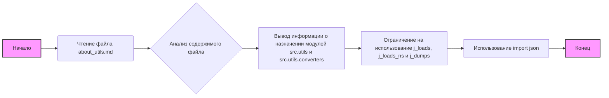

## Анализ кода `src/utils/instructions/about_utils.md`

### <алгоритм>

1.  **Начало**: Чтение markdown файла `about_utils.md`.
2.  **Разбор**: Анализ содержимого файла, который представляет собой инструкции.
3.  **Вывод**: Вывод информации о назначении модулей `src.utils` и `src.utils.converters`, об ограничении на использование `j_loads`, `j_loads_ns` и `j_dumps`, и о необходимости использовать `import json`.

**Примеры:**

*   **Шаг 1 (Чтение):** Считывается содержимое файла, например, "## Модуль: src.utils ...".
*   **Шаг 2 (Разбор):** Анализируется текст, выявляются ключевые фразы, например "служебные утилиты проекта", "НЕ используется" и т.д.
*   **Шаг 3 (Вывод):** Формируется текстовое объяснение согласно полученной информации.

### <mermaid>

**Анализ зависимостей `mermaid`:**

В диаграмме `mermaid` нет импортированных зависимостей, так как она описывает логику обработки текста внутри файла, а не программную структуру. Узлы графа представляют этапы алгоритма.

*   **`Начало`**: Начальная точка процесса.
*   **`Чтение файла about_utils.md`**: Операция чтения содержимого файла.
*   **`Анализ содержимого файла`**: Этап, на котором текст файла подвергается анализу для понимания инструкций.
*   **`Вывод информации о назначении модулей src.utils и src.utils.converters`**: Этап вывода текстовой информации, о назначении модулей.
*    **`Ограничение на использование j_loads, j_loads_ns и j_dumps`**:  Этап вывода ограничения на использование.
*    **`Использование import json`**:  Этап вывода информации, об использовании json библиотеки.
*   **`Конец`**: Конечная точка процесса.

### <объяснение>

**Импорты:**

*   В данном коде нет импортов, так как это markdown файл с инструкциями, а не python код.

**Классы:**

*   В данном коде нет классов, так как это markdown файл с инструкциями, а не python код.

**Функции:**

*   В данном коде нет функций, так как это markdown файл с инструкциями, а не python код.

**Переменные:**

*   В данном коде нет переменных, так как это markdown файл с инструкциями, а не python код.

**Объяснение текста инструкций:**

1.  **Модули `src.utils` и `src.utils.converters`**:
    *   Эти модули предназначены для хранения служебных утилит, используемых в проекте.
    *   Утилиты спроектированы таким образом, чтобы минимизировать зависимости от внутренних инструментов проекта.

2.  **Ограничение на использование `j_loads`, `j_loads_ns` и `j_dumps`**:
    *   Инструкция явно запрещает использование функций `j_loads`, `j_loads_ns` и `j_dumps` из внутренних утилит проекта.
    *   Это ограничение, вероятно, введено для обеспечения независимости или для предотвращения проблем с конфликтами версий и зависимостей.

3.  **Использование `import json`**:
    *   Инструкция требует использовать стандартную библиотеку `json` для работы с JSON данными.
    *   Это обеспечивает стандартизированный и надежный подход к работе с JSON, а также гарантирует независимость от внутренних реализаций.

**Потенциальные ошибки и области для улучшения:**

*   Инструкция не говорит о том, **почему** именно эти функции (`j_loads`, `j_loads_ns`, `j_dumps`) не следует использовать.
    Это может вызвать недопонимание среди разработчиков, если они не знают причины.
    **Предложение:** Добавить объяснение причины ограничения.
*   Нет явных указаний о том, как обрабатывать ошибки при работе с JSON.
    **Предложение:** Добавить рекомендацию по обработке исключений при использовании `json.loads` и `json.dumps`.

**Цепочка взаимосвязей с другими частями проекта:**

*   Модули `src.utils` и `src.utils.converters` используются другими частями проекта как вспомогательные инструменты.
*   Инструкция ограничивает зависимости этих модулей, чтобы обеспечить их автономность.
*   Все части проекта, работающие с JSON данными, должны соблюдать инструкцию об использовании стандартной библиотеки `json`.