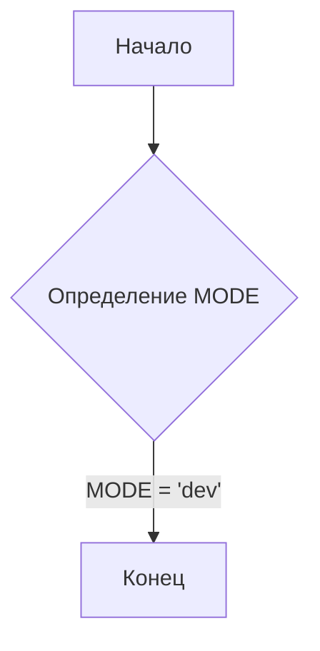
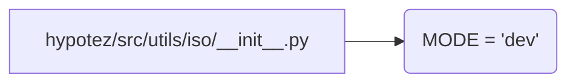

```MD
1. **<input code>**:

```python
## \file hypotez/src/utils/iso/__init__.py
# -*- coding: utf-8 -*-\
#! venv/Scripts/python.exe
#! venv/bin/python/python3.12

"""
.. module: src.utils.iso 
	:platform: Windows, Unix
	:synopsis:

"""
MODE = 'dev'
```

2. **<algorithm>**:

Этот файл является инициализатором модуля `src.utils.iso`.  Алгоритм состоит в основном из определения константы `MODE`.  Нет никаких циклов или условных операторов. Данные не передаются между функциями или классами.

**Блок-схема:**



**Пример:**

При выполнении этого файла, переменная `MODE` будет содержать значение `'dev'`.


3. **<mermaid>**:



**Объяснение диаграммы:**

Диаграмма показывает, что файл `hypotez/src/utils/iso/__init__.py` определяет переменную `MODE` со значением `'dev'`.  Никаких зависимостей от других файлов в этом файле нет.


4. **<explanation>**:

* **Импорты**:  В этом файле нет импортов. Это стандартный файл инициализации Python, который используется для группировки связанных модулей.  Поскольку нет импортов, нет связи с другими пакетами, начинающимися с `src.`.


* **Классы**: Нет классов.


* **Функции**: Нет функций.


* **Переменные**: Единственная переменная — `MODE`.  Это строковая переменная, определяющая режим работы.  В данном случае, режим 'dev'.


* **Возможные ошибки или области для улучшений**:  Этот файл очень прост и не содержит потенциальных ошибок. Единственная область для потенциального улучшения — это документирование `MODE`, если оно имеет смысл в более широком контексте проекта.  Например, если есть несколько режимов (например, `dev`, `test`, `prod`), возможно, стоит использовать перечисление (enum) вместо простой строки для большей ясности и безопасности. Также может быть полезно определить переменную `__all__` для управления тем, что будет экспортировано из модуля, если в нем будут определены другие элементы.

* **Цепочка взаимосвязей с другими частями проекта**:  Эта константа `MODE` определенно будет использоваться в других частях проекта `hypotez`.  Вероятно, она будет влиять на поведение (например, какие данные использовать, какие функции вызывать, какие настройки использовать).  Конкретная цепочка взаимосвязей неясна без анализа кода других частей проекта.


**В заключение**: Данный файл является простым файлом инициализации.  Его основной функцией является объявление константы `MODE`.  Знание значения этой константы может быть важно для настройки других частей приложения.