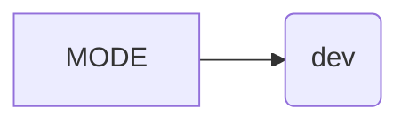

```MD
# Анализ файла hypotez/src/utils/iso/__init__.py

## <input code>

```python
## \file hypotez/src/utils/iso/__init__.py
# -*- coding: utf-8 -*-\
#! venv/Scripts/python.exe
#! venv/bin/python/python3.12

"""
.. module: src.utils.iso 
	:platform: Windows, Unix
	:synopsis:

"""
MODE = 'dev'
```

## <algorithm>

Этот файл является инициализационным модулем для пакета `src.utils.iso`.  В нем определен единственный атрибут `MODE`, хранящий строковое значение 'dev'. Алгоритм работы заключается в простом определении переменной.  Пошаговая блок-схема не требуется, так как логики выполнения нет.

## <mermaid>



## <explanation>

**Импорты**:  В файле отсутствуют импорты.

**Классы**: Нет определенных классов.

**Функции**: Нет определенных функций.

**Переменные**:

* `MODE`:  Строковая переменная, хранящая значение 'dev'.  Скорее всего,  используется для определения режима работы (например, 'dev' - для разработки, 'prod' - для производства).  Это константа, которая не должна изменяться в процессе работы программы.


**Возможные ошибки или области для улучшений**:

* Отсутствие документации к переменной MODE. Необходимо добавить строку docstrings с описанием значения `MODE`,  для чего стоит использовать docstrings.
* Наличие `#! venv/Scripts/python.exe` и `#! venv/bin/python/python3.12` в начале файла не имеет практического смысла в большинстве случаев, так как интерпретатор Python уже должен быть установлен в `venv`, эти строки могут быть удалены.
* Непонятно, для чего нужен файл. Для того, чтобы код стал более полезным и его использование было более понятным, стоит добавить в модуль описание, например, предполагаемое использование в других модулях, описывающие сценарии.

**Цепочка взаимосвязей с другими частями проекта**:

Этот модуль `hypotez/src/utils/iso/__init__.py` является частью пакета `src.utils.iso`. Скорее всего, он будет использоваться другими модулями или скриптами в этом пакете для доступа к константе `MODE`.  Поскольку файл `__init__.py` — это инициализационный модуль, он может импортировать другие модули или классы из этого пакета. Это позволяет организовать пакет иерархически.  Без дополнительного контекста сложно сказать, как этот модуль взаимодействует с другими частями проекта.