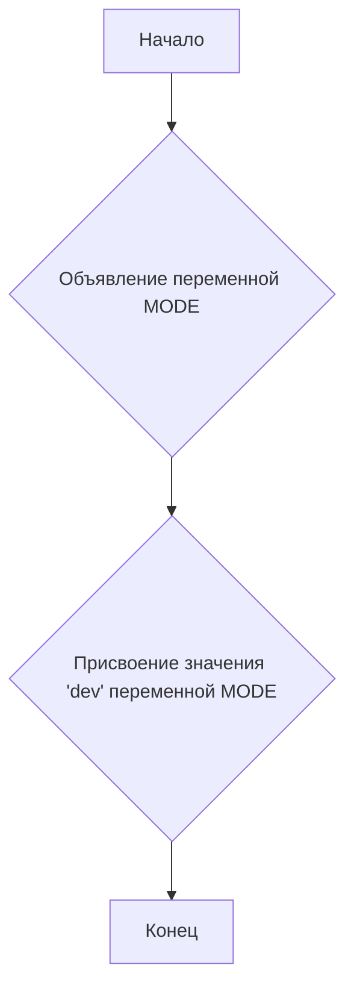

## Анализ кода `hypotez/src/utils/iso/__init__.py`

### <алгоритм>

1.  **Начало:** Исполнение файла `__init__.py` начинается.
2.  **Объявление `MODE`:** Объявляется переменная `MODE` и ей присваивается строковое значение `'dev'`.
3.  **Конец:** Завершение исполнения файла.

**Пример:**

```
Начало ->  -> Конец
```

### <mermaid>



**Описание:**

*   **A (Начало):**  Начальная точка выполнения скрипта.
*   **B (Объявление переменной MODE):** Указывает на этап объявления переменной с именем `MODE`.
*   **C (Присвоение значения 'dev' переменной MODE):** Обозначает присвоение строкового значения `'dev'` переменной `MODE`.
*   **D (Конец):** Конечная точка выполнения скрипта.

### <объяснение>

**Импорты:**
   -  В данном файле импорты отсутствуют. Это характерно для `__init__.py` файлов, когда он используется для объявления пакета и инициализации его переменных, а не для непосредственного выполнения кода.

**Классы:**
   -   В данном файле классы отсутствуют.

**Функции:**
   -   В данном файле функции отсутствуют.

**Переменные:**
   -   `MODE`:
        -   **Тип:** Строка (str).
        -   **Использование:** Эта переменная используется для определения режима работы приложения, в данном случае режим разработки (`dev`).  Обычно такие переменные используются для условной загрузки или инициализации различных частей кода в зависимости от среды выполнения (разработка, тестирование, продакшн).
        -   **Пример:** В других частях проекта, переменная `MODE` может быть использована для включения/отключения отладочных сообщений, использования тестовых баз данных, и т.д. Пример:
        ```python
        if MODE == 'dev':
            print("Режим разработки")
            # Подключение к тестовой БД
        elif MODE == 'prod':
            # Подключение к продакшен БД
            pass
        ```

**Потенциальные ошибки и области для улучшения:**

1.  **Отсутствие импортов:** Так как файл `__init__.py` по сути является точкой входа для модуля `iso`, в будущем могут понадобиться импорты, и их следует добавлять по мере необходимости.
2.  **Неинформативное имя `MODE`:** Хотя имя переменной и подразумевает режим работы, для большей наглядности можно было бы использовать более полное имя, например `APPLICATION_MODE`.
3. **Не используется для явного указания относительного пути в пакете:** Обычно в `__init__.py` файлах происходит объявление, что текущая директория является пакетом `iso`.
4. **Отсутствие документации:** Необходимо добавить описание переменной `MODE`, чтобы было понятно ее назначение.

**Взаимосвязи с другими частями проекта:**

*   Переменная `MODE` может использоваться в других модулях проекта `hypotez` для определения конфигурации, журналирования или других настроек в зависимости от текущего режима работы.

**Цепочка взаимосвязей с другими частями проекта:**

1.  Другие модули в проекте `hypotez` могут импортировать модуль `iso` через импорт пакета, например `from hypotez.src.utils import iso`.
2.  После импорта другие модули могут использовать переменную `MODE`, которая была инициализирована в `__init__.py` через  `iso.MODE`.
3.  В зависимости от значения переменной `MODE`, другие модули могут выполнять различные блоки кода, изменяя тем самым поведение всего приложения.

Таким образом,  `__init__.py` в данном случае служит как файл инициализации для пакета `iso`, а переменная `MODE` является общей переменной, доступной в пределах этого пакета и используемой для переключения режимов работы проекта.