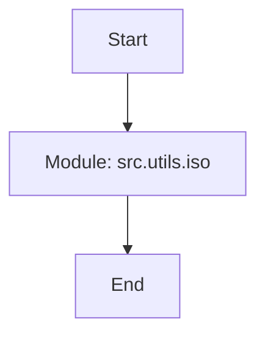

## Анализ кода `hypotez/src/utils/iso/__init__.py`

### <алгоритм>

1. **Начало**: Исполнение скрипта начинается.
   
   *Пример*: Запуск интерпретатора Python для выполнения файла `__init__.py`.

2. **Импорт модулей**: В данном коде импорт модулей отсутствует.
    
   *Пример*: Отсутствует строка `import some_module`.

3. **Определение модуля**: Код объявляет пакет `src.utils.iso`.  

   *Пример*: Создание каталога `iso` внутри `src/utils`, чтобы объявить его пакетом.

4. **Конец**: Завершение выполнения скрипта.
   
   *Пример*: Завершение интерпретации файла.

### <mermaid>



**Объяснение `mermaid` диаграммы:**

Диаграмма показывает простой процесс определения модуля.

1.  `Start`: Начало выполнения скрипта.
2.  `ModuleDefinition`: Обозначает создание модуля `src.utils.iso`.
3.  `End`: Завершение выполнения скрипта.

В коде нет импортов, поэтому диаграмма простая.

### <объяснение>

**Общая информация:**

Файл `__init__.py` в Python используется для обозначения каталога как пакета. В данном случае, файл расположен в `hypotez/src/utils/iso/__init__.py`, что указывает на то, что `iso` является подпакетом пакета `src.utils`.

**Импорты:**
  
  В данном коде нет явных импортов. Это означает, что пакет `src.utils.iso` пока не зависит от других модулей, но он может содержать подмодули или файлы, которые используют другие части проекта.
  
**Классы:**

В данном файле классы отсутствуют. Это означает, что данный файл в основном служит для обозначения директории `iso` как пакета.

**Функции:**
    
  Функции в данном файле также отсутствуют.

**Переменные:**
  
  В данном файле нет переменных.
  
**Потенциальные ошибки и области для улучшения:**

1.  **Отсутствие функциональности**:  Файл `__init__.py`  не содержит кода, кроме комментариев, что делает его малополезным сам по себе. Обычно, `__init__.py` используют для определения общих ресурсов,  инициализации, или импорта модулей внутри пакета.

2. **Неясные комментарии**: Комментарии в начале файла, содержащие пути к интерпретаторам (`#! venv/Scripts/python.exe` и `#! venv/bin/python/python3.12`), кажутся избыточными, так как они обычно используются для скриптов, которые должны запускаться непосредственно, а не для `__init__.py` файлов. Это можно удалить.

**Взаимосвязь с другими частями проекта:**
   
   `src.utils.iso` является пакетом, который предположительно используется для хранения модулей и функций, связанных с ISO стандартами (судя по имени `iso`).
   Другие части проекта, например, `src`, могут импортировать подмодули из `src.utils.iso` для использования связанных функций, классов или констант.
    
   Пример: Если внутри `iso` есть файл `iso_parser.py`, то его можно импортировать из других частей проекта следующим образом:

   ```python
   from src.utils.iso import iso_parser
   ```

   В дальнейшем, если код в `src.utils.iso` будет разработан, зависимости будут ясны.