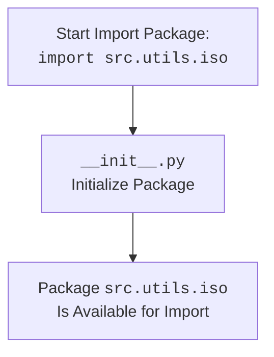

# Анализ кода `hypotez/src/utils/iso/__init__.py`

## 1. <алгоритм>

Файл `__init__.py` в Python-пакете `src.utils.iso` обычно используется для инициализации пакета. В данном случае код пуст, но его наличие означает, что директория `iso` является пакетом, и её можно импортировать как модуль.

Пошаговая блок-схема:
1. **Начало:** Запуск интерпретатора Python.
2. **Импорт:** При попытке импортировать `src.utils.iso`, Python обнаруживает файл `__init__.py`.
3. **Инициализация:** Интерпретатор выполняет код внутри `__init__.py`.
4. **Завершение:** Поскольку код пуст, никаких дополнительных действий не выполняется. Пакет `src.utils.iso` становится доступным для импорта другими модулями.

Пример:
- В файле `main.py` есть строка `import src.utils.iso`. При ее выполнении Python выполнит шаги, описанные выше.
- После импорта, можно использовать другие модули внутри `src.utils.iso` (если они существуют).

## 2. <mermaid>



**Описание зависимостей `mermaid`:**
- `Start`: Начальная точка импорта пакета `src.utils.iso`.
- `Init`:  Блок, представляющий файл `__init__.py`, который служит для инициализации пакета.
- `Finish`: Завершение инициализации пакета, после чего он становится доступен для импорта другими модулями.

## 3. <объяснение>

**Импорты:**
- В данном коде импортов нет. Однако, наличие `__init__.py` само по себе делает директорию `iso` частью пакета `src.utils`.
- Этот механизм позволяет другим модулям, например из `src`, импортировать `src.utils.iso` и использовать модули внутри него.

**Классы:**
- В файле нет классов.

**Функции:**
- В файле нет функций.

**Переменные:**
- В файле нет переменных.

**Дополнительные пояснения:**

- Файл `__init__.py` даже пустой играет важную роль. Он превращает каталог в пакет Python.
- В данном случае этот файл делает пакет `src.utils.iso` доступным для импорта, несмотря на отсутствие дополнительной логики.
- Этот подход структурирует проект и позволяет организовать код по функциональным областям (в данном случае, для iso-специфичных утилит).

**Потенциальные ошибки и области для улучшения:**
- На данный момент, файл пуст. В будущем могут понадобиться специфические инициализации.
- В `__init__.py` можно добавить явные импорты для упрощения использования модулей внутри пакета `src.utils.iso` (например, `from . import module1, module2`).
- Отсутствуют docstring для файла `__init__.py`, которые могли бы дать более подробное описание пакета, например
```python
"""
.. module:: src.utils.iso
   :platform: Windows, Unix
   :synopsis: Package containing utility functions related to ISO standards.

"""
```

**Цепочка взаимосвязей с другими частями проекта:**
- Любой модуль в рамках проекта `hypotez`,  который хочет использовать ISO-специфичные утилиты, может импортировать пакет `src.utils.iso` (при условии, что внутри него есть другие модули, такие как `src.utils.iso.module1`).

Пример использования в другом файле (например, в `src/module_using_iso.py`):
```python
# src/module_using_iso.py
import src.utils.iso
# если в пакете есть модуль
# from src.utils.iso import some_module
# some_module.do_something()
print("Package src.utils.iso is imported")
```
Это показывает как этот файл становится частью более крупной структуры проекта.