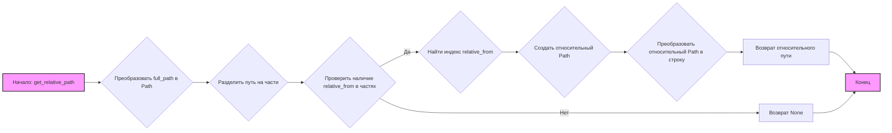

## Анализ кода `hypotez/src/utils/path.py`

### <алгоритм>
1.  **Начало**: Функция `get_relative_path` принимает два строковых аргумента: `full_path` (полный путь) и `relative_from` (сегмент, с которого нужно начать извлечение относительного пути).
    *   Пример: `full_path = "/home/user/project/src/utils/file.py"`, `relative_from = "src"`
2.  **Преобразование в Path**: Строка `full_path` преобразуется в объект `Path` из модуля `pathlib`. Это позволяет удобно работать с путями, используя методы объекта `Path`.
    *   Пример: `path = Path("/home/user/project/src/utils/file.py")`
3.  **Разделение пути на части**: Путь, представленный объектом `Path`, разделяется на отдельные компоненты, которые сохраняются в кортеже `parts`.
    *   Пример: `parts = ('/', 'home', 'user', 'project', 'src', 'utils', 'file.py')`
4.  **Поиск индекса сегмента**: Проверяется, содержится ли сегмент `relative_from` в кортеже `parts`.
    *   Пример: `relative_from = "src"` содержится в `parts`.
5.  **Извлечение относительного пути**:
    *   Если сегмент найден:
        *   Определяется индекс первого вхождения `relative_from` в `parts`.
        *   Создается новый объект `Path` из среза кортежа `parts`, начиная с найденного индекса и до конца кортежа.
        *   Путь преобразуется в строку с использованием `/` в качестве разделителя и возвращается.
        *   Пример: `start_index = 4`, `relative_path = Path('src', 'utils', 'file.py')`, возвращается строка `"src/utils/file.py"`.
    *   Если сегмент не найден:
        *   Возвращается `None`.
        *   Пример: Если `relative_from = "test"`, вернется `None`
6.  **Конец**: Функция возвращает вычисленный относительный путь (строка) или `None`.

### <mermaid>

**Объяснение зависимостей `mermaid`**:

*   **`graph LR`**: Определяет тип диаграммы как направленный граф, идущий слева направо (Left to Right).
*   **`A[Начало: get_relative_path]`**: Узел, представляющий начало функции `get_relative_path`. `A` - имя узла, `[ ]` - текст узла.
*   **`B{Преобразовать full_path в Path}`**: Узел, представляющий преобразование `full_path` в объект `Path`. `{}` -  форма ромба, обычно используется для условий.
*   **`C{Разделить путь на части}`**: Узел, представляющий разделение пути на части.
*   **`D{Проверить наличие relative_from в частях}`**: Узел, представляющий проверку наличия `relative_from` в частях пути.
*   **`E{Найти индекс relative_from}`**: Узел, представляющий нахождение индекса `relative_from`.
*   **`F{Создать относительный Path}`**: Узел, представляющий создание относительного `Path`.
*   **`G{Преобразовать относительный Path в строку}`**: Узел, представляющий преобразование относительного `Path` в строку.
*   **`H[Возврат относительного пути]`**: Узел, представляющий возврат относительного пути.
*  **`I[Возврат None]`**: Узел, представляющий возврат `None`.
*  **`J[Конец]`**: Узел, представляющий конец функции.
*   **`-->`**: Стрелки, показывающие поток выполнения.
*   **`D -- Да --> E`**: Условная стрелка, срабатывающая если условие истинно.
*    **`D -- Нет --> I`**: Условная стрелка, срабатывающая если условие ложно.
*   `style A fill:#f9f,stroke:#333,stroke-width:2px` и `style J fill:#f9f,stroke:#333,stroke-width:2px` - стилизация начала и конца.

### <объяснение>
**Импорты:**
*   `from pathlib import Path`: Импортирует класс `Path` из модуля `pathlib`. Класс `Path` предоставляет удобный способ работы с путями в файловой системе. Он позволяет представлять пути как объекты, что упрощает выполнение различных операций, таких как разбор, объединение и нормализация путей. Этот импорт используется для преобразования строк, представляющих пути к файлам, в объекты `Path`.
*   `from typing import Optional`: Импортирует `Optional` из модуля `typing`, используемый для аннотации типов, когда функция может вернуть либо значение определенного типа, либо `None`. Это помогает делать код более понятным и предотвращает ошибки типов.

**Переменные:**
*   `MODE = 'dev'`: Глобальная переменная, которая определяет режим работы приложения, в данном случае  установлен режим "dev" для разработки.  В текущей реализации переменная не используется внутри файла, и предназначена для использования в другом месте проекта.

**Функции:**
*   `get_relative_path(full_path: str, relative_from: str) -> Optional[str]`:
    *   **Аргументы**:
        *   `full_path` (str): Полный путь к файлу или директории.
        *   `relative_from` (str): Сегмент пути, от которого нужно построить относительный путь.
    *   **Возвращаемое значение**: `Optional[str]`. Возвращает строку, представляющую относительный путь, начиная с `relative_from`, если сегмент найден, и `None` в противном случае.
    *   **Назначение**: Функция используется для извлечения относительного пути из полного пути, начиная с определенного сегмента. Это может быть полезно, когда нужно определить местоположение файла относительно какой-то базовой директории.
    *   **Примеры**:
        *   `get_relative_path("/home/user/project/src/utils/file.py", "src")` вернет `"src/utils/file.py"`.
        *   `get_relative_path("/home/user/project/src/utils/file.py", "project")` вернет `"project/src/utils/file.py"`.
        *   `get_relative_path("/home/user/project/src/utils/file.py", "test")` вернет `None`.

**Объяснение кода:**

1.  Функция `get_relative_path` преобразует входную строку `full_path` в объект `Path`, что упрощает работу с путями.
2.  Путь разбивается на части (сегменты) с использованием `.parts` и сохраняется в кортеж.
3.  Функция ищет индекс сегмента `relative_from` в кортеже `parts`.
4.  Если сегмент найден, создается новый объект `Path` из среза `parts`, начиная с найденного индекса, и преобразуется в строку, которая возвращается в качестве относительного пути.
5.  Если сегмент не найден, функция возвращает `None`.

**Потенциальные ошибки и области для улучшения:**

*   **Обработка ошибок**: Функция не обрабатывает случаи, когда `full_path` или `relative_from` не являются допустимыми путями. Возможно, стоит добавить проверку на корректность входных данных и выбрасывать исключения при необходимости.
*   **Пустой путь**: Функция может некорректно обрабатывать пустой путь.
*  **Упрощение кода**: Можно оптимизировать код, используя метод `Path.relative_to()`, который был бы более наглядным и эффективным, если бы не было необходимости искать `relative_from` по частям пути.

**Цепочка взаимосвязей с другими частями проекта:**

*   Данная функция может быть использована в других модулях проекта, где требуется определение относительных путей на основе каких-либо базовых директорий. Например, для построения путей к конфигурационным файлам, лог-файлам, или другим ресурсам.
*   Модуль `src.utils.path` является частью инфраструктурного слоя, обеспечивающего базовую функциональность для работы с путями.
*   Модуль может быть вызван в модулях `config`, `cli`, `report` и так далее для определения путей к файлам конфигурации, артефактам отчетов и так далее.

Таким образом, модуль `src.utils.path` предоставляет базовую функциональность для работы с путями, которая может быть использована в различных частях проекта для обеспечения гибкости и переносимости кода.