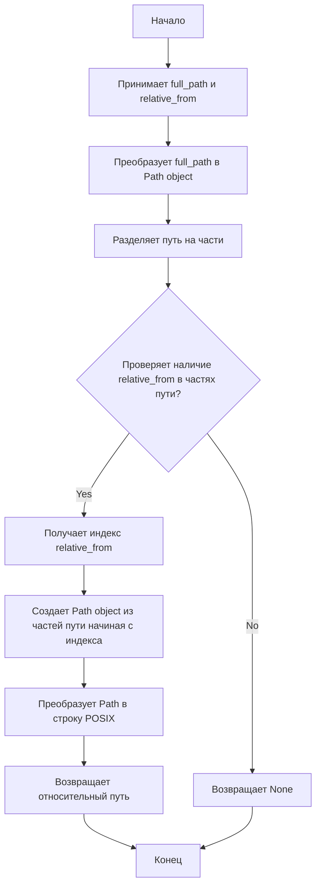

## Анализ кода `src/utils/path.py`

### 1. `<алгоритм>`:

**Функция `get_relative_path`:**

1.  **Начало:** Функция принимает два строковых аргумента: `full_path` (полный путь к файлу) и `relative_from` (сегмент пути, относительно которого нужно получить относительный путь).
    *   Пример: `full_path` = "/home/user/project/src/utils/path.py", `relative_from` = "src".

2.  **Преобразование в Path:**  Преобразует строку `full_path` в объект `pathlib.Path`, предоставляющий удобный интерфейс для работы с путями.
    *   Пример: `path` = `Path("/home/user/project/src/utils/path.py")`.

3.  **Разбиение пути:** Разбивает путь на компоненты (сегменты) с помощью атрибута `.parts`.
    *   Пример: `parts` = `("/", "home", "user", "project", "src", "utils", "path.py")`.

4.  **Поиск индекса:** Проверяет, присутствует ли сегмент `relative_from` в списке сегментов `parts`. Если присутствует, то сохраняет его индекс в переменную `start_index`.
    *   Пример: Если `relative_from` = "src", то `start_index` = 4.

5.  **Формирование относительного пути:** Если `relative_from` найден в пути:
    *   Создаётся новый объект `Path` из сегментов пути, начиная с индекса `start_index` до конца.
        *   Пример: `Path(*parts[4:])` создаст объект `Path("src/utils/path.py")`.
    *   Преобразуется полученный путь в строку в формате POSIX (с прямыми слешами), чтобы быть кроссплатформенным, и возвращается в виде строки.
        *   Пример: `"src/utils/path.py"`
        
6.  **Возврат None:** Если `relative_from` не найден в `parts`, функция возвращает `None`.

**Пример полного цикла:**

*   **Входные данные:**
    *   `full_path` = "/home/user/project/src/utils/path.py"
    *   `relative_from` = "src"
*   **Выходные данные:** `"src/utils/path.py"`

### 2. `<mermaid>`:

**Описание диаграммы:**
*   `Start`: Начало выполнения функции.
*   `Input_Path`: Функция принимает на вход `full_path` и `relative_from`.
*   `Convert_to_Path`: Конвертирует строку `full_path` в объект `pathlib.Path` для удобной работы с путями.
*   `Split_Path`: Разделяет путь на части с помощью атрибута `.parts` объекта `pathlib.Path`.
*   `Check_Segment`: Проверяет, присутствует ли строка `relative_from` в списке `parts`.
*   `Get_Segment_Index`: Если `relative_from` присутствует, то определяет его индекс в списке `parts`.
*   `Create_Relative_Path`: Создает новый объект `pathlib.Path`, используя части пути, начиная с индекса `relative_from` и до конца.
*   `Convert_To_Posix`: Преобразует объект `pathlib.Path` в строку с использованием POSIX-совместимых разделителей.
*   `Return_Relative_Path`: Возвращает строку с относительным путем.
*   `Return_None`: Если `relative_from` отсутствует в частях пути, возвращает `None`.
*   `End`: Конец выполнения функции.
 

### 3. `<объяснение>`:

**Импорты:**

*   `from pathlib import Path`:
    *   Импортирует класс `Path` из модуля `pathlib`.
    *   `pathlib` предоставляет объектно-ориентированный способ работы с файловыми путями. Класс `Path` используется для представления путей и выполнения различных операций, таких как создание, чтение и манипулирование путями.
    *   Взаимосвязь с `src`:  Используется для работы с путями внутри проекта, в том числе для определения относительных путей.
*   `from typing import Optional`:
    *   Импортирует `Optional` для использования в аннотации типов.
    *   `Optional[str]` означает, что функция может вернуть либо строку, либо `None`.
    *   Взаимосвязь с `src`: Используется для статической проверки типов в проекте.

**Функция:**

*   `get_relative_path(full_path: str, relative_from: str) -> Optional[str]`:
    *   **Аргументы:**
        *   `full_path` (`str`): Полный путь к файлу или каталогу в виде строки.
        *   `relative_from` (`str`):  Сегмент пути, относительно которого нужно получить относительный путь, в виде строки.
    *   **Возвращаемое значение:**
        *   `Optional[str]`: Относительный путь в виде строки, начиная с сегмента `relative_from`, или `None`, если сегмент `relative_from` не найден в `full_path`.
    *   **Назначение:**
        *   Извлекает часть пути, начиная с указанного сегмента.
        *   Предназначена для получения относительных путей внутри проекта, например, от корня проекта (`src`) до конкретного файла.
    *   **Примеры:**
        *   `get_relative_path("/home/user/project/src/utils/path.py", "src")` вернет `"src/utils/path.py"`.
        *   `get_relative_path("/home/user/project/src/utils/path.py", "utils")` вернет `"utils/path.py"`.
        *   `get_relative_path("/home/user/project/src/utils/path.py", "config")` вернет `None`.

**Переменные:**

*   `path` (`Path`): Объект `pathlib.Path`, представляющий полный путь.
*   `parts` (`tuple`): Кортеж (неизменяемый список) строк, представляющий сегменты пути.
*   `start_index` (`int`): Индекс сегмента `relative_from` в списке `parts`.
*   `relative_path` (`Path`): Объект `pathlib.Path`, представляющий относительный путь.

**Потенциальные ошибки и области для улучшения:**

*   **Обработка ошибок:** Код неявно предполагает, что `full_path` является корректным путём. Добавление валидации может улучшить устойчивость.
*   **Относительные пути:** Код работает, если `full_path` является абсолютным путем. Для обработки относительных путей потребуется дополнительная логика.
*   **Кейс-сенситивность:** Поиск `relative_from` является регистрозависимым, что может быть нежелательно в некоторых случаях. Можно добавить опцию для регистронезависимого поиска.

**Цепочка взаимосвязей с другими частями проекта:**

*   Этот модуль является частью утилит `src.utils`.
*   Может использоваться в других модулях для работы с путями внутри проекта и определения относительных путей, например, для загрузки файлов конфигурации или других ресурсов.
*   Функция `get_relative_path` может быть использована модулями, которым нужно знать путь до какого-либо файла/папки, относительно `src/`.