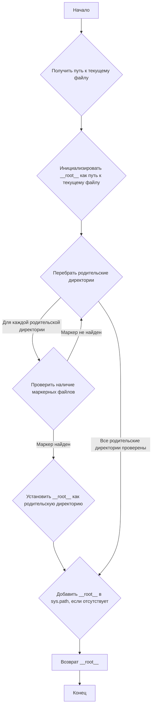
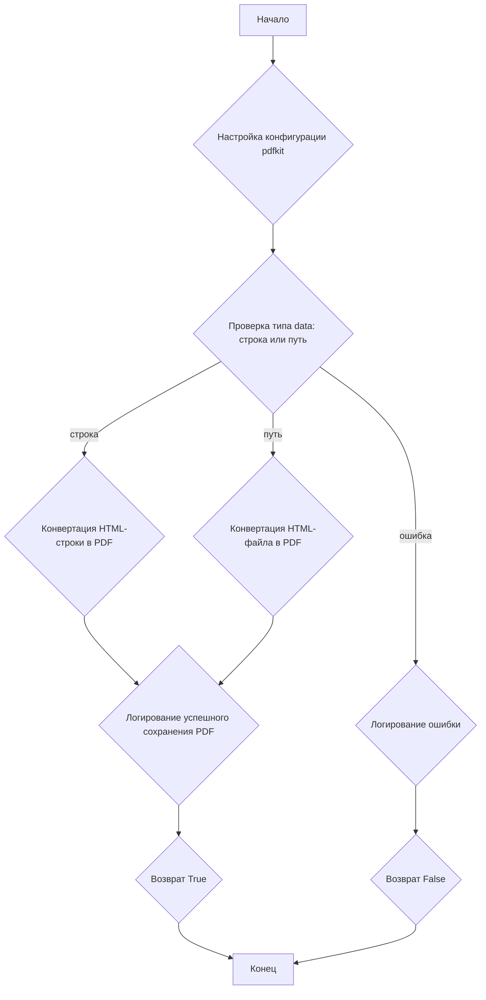
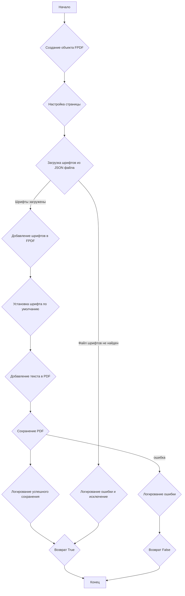
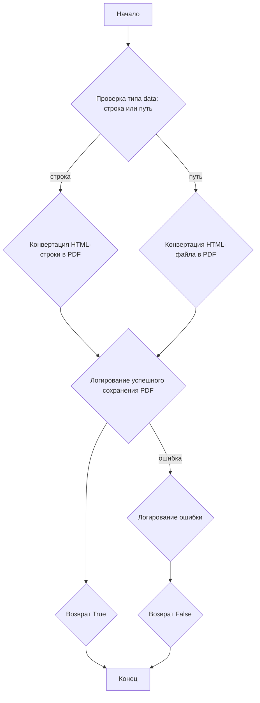
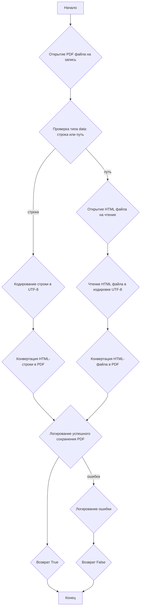
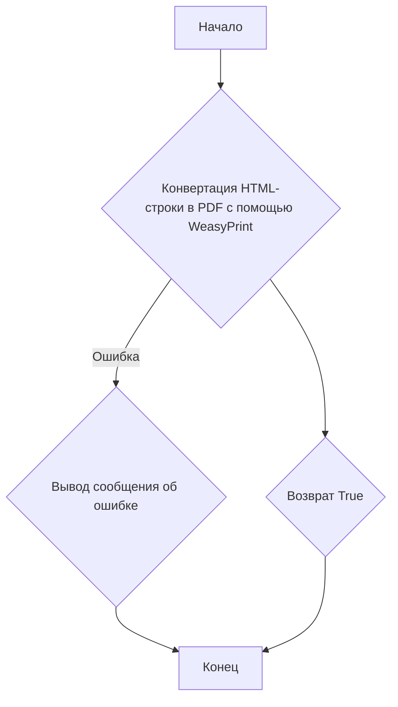
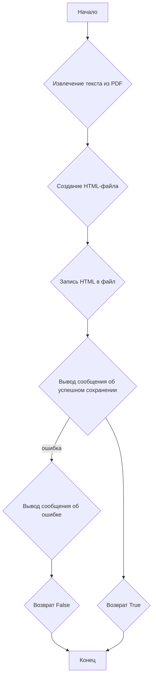

## ИНСТРУКЦИЯ:

Анализируй предоставленный код подробно и объясни его функциональность. Ответ должен включать три раздела:  

1. **<алгоритм>**: Опиши рабочий процесс в виде пошаговой блок-схемы, включая примеры для каждого логического блока, и проиллюстрируй поток данных между функциями, классами или методами.  
2. **<mermaid>**: Напиши код для диаграммы в формате `mermaid`, проанализируй и объясни все зависимости, 
    которые импортируются при создании диаграммы. 
    **ВАЖНО!** Убедитесь, что все имена переменных, используемые в диаграмме `mermaid`, 
    имеют осмысленные и описательные имена. Имена переменных вроде `A`, `B`, `C`, и т.д., не допускаются!  
    
    **Дополнительно**: Если в коде есть импорт `import header`, добавьте блок `mermaid` flowchart, объясняющий `header.py`:\
    ```mermaid
    flowchart TD
        Start --> Header[<code>header.py</code><br> Determine Project Root]
    
        Header --> import[Import Global Settings: <br><code>from src import gs</code>] 
    ```

3. **<объяснение>**: Предоставьте подробные объяснения:  
   - **Импорты**: Их назначение и взаимосвязь с другими пакетами `src.`.  
   - **Классы**: Их роль, атрибуты, методы и взаимодействие с другими компонентами проекта.  
   - **Функции**: Их аргументы, возвращаемые значения, назначение и примеры.  
   - **Переменные**: Их типы и использование.  
   - Выделите потенциальные ошибки или области для улучшения.  

Дополнительно, постройте цепочку взаимосвязей с другими частями проекта (если применимо).  

Это обеспечивает всесторонний и структурированный анализ кода.
## Формат ответа: `.md` (markdown)
**КОНЕЦ ИНСТРУКЦИИ**
```
## <алгоритм>

### 1. `set_project_root()`

**Описание:** Функция определяет корневую директорию проекта.
**Пример:**
- Если скрипт находится в `hypotez/src/utils` и в `hypotez` есть файл `__root__`, то возвращается `hypotez`.

**Блок-схема:**



### 2. Класс `PDFUtils`

**Описание:** Класс предоставляет методы для конвертации HTML или текста в PDF с использованием различных библиотек.

#### 2.1. `save_pdf_pdfkit(data, pdf_file)`
**Описание:** Функция конвертирует HTML контент или HTML файл в PDF используя библиотеку `pdfkit`.

**Пример:**
- `data` = "<html><body><h1>Hello</h1></body></html>", `pdf_file` = "output.pdf" преобразует HTML в PDF.
- `data` = "input.html", `pdf_file` = "output.pdf" преобразует файл input.html в PDF.
- Если `wkhtmltopdf.exe` не найден, вызывает исключение `FileNotFoundError`

**Блок-схема:**



#### 2.2. `save_pdf_fpdf(data, pdf_file)`

**Описание:** Функция сохраняет текстовые данные в PDF с использованием библиотеки `fpdf`.

**Пример:**
- `data` = "Hello world", `pdf_file` = "output.pdf" создает PDF с текстом "Hello world".

**Блок-схема:**



#### 2.3. `save_pdf_weasyprint(data, pdf_file)`
**Описание:** Функция конвертирует HTML контент или HTML файл в PDF используя библиотеку `WeasyPrint`.
**Пример:**
- `data` = "<html><body><h1>Hello</h1></body></html>", `pdf_file` = "output.pdf" преобразует HTML в PDF.
- `data` = "input.html", `pdf_file` = "output.pdf" преобразует файл input.html в PDF.

**Блок-схема:**

#### 2.4. `save_pdf_xhtml2pdf(data, pdf_file)`
**Описание:** Функция конвертирует HTML контент или HTML файл в PDF используя библиотеку `xhtml2pdf`.
**Пример:**
- `data` = "<html><body><h1>Hello</h1></body></html>", `pdf_file` = "output.pdf" преобразует HTML в PDF.
- `data` = "input.html", `pdf_file` = "output.pdf" преобразует файл input.html в PDF.

**Блок-схема:**


#### 2.5. `html2pdf(html_str, pdf_file)`

**Описание:** Функция конвертирует HTML-строку в PDF с использованием WeasyPrint.

**Пример:**
- `html_str` = "<p>Hello</p>", `pdf_file` = "output.pdf"

**Блок-схема:**


#### 2.6. `pdf_to_html(pdf_file, html_file)`

**Описание:** Функция конвертирует PDF файл в HTML файл, извлекая текст из PDF.

**Пример:**
- `pdf_file` = "input.pdf", `html_file` = "output.html"

**Блок-схема:**


## <mermaid>

```mermaid
flowchart TD
    Start(Начало) --> FindProjectRoot[<code>set_project_root()</code><br>Определение корневой директории проекта];
    FindProjectRoot --> RootPath[Возврат пути к корневой директории: <br> <code>__root__</code>];
    RootPath --> Check_wkhtmltopdf{Проверка наличия <code>wkhtmltopdf.exe</code>};
    Check_wkhtmltopdf -- wkhtmltopdf.exe найден --> PDFUtilsClass[<code>PDFUtils</code> Класс для работы с PDF];
        PDFUtilsClass --> save_pdf_pdfkit[<code>save_pdf_pdfkit()</code><br>Сохранение в PDF с помощью pdfkit];
        PDFUtilsClass --> save_pdf_fpdf[<code>save_pdf_fpdf()</code><br>Сохранение в PDF с помощью FPDF];
        PDFUtilsClass --> save_pdf_weasyprint[<code>save_pdf_weasyprint()</code><br>Сохранение в PDF с помощью WeasyPrint];
        PDFUtilsClass --> save_pdf_xhtml2pdf[<code>save_pdf_xhtml2pdf()</code><br>Сохранение в PDF с помощью xhtml2pdf];
         PDFUtilsClass --> html2pdf[<code>html2pdf()</code><br>Конвертация HTML в PDF с помощью WeasyPrint];
         PDFUtilsClass --> pdf_to_html[<code>pdf_to_html()</code><br>Конвертация PDF в HTML];

    Check_wkhtmltopdf -- wkhtmltopdf.exe не найден --> Error[Ошибка: <code>wkhtmltopdf.exe</code> не найден];
    Error --> End(Конец);

    style Start fill:#f9f,stroke:#333,stroke-width:2px
    style End fill:#ccf,stroke:#333,stroke-width:2px
```
Используемые импорты:
- `sys`: Модуль `sys` используется для доступа к параметрам и функциям, специфичным для среды выполнения. В данном коде `sys.path` используется для добавления пути к корневой директории проекта, что позволяет импортировать модули из этой директории.
- `os`: Модуль `os` предоставляет функции для взаимодействия с операционной системой, в данном случае используется для работы с файловыми путями.
- `json`: Модуль `json` используется для работы с данными в формате JSON, в частности, для чтения файла конфигурации шрифтов.
- `pathlib.Path`: Класс `Path` из модуля `pathlib` используется для представления файловых путей, что делает код более читаемым и кроссплатформенным.
- `pdfkit`: Библиотека `pdfkit` используется для конвертации HTML в PDF, требует наличия установленного `wkhtmltopdf`.
- `reportlab.pdfgen.canvas`: Библиотека `reportlab` используется для создания PDF-файлов, но в данном коде она импортируется, но не используется.
- `fpdf`: Библиотека `fpdf` используется для создания PDF-файлов и добавления текста.
- `weasyprint`: Библиотека `weasyprint` используется для конвертации HTML в PDF.
- `xhtml2pdf`: Библиотека `xhtml2pdf` используется для конвертации HTML в PDF.
- `pdfminer.high_level.extract_text`: Функция `extract_text` из библиотеки `pdfminer` используется для извлечения текста из PDF-файлов.
- `src.logger.logger`: Модуль `logger` из пакета `src.logger` используется для логирования сообщений.
- `src.utils.printer`: Модуль `printer` из пакета `src.utils` используется для печати сообщений, но в данном коде он импортируется, но не используется.

## <объяснение>

### Импорты
- `sys`: Обеспечивает доступ к системным переменным и функциям, например, `sys.path` для управления путями импорта модулей.
- `os`: Предоставляет интерфейс для взаимодействия с операционной системой, используется для работы с путями к файлам.
- `json`: Позволяет работать с JSON-данными, необходим для чтения конфигурации шрифтов из `fonts.json`.
- `pathlib.Path`: Упрощает работу с путями к файлам и директориям, предоставляя объектно-ориентированный интерфейс.
- `pdfkit`: Библиотека для конвертации HTML в PDF. Она использует `wkhtmltopdf` для генерации PDF.
- `reportlab.pdfgen.canvas`: Библиотека для создания PDF-документов, но не используется в коде.
- `fpdf`: Библиотека для создания PDF-документов, в основном для текста.
- `weasyprint`: Библиотека для конвертации HTML в PDF, более современная, чем `pdfkit`.
- `xhtml2pdf`: Библиотека для конвертации HTML в PDF.
- `pdfminer.high_level.extract_text`: Используется для извлечения текста из PDF-документов.
- `src.logger.logger`: Логгер из пакета `src.logger`, необходим для записи событий и ошибок в лог-файл.
- `src.utils.printer`: Модуль `printer` из пакета `src.utils`, используется для форматированной печати, но не используется в коде.

### Классы
- **`PDFUtils`**:
    - **Роль**: Класс, предоставляющий статические методы для преобразования HTML или текста в PDF с использованием различных библиотек.
    - **Атрибуты**: Нет атрибутов, так как все методы статические.
    - **Методы**:
        - `save_pdf_pdfkit(data, pdf_file)`: Сохраняет HTML (строку или файл) в PDF с помощью `pdfkit`.
        - `save_pdf_fpdf(data, pdf_file)`: Сохраняет текст в PDF с помощью `fpdf`, поддерживает шрифты из `fonts.json`.
        - `save_pdf_weasyprint(data, pdf_file)`: Сохраняет HTML (строку или файл) в PDF с помощью `weasyprint`.
        - `save_pdf_xhtml2pdf(data, pdf_file)`: Сохраняет HTML (строку или файл) в PDF с помощью `xhtml2pdf`.
        - `html2pdf(html_str, pdf_file)`: Конвертирует HTML строку в PDF с помощью `weasyprint`.
        - `pdf_to_html(pdf_file, html_file)`: Конвертирует PDF в HTML, извлекая текст из PDF с помощью `pdfminer`.
    - **Взаимодействие**: Использует различные библиотеки для конвертации в PDF. Логирует результаты и ошибки.

### Функции
- **`set_project_root(marker_files)`**:
    - **Аргументы**: `marker_files` - кортеж с именами файлов или директорий для поиска корневой директории проекта.
    - **Возвращаемое значение**: `Path` к корневой директории.
    - **Назначение**: Функция находит корневую директорию проекта, начиная с текущей директории файла. Используется для определения абсолютных путей к ресурсам.
    - **Пример**: Если в директории `hypotez/src/utils/` находится скрипт, а `hypotez/` содержит файл `__root__`, то вернется `Path` к директории `hypotez/`.

### Переменные
- `MODE`: Строка, определяющая режим работы, в данном случае `'dev'`.
- `__root__`: Переменная типа `Path`, хранит путь к корневой директории проекта.
- `wkhtmltopdf_exe`: Переменная типа `Path`, хранит путь к исполняемому файлу `wkhtmltopdf.exe`.

### Потенциальные ошибки и области для улучшения
- **Обработка ошибок**: В некоторых функциях обработка ошибок может быть улучшена. Вместо простого возврата `False` можно было бы поднимать исключения и использовать их для более детального логирования.
- **Использование `reportlab`**: Библиотека `reportlab.pdfgen.canvas` импортируется, но не используется. Этот импорт можно убрать.
- **Зависимости**: Код зависит от внешних библиотек (`pdfkit`, `fpdf`, `weasyprint`, `xhtml2pdf`, `pdfminer`). Необходимо убедиться, что эти библиотеки установлены. Также необходимо наличие `wkhtmltopdf.exe`.
- **Кодировка**: В `save_pdf_xhtml2pdf` явное кодирование в UTF-8, что хорошо, но может потребоваться обработка других кодировок.
- **Конфигурация шрифтов**: Файл `fonts.json` должен быть правильно настроен, а шрифты должны быть доступны. Необходимо добавить валидацию формата `fonts.json`.

### Взаимосвязи с другими частями проекта
- `src.logger.logger`: Модуль логирования используется для записи сообщений и ошибок, что помогает в отладке и мониторинге работы модуля.
- `src.utils.printer`: Модуль используется для печати, но не используется.
- Определение корневой директории проекта через `set_project_root` необходимо для правильной работы всех частей проекта, т.к. относительные пути будут не верны.

Этот анализ предоставляет всестороннее понимание кода, его функций и потенциальных проблем, а также его связей с другими частями проекта.