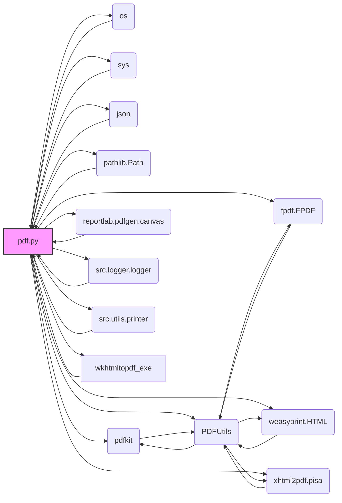

## Анализ кода `hypotez/src/utils/pdf.py`

### 1. <алгоритм>

**Блок-схема:**

```mermaid
graph LR
    A[Начало] --> B{Определение __root__};
    B --> C{Поиск wkhtmltopdf.exe};
    C -- wkhtmltopdf.exe найден --> D{Класс PDFUtils};
    C -- wkhtmltopdf.exe не найден --> E[Ошибка: FileNotFoundError];
    D --> F{save_pdf_pdfkit(data, pdf_file)};
    D --> G{save_pdf_fpdf(data, pdf_file)};
    D --> H{save_pdf_weasyprint(data, pdf_file)};
    D --> I{save_pdf_xhtml2pdf(data, pdf_file)};
    D --> J{html2pdf(html_str, pdf_file)};
    F -- data: строка --> F1[pdfkit.from_string(data, pdf_file)];
    F -- data: путь --> F2[pdfkit.from_file(data, pdf_file)];
    F1 -- успех --> FK[PDF сохранен];
    F1 -- ошибка --> FL[Ошибка: PDFKitError/OSError];
     F2 -- успех --> FK;
     F2 -- ошибка --> FL;
    G --> G1{Создание PDF};
     G1 --> G2{Загрузка fonts.json};
      G2 -- fonts.json найден --> G3{Добавление шрифтов};
     G2 -- fonts.json не найден --> G4[Ошибка: FileNotFoundError];
     G3 -- все шрифты добавлены --> G5{Запись текста в PDF};
     G3 -- ошибка добавления шрифта --> G6[Ошибка: FileNotFoundError];
     G5 --> G7{Сохранение PDF};
     G7 -- успех --> GK[PDF сохранен];
      G7 -- ошибка --> GL[Ошибка при сохранении FPDF];
    H -- data: строка --> H1[HTML(string=data).write_pdf(pdf_file)];
     H -- data: путь --> H2[HTML(filename=data).write_pdf(pdf_file)];
      H1 -- успех --> HK[PDF сохранен];
       H1 -- ошибка --> HL[Ошибка при сохранении WeasyPrint];
        H2 -- успех --> HK;
       H2 -- ошибка --> HL;
    I -- data: строка --> I1{pisa.CreatePDF(data, result_file)};
     I -- data: путь --> I2{Открытие файла, pisa.CreatePDF(source_data, result_file)};
     I1 -- успех --> IK[PDF сохранен];
     I1 -- ошибка --> IL[Ошибка компиляции PDF xhtml2pdf];
       I2 -- успех --> IK;
     I2 -- ошибка --> IL;
    J --> J1{HTML(string=html_str).write_pdf(pdf_file)};
    J1 -- успех --> JK[PDF сохранен];
     J1 -- ошибка --> JL[Ошибка PDF generation];
    FK --> K[Конец];
    FL --> K;
    GK --> K;
    GL --> K;
    HK --> K;
    HL --> K;
      IK --> K;
    IL --> K;
       JK --> K;
    JL --> K;
    E --> K;
```
**Примеры:**

1.  **`set_project_root()`**:
    *   Если файл `hypotez/pyproject.toml` существует, функция вернет путь к директории `hypotez`.
    *   Если файл `hypotez/src/utils/pdf.py` запущен из директории, где нет `pyproject.toml`, а есть `hypotez/requirements.txt`, вернет путь к директории `hypotez`.
    *   Если ни `pyproject.toml`, ни `requirements.txt`, ни `.git` не найдены в родительских директориях, вернет директорию, где расположен `pdf.py`.

2.  **`PDFUtils.save_pdf_pdfkit()`**:
    *   Если `data` является строкой HTML, она преобразуется в PDF.
    *   Если `data` является путем к HTML-файлу, файл преобразуется в PDF.
    *   При неудачной конвертации возвращается `False`.

3.  **`PDFUtils.save_pdf_fpdf()`**:
    *   Текст `data` добавляется в PDF с использованием шрифтов, описанных в `fonts.json`.
    *   При отсутствии `fonts.json` или шрифтов, вызывает ошибку `FileNotFoundError`.

4.  **`PDFUtils.save_pdf_weasyprint()`**:
    *   Если `data` - строка HTML, то она напрямую преобразуется в PDF.
    *   Если `data` - путь к HTML-файлу, файл преобразуется в PDF.

5.  **`PDFUtils.save_pdf_xhtml2pdf()`**:
    *   Если `data` - строка HTML, она обрабатывается `pisa.CreatePDF()`.
    *   Если `data` - путь к HTML-файлу, файл считывается и обрабатывается `pisa.CreatePDF()`.

6.   **`PDFUtils.html2pdf()`**:
     *   Принимает HTML-строку `html_str`, преобразует в PDF.
     *   Возвращает `True` при успешном преобразовании, иначе `None`.

### 2. <mermaid>



**Анализ зависимостей `mermaid`:**

*   `pdf.py` (A) - основной модуль, который импортирует различные библиотеки для работы с PDF.
*   `os` (B) и `sys` (C) - стандартные модули Python для работы с операционной системой и системными параметрами.
*   `json` (D) - модуль для работы с данными в формате JSON.
*    `pathlib.Path` (E) - класс для работы с путями к файлам.
*   `pdfkit` (F) - библиотека для преобразования HTML в PDF с помощью wkhtmltopdf.
*   `reportlab.pdfgen.canvas` (G) - библиотека для работы с PDF (используется не напрямую).
*   `fpdf.FPDF` (H) - библиотека для генерации PDF из текста.
*   `weasyprint.HTML` (I) - библиотека для преобразования HTML в PDF.
*   `xhtml2pdf.pisa` (J) - библиотека для преобразования HTML в PDF.
*   `src.logger.logger` (K) - пользовательский модуль для логирования.
*    `src.utils.printer` (L) - пользовательский модуль для вывода отладочной информации.
*    `wkhtmltopdf_exe` (M) - путь к исполняемому файлу wkhtmltopdf.
*    `PDFUtils` (N) - класс, который инкапсулирует в себе вызовы библиотек для преобразования в PDF.

### 3. <объяснение>

**Импорты:**

*   `sys`: Используется для работы с путями и системными параметрами. В данном случае, для добавления корневой директории проекта в `sys.path`.
*   `os`:  Используется для работы с файловой системой, в частности для поиска `wkhtmltopdf.exe`.
*   `json`: Используется для работы с файлом конфигурации шрифтов `fonts.json`.
*   `pathlib.Path`: Используется для представления путей к файлам и директориям в виде объектов.
*   `pdfkit`: Библиотека для преобразования HTML в PDF с использованием wkhtmltopdf. Она используется в методе `save_pdf_pdfkit` класса `PDFUtils`.
*   `reportlab.pdfgen.canvas`: Библиотека для создания PDF-файлов, но в текущем коде используется не напрямую, а через другие библиотеки.
*   `fpdf.FPDF`: Библиотека для генерации PDF из текста, используется в методе `save_pdf_fpdf` класса `PDFUtils`.
*   `weasyprint.HTML`: Библиотека для преобразования HTML в PDF, используется в методе `save_pdf_weasyprint` класса `PDFUtils` и  `html2pdf`.
*   `xhtml2pdf.pisa`: Библиотека для преобразования HTML в PDF, используется в методе `save_pdf_xhtml2pdf` класса `PDFUtils`.
*   `src.logger.logger`: Модуль для логирования событий, используется для записи ошибок и информационных сообщений.
*   `src.utils.printer`: Модуль для красивого вывода данных, в текущей версии не используется.

**Классы:**

*   `PDFUtils`:
    *   **Роль**: Инкапсулирует методы для преобразования HTML или текста в PDF с использованием различных библиотек.
    *   **Атрибуты**: Нет атрибутов экземпляра.
    *   **Методы**:
        *   `save_pdf_pdfkit(data: str | Path, pdf_file: str | Path) -> bool`: Сохраняет HTML (строку или путь к файлу) в PDF с использованием `pdfkit`.
        *   `save_pdf_fpdf(data: str, pdf_file: str | Path) -> bool`: Сохраняет текст в PDF с использованием `FPDF`.
        *   `save_pdf_weasyprint(data: str | Path, pdf_file: str | Path) -> bool`: Сохраняет HTML (строку или путь к файлу) в PDF с использованием `WeasyPrint`.
        *   `save_pdf_xhtml2pdf(data: str | Path, pdf_file: str | Path) -> bool`: Сохраняет HTML (строку или путь к файлу) в PDF с использованием `xhtml2pdf`.
        *   `html2pdf(html_str: str, pdf_file: str | Path) -> bool | None`: Преобразует HTML-строку в PDF с использованием `WeasyPrint`.

**Функции:**

*   `set_project_root(marker_files: tuple = ('pyproject.toml', 'requirements.txt', '.git')) -> Path`:
    *   **Аргументы**: `marker_files` - кортеж имен файлов или директорий, которые указывают на корень проекта.
    *   **Возвращаемое значение**: `Path` - путь к корневой директории проекта.
    *   **Назначение**: Определяет корневую директорию проекта путем поиска вверх по файловой системе.
    *   **Пример**: Если `pyproject.toml` находится в `hypotez`, то функция вернет `Path` к директории `hypotez`.

**Переменные:**

*   `MODE: str = 'dev'`: Указывает режим работы, но в коде не используется.
*   `__root__: Path`: Хранит путь к корневой директории проекта, полученный с помощью `set_project_root()`.
*    `wkhtmltopdf_exe: Path`: Путь к исполняемому файлу `wkhtmltopdf.exe`.

**Цепочка взаимосвязей:**

1.  Функция `set_project_root` определяет корневую директорию проекта.
2.  Переменная `__root__` сохраняет путь к корневой директории.
3.  Переменная `wkhtmltopdf_exe` формирует путь к исполняемому файлу wkhtmltopdf.
4.  `PDFUtils` использует `wkhtmltopdf_exe` в методе `save_pdf_pdfkit`.
5.  `PDFUtils` также использует `__root__` для поиска `fonts.json` и файлов шрифтов в методе `save_pdf_fpdf`.
6.  Методы `PDFUtils` используют библиотеки `pdfkit`, `fpdf`, `weasyprint` и `xhtml2pdf` для преобразования в PDF.
7.  `src.logger.logger` используется для логирования ошибок и информационных сообщений.

**Потенциальные ошибки и области для улучшения:**

1.  **Обработка исключений**: В некоторых методах класса `PDFUtils` обработка исключений может быть улучшена, например, логирование `ex` без привязки к конкретному типу исключения и пропуск каких-либо действий ( `...` ).
2. **Пути**: Жестко заданы пути к wkhtmltopdf.exe и папке assets, возможно стоит вынести их в config.
3. **Использование `...`**:  Многоточие `...` в блоках except может сбить с толку, стоит заменить на `pass`.
4.  **`MODE` переменная**: Переменная `MODE` объявлена, но нигде не используется. Можно либо удалить, либо реализовать ее применение в коде.
5.  **Обработка ошибок `xhtml2pdf`**: Обработка ошибок компиляции PDF в `xhtml2pdf` требует более детального разбора для предоставления пользователю информативного сообщения об ошибке.
6.  **Дублирование кода**: В методах save_pdf_weasyprint и save_pdf_xhtml2pdf есть дублирование кода для обработки путей к файлам. Можно выделить его в отдельную внутреннюю функцию.
7. **Логика `html2pdf`**: метод  `html2pdf` не возвращает `False` в случае ошибки, а возвращает `None`, это может привести к проблемам при обработке его вызова, лучше возвращать `True` или `False`.
8. **Установка шрифтов:** В методе `save_pdf_fpdf` происходит попытка загрузки шрифтов из файла json. Стоит добавить проверку валидности этого json файла.
9.  **Унификация параметров**: Методы `save_pdf_*` принимают различные типы данных `str | Path`, но `save_pdf_fpdf` принимает только `str`, это может привести к проблемам при унификации вызова.