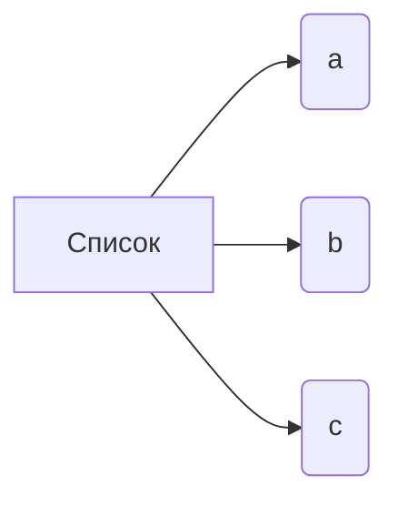

```MD
# Анализ кода

**1. <input code>**

```
["a","b","c"]
```

**2. <algorithm>**

Код представляет собой простую строку, содержащую список строк.  Алгоритм работы сводится к представлению данных в виде списка.



**Пример:**

Список `["a", "b", "c"]` содержит элементы "a", "b" и "c".


**3. <mermaid>**


**Описание диаграммы:**

Диаграмма представляет список `["a", "b", "c"]` в виде трех элементов `a`, `b` и `c`, которые непосредственно связаны со списком `A`. Это простая линейная структура, отражающая данные в коде без дополнительных вычислений или логики.


**4. <explanation>**

Код представляет собой список строк в формате JSON. Он не содержит импортов, классов или функций.

* **Импорты:** Нет импортов, так как это не фрагмент кода, содержащий импортируемые модули, классы или функции.
* **Классы:** Нет классов.
* **Функции:** Нет функций.
* **Переменные:** Нет переменных в строгом смысле. Список `["a", "b", "c"]` — это константная последовательность значений.
* **Возможные ошибки или области для улучшений:** Нет ошибок.  Можно было бы рассматривать этот код как константу, которая представляет собой список.  Для улучшения требуется контекст.  В таком виде код не может быть выполнен, и не предполагает никаких действий.  Он представляет данные без каких-либо операций.

**Цепочка взаимосвязей с другими частями проекта:**

Без контекста невозможно определить взаимосвязи с другими частями проекта.  Для определения таких взаимосвязей требуется больше информации о том, где находится этот код, какая программа его использует и какова его цель.  Возможно, этот список является частью большего фрагмента кода или структуры данных, который будет использоваться для дальнейшей обработки.